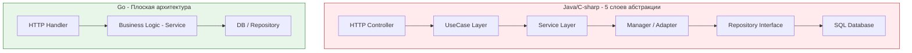

Выходцы из энтерпрайз-экосистем (Java, C#, PHP) приносят с собой в Go фундаментальную установку: **абстракция — это всегда хорошо**. Нас учили, что код должен быть максимально переиспользуемым, гибким и готовым к любым изменениям бизнеса. 

Это приводило к созданию колоссальных башен из слоев: `Controller` вызывает `Facade`, тот обращается к `Service`, сервис делегирует логику `Manager`, который общается с `Repository`, извлекающим данные через `DAO`. Каждое взаимодействие закрыто интерфейсом. 

Когда разработчик пытается построить такую же архитектуру в Go, он сталкивается с сопротивлением языка. Код становится громоздким, уродливым и медленным. В Go действует иное правило: **Абстракция имеет огромную цену. Простота и явность ценятся выше гибкости.**

Давайте разберем, почему многоуровневые иерархии и преждевременные абстракции убивают производительность Go-приложений и противоречат самой философии языка.

## Mechanical Sympathy: Цена глубокого стека вызовов

В классическом ООП мы не задумываемся о глубине стека вызовов (Call Stack). Создание еще одного промежуточного класса-обертки кажется бесплатным. В Go это имеет вполне конкретную цену на уровне рантайма и управления памятью.

### 1. Рост стека горутины (Stack Growth)

Как мы обсуждали ранее, стартовый размер стека для потока в Java (OS Thread) составляет обычно 1 МБ (или больше). В Go стартовый стек горутины равен всего **2 КБ**. Это позволяет запускать миллионы горутин одновременно.

Но что происходит, если ваша бизнес-логика размазана по 10 слоям абстракций (функция вызывает функцию, которая вызывает интерфейс, который вызывает метод...)? Каждому вызову функции требуется кадр стека (Stack Frame) для сохранения аргументов, локальных переменных и адреса возврата. 

Если 10 слоев абстракции исчерпают лимит в 2 КБ, компилятор и рантайм будут вынуждены выполнить дорогостоящую операцию `runtime.morestack`:
1. Рантайм аллоцирует новый кусок памяти, в два раза больший (4 КБ).
2. **Копирует** все данные из старого стека в новый.
3. Обновляет все указатели на стек (Stack Roots), чтобы сборщик мусора (GC) не сошел с ума.
4. Освобождает старый стек.

Излишнее дробление логики на десятки микро-функций и слоев оберток заставляет рантайм постоянно "переезжать" на новые стеки, создавая скрытые тормоза (Latency Spikes).

### 2. Блокировка инлайнинга (Inlining Budget)

Компилятор Go имеет мощный механизм встраивания функций (Inlining). Если функция маленькая (например, простой геттер или математическая операция), компилятор не будет делать вызов функции (с сохранением регистров и прыжком по адресам), а просто вставит её машинный код прямо в место вызова. Это делает код феноменально быстрым.

Но у компилятора есть "бюджет сложности" (Inlining Cost).
* Если ваша логика завернута в 5 слоев `Wrapper -> Adapter -> Decorator`, компилятор быстро исчерпает этот бюджет и прекратит инлайнинг на верхних уровнях.
* Если слой скрыт за интерфейсом (динамическая диспетчеризация через `itab`), инлайнинг отключается практически полностью. Процессор получает постоянные кэш-промахи инструкций.



## Проблема "Преждевременной Абстракции"

Самый частый грех разработчика, изучающего чистую архитектуру (Clean Architecture) — написание абстракций "про запас".

**Антипаттерн:**
```go
// Разработчик думает: "Вдруг завтра мы поменяем базу данных!"
// И создает интерфейс для сущности, у которой ЕДИНСТВЕННАЯ реализация:
type IUserRepository interface {
    Save(u *User) error
}

type PostgresUserRepository struct { db *sql.DB }
func (r *PostgresUserRepository) Save(u *User) error { ... }
```

В Go это считается нарушением принципа простоты (см. [[5. Философия Go. Простота, читаемость и прагматизм]]). Если у вас есть только одна база данных (PostgreSQL), и вы не пишете unit-тесты для сервиса, которые требуют мокирования именно этого интерфейса — **удалите интерфейс**.

Пишите прямой, конкретный код. Интерфейс должен появиться **только тогда**, когда в системе физически появляется вторая реализация (например, `RedisUserRepository` в дополнение к `PostgresUserRepository`) или когда это строго необходимо для внедрения моков (и то, на стороне потребителя, как мы обсуждали в [[16. Почему маленькие интерфейсы лучше больших]]).

> [!tip] Собеседование
> **Вопрос:** Что в Go-сообществе подразумевают под правилом "Rule of Three" (Правило трех) при проектировании абстракций?
> **Ответ:** Это прагматичный подход к рефакторингу. Не создавайте абстракцию, интерфейс или общую функцию-хелпер, когда видите дублирование кода в первый или второй раз. Копипаста (A little copying is better than a little dependency) на этом этапе дешевле. И только когда код дублируется в **третий раз**, вы получаете достаточно контекста, чтобы понять истинную природу этой логики, и только тогда выделяете её в общую абстракцию. Преждевременная абстракция намного хуже, чем дублирование.

## Легкость удаления кода (Deletability)

Сложные иерархии абстракций создают код, который страшно удалять и рефакторить. 

Представьте, что бизнес-логика размазана по паттернам: Фабрика создает Стратегию, которая инжектится в Фасад. Когда бизнес-требование устаревает, программисты боятся удалять этот кусок, потому что интерфейсы переплетены. Код "гниет".

**Плоский код на Go легко удалять.** 
Если ваш HTTP-хендлер вызывает конкретную функцию `Service`, которая выполняет конкретный SQL-запрос из пакета `postgres`, вы видите весь поток выполнения от начала и до конца (Local Reasoning). Когда фича становится не нужна, вы просто удаляете этот маршрут (Route), хендлер и SQL-запрос. Никакие "базовые классы" или "абстрактные репозитории" не пострадают, потому что их не существует.

## Шаблоны проектирования (Design Patterns) в Go

Поскольку Go не любит сложные иерархии, классические шаблоны проектирования из ООП здесь применяются редко или мутируют до неузнаваемости.

*   **Decorator (Декоратор):** В ООП требует создания классов-оберток. В Go реализуется просто через функции высшего порядка (Higher-Order Functions). Самый яркий пример — HTTP-мидлвари:
    ```go
    // Декоратор в одну строку без классов и интерфейсов
    func WithLogging(next http.Handler) http.Handler {
        return http.HandlerFunc(func(w http.ResponseWriter, r *http.Request) {
            log.Println("Incoming request")
            next.ServeHTTP(w, r)
        })
    }
    ```
*   **Strategy (Стратегия):** Вместо создания интерфейса `IStrategy` и классов `StrategyA`, `StrategyB`, в Go в 90% случаев достаточно передать в функцию **замыкание** (Closure / func-тип) с нужным алгоритмом.
*   **Template Method (Шаблонный метод):** Категорически неприменим, так как базируется на наследовании и переопределении защищенных (`protected`) методов.

> [!warning] Ловушка / Gotcha: Чрезмерная генерация (Over-engineering)
> Разработчики из Java часто приносят инструменты автогенерации кода (например, кодогенераторы "слоистой" архитектуры, которые на каждый чих создают файл интерфейса, файл реализации, файл мока, файл DTO и маппер). Это убивает скорость разработки. Идиоматичный Go — это написание ручного, прозрачного кода. Кодогенерация в Go применяется точечно: для protobuf/gRPC, для парсеров JSON (easyjson) или строго типизированного SQL (sqlc).

## Итог: Компромисс между гигиеной и скоростью

Отказ от многоуровневых слоев абстракции не означает, что весь код приложения нужно писать в одном файле `main.go`. Это означает, что **каждый слой абстракции должен доказывать свою необходимость**.

1.  Каждый новый `interface{}` в вашем коде — это потенциальный кэш-промах в рантайме.
2.  Каждый новый слой вызовов (Proxy/Facade) — это нагрузка на стек горутины.
3.  Плоский и "скучный" (Boring) код читается в 10 раз быстрее, чем "чистый" код, разбитый на 20 файлов интерфейсов.

Но если мы не строим архитектуру через слои интерфейсов и базовых классов, то как мы изолируем домены друг от друга? Как мы запрещаем одному компоненту лезть во внутреннее состояние другого? 
В Go основным инструментом архитектуры, инкапсуляции и управления зависимостями выступает **Пакет (Package)**. О том, как правильно нарезать проект на пакеты, мы поговорим в завершающей статье этого блока: [[22. Пакеты и структура проекта как часть философии Go]].