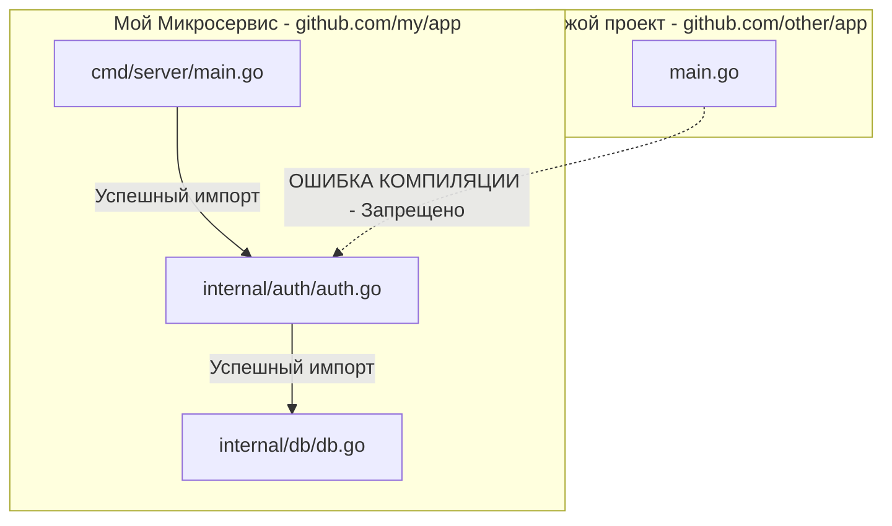

В языках программирования вроде C#, Java или PHP концепция пространства имен (Namespace) — это чаще всего просто способ логически сгруппировать классы, чтобы избежать конфликта имен. Вы можете легко создать циклическую зависимость между `com.app.services` и `com.app.models`, и компилятор (или интерпретатор) это "проглотит". 

В Go **директория — это и есть пакет (Package)**. И пакет здесь выступает не просто папкой для файлов, а фундаментальной единицей компиляции, инкапсуляции и архитектуры. 

Неправильная нарезка приложения на пакеты — это главная причина, по которой разработчики из других экосистем начинают ненавидеть Go. Они пытаются перенести свои привычные структуры (например, MVC) и немедленно сталкиваются с ошибками компилятора.

Давайте разберем, как пакеты работают на уровне компилятора, почему стандартные подходы ООП здесь ломаются, и как выглядит идиоматичный "Standard Go Project Layout".

## Под капотом: Пакет как единица компиляции (DAG)

Чтобы понять философию пакетов Go, нужно вспомнить, какую проблему решали создатели языка (см. [[3. Какие проблемы существующих языков пытался решить Go]]). Они хотели избавиться от 45-минутных сборок в C++.

В Go компилятор работает с пакетами, а не с отдельными файлами. Когда вы запускаете сборку, компилятор строит **Направленный ациклический граф (Directed Acyclic Graph, DAG)** зависимостей.

> [!info] Под капотом: Экспортные данные и файлы `.a`
> Если пакет `A` импортирует пакет `B`, а пакет `B` импортирует пакет `C`, процесс компиляции идет снизу вверх.
> Сначала компилируется `C`. Результат его сборки (вместе с метаданными об экспортируемых типах и функциях) сохраняется во временный объектный файл `C.a` (archive).
> Затем компилируется `B`. Компилятор читает исходники `B` и объектный файл `C.a`. 
> Наконец, компилируется `A`. Компилятору нужно прочитать **только `B.a`**. Ему *не нужно* снова парсить исходники `C`, потому что все транзитивные зависимости уже запечены в метаданных `B.a`. 
> Эта архитектура делает компиляцию Go-проектов феноменально быстрой (линейная сложность I/O операций).

Именно из-за этой аппаратной оптимизации в Go **строго запрещены циклические импорты (Import Cycles)**. Если `A` ссылается на `B`, а `B` ссылается на `A`, компилятор физически не может построить DAG и сгенерировать объектные файлы снизу вверх. Произойдет фатальная ошибка компиляции: `import cycle not allowed`.

## Ловушка: Паттерн MVC и "Свалки"

Разработчики из Ruby on Rails, Django или Spring часто приносят в Go структуру по типам файлов (Layer-based packaging). Они создают папки:
*   `models/` (все структуры данных здесь)
*   `controllers/` (все HTTP-хендлеры здесь)
*   `services/` (вся бизнес-логика здесь)

**В Go это грубейший антипаттерн.**

Почему? Представьте: `controllers` импортирует `services`, чтобы вызвать логику. `services` импортирует `models`, чтобы получить структуру `User`. 
Затем в `models` (например, в метод `user.BeforeSave()`) вам внезапно требуется вызвать хеширование пароля из `services`. Вы импортируете `services` в `models`.
Бум! Вы получили циклический импорт: `services` -> `models` -> `services`. Компилятор останавливает сборку.

Вторая проблема слоистой архитектуры — нарушение принципа "Имя пакета описывает его суть".

> [!tip] Собеседование
> **Вопрос:** Почему в Go-сообществе считается плохим тоном создавать пакеты с именами `utils`, `common`, `helpers` или `models`?
> **Ответ:** Имя пакета в Go должно отвечать на вопрос **"Что этот пакет предоставляет?"** (What it provides), а не "Что в нем лежит?" (What it contains). Пакет `utils` ничего не говорит о своей функции. Это пакет-свалка. Сегодня туда положат форматирование строк, завтра — парсер JSON, послезавтра — коннектор к Redis. Это раздувает размер пакета, нарушает Single Responsibility Principle и гарантированно приводит к циклическим импортам. Вместо `utils` нужно создавать изолированные пакеты по смыслу: `stringutil`, `jsonparser`, `redisclient`.

## Идиоматичная структура: Domain-Driven Packaging

Вместо группировки файлов по их технической роли (контроллеры, модели), идиоматичный Go-код группируется по **доменным областям (Features/Domains)**.

Вместо:
```text
/models/user.go
/models/billing.go
/controllers/user_ctrl.go
/controllers/billing_ctrl.go
```

Должно быть:
```text
/auth/            # Пакет авторизации
    handler.go    # HTTP роуты
    service.go    # Логика
    user.go       # Структура данных
/billing/         # Пакет биллинга
    invoice.go
    gateway.go
```

В такой структуре пакет `auth` полностью самодостаточен. Если биллингу нужно узнать статус пользователя, он делает это через явный интерфейс (см. [[17. SOLID в мире Go. Что осталось, а что изменилось]]), соблюдая однонаправленный поток зависимостей.

## Standard Project Layout: cmd, pkg и internal

Несмотря на то что сам язык не диктует структуру папок, за 15 лет в сообществе устоялся негласный стандарт (Standard Go Project Layout), который используется в Kubernetes, Docker, Prometheus и других крупных проектах.

Он состоит из трех главных директорий:

### 1. `cmd/` (Точки входа)
Здесь лежат файлы `main.go`. На каждый исполняемый бинарник создается своя подпапка.
Например:
*   `cmd/api-server/main.go`
*   `cmd/cli-tool/main.go`
В этих файлах не должно быть бизнес-логики. Их задача — прочитать конфиги, собрать граф зависимостей (Dependency Injection) и запустить приложение.

### 2. `pkg/` (Публичные библиотеки)
Исторически сложившаяся папка для кода, который **предназначен для импорта другими проектами**. Например, если вы пишете микросервис и хотите отдать другим командам готовый API-клиент для вашего сервиса, вы кладете его в `pkg/client/`. (Примечание: в современных проектах `pkg` используют реже, но в OpenSource она всё ещё является стандартом де-факто).

### 3. `internal/` (Магия инкапсуляции компилятора)
Это самая важная директория для бэкенд-разработчика. В Go нет модификаторов `private` или `protected` для пакетов. Любой пакет, выложенный в GitHub, можно импортировать.

Чтобы защитить вашу бизнес-логику от чужих импортов, разработчики языка встроили в компилятор хардкод-правило: **Код внутри директории `internal/` может быть импортирован только тем кодом, который лежит в корневом дереве над этой папкой.**



Если кто-то из другой команды попытается написать `import "github.com/my/app/internal/auth"`, компилятор Go откажется собирать их проект: `use of internal package ... not allowed`. 
Поэтому 99% бизнес-логики микросервисов в Go должно лежать именно внутри папки `internal/`. Это гарантирует, что ваш внутренний код никогда не станет чьим-то чужим публичным API.

## Как избежать циклических импортов на практике?

Если вы столкнулись с ошибкой `import cycle not allowed`, это всегда сигнал архитектурного изъяна. 

Для разрубания гордиева узла в Go применяют 3 приема:
1.  **Слияние:** Если пакеты `A` и `B` так сильно зависят друг от друга, возможно, искусственное разделение было ошибкой. Объедините их в один пакет `AB`.
2.  **Выделение общего в `C`:** Если `A` и `B` зависят от общей структуры данных, вынесите эту структуру в нижележащий пакет `C`, который не зависит ни от кого, и импортируйте его в `A` и `B`.
3.  **Инверсия зависимостей (Интерфейсы):** Если `A` вызывает `B`, а `B` должен "ответить" `A` (например, отправить лог), `B` не должен импортировать `A`. Вместо этого в `B` объявляется интерфейс `type Logger interface`, а `A` передает свою реализацию этого интерфейса в `B` во время инициализации в `main.go`.

## Итог

1.  **Пакеты — это граница компиляции.** Они должны образовывать однонаправленный граф (DAG). Никаких циклических импортов.
2.  **Группируйте по смыслу, а не по слоям.** Избегайте папок `controllers` и `models`. Создавайте пакеты `auth`, `payment`, `order`.
3.  **Забудьте про `utils`.** Называйте пакеты тем, что они делают.
4.  **Используйте `internal/`** для защиты бизнес-логики вашего микросервиса от случайного использования снаружи.

Мы выяснили, как пакеты инкапсулируют логику на макроуровне (уровне файловой системы). Но как защитить данные внутри самого пакета? Почему в Go нет ключевых слов `public`, `private` и `protected`? Гениальное (и шокирующее для новичков) решение этой проблемы мы разберем в следующей статье: [[23. Public и Private через экспортируемость имен]].