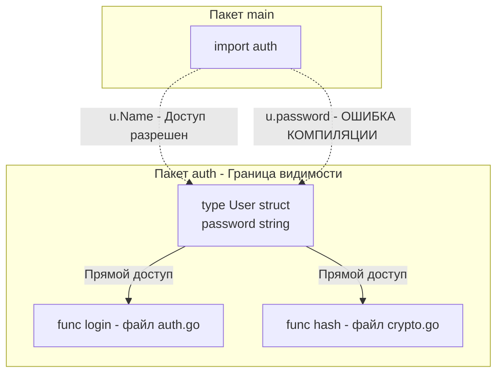

Переход в Go из языков с развитой системой модификаторов доступа (Java, C#, C++, PHP) всегда начинается с одного и того же вопроса: *"А где `public`, `private` и `protected`?"*.

В Java вы можете тонко настраивать видимость: для класса, для пакета (`package-private`), для наследников (`protected`), для всех (`public`). Это создает огромную когнитивную нагрузку. Читая вызов `user.save()`, вы не можете сказать, откуда доступен этот метод, не открыв определение класса `User`.

Создатели Go решили эту проблему с присущим им радикальным прагматизмом, избавившись от ключевых слов вообще. В Go видимость (инкапсуляция) определяется исключительно **регистром первой буквы идентификатора**.

## Правило первой буквы: Экспортируемое и Неэкспортируемое

В Go нет понятий "публичный" или "приватный". Правильная терминология, которую используют Senior-разработчики и документация языка — **Экспортируемое (Exported)** и **Неэкспортируемое (Unexported)**.

*   **Начинается с заглавной буквы (`A-Z`):** Идентификатор экспортируется. Он виден (доступен) из любого другого пакета, который импортирует ваш пакет.
    *(Примеры: `User`, `ServeHTTP`, `DB`, `ErrNotFound`)*
*   **Начинается со строчной буквы (`a-z`) или подчеркивания (`_`):** Идентификатор не экспортируется. Он виден **только внутри своего пакета**.
    *(Примеры: `user`, `calculateHash`, `dbConnection`)*

>[!info] Под капотом: Компилятор и ASCII
> Отказ от ключевых слов `public/private` — это не только забота о читаемости, но и аппаратная оптимизация парсера (Lexer/Parser) компилятора Go.
> В C++ или Java парсер должен поддерживать сложную матрицу состояний доступа и учитывать ключевые слова перед каждым полем. В Go компилятору (функция `ast.IsExported`) достаточно выполнить простейшую битовую операцию проверки ASCII-кода первого символа: `'A' <= c && c <= 'Z'`. Это экономит такты процессора при сборке огромных кодовых баз, делая компиляцию Go-проектов молниеносной.

## Ловушка мышления: Границы видимости

Главная ошибка разработчиков из ООП — они думают, что неэкспортируемое поле (строчная буква) приватно *для структуры* (аналог `private` в классе).

**В Go границей инкапсуляции является Пакет (Package), а не структура.**

Если у вас в пакете `auth` есть структура `User` с неэкспортируемым полем `passwordHash`, любая другая функция в **любом файле** этого же пакета `auth` может свободно читать и изменять это поле.

```go
package auth // Граница инкапсуляции начинается здесь

type User struct {
    Name         string // Экспортируется - доступно везде
    passwordHash string // Не экспортируется - доступно только внутри пакета auth
}

// Эта функция лежит в том же пакете, поэтому она имеет ПОЛНЫЙ доступ
// к "приватным" полям структуры User.
func comparePasswords(u *User, input string) bool {
    return u.passwordHash == hash(input) 
}
```



Почему сделано именно так? Это позволяет разбивать сложную бизнес-логику одной сущности на несколько файлов (например, `user.go`, `user_validation.go`, `user_repository.go`), не создавая искусственных публичных геттеров/сеттеров только ради того, чтобы эти файлы могли общаться друг с другом.

## Почему в Go нет protected?

Модификатор `protected` в ООП позволяет классу-наследнику обращаться к полям базового класса, которые скрыты от "чужих".

Поскольку в Go нет иерархии наследования (см. [[12. Composition Over Inheritance. Почему в Go нет наследования]]), понятие `protected` теряет смысл на уровне компилятора. Вы либо находитесь внутри пакета (имеете полный доступ), либо снаружи (доступ только к экспортируемому API).

## Mechanical Sympathy: Рефлексия и JSON

Правило экспортируемости глубоко вшито в рантайм Go, и именно здесь новички наступают на самые болезненные грабли при работе с внешним миром (БД, JSON, XML).

Стандартные библиотеки (например, `encoding/json` или драйверы базы данных) используют пакет `reflect` для анализа ваших структур. Но правило безопасности рантайма гласит: **Рефлексия из чужого пакета не имеет права читать и изменять неэкспортируемые поля вашей структуры.**

**Классический баг:**
```go
package main

import "encoding/json"

type Config struct {
    host string `json:"host"` // ❌ ОШИБКА: строчная буква!
    Port int    `json:"port"` // ✅ ПРАВИЛЬНО: заглавная буква
}

func main() {
    c := Config{host: "localhost", Port: 8080}
    bytes, _ := json.Marshal(c)
    fmt.Println(string(bytes)) // Вывод: {"port":8080}
}
```
Поле `host` было тихо проигнорировано упаковщиком JSON! Пакет `encoding/json` лежит за пределами вашего пакета `main`, поэтому он видит поле `host` через рефлексию, но метод `reflect.Value.CanSet()` для него возвращает `false`. 

**Правило:** Любое поле структуры, которое должно быть сериализовано в JSON/XML или сохранено в базу данных через ORM (например, GORM), **обязано** начинаться с заглавной буквы.

## Ловушка: Встраивание неэкспортируемого типа (Gotcha)

В статье [[13. Embedding. Как в Go реализуется композиция]] мы обсуждали механизм встраивания (Embedding). Что произойдет, если мы встроим "приватную" структуру в "публичную"?

> [!tip] Собеседование
> **Вопрос:** Если мы встроим неэкспортируемую структуру с экспортируемыми методами в экспортируемую структуру, будут ли эти методы доступны из другого пакета?
> **Ответ:** Да! Это одна из самых интересных архитектурных особенностей Go. 
> Компилятор Go "поднимает" (promotes) все методы встроенной структуры на уровень внешней. При этом проверяется только экспортируемость **самого метода**, а не структуры, которой он принадлежал.

Рассмотрим пример:
```go
package internal

// Неэкспортируемая структура
type logger struct {}

// Экспортируемый метод
func (l *logger) Log(msg string) { ... }

// Экспортируемая структура
type Server struct {
    logger // Встраиваем неэкспортируемый тип
}

func NewServer() *Server {
    return &Server{logger: logger{}}
}
```
В пакете `main`:
```go
package main

func main() {
    srv := internal.NewServer()
    
    // srv.logger.Log("...") // ❌ Ошибка: поле logger скрыто
    
    srv.Log("Успешно!") // ✅ РАБОТАЕТ! Метод Log стал публичным API сервера
}
```
Этот паттерн часто используется Senior-разработчиками для инкапсуляции состояния. Вы прячете внутренние поля в неэкспортируемую структуру `logger`, но выставляете наружу только ее публичные методы через встраивание в `Server`.

## Архитектурные следствия: Геттеры и Сеттеры

В Java/C# создание геттеров и сеттеров для каждого поля — это индустриальный стандарт, который генерируется IDE автоматически (`getName()`, `setName()`). 

В идиоматичном Go (как мы обсуждали в [[5. Философия Go. Простота, читаемость и прагматизм]]) избегают бойлерплейта.
Если поле структуры не содержит сложной логики валидации при записи, его **нужно делать экспортируемым напрямую**.

*   **Плохо (Java-style):**
    ```go
    type User struct { name string }
    func (u *User) GetName() string { return u.name }
    func (u *User) SetName(n string) { u.name = n }
    ```
*   **Хорошо (Go-style):**
    ```go
    type User struct { Name string }
    ```

Если же геттер действительно нужен (например, поле вычисляемое или требует защиты мьютексом), в Go **не используют префикс `Get`**.
Идиоматичное имя геттера — это просто имя поля с заглавной буквы:

```go
type Counter struct {
    mu    sync.Mutex
    count int // Защищенное неэкспортируемое поле
}

// Идиоматичный геттер: называется просто Count, а не GetCount
func (c *Counter) Count() int {
    c.mu.Lock()
    defer c.mu.Unlock()
    return c.count
}
```

## Итог

1.  **Локальность рассуждений:** Регистр первой буквы — это гениальное решение для читаемости. Вам достаточно взглянуть на `variable.CallMethod()`, чтобы понять, является ли `CallMethod` частью публичного API (контракта) чужого пакета, или это внутренняя утилита.
2.  **Инкапсуляция на уровне пакета:** В Go файлы внутри одной директории полностью доверяют друг другу и имеют доступ ко всему скрытому состоянию.
3.  **Осторожно с сериализацией:** Всегда экспортируйте поля, которые должны обрабатываться стандартными библиотеками вроде `json`.

На этом мы завершаем огромный блок, посвященный архитектуре, пакетам, типизации и философии чистого кода в Go. Вы научились мыслить структурами, интерфейсами-уточками и правильно управлять границами пакетов.

Но Go был бы обычным скучным языком, если бы не его главная киллер-фича, ради которой его выбирают для бэкенда — встроенная многопоточность. Пришло время переключить мозг с проектирования абстракций на управление ресурсами CPU. Мы начинаем погружение в мир планировщиков и легких потоков со статьи: [[24. Concurrency Is Not Parallelism. Философия конкурентности в Go]].