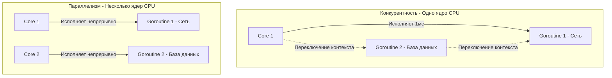
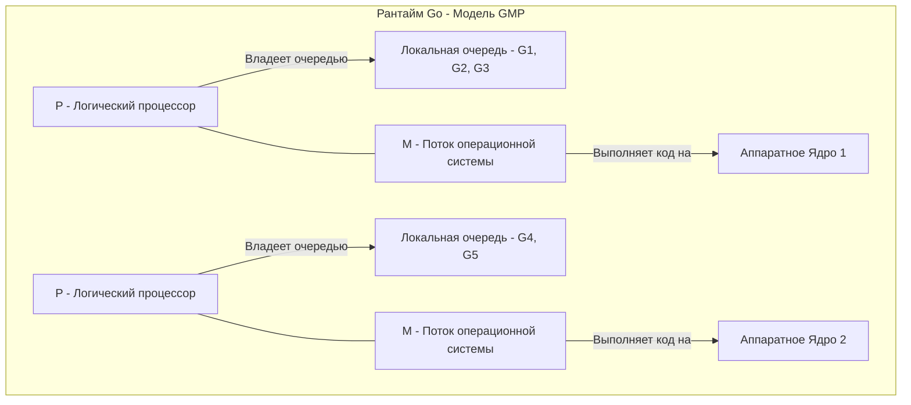

Переход из мира синхронного PHP, однопоточного Python или тяжеловесных тредов Java в мир Go часто начинается с непонимания одного фундаментального концепта. 

В 2012 году Роб Пайк (создатель Go) выступил со знаменитым докладом, название которого стало одной из главных пословиц языка (см. [[8. Go Proverbs. Практический смысл известных цитат]]): **«Concurrency is not Parallelism» (Конкурентность — это не параллелизм)**.

Многие бэкенд-разработчики используют эти термины как синонимы. Но в архитектуре высоконагруженных систем это две совершенно разные плоскости. Непонимание разницы приводит к архитектурным ошибкам, утечкам памяти и системам, которые работают медленнее после попытки их "распараллелить".

Давайте разберем эти понятия на уровне дизайна кода, планировщика ОС и архитектуры железа.

## Определение понятий

Роб Пайк сформулировал разницу так:
*   **Конкурентность (Concurrency)** — это про **справляться** с множеством задач одновременно. Это свойство *дизайна и архитектуры программы*.
*   **Параллелизм (Parallelism)** — это про **выполнять** множество задач одновременно. Это свойство *аппаратного обеспечения (железа)*.

**Конкурентность** — это способ разбить вашу монолитную программу на независимые, автономно выполняемые куски (горутины). 
**Параллелизм** возникает (или не возникает) автоматически, если вы запускаете вашу конкурентно спроектированную программу на многоядерном процессоре.

Вы можете написать конкурентную программу (с использованием `go func()`), запустить ее на процессоре с одним ядром (или задав переменную окружения `GOMAXPROCS=1`), и она будет отлично работать. Горутины будут выполняться по очереди, переключаясь во время I/O-операций. Программа будет конкурентной, но **не параллельной**.

И наоборот: вы можете написать калькулятор, который использует SIMD-инструкции процессора (векторизацию) для сложения огромных массивов за один такт. Эта программа будет строго последовательной в коде, но исполняться аппаратно параллельно.

## Под капотом: Как Go делает конкурентность эффективной (Модель G-M-P)

В классических языках (Java, C++, C#) для реализации конкурентности разработчики использовали потоки операционной системы (OS Threads). Создание нового потока в Java `new Thread()` напрямую транслировалось в системный вызов ядра ОС (например, `clone` в Linux). 

Как мы разбирали в статье [[3. Какие проблемы существующих языков пытался решить Go]], потоки ОС чудовищно дороги. Они требуют мегабайты памяти под стек и тысячи наносекунд на переключение контекста через ядро (Ring 0).

Go решает эту проблему, реализуя конкурентность в **User Space (пространстве пользователя)** с помощью собственного планировщика и модели `G-M-P`.

В исходниках рантайма Go есть три главные структуры данных:
1.  **G (Goroutine)** — структура `g`. Содержит состояние горутины, ее локальный стек (изначально всего 2 КБ) и указатель команд (Instruction Pointer), чтобы знать, на какой строчке кода она остановилась.
2.  **M (Machine)** — структура `m`. Это абстракция над реальным потоком ОС (OS Thread). `M` ничего не знает про горутины, она просто берет код и выполняет его на ядрах процессора.
3.  **P (Processor)** — структура `p`. Это "логическое ядро" рантайма Go. У каждого `P` есть локальная очередь (Local Run Queue) горутинов `G`, готовых к выполнению. Количество `P` по умолчанию равно количеству логических ядер вашего CPU (настраивается через `GOMAXPROCS`).

Чтобы горутина начала выполняться, `M` (поток ОС) должен присоединить к себе `P` (логический процессор) и взять из его очереди `G` (горутину). 

## Mechanical Sympathy: Магия переключения (Context Switch)

Представьте, что ваша конкурентная `G1` делает SQL-запрос. Она обращается к сети, и данные еще не пришли. 

**В Java/C++:** Поток ОС `M` блокируется. Ядро Linux должно сохранить все регистры CPU в память, сбросить кэш таблиц страниц виртуальной памяти (TLB Flush) и загрузить другой поток. Это убивает производительность (Cache Misses) и занимает микросекунды.

**В Go:** Рантайм видит, что `G1` уходит в I/O-ожидание. Он "открепляет" `G1` от потока ОС и переводит её в статус `Gwaiting` (сохранив всего пару регистров — `PC` и `SP` — в структуру `g`). 
Поток ОС `M` **не блокируется**. Он немедленно берет следующую горутину `G2` из локальной очереди `P` и продолжает работу. 

Всё это происходит в User Space. Железный процессор даже не замечает, что задача поменялась — он продолжает "молотить" инструкции без сброса кэшей L1/L2. Переключение горутины стоит десятки наносекунд — в 100 раз дешевле переключения потока ОС.

> [!tip] Собеседование
> **Вопрос:** Вы написали программу, которая складывает числа в цикле от 1 до 100 миллиардов. Сделает ли использование 10 000 горутин эту программу быстрее на процессоре с 1 ядром (`GOMAXPROCS=1`)?
> **Ответ:** Нет, она станет **медленнее**. 
> Числодробление — это CPU-bound задача. На одном ядре параллелизм невозможен. Если вы разобьете задачу на 10 000 конкурентных горутин, процессору придется тратить такты на переключение контекста между ними (хоть оно в Go и дешевое, но не бесплатное). 
> Конкурентность без параллелизма ускоряет только **I/O-bound** задачи (когда потоки ждут сеть или диск). CPU-bound задачи ускоряются только параллелизмом (добавлением реальных физических ядер).

## Почему Go форсирует конкурентность?

Когда вы пишете `go processOrder(order)`, вы не говорите рантайму: *"создай новый поток и выполни это параллельно"*. Вы говорите: *"вот независимая часть бизнес-логики, выполни ее в фоне, когда у процессора будет свободное время"*.

Вы делегируете принятие решения планировщику Go.
*   Если вы запустите код на Raspberry Pi с 1 ядром, планировщик будет переключать контексты, обеспечивая отзывчивость системы.
*   Если вы задеплоите тот же бинарник на сервер с 64 ядрами, планировщик раскидает горутины по 64 структурам `P` и `M`, обеспечивая максимальный параллелизм без изменения единой строчки кода.

## Ловушка: Гонки данных (Data Races)

Как только вы разбиваете программу на независимые горутины, возникает проблема: что делать, если `G1` и `G2` (которые могут исполняться параллельно на разных ядрах) захотят одновременно изменить переменную `count`?

На уровне железа это приводит к неопределенному поведению. Оба ядра прочитают значение `count` в свои локальные кэши L1, инкрементируют его и попытаются записать обратно, затирая результаты друг друга (Lost Update).

Раз конкурентность — это свойство дизайна, то язык должен предоставить инструменты для безопасного общения между этими независимыми частями кода.

## Итог

1.  **Конкурентность** — это структура. Разбиение программы на независимые процессы.
2.  **Параллелизм** — это исполнение. Физическое одновременное выполнение команд.
3.  Go позволяет легко писать конкурентный код с помощью горутин. Рантайм (через структуры `G`, `M`, `P`) заботится о том, чтобы этот код исполнялся параллельно, если железо это позволяет.
4.  Переключение контекста горутин происходит в User Space, что позволяет держать 100 000 открытых сетевых соединений на одном сервере, не убивая процессор сбросом кэшей.

Мы поняли, как разбивать логику на независимые горутины. Но как они должны обмениваться результатами своей работы, чтобы не словить состояние гонки? В классических языках ответ один — мьютексы. Но Go предлагает радикально другой, математически выверенный подход. Об этом — в следующей важнейшей статье раздела: [[25. Share Memory By Communicating. Почему каналы важнее Mutex]].