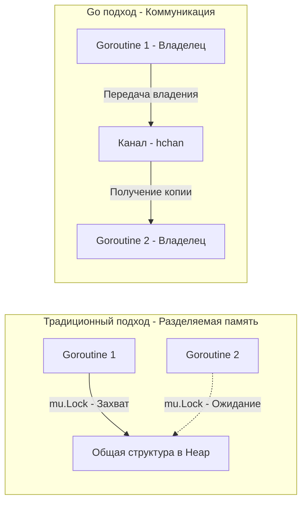

В предыдущей статье ([[24. Concurrency Is Not Parallelism. Философия конкурентности в Go]]) мы выяснили, что горутины — это независимые потоки выполнения, которые планировщик рантайма распределяет по ядрам процессора. 

Как только в системе появляется несколько независимых процессов, возникает фундаментальная проблема: **Синхронизация состояния**. Что делать, если две горутины хотят одновременно обновить счетчик или добавить элемент в мапу?

Разработчики из мира Java, C# или C++ автоматически тянутся к мьютексам (`Mutex`, `Monitor` или `Lock`). Логика проста: создаем общую переменную, оборачиваем её блокировкой, и все потоки по очереди получают к ней доступ.

Но создатели Go предложили совершенно иную парадигму, которая стала главной пословицей языка (её мы кратко упоминали в [[8. Go Proverbs. Практический смысл известных цитат]]): 
**«Do not communicate by sharing memory; instead, share memory by communicating»** *(Не общайтесь, разделяя память; разделяйте память, общаясь)*.

Давайте спустимся на уровень железа и рантайма, чтобы понять, почему общая память — это проблема, и как каналы меняют архитектуру высоконагруженных систем.

## Проблема общей памяти (Mechanical Sympathy)

Представьте себе классическую архитектуру: у нас есть структура `Cache` с полем `map` и `sync.Mutex`. Десятки горутин со всех ядер процессора пытаются читать и писать в этот кэш.

На уровне исходного кода это выглядит как простая блокировка `mu.Lock()`. Но на уровне процессора разворачивается настоящая война.

Современные многоядерные процессоры (CPU) имеют локальные кэши (L1/L2) для каждого ядра. Чтобы ядра не работали с устаревшими данными, процессоры используют протоколы когерентности кэша (например, **MESI**).
Когда Горутина 1 (на Ядре 1) захватывает мьютекс, она использует атомарную операцию процессора `CAS` (Compare-And-Swap). Ядро 1 помечает кэш-линию с мьютексом как "Эксклюзивную" (Exclusive/Modified).

В этот момент Горутина 2 (на Ядре 2) пытается захватить тот же мьютекс. Происходит следующее:
1. Ядро 2 отправляет широковещательный запрос по шине процессора.
2. Ядро 1 вынуждено прервать работу, сбросить свои изменения в общую память (L3 кэш или RAM) и инвалидировать свою локальную кэш-линию.
3. Это явление называется **Cache Line Bouncing** (прыгающая кэш-линия).

>[!info] Под капотом: Масштабируемость мьютексов
> Мьютекс — это глобальная точка синхронизации (Bottleneck). Чем больше физических ядер у вашего процессора и чем активнее горутины борются за один мьютекс (Lock Contention), тем **медленнее** работает система в целом. Ядра тратят такты не на полезную работу, а на протоколы инвалидации кэшей друг друга.

## Парадигма CSP и Каналы

Вместо того чтобы заставлять горутины толпиться вокруг одного куска памяти, Go реализует математическую модель **CSP (Communicating Sequential Processes)**, предложенную Тони Хоаром в 1978 году.

Суть парадигмы: **В каждый момент времени данными владеет только одна горутина.** 
Если другой горутине нужны эти данные, первая горутина не дает ей ссылку на общую память. Она **отправляет копию данных (сообщение)** через безопасный канал связи.



Когда горутина передает объект через канал, она неявно передает **права владения** этим объектом. Нет разделяемого состояния — нет гонок данных (Data Races), нет необходимости в мьютексах на уровне бизнес-логики.

## Под капотом: Устройство Канала (hchan)

Многие разработчики думают, что каналы (`chan`) — это какая-то безблокировочная магия (lock-free). Это миф.

Внутри рантайма Go канал представлен структурой `hchan`. Если мы заглянем в исходники (`runtime/chan.go`), мы увидим следующее (упрощенно):

```go
type hchan struct {
    qcount   uint           // Количество элементов в очереди
    dataqsiz uint           // Размер кольцевого буфера
    buf      unsafe.Pointer // Указатель на массив памяти (буфер)
    sendx    uint           // Индекс отправки
    recvx    uint           // Индекс получения
    recvq    waitq          // Очередь ожидающих горутин-читателей (sudog)
    sendq    waitq          // Очередь ожидающих горутин-писателей (sudog)
    lock     mutex          // ДА, ВНУТРИ КАНАЛА ЕСТЬ МЬЮТЕКС!
}
```

**Стоп! Если внутри канала есть мьютекс, почему Пайк говорит, что каналы лучше мьютексов?**

Разница заключается в **семантике и интеграции с планировщиком**.

1.  **Оркестрация потока управления (Control Flow):** Мьютекс просто блокирует память. Канал — управляет выполнением программы. Когда горутина пытается прочитать из пустого канала, она не "крутится" в бесконечном цикле (spin-lock). Рантайм Go захватывает внутренний `lock` канала, помещает горутину в очередь `recvq`, снимает её с ядра процессора (вызывает `gopark`) и отдает ядро другой горутине. Это идеальная интеграция с M:N планировщиком.
2.  **Инкапсуляция состояния:** Мьютекс легко забыть разблокировать (забытый `defer mu.Unlock()`). Можно случайно прочитать данные в обход мьютекса. Канал инкапсулирует локи внутри рантайма. Разработчик физически не может "сломать" внутренний буфер канала.

> [!warning] Ловушка / Gotcha: Передача указателей через канал
> Самая частая ошибка архитектуры при использовании каналов. Вы создаете структуру, передаете указатель на нее `*User` через канал в другую горутину, а затем... **продолжаете изменять эту структуру в исходной горутине**.
> Это полностью разрушает философию "Share Memory By Communicating" и создает гонку данных (Data Race).
> **Правило:** Если вы передаете указатель через канал, исходная горутина должна "забыть" про него. Передавайте право на мутацию (Ownership), а не просто ссылку. А еще лучше — передавайте структуры по значению (компилятор скопирует память, обеспечив 100% изоляцию), если структура не весит мегабайты.

## Mutex против Channel: Прагматичный выбор

Означает ли всё это, что мьютексы в Go запрещены или их нужно избегать? Категорически нет. В стандартной библиотеке Go мьютексы используются повсеместно (в том числе внутри тех же каналов).

Дзен Go (как мы обсуждали в предыдущих статьях) требует прагматизма. 

**Используйте `sync.Mutex` / `sync.RWMutex`, когда:**
1. Вы защищаете простое локальное состояние внутри структуры (например, in-memory кэш, мапа, инкрементальный счетчик).
2. Операция чтения/записи занимает наносекунды и не содержит сетевых вызовов или I/O.
3. Вам не нужно уведомлять другие горутины о том, что состояние изменилось.

**Используйте `chan` (Каналы), когда:**
1. Вам нужно **передать данные** от одного независимого процесса к другому (Паттерны Producer-Consumer, Worker Pool).
2. Вы хотите **оркестрировать** горутины: запустить 10 воркеров и дождаться их завершения, или передать сигнал отмены (через закрытие канала `close`).
3. Вам нужно объединить несколько асинхронных операций (через оператор `select`).

> [!tip] Собеседование
> **Вопрос:** Почему использование мьютексов делает архитектуру жесткой, а каналов — гибкой?
> **Ответ:** Мьютексы порождают сильную связность (Tight Coupling). Горутины должны знать об общей структуре и делить её в памяти. Каналы обеспечивают слабую связность (Loose Coupling). Горутина-писатель ничего не знает о том, кто читает данные. Она просто "бросает" значение в канал. Вы можете добавить еще 5 горутин-читателей, объединить каналы через `select`, ограничить пропускную способность (через буферизацию) — и вам не придется менять логику работы писателя.

## Оператор select: Сердце конкурентности

Настоящая мощь каналов раскрывается при использовании оператора `select`. Это аналог `switch`, но для каналов. 

Он позволяет одной горутине одновременно "слушать" несколько каналов без блокировки потока ОС. Это идеальный инструмент для реализации таймаутов,优雅ного завершения (graceful shutdown) и мультиплексирования.

```go
func worker(ctx context.Context, tasks <-chan Task) {
    for {
        select {
        case t := <-tasks:
            process(t)
        case <-ctx.Done(): // Share memory by communicating (сигнал отмены)
            log.Println("Воркер остановлен")
            return
        }
    }
}
```
Сделать подобную неблокирующую отмену на основе сырых мьютексов и переменных состояния (Condition Variables) в Java или C++ — это задача, требующая десятков строк сложнейшего кода с риском получить Deadlock. В Go это нативный синтаксис.

## Итог

1.  Разделяемая память (мьютексы) — это узкое горлышко (Bottleneck) на уровне кэшей процессора и архитектуры приложения.
2.  Философия Go: передавайте данные как сообщения через каналы. Это децентрализует систему и делает поток управления прозрачным.
3.  Внутри канала есть мьютекс, но канал берет на себя самую сложную работу — интеграцию с планировщиком (G-M-P) и управление жизненным циклом горутин (park/unpark).

На этом мы завершаем фундаментальный обзор философии языка, типизации и конкурентности. Вы уже знаете, *как* нужно мыслить. Но чтобы писать код, вам нужны инструменты. И вместо того чтобы искать их на GitHub или в npm-реестре, Senior Go-разработчик сначала смотрит в исходники самого языка. 
В следующей, завершающей статье этого блока мы обсудим, почему "всё свое ношу с собой" стало стандартом в Go: [[26. Стандартная библиотека как часть философии языка]].