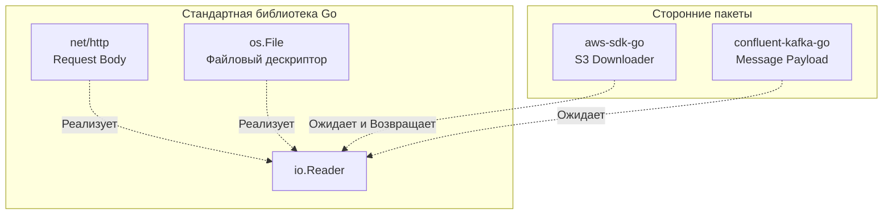

В экосистемах вроде Node.js (JavaScript) или PHP стандартная библиотека предоставляет лишь базовый набор утилит. Для создания полноценного веб-сервера вы немедленно тянете пакеты из менеджера зависимостей: `npm install express`, `composer require symfony/http-foundation`.

Когда разработчики приходят в Go, они по инерции начинают искать на GitHub "самый популярный веб-фреймворк" или "самую удобную библиотеку для работы с HTTP". Они находят фреймворки вроде Gin, Echo или Fiber, устанавливают их и… упускают один из главных архитектурных столпов языка.

Философия Go бескомпромиссна: **Стандартная библиотека — это не стартовый набор для новичков. Это production-ready инструмент, вокруг абстракций которого строится вся остальная экосистема.**

Давайте разберем, почему стандартная библиотека Go уникальна, как она интегрирована с ядром операционной системы и почему Senior Go-разработчики пишут микросервисы с нулевым (или минимальным) количеством внешних зависимостей.

## 1. Бэкенд-нативность "из коробки"

Go создавался внутри Google для решения конкретных проблем бэкенда и распределенных систем (см. [[3. Какие проблемы существующих языков пытался решить Go]]). Это отразилось на составе пакетов.

В стандартной библиотеке Go нет парсеров XML-RPC, библиотек для построения GUI или движков для отрисовки графики (как в Python или Java). Зато в ней есть:
*   `net/http` — полноценный HTTP/1.1 и HTTP/2 сервер и клиент.
*   `crypto/...` — реализации всех современных криптографических алгоритмов (TLS 1.3, AES-GCM, RSA, ECDSA), написанные и оптимизированные с использованием ассемблера.
*   `database/sql` — универсальный пул соединений для реляционных баз данных.
*   `encoding/json` — парсер JSON, основанный на рефлексии (которого часто хватает для 80% задач).

В других языках встроенные серверы (например, `http.server` в Python) созданы исключительно для локальной отладки. В официальной документации Python прямо написано: *«Не используйте это в продакшене»*.
В Go сервер из пакета `net/http` обслуживает терабайты продакшен-трафика в таких компаниях, как Cloudflare, Uber и Netflix.

## 2. Интеграция с рантаймом: Mechanical Sympathy

Вы не можете просто так написать стороннюю библиотеку для работы с сетью, которая будет "лучше" стандартной. И дело не в том, что авторы языка умнее вас. Дело в том, что пакет `net` имеет привилегированный доступ к рантайму Go.

> [!info] Под капотом: Пакет net и Network Poller
> Когда вы вызываете функцию `conn.Read()` на TCP-сокете с помощью сторонней библиотеки на C++, поток операционной системы (OS Thread) **блокируется**, ожидая прибытия пакета по сети. 
> В Go стандартный пакет `net` работает в тесной связке с планировщиком (G-M-P). Вызов `conn.Read()` под капотом переводит сокет в неблокирующий режим (O_NONBLOCK) и регистрирует его в системном мультиплексоре ОС (`epoll` в Linux или `kqueue` в macOS). 
> После этого пакет `net` подает сигнал рантайму: *«усыпи текущую горутину (вызов `gopark`), а поток ОС отдай другой горутине»*. 
> Эта магия (Netpoll) недоступна для стороннего кода, написанного поверх сырых системных вызовов. Используя стандартную библиотеку, вы получаете идеальную утилизацию CPU и кэш-линий без необходимости вручную жонглировать асинхронными коллбэками.

## 3. Стандартизация абстракций (Ecosystem Glue)

Самая важная роль стандартной библиотеки Go — это не реализация функций, а **определение интерфейсов**. 

Благодаря неявной реализации интерфейсов (см. [[16. Почему маленькие интерфейсы лучше больших]]), стандартная библиотека задает "общий язык", на котором общаются все сторонние пакеты.

Пример: интерфейс `io.Reader`.
```go
type Reader interface {
    Read(p[]byte) (n int, err error)
}
```



Если вы скачаете AWS SDK для Go, чтобы загрузить файл в S3-бакет, функция `Upload` будет ожидать `io.Reader`. Она не требует "свой особенный класс AWSFile". Вы можете передать ей файл с диска (`os.File`), тело входящего HTTP-запроса (`r.Body`), или буфер из памяти (`bytes.Buffer`). 

Стандартная библиотека "склеивает" экосистему, предотвращая фрагментацию. В Java/C# разные фреймворки часто имеют свои собственные несовместимые абстракции для HTTP-запросов. В Go интерфейс `http.Handler` является абсолютным монополистом. Любой сторонний роутер или мидлварь обязан его реализовывать.

## 4. Паттерн "Драйверы" (Пакет database/sql)

Еще один гениальный архитектурный ход стандартной библиотеки — пакет `database/sql`.

Этот пакет **не содержит** ни одного драйвера для баз данных (ни PostgreSQL, ни MySQL, ни SQLite). Что же в нем есть?
1. В нем есть пул соединений (Connection Pool) с управлением жизненным циклом (пинги, обрывы, таймауты).
2. В нем есть набор абстрактных интерфейсов (`driver.Conn`, `driver.Tx`).

Разработчик (вы) в своем коде работает **только** со стандартным пакетом `database/sql`. А конкретный драйвер для PostgreSQL (например, `github.com/lib/pq`) просто подключается в `main.go` с помощью анонимного импорта `import _ "github.com/lib/pq"`. 

Драйвер в момент инициализации регистрирует свою реализацию в `database/sql`. Это идеальный пример принципа инверсии зависимостей (DIP) из SOLID. Вся сложная логика работы с пулом потоков и транзакциями реализована авторами языка, а авторам драйверов остается лишь написать сериализацию байтов в специфичный протокол базы данных.

>[!tip] Собеседование
> **Вопрос:** Почему в Go принято использовать `database/sql` даже при наличии мощных драйверов вроде `pgx`, и в чем разница?
> **Ответ:** Использование `database/sql` делает ваш код теоретически независимым от конкретной БД. Но на практике `pgx` (современный драйвер для PostgreSQL) предоставляет два варианта работы:
> 1. Через стандартный `database/sql` (совместимость со всеми инструментами).
> 2. Через свой собственный (native) интерфейс, который позволяет использовать специфичные фичи Postgres (например, COPY-операции, сложные массивы или Listen/Notify). Senior-разработчик выбирает нативный `pgx`, если требуются специфичные оптимизации для Postgres, и стандартный `database/sql`, если нужна универсальность и совместимость со стандартными ORM/Query-билдерами.

## 5. Культура "Нулевых Зависимостей"

В сообществе Node.js есть известная история про пакет `left-pad` (11 строк кода), удаление которого сломало половину интернета. 

Go Proverbs гласит: *«Небольшое копирование лучше небольшой зависимости»*. Если вам нужно сгенерировать случайную строку из 10 символов, вы не ищете пакет `go-random-string`. Вы открываете стандартный пакет `crypto/rand` и пишете эти 5 строк логики самостоятельно.

Чем меньше у вашего проекта внешних зависимостей (строк в `go.mod`), тем:
1. Быстрее он компилируется.
2. Меньше риск Supply Chain атак (когда злоумышленник захватывает чужой пакет).
3. Легче обновлять версию Go.

> [!warning] Ловушка / Gotcha: fasthttp
> Многие разработчики, стремясь к максимальной производительности, заменяют стандартный `net/http` на сторонний пакет `valyala/fasthttp` (который аллоцирует меньше памяти за счет переиспользования буферов в пулах). 
> Но это ловушка! `fasthttp` **не совместим** со стандартными интерфейсами `net/http` и `context.Context`. Заменив сервер, вы больше не сможете использовать 99% сторонних мидлварей (Prometheus-метрики, трейсинг, лимитеры), написанных для стандартной библиотеки. Вы изолируете себя от экосистемы. Выбирайте `fasthttp` только для критически нагруженных шлюзов (API Gateways), где миллисекунды GC важнее экосистемы, а в обычных микросервисах всегда оставайтесь на `net/http`.

## Итог

1.  **Не спешите брать фреймворк.** В Go фреймворки скрывают поток управления и ломают принцип локальности рассуждений. Для 90% задач вам хватит стандартной библиотеки + хорошего стороннего роутера (например, `chi` или встроенного в Go 1.22+ `ServeMux`).
2.  **Учите стандартные абстракции.** Понимание `io.Reader`, `io.Writer`, `error` и `context.Context` важнее знания синтаксиса языка.
3.  **Изучайте исходники.** Исходный код стандартной библиотеки Go читается как увлекательная книга. Это эталон идиоматичного кода. Если вы не знаете, как правильно спроектировать API пакета, посмотрите, как спроектирован `net/http` или `io`.

Но почему разработчики Go так уверены в стандартной библиотеке? Почему они не боятся, что завтра выйдет Go 2.0 и все эти интерфейсы превратятся в тыкву (как это было при переходе с Python 2 на Python 3)? 
Ответ кроется в жестком контракте, который авторы языка заключили с сообществом. Об этом гаранте спокойствия мы поговорим в следующей статье: [[27. Совместимость Go 1 и стабильность экосистемы]].