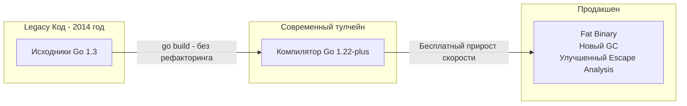

В мире бэкенд-разработки есть одна боль, которая объединяет программистов на Python, Node.js, PHP и Java. Это миграция на новую мажорную версию. 

Переход с Python 2 на Python 3 занял у индустрии более 10 лет и стоил компаниям миллионы долларов на переписывание кода. Обновление фреймворков (Angular 1 -> 2, обновления Spring или Symfony) часто требует недель на рефакторинг из-за Breaking Changes (обратно несовместимых изменений).

Когда разработчики приходят в Go, они с удивлением обнаруживают проекты, написанные 8 лет назад, которые можно просто скачать с GitHub, запустить `go build`, и они собираются без единой ошибки. 

Секрет этого чуда кроется в документе, который называется **«Go 1 Compatibility Promise» (Гарантия совместимости Go 1)**. Это не просто маркетинговый ход, это инженерный фундамент, на котором держится вся уверенность бизнеса в языке.

## Суть контракта совместимости

В 2012 году, выпуская версию Go 1.0, разработчики (Кен Томпсон, Роб Пайк, Расс Кокс) опубликовали строгий манифест. Его суть сводится к одному предложению:

> **Программы, написанные для спецификации Go 1, будут продолжать корректно компилироваться и работать без изменений на протяжении всего жизненного цикла серии Go 1.x.**

Для вас как для бэкенд-архитектора это означает следующее:
1.  **Синтаксис не ломается.** Ключевые слова не меняют своего значения.
2.  **API стандартной библиотеки не удаляется.** Если пакет `net/http` имел функцию `http.Get()` в версии 1.0, она будет там с той же сигнатурой в версии 1.30. Устаревшие функции могут получить комментарий `// Deprecated:`, но компилятор никогда не перестанет их поддерживать.
3.  **Бесплатные обновления (Free Performance Boost):** Вы можете взять код, написанный в 2014 году под Go 1.3, и скомпилировать его современным компилятором Go 1.22. Ваш код мгновенно, без единого изменения, получит новый неблокирующий Garbage Collector, оптимизированный планировщик `G-M-P` и векторизованные инструкции процессора.

## Под капотом: Как Go управляет изменениями (GODEBUG)

Индустрия не стоит на месте, и компилятору необходимо внедрять новые, иногда меняющие поведение, фичи. Как команда Go делает это, не ломая гарантию совместимости?

В современном Go (начиная с 1.21) механизм совместимости привязан к файлу `go.mod`. 
Если в вашем файле `go.mod` написано `go 1.20`, а вы компилируете проект с помощью тулчейна Go 1.23, компилятор **понизит** свое поведение до версии 1.20 для этого конкретного модуля.

> [!info] Под капотом: Переменная среды GODEBUG
> Механизм эмуляции старых версий реализован через внутренние флаги `GODEBUG`. 
> Например, в Go 1.22 изменили фундаментальное поведение: переменная цикла `for` теперь создается заново на каждой итерации (чтобы предотвратить частые баги с замыканиями и указателями в горутинах). Это технически Breaking Change! 
> Но если ваш `go.mod` указывает версию `1.21` или ниже, компилятор Go 1.22 автоматически применяет флаг `GODEBUG=loopvar=1`, компилируя цикл по старым правилам. Ваш старый код не сломается. Вы получите новую семантику цикла только тогда, когда явно обновите директиву до `go 1.22` в своем `go.mod`.

Этот подход позволяет языку эволюционировать, давая разработчикам полный контроль над моментом перехода на новую семантику.

## Исключения: Что НЕ покрывается гарантией?

Обещание совместимости не означает, что вы можете писать плохой код и ожидать, что он будет работать вечно. Контракт имеет четкие границы.

### 1. Пакет unsafe
Пакет `unsafe` (как следует из названия) позволяет обходить типобезопасность Go, напрямую читая и записывая в оперативную память с помощью арифметики указателей. 
Внутреннее представление структур рантайма (например, `slice`, `iface` или мапы `hmap`) может меняться от версии к версии. Если вы жестко захардкодили смещение байтов (byte offsets) внутри `hmap`, ваш код сломается при следующем обновлении.

### 2. Баги и Недокументированное поведение
Если ваш код полагался на баг в стандартной библиотеке (например, `crypto/tls` неверно проверял сертификат), а авторы Go этот баг исправили — ваш код сломается. Авторы языка считают, что "Исправление бага — это не нарушение обратной совместимости".

### 3. Порядок итерации Map (Mechanical Sympathy in Action)

Это самый знаменитый и показательный пример философии Go.

В ранних версиях языка итерация по `map` (хеш-таблице) всегда происходила в одном и том же порядке (как данные лежали в памяти). Разработчики начали писать тесты и бизнес-логику, которая **неявно** полагалась на этот порядок.

Но спецификация языка (которая является высшим законом) гласила: *"Порядок итерации по map не определен"*.

Что сделали авторы Go? Вместо того чтобы просить разработчиков "пожалуйста, не полагайтесь на порядок", они внедрили в рантайм **аппаратную рандомизацию**.
Теперь каждый раз, когда вы вызываете цикл `for k, v := range myMap`, рантайм `hmap` генерирует случайное число (seed) и начинает обход бакетов памяти со случайного смещения.

> [!warning] Ловушка / Gotcha: Искусственный хаос
> Рандомизация мап — это преднамеренный хаос, созданный для защиты абстракции. Авторы языка намеренно "ломали" ваш локальный запуск, чтобы ваш код упал на этапе тестирования, а не сломался в продакшене через 3 года при обновлении архитектуры компилятора. Если вам нужен упорядоченный обход мапы, вы обязаны явно извлечь ключи в слайс и отсортировать их.

## Стабильность как конкурентное преимущество

Почему этот консерватизм так важен для Enterprise?
*   **Срок жизни кода (Code Longevity):** В микросервисной архитектуре многие сервисы могут не требовать продуктовых обновлений годами. Разработчики не должны тратить спринты на "обновление фреймворков безопасности", чтобы просто собрать старый проект.
*   **Снижение когнитивной нагрузки:** Изучив стандартную библиотеку Go сегодня, вы можете быть уверены, что эти знания будут актуальны и через 5, и через 10 лет. Вы не окажетесь в ситуации, когда ваши знания устаревают из-за выхода "нового стандарта индустрии".
*   **Экосистема без расколов:** Сообщество Go не разделено на лагеря "кто использует старую версию, а кто новую" (как это было в экосистеме Python). Почти 90% разработчиков всегда используют одну из двух последних версий компилятора, зная, что это безопасно.

> [!tip] Собеседование
> **Вопрос:** В чем разница между обновлением мажорной версии в языке с виртуальной машиной (Java) и обновлением версии Go?
> **Ответ:** В Java вам необходимо обновить среду выполнения (JRE) на сервере, что может затронуть другие сервисы, работающие на этой же машине. В Go бинарник статически слинкован (содержит свой собственный рантайм внутри). Вы можете обновить компилятор на своей рабочей машине, собрать новый бинарник и задеплоить его. Инфраструктура (Docker-образы, серверы) даже не заметит, что вы обновили версию языка.

## Итог

Контракт Go 1 — это одно из самых сильных инженерных обещаний в индустрии. Он защищает бизнес-логику от "гниения" (bit rot), а разработчиков — от бесконечного рефакторинга ради рефакторинга.

Однако этот жесткий консерватизм имел и обратную сторону. Разработчики просили добавить в язык Обобщенное программирование (Generics) более 10 лет. Команда языка отказывалась, так как не могла найти решение, которое не сломало бы обратную совместимость, время компиляции или производительность рантайма. 

Как в итоге была решена эта невозможная задача? Разбираем в следующей статье: [[28. Generics. Почему Go так долго жил без них]].