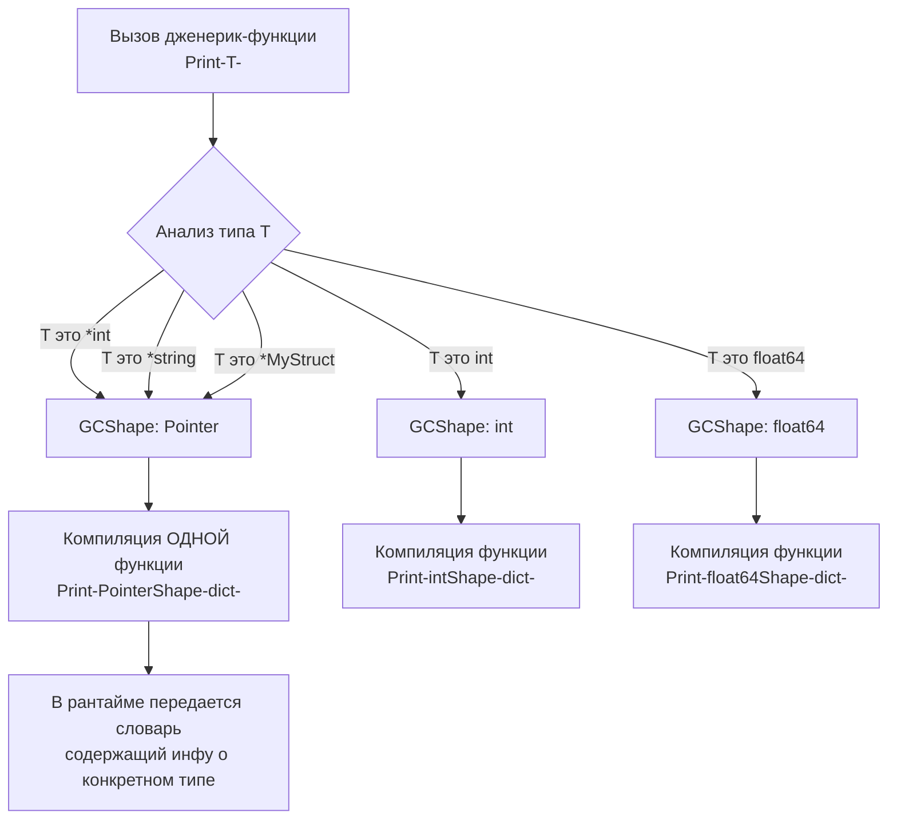

## Слон в комнате: Почему мы ждали 10 лет?

На протяжении десятилетия отсутствие обобщенного программирования (Generics) было главным поводом для критики Go со стороны разработчиков на Java, C# и C++. Ответом сообщества часто было: «Вам не нужны дженерики, используйте интерфейсы». 

Но реальность такова, что разработчики языка — Роб Пайк, Кен Томпсон, Роберт Гризмер и Расс Кокс — никогда не были *против* дженериков. Они были против **плохих реализаций** дженериков. Встраивание обобщений ломало фундаментальные принципы, описанные в [[5. Философия Go. Простота, читаемость и прагматизм]]: язык должен быстро компилироваться, код должен легко читаться, а рантайм не должен перегружаться скрытыми абстракциями.

Добавление дженериков (появились в Go 1.18 в 2022 году) стало самым масштабным изменением языка с момента его релиза. Чтобы понять, почему это заняло так много времени, нужно заглянуть под капот существующих подходов в других языках.

---

## Треугольник компромиссов Расса Кокса

Расс Кокс, один из ведущих разработчиков Go, в своей знаменитой статье «The Generic Dilemma» сформулировал проблему дженериков как треугольник компромиссов. При реализации обобщений разработчики компилятора могут выбрать только **два из трех** свойств:

1. **Быстрая компиляция.**
2. **Быстрое исполнение (производительность).**
3. **Удобство написания кода (отсутствие бойлерплейта).**

Давайте посмотрим, как эту проблему решали другие языки.

### Подход C++ и Rust: Мономорфизация (Monomorphization)
**Выбрано: Быстрое исполнение + Удобство написания.**
В C++ (Templates) и Rust компилятор берет обобщенную функцию и создает ее точную копию для *каждого* типа, с которым она вызывается. Вызвали `Sort[int]` и `Sort[string]` — в бинарнике будут лежать две совершенно разные функции. 
* **Плюс:** Идеальная производительность. Никакого оверхеда в рантайме, CPU счастлив, кэши работают отлично.
* **Минус:** Катастрофически медленная компиляция (одна из причин, почему C++ проекты собираются часами) и «разбухание» бинарника (Code Bloat). Для философии Go медленная компиляция была неприемлема.

### Подход Java: Стирание типов (Type Erasure)
**Выбрано: Быстрая компиляция + Удобство написания.**
В Java дженерики существуют только на этапе компиляции. В рантайме `List<Integer>` и `List<String>` превращаются в просто `List<Object>`. Компилятор автоматически подставляет приведения типов (type casting).
* **Плюс:** Быстрая компиляция, бинарник не разрастается, так как функция существует в одном экземпляре.
* **Минус:** Производительность. Чтобы положить примитив `int` в `Object`, его нужно обернуть в ссылочный тип `Integer` (Boxing). Это вызывает аллокацию в куче и убивает Mechanical Sympathy напрочь: данные разбросаны по памяти, кэш-линии CPU инвалидируются, Garbage Collector получает гору лишней работы. Для системного языка вроде Go это фатально.

### Подход C и раннего Go: Отказ от встроенных дженериков
**Выбрано: Быстрая компиляция + Быстрое исполнение.**
До 1.18 Go заставлял разработчиков либо использовать `interface{}` (пустой интерфейс) и терять типобезопасность плюс платить за распаковку в рантайме, либо писать генераторы кода (`go generate`), по сути выполняя работу компилятора C++ вручную. Это было неудобно (страдало третье условие треугольника).

---

## Как это реализовали в Go (GCShape Stenciling)

Команда Go искала способ обойти этот треугольник. Итоговое решение под капотом — это инженерный шедевр, сочетающий идеи частичной мономорфизации и словарей типов (Dictionaries). Этот подход называется **GCShape Stenciling**.

Вместо того чтобы генерировать отдельный машинный код для *каждого* типа (как C++) или оборачивать всё в один тип-указатель (как Java), компилятор Go группирует типы по их **GCShape** — форме для Garbage Collector.

> [!info] Под капотом: Что такое GCShape?
> **GCShape** — это абстракция компилятора, определяющая размер типа в памяти и расположение в нем указателей. 
> 
> Все указатели в Go (`*int`, `*string`, `*MyStruct`) имеют одинаковый размер (8 байт на 64-битных системах) и одинаково обрабатываются сборщиком мусора. Значит, они имеют один и тот же GCShape.
> Базовые типы `int` и `float64` имеют размер 8 байт, но не содержат указателей — у них разные GCShape.

### Как работает компиляция дженериков:
1. **Штамповка (Stenciling):** Для каждого уникального `GCShape` компилятор генерирует *свою* версию обобщенной функции.
2. **Словари (Dictionaries):** Поскольку одна сгенерированная функция обслуживает сразу пачку типов (например, все указатели), ей нужно знать, с каким именно типом она работает прямо сейчас (например, чтобы вызвать метод `String()`). Для этого при вызове функции компилятор неявно передает **указатель на словарь типа** (похоже на `itab` в интерфейсах).



**Что это дало?**
* Нет тотального Code Bloat, как в C++: все указатели шарят один машинный код.
* Нет чудовищного Boxing-а базовых типов, как в Java: `int` остается на стеке и занимает свои 8 байт, `byte` — 1 байт.
* Компиляция замедлилась (примерно на 15-20% в проектах с обилием дженериков), но осталась в пределах комфорта.

---

## Синтаксис и ограничения

Go ввел два новых ключевых слова (и концепции) для дженериков: параметры типов (Type Parameters) в квадратных скобках `[]` и ограничения (Constraints) через интерфейсы.

```go
// T - параметр типа. 
// any - это алиас для interface{} (ограничение, разрешающее любой тип).
func Reverse[T any](s []T) {
    for i, j := 0, len(s)-1; i < j; i, j = i+1, j-1 {
        s[i], s[j] = s[j], s[i]
    }
}
```

### Констрейнты (Ограничения)
В отличие от C++, где компилятор понимает ошибку типизации только при попытке сгенерировать тело шаблона (выдавая многокилометровые трейсы ошибок), в Go дженерик-функция обязана декларировать интерфейс-ограничение.

```go
// Ограничение: T должно быть типом, поддерживающим операции >, <, ==
type Ordered interface {
    ~int | ~int8 | ~int16 | ~int32 | ~int64 |
    ~uint | ~uint8 | ~uint16 | ~uint32 | ~uint64 | ~uintptr |
    ~float32 | ~float64 |
    ~string
}

// Теперь компилятор на этапе парсинга функции гарантирует, 
// что к T можно применить оператор <
func Min[T Ordered](a, b T) T {
    if a < b {
        return a
    }
    return b
}
```
*Символ `~` означает «любой тип, базовым для которого является указанный». Это позволяет передавать кастомные типы вроде `type MyInt int`.*

---

## Когда НЕ нужно использовать дженерики

После выхода Go 1.18 многие разработчики с бэкграундом в ООП начали пихать параметры типов везде, превращая Go в подобие C#. Это грубое нарушение философии языка, описанной в [[6. Idiomatic Go. Что значит писать по-goшному]].

> [!tip] Собеседование: Интерфейс или Дженерик?
> Классический вопрос на Middle+: "Когда использовать дженерики, а когда интерфейсы?"
> **Правило:** > * Если вам нужно абстрагироваться от **поведения** (что объект умеет делать) — используйте интерфейсы.
> * Если вам нужно абстрагироваться от **хранения данных** (структуры данных, коллекции) — используйте дженерики.

**Антипаттерн: Дженерик ради вызова метода**
```go
// ПЛОХО: Использование дженерика там, где интерфейс решает задачу проще.
type Stringer interface {
    String() string
}

// Зачем здесь T? При каждом новом типе мы рискуем раздуть бинарник.
func PrintToString[T Stringer](item T) {
    fmt.Println(item.String())
}

// ХОРОШО: Классический интерфейс. Функция компилируется один раз.
func PrintToString(item Stringer) {
    fmt.Println(item.String())
}
```

**Когда дженерики действительно нужны:**
1. **Собственные коллекции:** `Set[T]`, `Tree[T]`, `SyncMap[K, V]`.
2. **Утилиты для работы со слайсами и мапами:** `Filter()`, `Map()`, `Reduce()`, `Keys()`, `Values()`.
3. **Обёртки над каналами:** `FanIn[T]`, `MergeChannels[T]`.

> [!warning] Ловушка / Gotcha
> Обобщенные типы не могут использоваться в качестве базовых для создания интерфейсов, а дженерик-функции **не могут быть методами других дженерик-структур, если они вводят новые параметры типов**. 
> То есть в Go невозможно написать классический паттерн `Monad` (например, `Map<U>(f func(T) U) Monad<U>`) внутри методов самой структуры. Вы должны писать это как отдельную функцию пакета. Это сознательное ограничение для ускорения компиляции и предотвращения излишней абстракции.

## Итог

1. Go жил без дженериков 10 лет, потому что создатели искали решение, которое не уничтожит скорость компиляции и производительность рантайма.
2. В Go нет `Type Erasure` (как в Java) и чистой `Monomorphization` (как в C++). Используется подход **GCShape Stenciling**, объединяющий генерацию кода для разных структур памяти и передачу словарей типов для интерфейсов.
3. Дженерики идеальны для структур данных (слайсы, деревья, хеш-таблицы).
4. Обычные интерфейсы по-прежнему остаются главным инструментом для абстрагирования бизнес-логики и поведения (подробнее о них было в [[14. Интерфейсы в Go как альтернатива классическому ООП]]).

Переход разработчиков из других языков часто сопровождается желанием перенести старые привычки в новую среду. Использование дженериков там, где они не нужны — лишь один из таких симптомов. В следующей статье мы подробно разберем все основные ошибки новичков в Go, чтобы ваш код сразу выглядел идиоматично: [[29. Частые антипаттерны разработчиков, пришедших из ООП]].