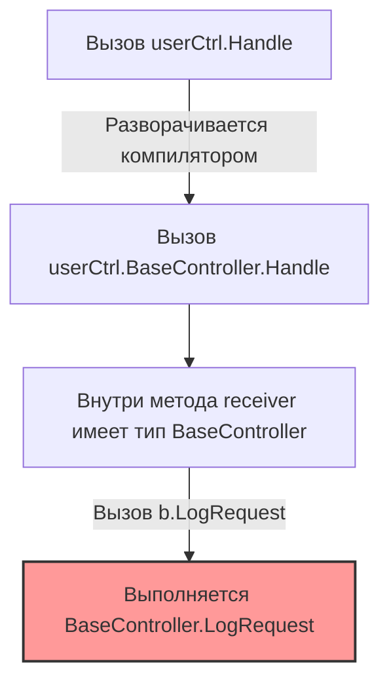

Переход в Go из языков с классической объектно-ориентированной парадигмой (Java, C#, PHP) — это не просто изучение нового синтаксиса. Это смена инженерного мышления. Большинство проблем с производительностью, излишней сложностью и нечитаемостью кода в Go возникают тогда, когда разработчик пытается писать на Go так, как он привык писать на Java.

В этой статье мы разберем самые популярные паттерны из ООП-мира, которые в экосистеме Go превращаются в антипаттерны, и посмотрим, как они бьют по производительности рантайма и сборщика мусора.

## 1. Преждевременные интерфейсы (IUserService и UserServiceImpl)

В классическом ООП принято проектировать систему "сверху вниз": сначала объявляются интерфейсы, а затем пишутся их реализации. Паттерн, при котором на каждую структуру создается интерфейс (даже если реализация всего одна), в Go считается грубым архитектурным нарушением.

**Антипаттерн:**
Создание интерфейса рядом с реализацией и возврат интерфейса из конструктора.
```go
// ПЛОХО: Интерфейс объявлен там же, где и реализация
type UserService interface {
    CreateUser(name string) error
}

type userServiceImpl struct {
    db *sql.DB
}

func NewUserService(db *sql.DB) UserService {
    return &userServiceImpl{db: db}
}
```

**Идиоматичный подход (Go Way):**
В Go интерфейсы описывают не то, что *предоставляет* пакет, а то, что ему *требуется*. Интерфейс должен определяться на стороне **потребителя** (Consumer), а не поставщика. Это возможно благодаря неявной реализации, описанной в [[15. Duck Typing и неявная реализация интерфейсов]]. Экспортируйте конкретные типы (`*UserService`), а клиент сам напишет интерфейс, если он ему нужен для мокирования.

> [!info] Под капотом: Цена интерфейса
> Помимо засорения кода, возврат интерфейсов имеет цену в рантайме. Когда функция возвращает конкретный тип `*userServiceImpl`, компилятор знает точный размер типа и его методы. Он может применить **Inlining** (встраивание кода функции в место вызова), что убирает накладные расходы на вызов. 
> 
> Когда вы возвращаете интерфейс, под капотом создается структура `iface` (состоящая из двух указателей: `tab` на таблицу методов и `data` на данные). Вызов метода через интерфейс — это всегда **Dynamic Dispatch** (динамическая диспетчеризация). Компилятор не может заинлайнить такой вызов, а процессор не может эффективно использовать предсказатель ветвлений (Branch Predictor).

## 2. Иллюзия наследования через Embedding

Как мы выяснили в [[12. Composition Over Inheritance. Почему в Go нет наследования]], Go использует композицию. Однако механизм встраивания структур (Embedding) внешне очень похож на наследование, что порождает опасную иллюзию.

**Антипаттерн:**
Попытка использовать Embedding для создания "базового класса" и переопределения виртуальных методов.

```go
type BaseController struct{}

func (b *BaseController) Handle() {
    b.LogRequest()
}

func (b *BaseController) LogRequest() {
    fmt.Println("Base log")
}

type UserController struct {
    BaseController
}

func (u *UserController) LogRequest() {
    fmt.Println("User log") // Попытка "переопределить" метод
}
```

> [!tip] Собеседование
> **Вопрос:** Что выведет вызов `userCtrl.Handle()`, если `userCtrl` — это экземпляр `UserController`?
> **Ответ:** Выведет `"Base log"`. В Go нет виртуальных таблиц методов (VTable) для структур. 

Встраивание — это всего лишь синтаксический сахар для создания неявного поля. Вызов `userCtrl.Handle()` под капотом разворачивается в `userCtrl.BaseController.Handle()`. Внутри метода `Handle` receiver (получатель) имеет тип `*BaseController`, и он ничего не знает о том, что обернут в `UserController`. 



**Решение:** Если вам нужен полиморфизм поведения, используйте интерфейсы, а не структуры. Встраивание (описанное в [[13. Embedding. Как в Go реализуется композиция]]) нужно только для переиспользования полей данных или простых вспомогательных методов.

## 3. Указатели везде ("Всё — это ссылка")

В Java или C# большинство объектов передаются по ссылке. Приходя в Go, разработчики по привычке делают все аргументы функций и возвращаемые значения указателями, аргументируя это тем, что "копирование структуры потребляет лишнюю память".

**Антипаттерн:**
```go
// ПЛОХО: Передача мелких объектов по указателю
func CalculateMetrics(req *RequestData) *ResponseData {
    res := &ResponseData{
        Time: time.Now(),
        ID:   req.ID,
    }
    return res
}
```

> [!info] Под капотом: Mechanical Sympathy и Escape Analysis
> Передача по указателю часто работает **медленнее**, чем копирование значения. 
> 1. **Кэш процессора:** Передача по значению копирует данные прямо на стек горутины. Стек горячий, он всегда находится в L1/L2 кэше процессора. Чтение по указателю заставляет CPU лезть в основную память (Heap), ловя Cache Miss.
> 2. **Escape Analysis:** Когда вы возвращаете указатель `&ResponseData` из функции, компилятор видит, что данные "убегают" (escape) за пределы текущего стекового фрейма. Он обязан аллоцировать `ResponseData` в куче (Heap). 
> 3. **Garbage Collector:** Каждая аллокация в куче создает работу для GC. Сборщику мусора придется сканировать этот указатель на фазе Mark и очищать память на фазе Sweep. Стек же очищается мгновенно и бесплатно при возврате из функции (просто сдвигом регистра процессора RSP).

**Идиоматичный подход:**
Скопировать структуру размером до 64-128 байт на стеке стоит пару инструкций CPU. Передавайте и возвращайте структуры по значению. Используйте указатели только в двух случаях:
1. Вам нужно **мутировать** (изменить) исходную структуру внутри функции.
2. Структура **очень большая** (например, содержит массивы мегабайтного размера) или копирование логически запрещено (например, внутри есть `sync.Mutex`).

## 4. Геттеры и сеттеры "по умолчанию"

В ООП инкапсуляция возведена в абсолют. Поля классов всегда приватные, и к ним генерируются `get` и `set` методы.

**Антипаттерн:**
```go
type Config struct {
    host string
}

func (c *Config) GetHost() string {
    return c.host
}

func (c *Config) SetHost(h string) {
    c.host = h
}
```

**Идиоматичный подход:**
Go прагматичен. Если поле структуры представляет собой просто данные и не требует сложной валидации при изменении — сделайте его публичным (с большой буквы). Если инкапсуляция действительно нужна для защиты инвариантов, методы не должны содержать префикс `Get`. 

Правильное именование (согласно [[6. Idiomatic Go. Что значит писать по-goшному]]):
```go
// Поле приватное
func (c *Config) Host() string { // Без Get!
    return c.host
}

func (c *Config) SetHost(h string) error { // Set остается
    if h == "" {
        return errors.New("host cannot be empty")
    }
    c.host = h
    return nil
}
```

## 5. Игнорирование Zero Value

Разработчики из ООП привыкли к конструкторам. Если в Go нет конструкторов, они имитируют их функциями `New...()` даже тогда, когда в этом нет необходимости.

**Антипаттерн:**
```go
type Counter struct {
    count int
}

func NewCounter() *Counter {
    return &Counter{count: 0}
}
```

**Идиоматичный подход:**
Опирайтесь на концепцию, описанную в [[20. Zero Value как часть дизайна языка]]. В Go память при выделении зануляется. Идиоматичная структура должна быть готова к использованию сразу после объявления, без инициализации. 

```go
// ХОРОШО: структура готова к работе со своим Zero Value
var c Counter
c.Increment() 
```
Встроенные типы `sync.Mutex` или `bytes.Buffer` спроектированы именно так — вам не нужно вызывать `NewMutex()`, вы просто объявляете переменную и используете ее. Пишите функции `New...()` только тогда, когда структуре требуется сложная преднастройка (например, открытие соединения с базой данных).

## Итог

Избавление от ООП-багажа — это первый шаг к написанию высокопроизводительного системного кода. 
1. Не плодите интерфейсы авансом.
2. Помните, что Embedding не дает полиморфизма, это просто проброс полей.
3. Берегите кучу: передавайте небольшие объекты по значению, чтобы не нагружать Garbage Collector.
4. Уважайте простоту языка: открывайте поля, если им не нужна валидация, и проектируйте структуры так, чтобы их Zero Value было полезным.

Поняв, как **не надо** писать код на Go, самое время научиться читать и анализировать качественный код от разработчиков из Google и открытого сообщества. В следующей статье мы разберем техники погружения в чужие кодовые базы: [[30. Как читать и понимать идиоматичный Go-код]].