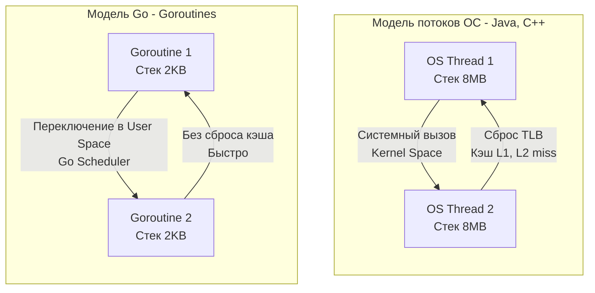

В предыдущей статье мы увидели, что Go создавался прагматиками в ответ на кризис масштабирования внутри Google. Но чтобы по-настоящему осознать архитектурные решения языка, нужно разобрать, **какие конкретно технические проблемы** существовавших на тот момент инструментов (прежде всего C++, Java и Python) заставили инженеров написать собственный компилятор с нуля.

Go — это язык-компромисс, спроектированный для решения пяти фундаментальных проблем бэкенд-разработки.

## 1. Проблема времени компиляции (Сломанный I/O)

В C/C++ используется текстовый препроцессор и механизм `#include`. Если у вас есть заголовочный файл `a.h`, который включается в `b.h`, а тот — в `c.h`, компилятору приходится читать и парсить один и тот же текст множество раз. В огромных монорепозиториях (как у Google) компиляция превращалась в процесс сложности $O(N^2)$ или хуже. 

На уровне железа это означало колоссальную избыточную нагрузку на дисковую подсистему (I/O) и процессор (постоянное построение одних и тех же абстрактных синтаксических деревьев — AST).

**Решение в Go:** 
Go ввел строгую иерархию пакетов (packages). Если пакет `A` зависит от `B`, а `B` зависит от `C`, компилятор собирает их снизу вверх. 
Когда `A` компилируется, компилятору **не нужно** читать исходники `C`. Он читает только уже скомпилированный объектный файл пакета `B` (`.a` файл), в котором в бинарном виде сохранена метаинформация об экспортируемых типах (включая транзитивные зависимости из `C`).
Каждый файл исходного кода парсится ровно **один раз**. Это снижает I/O нагрузку на порядки и делает сборку Go-кода молниеносной.

## 2. Кризис многопоточности и "Проблема C10K"

В середине 2000-х годов серверы начали получать многоядерные процессоры, а сетевые нагрузки выросли. Появилась проблема **C10K** — как одновременно держать 10 000 активных сетевых соединений (например, для долгоживущих соединений или вебсокетов).

Классические языки (Java, C++, PHP) предлагали два пути:
1.  **Thread per request (Поток ОС на запрос):** Один сетевой клиент = один OS Thread.
2.  **Асинхронный I/O с коллбэками (Event Loop):** Как в Node.js или Python (asyncio), где код выполняется в одном потоке, но использует epoll/kqueue.

Оба подхода имели критические системные изъяны.

### Mechanical Sympathy: Почему потоки ОС (OS Threads) — это дорого?

Если вы создаете 10 000 потоков ОС (в Java или C++), ядро Linux должно выделить каждому потоку стек памяти. По умолчанию это 1-8 МБ. Просто для того, чтобы держать 10 000 спящих потоков, вам потребуется **от 10 до 80 Гигабайт RAM**.

Вторая проблема — **Переключение контекста (Context Switch)**. Чтобы переключить выполнение с Потока 1 на Поток 2, процессор должен:
1. Выполнить прерывание и перейти в Kernel Space (Ring 0).
2. Сохранить все регистры процессора в память.
3. **Сбросить TLB (Translation Lookaside Buffer)** — кэш виртуальной памяти.
4. Выполнить логику планировщика ОС (CFS в Linux).
5. Вернуться в User Space (Ring 3).

Сброс TLB означает, что когда Поток 2 начнет работу, он столкнется с "холодным" кэшем (Cache Misses в L1/L2), и процессору придется заново подтягивать данные из медленной оперативной памяти (RAM). Процессор будет простаивать, ожидая данные.

**Решение в Go:** 
Внедрение модели `M:N` через **Goroutines** (горутины). 
Горутины — это легковесные потоки в User Space. Рантайм Go создает небольшое количество реальных потоков ОС (обычно равное числу ядер процессора), и мультиплексирует на них тысячи горутин.
*   Стартовый стек горутины — всего **2 КБ** (увеличивается динамически). 10 000 горутин занимают ~20 МБ.
*   Переключение контекста между горутинами делает сам рантайм Go в User Space (без системных вызовов). Кэши процессора не сбрасываются.

Подробнее мы изучим этот механизм в [[24. Concurrency Is Not Parallelism. Философия конкурентности в Go]].

## 3. Ад зависимостей и сложность деплоя

В мире C/C++ и Python приложение часто зависит от динамических библиотек (`.so` в Linux или `.dll` в Windows). Если вы собрали программу на Ubuntu 18.04 и перенесли бинарник на CentOS 7, программа может упасть при запуске с ошибкой `GLIBC_2.28 not found`. 
В мире Java и C# вам нужно было устанавливать на сервер правильную версию виртуальной машины (JRE или .NET Runtime) перед тем, как запустить код.

Это порождало "Dependency Hell" и знаменитое оправдание: *«На моей машине всё работает»*.

**Решение в Go:** 
**Статическая линковка по умолчанию.** Компилятор Go пакует весь ваш код, рантайм языка (GC, планировщик) и стандартную библиотеку в один независимый исполняемый файл (Fat Binary). 
Вам больше не нужна среда выполнения. Вы можете взять пустой Docker-контейнер (`FROM scratch`), положить туда бинарник Go, и он будет работать на любом дистрибутиве Linux с подходящей архитектурой процессора.

## 4. Хрупкость ООП и проблема базового класса

В 90-е и 00-е годы языки (Java, C++, C#) навязывали глубокие иерархии наследования. Разработчики тратили недели на проектирование "идеальных" деревьев классов (например, `Animal` -> `Mammal` -> `Dog`).
Однако в реальных бизнес-приложениях требования меняются быстро. Когда вам нужно было добавить поведение, которое не вписывалось в иерархию, приходилось переписывать базовые классы. Это приводило к **Fragile Base Class Problem** (проблеме хрупкого базового класса): изменение в корне дерева ломало логику во всех наследниках.

Знаменитая цитата создателя Erlang Джо Армстронга описывает эту проблему так: 
> *"Вы хотели получить банан, но в итоге получили гориллу, которая держит этот банан, и все джунгли в придачу."*

**Решение в Go:** 
Отказ от классического ООП-наследования. В Go нет ключевого слова `extends` или `class`. 
Вместо этого Go предлагает строгую композицию (структуры встраиваются в структуры) и неявные интерфейсы (Duck Typing). Вам не нужно заранее заявлять, что тип реализует интерфейс, — достаточно просто реализовать нужные методы. Это делает архитектуру невероятно гибкой. 
Более детально это рассмотрено в [[12. Composition Over Inheritance. Почему в Go нет наследования]].

## 5. Неявный поток управления (Магия и Исключения)

В C++ можно перегрузить оператор `+`. Вы видите в коде `a + b`, но на самом деле под капотом выполняется тяжелая функция, делающая сетевой запрос.
В Java и Python активно используются исключения (`try/catch`). Функция `process()` выглядит безобидно, но может выбросить 10 разных видов исключений, прерывая нормальный поток выполнения и заставляя процессор "раскручивать стек" (Stack Unwinding) в поисках подходящего обработчика.

Все это создает "магию", которая усложняет чтение кода. Для Google, где чужой код каждый день читают тысячи инженеров, неявное поведение было критической проблемой.

**Решение в Go:** 
Полный запрет на перегрузку операторов, отсутствие макросов и отказ от исключений как средства управления бизнес-логикой. 
В Go ошибки — это просто значения. Программист вынужден писать `if err != nil`, что делает поток управления (Control Flow) абсолютно прозрачным. Читая код, вы точно знаете: *вот здесь* программа может вернуть ошибку. 

> [!warning] Ловушка / Gotcha
> Многие разработчики, приходящие в Go, пытаются эмулировать `try/catch` с помощью механизмов `panic` и `recover`. Это грубейшее нарушение философии языка. Паника в Go предназначена исключительно для невосстановимых ошибок времени выполнения (например, выход за границы массива или разыменование nil-указателя), а не для бизнес-логики.
> *(Подробнее в [[9. Errors Are Values. Почему в Go нет исключений]])*

## Резюме

Go не пытался стать "лучшим языком для всего". Это узкоспециализированный инструмент для создания масштабируемых, сетевых, высоконагруженных бэкенд-систем.
Он решил проблемы тяжеловесности С++, громоздкости деплоя Java и медлительности Python, пожертвовав при этом некоторой выразительностью синтаксиса ради строгой инженерной предсказуемости.

Теперь, понимая проблемы, которые решал язык, нам будет проще увидеть, в чем именно заключаются его фундаментальные отличия от мейнстрима. В следующей статье мы разберем: [[4. Почему Go не похож на Java, C++ и C#]].