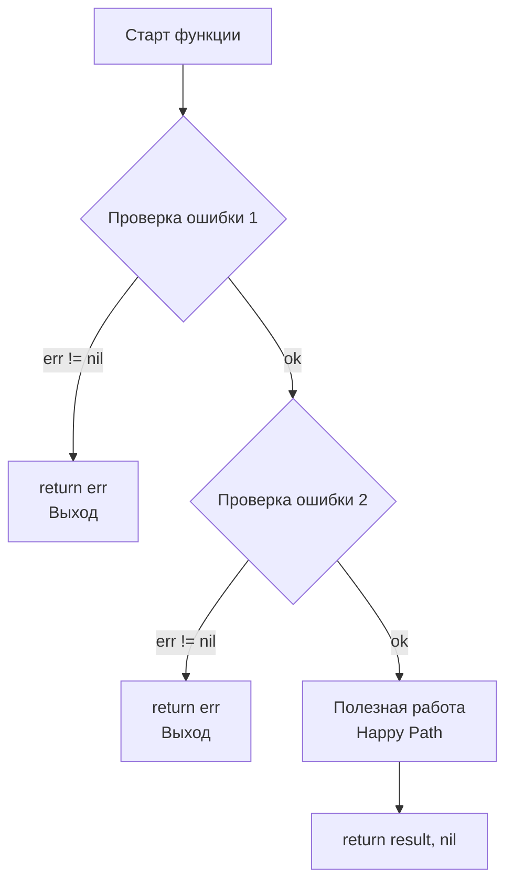

## Чтение кода — главный навык Senior-инженера

В языках с тяжелым фреймворко-ориентированным ООП (например, Java со Spring или C# с ASP.NET) чтение бизнес-логики часто сводится к поиску нужных аннотаций (`@Autowired`, `[Inject]`) и попыткам понять, какой «магический» контейнер инициализирует этот класс в рантайме.

В Go всё иначе. Философия языка (описанная в [[5. Философия Go. Простота, читаемость и прагматизм]]) и отсутствие магии ([[19. Почему в Go избегают магии и скрытого поведения]]) делают код предельно линейным. Но чтобы читать его быстро и эффективно, нужно перестроить нейронные связи и научиться сканировать текст по-goшному. 

Ниже представлен инженерный гайд по навигации и анализу идиоматичных Go-проектов.

---

## 1. Точка входа: Начинайте с `main.go`

В ООП-мире `main` часто выглядит как одна строчка `Application.Run()`, а вся композиция запрятана в конфигурациях. Идиоматичный Go-проект строится иначе. `main.go` — это **Composition Root** (корень композиции).

Когда вы открываете новый репозиторий, ваш путь должен выглядеть так:
1. Идем в директорию `cmd/<app_name>/main.go`.
2. Читаем функцию `main()`. Именно здесь, в открытом виде (явным кодом), создаются логгеры, открываются пулы соединений с БД, инициализируются репозитории, передаются в сервисы и биндятся к HTTP-роутерам.

```go
// Пример типичного идиоматичного main.go
func main() {
    // 1. Инициализация инфраструктуры
    cfg := config.Load()
    db := postgres.NewDB(cfg.DBConn)
    defer db.Close() // Сразу видим, кто управляет ресурсом

    // 2. Внедрение зависимостей (DI) "руками"
    userRepo := postgres.NewUserRepository(db)
    userService := user.NewService(userRepo)
    userHandler := http.NewUserHandler(userService)

    // 3. Запуск сервера
    router := chi.NewRouter()
    router.Post("/users", userHandler.Create)
    
    // ... graceful shutdown
}
```

> [!tip] Собеседование
> **Вопрос:** Почему в Go редко используют DI-фреймворки (Dependency Injection), популярные в Java/C#?
> **Ответ:** Явная инициализация в `main.go` дает полный контроль над графом зависимостей на этапе компиляции. Если что-то сломается или будет пропущено, компилятор сообщит об этом немедленно. В рантайм-контейнерах (Reflection-based DI) ошибки инъекции всплывают только во время выполнения приложения. О нелюбви Go к reflection мы говорили в [[19. Почему в Go избегают магии и скрытого поведения]].

---

## 2. Line of Sight (Линия видимости)

Читая функции в Go, обращайте внимание на отступы. В идиоматичном коде **«счастливый путь» (Happy Path) всегда прижат к левому краю экрана**. 

Вы не увидите глубоко вложенных блоков `if-else` или `try-catch`, уходящих вправо. Код читается строго сверху вниз. Ошибки обрабатываются и возвращаются немедленно (об этом подробнее в [[10. Обработка ошибок в Go. if err != nil как часть дизайна]]).



**Как это читать:** Сканируйте левый край функции. Вы сразу поймете, что она делает, пропуская глазами блоки `if err != nil`. Ошибки — это шум для бизнес-логики, но они критически важны для надежности, поэтому они вынесены в отдельные визуальные блоки-возвраты.

---

## 3. Трекинг потока выполнения (Context)

В языках с классическими потоками (OS Threads) есть понятие Thread-Local Storage — невидимое хранилище данных, привязанное к текущему потоку выполнения. Там часто прячут ID запроса, логгеры или транзакции. 

В Go горутины легковесны и постоянно перебрасываются планировщиком (G-M-P) между разными потоками ОС. Никакого Thread-Local Storage нет. Его заменяет **явная передача `context.Context`**.

**Правило чтения №1:** Первый аргумент функции — это всегда `ctx context.Context`. 
Если функция принимает `ctx`, значит она:
1. Выполняет IO-операцию (сеть, БД, диск).
2. Поддерживает отмену (Cancellation) или таймауты.
3. Может запустить новые горутины, жизненный цикл которых привязан к этому контексту.

Когда читаете код, мысленно стройте дерево графа вызовов по передаче `ctx`. Как только вы видите `context.Background()`, знайте — здесь начинается новый независимый процесс.

---

## 4. Как читать конкурентный код

Чтение асинхронного кода — самая сложная часть, потому что поток выполнения распараллеливается. Чтобы понять горутины и каналы, применяйте **Принцип лексического владения (Lexical Confinement)**.

Ищите **Владельца (Owner)** ресурса:
1. Тот, кто создает канал (`make(chan T)`), тот его и закрывает (`close(ch)`).
2. Тот, кто запускает горутину, обязан знать, когда и как она завершится.

> [!warning] Ловушка / Gotcha
> Если вы читаете код и видите функцию, которая возвращает канал, но нигде в зоне видимости не описано условие его закрытия — это потенциальная утечка памяти (Goroutine Leak). Сборщик мусора (GC) не может удалить из памяти горутину, заблокированную на чтении из пустого незакрытого канала, так как она считается «живой» с точки зрения планировщика. Подробнее философию работы с каналами мы разбирали в [[25. Share Memory By Communicating. Почему каналы важнее Mutex]].

---

## 5. Чтение с прицелом на Mechanical Sympathy

Senior Go Engineer читает код не просто как текст, а как инструкции для процессора и сборщика мусора. Это и есть **Mechanical Sympathy**.

На что обращать внимание:

### Аллокации и Escape Analysis
Когда вы видите передачу переменной по ссылке (знак `&`), задайте себе вопрос: «Убежит ли эта переменная в кучу?».
* Если функция короткоживущая и передает указатель в дочернюю функцию — всё останется на быстром стеке (в кэш-линиях CPU).
* Если указатель сохраняется в глобальную структуру, мапу или передается через канал — это гарантированная аллокация в Heap. Это значит, что вы напрягаете Garbage Collector.

### Работа со слайсами
Видите `make([]int, 0)` в цикле? Это красный флаг. Идиоматичный код минимизирует реаллокации памяти. 
* Правильное чтение: программист должен был написать `make([]int, 0, len(source))`, чтобы сразу выделить цельный блок памяти (Continuous Memory) и избежать копирования массива при превышении `capacity`.

### Интерфейсы и динамическая диспетчеризация
В Go используется неявная реализация интерфейсов (Duck Typing — [[15. Duck Typing и неявная реализация интерфейсов]]). Вы не можете просто нажать в IDE на интерфейс и найти конкретный класс (как `implements` в Java). 

**Как быстро найти реализацию?**
Ищите тесты. В файлах `_test.go` разработчики неизбежно инициализируют конкретные структуры (моки или реальные компоненты) и передают их в интерфейсные переменные. Тесты — это лучшая документация к тому, какие конкретно объекты ожидаются контрактом.

> [!info] Под капотом: `itab` и вызовы
> Когда вы читаете строку `userRepo.Save()`, где `userRepo` — это интерфейс, помните, что под капотом происходит следующее: процессор читает скрытую структуру `iface`, достает из нее указатель на таблицу методов (`itab`), ищет смещение для функции `Save` и выполняет непрямой переход (`JMP`). Это сбрасывает конвейер предсказателя ветвлений (Branch Predictor). В горячих циклах (High Performance) интерфейсов стараются избегать.

## Итог

1. **Топология:** Код читается сверху вниз. Начинайте с `main.go`, где собирается весь конструктор зависимостей.
2. **Логика:** Ищите Happy Path по левому краю. Возвраты с ошибками — это просто "отбойники" на трассе.
3. **Конкурентность:** Следите за `context.Context` как за кровеносной системой приложения и ищите явных владельцев горутин и каналов.
4. **Mechanical Sympathy:** Сканируя код, держите в голове стоимость операций: где данные лягут на стек, где в кучу, а где процессор споткнется о вызов через интерфейс.

Мы прошли длинный путь, изучая, почему Go спроектирован именно так: без наследования, без исключений, с явным контекстом и строгой конкурентностью. Пришло время собрать все эти принципы воедино. В финальной статье этого блока мы сформулируем свод правил, по которым живет Senior-инженер: [[31. Итоги раздела. Правильный майндсет Go-разработчика]].