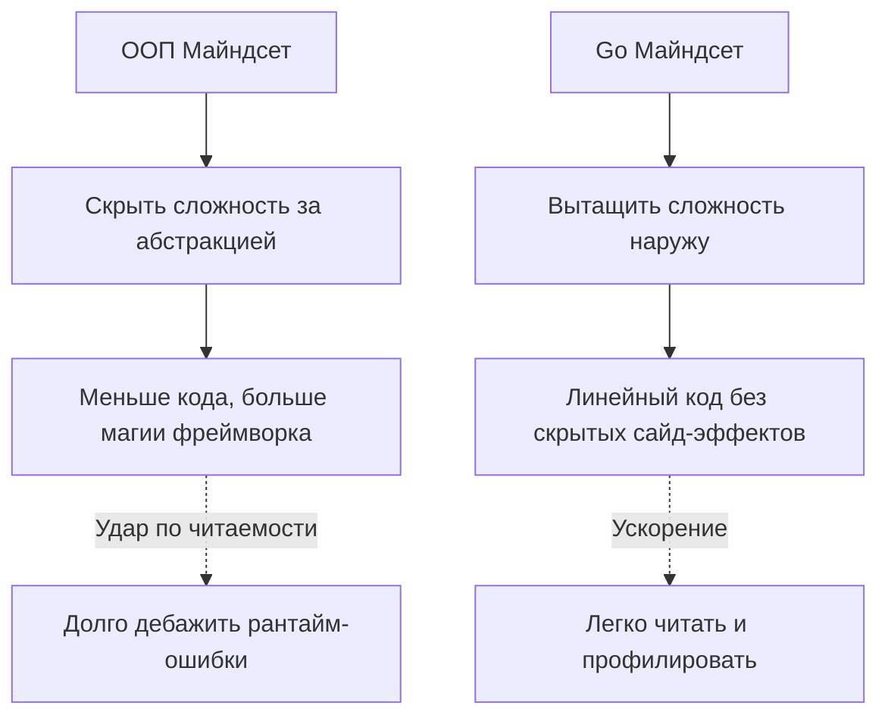

## Переход Рубикона: От ООП-архитектора к Go-инженеру

Мы подошли к финалу фундаментального раздела, посвященного философии языка. Прочитав предыдущие 30 статей, вы могли заметить главную мысль: Go не пытается быть "лучшей Java" или "упрощенным C++". Это язык с совершенно иной ДНК, который был спроектирован для решения конкретных проблем Google в эпоху многоядерных процессоров и огромных кодовых баз.

Переход на Go (особенно с позиции Senior/Lead в другом стеке) — это процесс **разучивания**. Вам придется отбросить многие паттерны, которые в мире объектно-ориентированного программирования считались "best practices", и принять новый, гораздо более прагматичный и прямолинейный майндсет.

Давайте кристаллизуем этот майндсет в виде пяти главных инженерных столпов.

---

## 1. Код читается чаще, чем пишется (Явное лучше неявного)

В [[19. Почему в Go избегают магии и скрытого поведения]] мы обсуждали, почему в языке нет аннотаций, DI-контейнеров на основе рефлексии и перегрузки методов. 

Майндсет Go-разработчика: **"Я готов написать больше бойлерплейта, если это сделает путь выполнения кода абсолютно прозрачным".**

Вам больше не нужно гадать, какой именно класс инжектится в контроллер в рантайме. Вы не ищете глобальные конфигурации фреймворка. Вы открываете `main.go` и видите весь граф зависимостей. Вы видите, где аллоцируется память, где создаются интерфейсы (на стороне потребителя, как завещает [[15. Duck Typing и неявная реализация интерфейсов]]), и как ошибки возвращаются наверх по стеку вызовов ([[10. Обработка ошибок в Go. if err != nil как часть дизайна]]).



## 2. Mechanical Sympathy (Уважение к железу)

Go — это системный язык с Garbage Collector. Это значит, что он прощает вам ручное управление памятью (как в C/C++), но **жестоко наказывает** за непонимание того, как работает кэш процессора и сборщик мусора.

Майндсет Go-разработчика: **"Я проектирую структуры так, чтобы они дружили с L1/L2 кэшем, и пишу код так, чтобы не нагружать GC".**

В Java вы привыкли, что объекты — это ссылочные типы, разбросанные по куче (Heap). В Go вы думаете о памяти физически:
1.  **Escape Analysis:** Вы осознанно выбираете между передачей по значению (быстрый стек, очищается сдвигом указателя RSP) и передачей по ссылке (убегание в кучу, нагрузка на GC).
2.  **Выравнивание структур (Padding):** Вы знаете, что порядок полей в `struct` влияет на её итоговый размер в памяти.
3.  **Локальность данных:** Вы используете массивы структур (слайсы), а не массивы указателей на структуры, чтобы процессор мог эффективно использовать предсказатель ветвлений (Branch Predictor) и предвыборку данных (Hardware Prefetcher).

> [!info] Под капотом: Layout структур и кэш
> Взгляните на эту структуру. На 64-битной архитектуре поля выравниваются по границе машинного слова (8 байт).
> ```go
> type BadStruct struct {
>     A bool  // 1 байт
>     B int64 // 8 байт
>     C bool  // 1 байт
> }
> ```
> Компилятор вставит 7 байт пустоты (padding) после `A` и 7 байт после `C`. Итого: `1+7 + 8 + 1+7 = 24 байта`.
> Если поменять поля местами (от большего к меньшему): `int64`, `bool`, `bool`, структура займет `8 + 1 + 1 + 6 (padding) = 16 байт`. Сэкономили 33% памяти просто за счет понимания железа.

## 3. Композиция вместо монолитных иерархий

Вспомните [[12. Composition Over Inheritance. Почему в Go нет наследования]] и [[21. Простота против абстракций. Почему Go не любит сложные иерархии]]. 

Майндсет Go-разработчика: **"Я строю системы из маленьких, независимых кубиков, а не высекаю их из монолитного куска мрамора".**

Вы больше не мыслите паттерном "Базовый класс -> Наследник". Вы объединяете функциональность через Embedding. Ваши интерфейсы крошечные (1-2 метода). Если функции нужен логгер, вы передаете ей интерфейс `io.Writer`, а не монструозный `ILoggerService`.

> [!tip] Собеседование
> **Вопрос на System Design:** Как спроектировать сервис, который читает из Кафки, парсит JSON и пишет в БД?
> **Ответ ООП-разработчика:** Создать абстрактный класс `MessageProcessor`, унаследовать `KafkaJsonDbProcessor`, реализовать виртуальные методы `Read`, `Parse`, `Save`.
> **Ответ Go-разработчика:** Создать три независимые структуры/пакета: ридер, парсер, райтер. Связать их через интерфейсы в `main.go`. Парсер не должен знать о Кафке, он принимает `[]byte` и отдает `struct`.

## 4. Конкурентность — это архитектура, а не просто скорость

Многие приходят в Go из-за горутин, думая, что это просто "быстрые треды". Но, как гласит [[24. Concurrency Is Not Parallelism. Философия конкурентности в Go]], конкурентность — это способ *структурирования* программы.

Майндсет Go-разработчика: **"Я не шарю память между горутинами, защищая её мьютексами. Я передаю владение данными через каналы".** ([[25. Share Memory By Communicating. Почему каналы важнее Mutex]]).

Вы понимаете устройство рантайма (G-M-P модель). Вы знаете, что когда горутина блокируется на I/O (сеть или диск), системный тред (M) ОС не простаивает — планировщик Go (P) переключает его на другую горутину (G) за наносекунды, используя `netpoll` (epoll/kqueue). Вы используете `context.Context` для контроля жизненного цикла всех асинхронных процессов и никогда не запускаете горутину, не зная, как она будет остановлена.

## 5. Ошибки — это значения (Errors are Values)

Мы навсегда забываем конструкцию `try-catch`. В [[9. Errors Are Values. Почему в Go нет исключений]] мы разобрали, что исключения скрывают граф потока управления.

Майндсет Go-разработчика: **"Ошибка — это часть нормального жизненного цикла программы, а не аномалия".**

В Go вы работаете с ошибками так же, как с любыми другими переменными: вы можете их обернуть (wrap), проанализировать через `errors.Is` и `errors.As`, добавить бизнес-контекст. Код, состоящий на треть из `if err != nil`, — это не "уродливо", это признак пуленепробиваемой, надежной системы, где программист явно обработал каждое состояние.

> [!warning] Ловушка / Gotcha
> Самый частый антипаттерн мигрантов — использование `panic` и `recover` для имитации `throw` и `catch`. 
> Паника в Go предназначена **только** для фатальных ошибок, при которых продолжение работы невозможно (например, `nil pointer dereference` или невозможность открыть конфиг при старте приложения). Использование паники для бизнес-логики (например, "юзер не найден") — это архитектурное преступление.

---

## Итог: Что значит быть Senior Go Engineer?

Быть Senior разработчиком на Go — значит писать **скучный код**. 

Это код, который:
1. Читается линейно (без прыжков по 15 файлам конфигурации).
2. Легко тестируется (потому что зависимости внедряются явно, а интерфейсы маленькие).
3. Эффективно работает с железом (нет лишних аллокаций в куче, используется буферизованный I/O).
4. Безопасно параллелится (горутины имеют владельца, гонки данных предотвращаются архитектурой, а не только мьютексами).
5. Не использует «умные» хаки (глубокую рефлексию, метапрограммирование, чрезмерное увлечение дженериками — [[28. Generics. Почему Go так долго жил без них]]).

Вы научились мыслить как создатели языка: Кен Томпсон, Роб Пайк и Роберт Гризмер. Вы понимаете, что простота — это не отсутствие возможностей, а высшая форма инженерной изощренности.