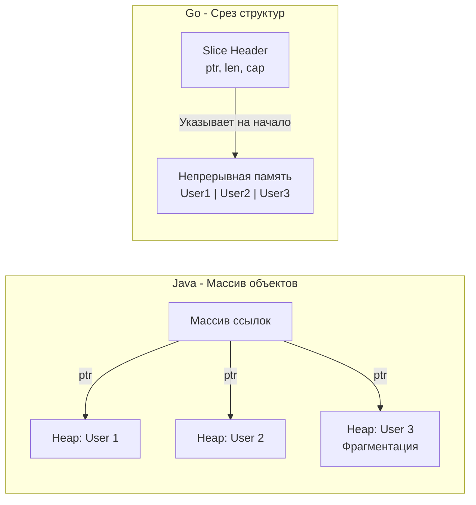

Переход в Go из мира энтерпрайз-языков (Java, C#, C++) часто сопровождается попытками писать на Go так же, как на старом языке. Разработчики создают гигантские интерфейсы, пытаются эмулировать классы через структуры со встроенными указателями и ищут аналоги `try/catch`. 

Это приводит к громоздкому, неидиоматичному коду, который работает медленнее, чем мог бы. Чтобы писать эффективный Go-код, нужно понять фундаментальные отличия в архитектуре языка, управлении памятью и рантайме.

Go часто называют «C с мусорщиком», но это сильное упрощение. Ниже мы разберем ключевые архитектурные решения, которые делают Go уникальным компромиссом между системным (C++) и прикладным (Java/C#) программированием.

## 1. Представление данных: Mechanical Sympathy и кэш-линии

Главное архитектурное отличие Go от Java и C# (до появления современных `struct` в .NET) заключается в том, как данные располагаются в памяти.

В Java большинство объектов — это ссылочные типы. Если вы создаете массив из 10 000 объектов `User`, вы получаете массив из 10 000 **указателей**, которые ссылаются на объекты, разбросанные по куче (Heap). 
Для процессора это катастрофа. При попытке обойти такой массив происходит постоянный **Cache Miss** (промах кэша L1/L2), так как данные лежат не последовательно. Процессор вынужден ждать сотни тактов, пока данные загрузятся из медленной RAM.

В Go структуры (`struct`) — это типы-значения (Value Types). Массив или срез `[]User` аллоцирует **один непрерывный блок памяти**, где данные структур лежат вплотную друг к другу. 

> [!info] Под капотом: Аппаратный Prefetcher
> Современные CPU оснащены механизмом Prefetcher. Он анализирует паттерны чтения памяти. Если он видит, что вы читаете непрерывный блок памяти (как в Go), он заранее загружает следующие кэш-линии (по 64 байта) в L1-кэш до того, как ваш код их запросит. Итерация по `[]User` в Go будет в десятки раз быстрее, чем обход массива ссылок в Java, исключительно благодаря Mechanical Sympathy.

## 2. Escape Analysis вместо поколенческого Garbage Collector

Java и C# используют сложный поколенческий сборщик мусора (Generational GC с делением на Eden, Survivor, Old пространства). Почему? Потому что в этих языках большинство объектов аллоцируется в куче (Heap), живут очень мало и быстро становятся мусором. Чтобы эффективно это чистить, нужна сложная эвристика.

Go использует принципиально иной подход — **Escape Analysis (Анализ утечек)**.
Во время компиляции Go определяет, переживет ли переменная функцию, в которой была создана. Если переменная не "утекает" (например, вы не возвращаете указатель на нее и не отправляете в канал), компилятор аллоцирует её **на стеке горутины**, а не в куче.

Очистка стека происходит мгновенно при возврате из функции (просто сдвигается указатель стека). Это "бесплатно" и не нагружает GC. 

Из-за того, что Go отправляет в кучу только действительно долгоживущие объекты, сборщику мусора в Go не нужны поколения. В Go реализован **Concurrent Mark-and-Sweep GC**, главная цель которого — минимальные задержки (Low Latency / Stop-The-World < 1 мс), а не максимальная пропускная способность, как у G1 в Java.

> [!warning] Ловушка / Gotcha: Миф о том, что указатели быстрее
> Приходя из C/C++, разработчики часто пишут функции вида `func process(u *User)` и передают указатель, чтобы "сэкономить на копировании" структуры. 
> В Go это часто дает **обратный эффект**. Передача указателя может заставить компилятор аллоцировать `User` в куче (Escape Analysis решит, что указатель может уйти за пределы области видимости). Нагрузка на GC возрастет. Зачастую передать по значению (скопировать 30-50 байт структуры в регистрах или на стеке) намного быстрее, чем напрягать Heap и GC.

## 3. Компиляция: AOT против JIT

*   **Java и C#** компилируются в промежуточный байт-код. При запуске программы виртуальная машина использует JIT-компилятор (Just-In-Time), который собирает статистику работы (profiling) и оптимизирует машинный код на лету. Это дает феноменальную пиковую производительность, но требует времени на "прогрев" (Warm-up) и потребляет много RAM.
*   **Go (и C++)** используют AOT-компиляцию (Ahead-Of-Time). Код сразу транслируется в нативные инструкции процессора. 

**Следствия для бэкенда:** Go-приложения стартуют за миллисекунды. Это делает Go идеальным для Kubernetes, микросервисов и Serverless (AWS Lambda), где контейнеры могут убиваться и подниматься сотни раз в минуту. Вам не нужно ждать 10 секунд, пока JVM "прогреется". 

Однако в долгоживущих числодробилках хорошо прогретая Java (с оптимизациями вроде развертывания циклов на основе рантайм-статистики) может обойти Go по скорости. Go жертвует абсолютной пиковой производительностью ради низкого потребления ресурсов и предсказуемости.

## 4. Отсутствие VTable и "Чистые" структуры

В C++ или Java любой класс, имеющий виртуальные методы, несет скрытые расходы: объект содержит скрытый указатель `vptr` на таблицу виртуальных функций `vtable`. Объекты "знают", к какому классу они принадлежат. Кроме того, объекты в Java имеют "заголовок" (Object Header) для блокировок и нужд GC. Это раздувает память: пустой объект в Java может занимать 16 байт.

В Go **данные отделены от поведения**. 
Структура `struct` в Go — это просто кусок памяти. У неё нет скрытых указателей или заголовков. Пустая структура `struct{}` занимает ровно 0 байт памяти. 

Полиморфизм в Go возникает **только тогда**, когда вы присваиваете структуру переменной типа `interface`. Только в этот момент рантайм Go создает специальную обертку под капотом (структура `iface`), которая содержит два указателя:
1. Указатель на сами данные.
2. Указатель на `itab` (таблицу, связывающую методы типа с интерфейсом).

Это значит, что вы платите за динамическую диспетчеризацию (полиморфизм) только тогда, когда явно используете интерфейсы, а не для каждого созданного объекта по умолчанию.

> [!tip] Собеседование
> **Вопрос:** В чем разница между реализацией интерфейсов в Java/C# и Go?
> **Ответ:** В Java интерфейсы реализуются **явно** (explicit) через `implements`. Класс знает, какие интерфейсы он реализует. В Go типизация **структурная (Duck Typing)** — интерфейсы реализуются **неявно** (implicit). Если у структуры есть нужные методы с правильной сигнатурой, она автоматически реализует интерфейс. Это развязывает зависимости: вы можете объявить интерфейс в своем пакете (package) и использовать структуры из чужого пакета, даже если их авторы ничего не знали о вашем интерфейсе.

## 5. Философия "Явное лучше неявного"

В C++ можно перегрузить оператор сложения: `a + b` может означать скачивание файла из интернета.
В C# можно написать `Property`, где обращение к `user.Name` на самом деле вызывает тяжелый SQL-запрос под капотом.
В Java активно используются аннотации (`@Transactional`, `@Autowired`), где фреймворк с помощью рефлексии магическим образом меняет поведение кода во время выполнения.

**В Go магия запрещена дизайном:**
*   Нет перегрузки операторов.
*   Нет свойств (properties), только явные методы-геттеры и сеттеры `GetName()`.
*   Нет исключений (Exceptions), прерывающих поток управления (Control Flow). Возврат ошибки — это явный возврат значения, которое программист обязан обработать (об этом поговорим подробно в [[9. Errors Are Values. Почему в Go нет исключений]]).
*   Минимум рефлексии (ее использование считается плохим тоном везде, кроме пакетов сериализации вроде `encoding/json`).

## Итог: смена парадигмы

Когда вы пишете на Go, вы должны перестать думать категориями "Иерархия классов" и "Инкапсуляция состояния с помощью паттернов". 
Вместо этого вам нужно думать категориями: **Как данные лежат в памяти? Кто ими владеет? Как они будут передаваться между горутинами?**

В Java и C# язык защищает вас от железа слоями абстракций. В Go язык дает вам абстракции (горутины, каналы, интерфейсы), но при этом оставляет вас достаточно близко к «голому металлу», чтобы вы могли использовать процессор максимально эффективно.

Эта прагматичность пронизывает весь язык. Чтобы закрепить этот майндсет, в следующей статье мы разберем саму идеологию языка: [[5. Философия Go. Простота, читаемость и прагматизм]].