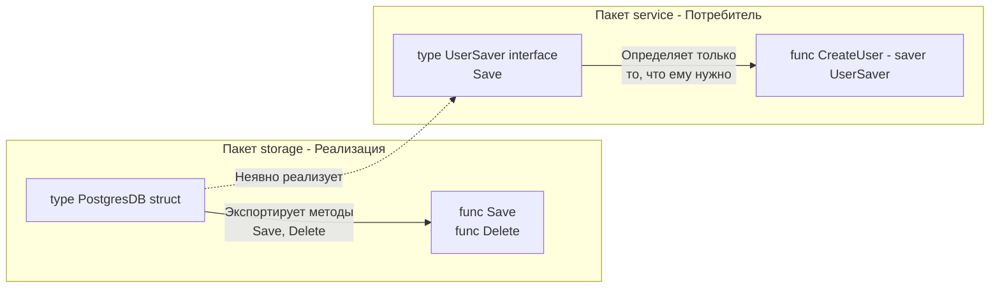

Каждый язык программирования имеет свой акцент. Вы можете написать код на Go, который синтаксически будет абсолютно корректным, компилируемым и рабочим, но любой опытный Go-разработчик скажет: *«Это написано на Java, просто с использованием синтаксиса Go»*.

**Idiomatic Go (Идиоматичный Go)** — это не просто набор правил линтера. Это майндсет, набор конвенций и архитектурных паттернов, которые сообщество признало наиболее эффективными. Идиоматичный код пишется не только для того, чтобы радовать глаз коллег на Code Review, но и для того, чтобы работать в полной гармонии с компилятором, Escape Analysis и планировщиком рантайма.

Давайте разберем основные принципы «Go-way», которые отличают новичка (пришедшего из других языков) от уверенного Middle/Senior Go-инженера.

## 1. Line of Sight (Прямая видимость) и Guard Clauses

В языках с классическим ООП и `try/catch` мы часто видим глубокую вложенность (Deep Nesting). Разработчики оборачивают "счастливый путь" (Happy Path) в блоки `if` или `try`, а обработку ошибок оставляют в `else` или `catch` на нижних уровнях отступов.

Идиоматичный Go требует обратного: **код "счастливого пути" должен быть выровнен по левому краю экрана (Line of Sight).** 
Ошибки должны проверяться и возвращаться немедленно (паттерн Guard Clauses).

**Не идиоматично (Стиль C#/Java):**
```go
func ProcessUser(id string) (*Result, error) {
    if id != "" {
        user, err := db.GetUser(id)
        if err == nil {
            if user.IsActive {
                // Happy path спрятан глубоко вправо
                return generateResult(user), nil
            } else {
                return nil, errors.New("user inactive")
            }
        } else {
            return nil, err
        }
    }
    return nil, errors.New("empty id")
}
```

**Идиоматично (Go-way):**
```go
func ProcessUser(id string) (*Result, error) {
    if id == "" {
        return nil, errors.New("empty id")
    }

    user, err := db.GetUser(id)
    if err != nil {
        return nil, err
    }

    if !user.IsActive {
        return nil, errors.New("user inactive")
    }

    // Happy path всегда слева и в самом низу
    return generateResult(user), nil
}
```

> [!info] Под капотом: Mechanical Sympathy и Предсказатель ветвлений
> Почему это важно для процессора? Современные CPU используют конвейер команд (Pipeline) и предсказатель ветвлений (Branch Predictor). 
> В идиоматичном Go-коде блоки `if err != nil` компилируются в условные переходы, которые почти никогда не выполняются (так как ошибки в нормальном потоке редки). Процессор запоминает, что переход внутрь `if` случается редко, и спекулятивно (Speculative Execution) продолжает выполнять инструкции "счастливого пути" по прямой. Глубокая вложенность, наоборот, путает предсказатель ветвлений и приводит к частым сбросам конвейера (Pipeline Flushes), когда процессор "угадывает" неправильную ветку.

## 2. Синхронные API (Конкурентность — забота вызывающего)

Разработчики, приходящие из Node.js или C#, часто пытаются сделать функции асинхронными по умолчанию, возвращая каналы или промисы. 

**Антипаттерн:**
```go
// Функция сама создает горутину и возвращает канал.
func FetchDataAsync(url string) <-chan []byte {
    ch := make(chan[]byte)
    go func() {
        data := fetch(url)
        ch <- data
    }()
    return ch
}
```

В Go это считается плохим тоном. Идиоматичная функция должна быть **синхронной** и просто выполнять свою работу:

**Идиоматично:**
```go
func FetchData(url string) ([]byte, error) {
    return fetch(url)
}
```
Если вызывающей стороне нужно выполнить эту функцию асинхронно, она сама обернет её в горутину: `go FetchData()`. Библиотека не должна решать за программиста, как ему масштабировать конкурентность.

> [!warning] Ловушка / Gotcha: Escape Analysis
> Возврат канала из функции (как в антипаттерне выше) имеет высокую скрытую цену. Запуск горутины внутри функции заставляет компилятор (через Escape Analysis) переместить все переменные, захваченные замыканием (closure), со стека в кучу (Heap). Кроме того, сам канал тоже аллоцируется в куче. Синхронная функция, напротив, может выполнить всю работу на локальном стеке горутины, который очистится мгновенно без участия Garbage Collector.

## 3. Отказ от конструкторов в пользу Zero Values

В Java или C++ объект без вызова конструктора находится в невалидном состоянии. В Go идиоматичный дизайн структур подразумевает, что их "нулевое значение" (Zero Value) должно быть готово к использованию из коробки.

Отличный пример из стандартной библиотеки — `sync.Mutex` или `bytes.Buffer`. Вам не нужно вызывать `NewMutex()` или `NewBuffer()`.

```go
// Идиоматично: Zero value готово к работе
var mu sync.Mutex
mu.Lock()
// ...
mu.Unlock()

var buf bytes.Buffer
buf.WriteString("Привет")
```

Подробнее мы разберем эту концепцию в статье [[20. Zero Value как часть дизайна языка]].

## 4. Интерфейсы определяются там, где используются

Это самое сложное для понимания правило для разработчиков из C# и Java. В ООП вы создаете класс `UserRepository`, затем создаете к нему интерфейс `IUserRepository` (в том же файле или пакете) и отдаете этот интерфейс клиентам.

**В Go интерфейсы неявные (Duck Typing).** Пакет, реализующий логику (например, подключение к БД), **вообще не должен экспортировать интерфейс**. Он просто экспортирует структуру с методами.

Интерфейс определяет **потребитель** (Consumer) — тот пакет, которому нужна эта база данных.



Это развязывает зависимости: `service` ничего не знает про пакет `storage` (ему не нужно его импортировать), а `storage` не привязан к интерфейсам `service`.

## 5. Именование: Краткость — сестра таланта

Идиоматичный Go ненавидит "заикание" (stuttering) и избыточно сложные имена.

*   **Не заикайтесь:** Если вы создали пакет `user`, не называйте структуру `user.User` или функцию `user.CreateUser()`. Назовите структуру `user.Model`, а функцию `user.Create()`.
*   **Длина имени зависит от контекста:** Чем меньше область видимости переменной, тем короче её имя. В цикле из 3 строк переменная должна называться `i` или `v`, а не `index` или `userValue`. Но глобальная переменная на уровне пакета должна иметь максимально описательное имя.
*   **Однобуквенные ресиверы:** Имена ресиверов методов обычно состоят из одной-двух букв (сокращение от типа), а не `this` или `self`.

```go
// Не идиоматично:
func (this *UserService) Process(userEntity *User) error {}

// Идиоматично:
func (s *Service) Process(u *User) error {}
```

> [!tip] Собеседование
> **Вопрос:** Почему в Go методы структур не используют имя ресивера `this` или `self`?
> **Ответ:** Go — не классический ООП язык. Метод в Go — это просто функция, первым (неявным) аргументом которой передается сама структура. Использование `this` или `self` создает ложную иллюзию для программистов, что они работают с "объектом" и могут рассчитывать на наследование или полиморфизм в стиле Java. Использование однобуквенных имен подчеркивает, что ресивер — это просто обычный параметр.

## Итог: Что значит "писать по-goшному"

Писать идиоматично — значит писать код, который:
1.  **Легко читать сверху вниз**, не прыгая глазами по сложным конструкциям и вложенным `if / else`.
2.  **Не содержит магии** и скрытых сайд-эффектов (например, синхронно возвращает результат, а не запускает фоновые горутины втайне от вызывающего).
3.  **Дружелюбен к рантайму и GC**, минимизируя аллокации в куче благодаря правильному использованию структур и Zero Values.
4.  **Связан через маленькие интерфейсы**, определенные на стороне потребителя.

Чтобы стандартизировать этот майндсет, в сообществе сформировались официальные принципы языка и известные "пословицы" (Proverbs). О том, на каких столпах стоит культура языка, мы поговорим в следующей статье: [[7. The Zen of Go и официальные принципы языка]].