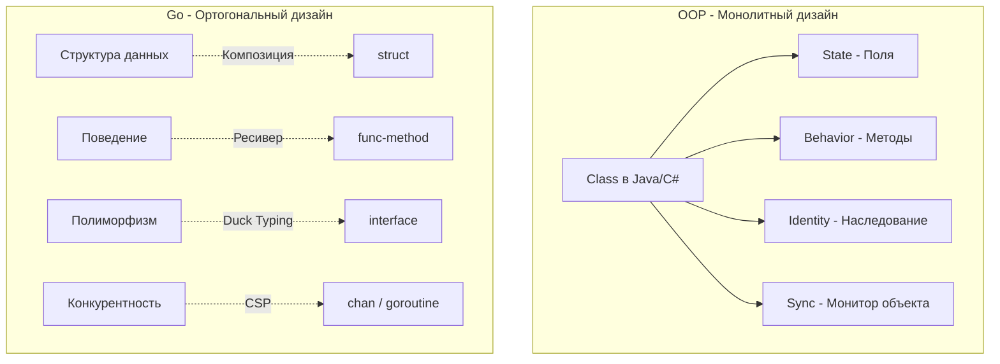

Если язык программирования — это инструмент, то его философия — это инструкция по технике безопасности и руководство по эффективной эксплуатации. 

Многие из вас знакомы с «Дзеном Python» (The Zen of Python) — набором из 19 афоризмов, описывающих философию дизайна языка. В мире Go долгое время не было единого манифеста, пока в 2020 году Дэйв Чейни (Dave Cheney), один из самых известных контрибьюторов в язык, не сформулировал **«The Zen of Go»**. Он собрал воедино идеи Кена Томпсона, Роба Пайка и Расса Кокса, создав выжимку принципов, которыми руководствуются Senior Go-инженеры при проектировании систем.

В этой статье мы разберем ключевые постулаты «Дзена Go» и официальные принципы дизайна языка с точки зрения архитектуры и рантайма.

## 1. Ортогональность (Orthogonality)

Это самый важный академический принцип, заложенный в основу языка. В информатике ортогональность означает, что изменения в одном компоненте системы не влияют на другие. Инструменты (фичи языка) не пересекаются, а **комбинируются**.

В C++ или Java классы — это монолитная концепция. Класс одновременно отвечает за:
1. Данные (поля).
2. Поведение (методы).
3. Инкапсуляцию (public/private).
4. Полиморфизм (виртуальные методы и наследование).
5. Синхронизацию (в Java каждый объект имеет скрытый монитор для `synchronized`).

В Go функционал строго разделен (ортогонален):
*   **Данные:** структуры (`struct`). Это просто память.
*   **Поведение:** методы (функции с ресивером).
*   **Инкапсуляция:** реализована на уровне пакетов (Packages), а не структур.
*   **Полиморфизм:** интерфейсы (`interface`), которые реализуются неявно.
*   **Синхронизация:** горутины и каналы (`goroutine` / `chan`) или мьютексы (`sync.Mutex`).



> [!info] Под капотом: Отсутствие скрытых расходов
> Благодаря ортогональности, если вам нужна только структура данных (например, DTO из базы), вы платите только за размер её полей. В ней нет скрытых указателей `vptr` для виртуальных таблиц или заголовков объектов для сборщика мусора и блокировок (Object Headers), как в JVM (которые могут занимать по 12-16 байт на каждый объект). Ортогональность делает ваши данные в памяти плотными (Dense), что идеально ложится в линии кэша L1/L2 процессора.

## 2. Каждый пакет решает ровно одну задачу (Single Purpose Package)

В языках вроде C# и Java директории (Namespaces) — это часто просто способ физически раскидать файлы по папкам. Вы можете иметь `com.company.utils` или `app.common`.

В Go **директория — это и есть пакет (Package)**. Пакет — это единица компиляции, и он должен иметь одну четкую семантическую цель. Название пакета должно описывать, *что* он предоставляет, а не *что* он содержит.

*   **Плохо:** пакет `utils`. Что он делает? Форматирует строки? Делает запросы в БД? Парсит JSON? Пакет-свалка нарушает архитектуру и приводит к циклическим импортам (import cycles), которые компилятор Go строго запрещает.
*   **Хорошо:** пакеты `httputil`, `jsonparser`, `postgres`.

Пакет в Go — это граница инкапсуляции. Всё, что начинается с маленькой буквы — приватно для пакета, всё, что с большой — экспортируемо. Это заставляет вас проектировать публичный API (контракт) каждого модуля (об этом подробнее в [[22. Пакеты и структура проекта как часть философии Go]]).

## 3. Прежде чем запустить горутину, знай, как она остановится

Если бы из всего "Дзена Go" нужно было оставить только одно правило для бэкенд-разработчика, это было бы оно. 

Запустить горутину феноменально легко: достаточно написать `go doWork()`. Из-за этого новички спамят горутинами при любой возможности. Проблема в том, что в Go нет механизма принудительного убийства горутин снаружи (в отличие от прерывания тредов в ОС). Горутина завершается только тогда, когда функция возвращает управление.

>[!warning] Ловушка / Gotcha: Утечка горутин (Goroutine Leak)
> Если горутина заблокировалась на чтении из канала, в который больше никто никогда не запишет, или ждет ответа по сети без установленного таймаута — она "повисает" навсегда. 
> Утечка горутин страшнее утечки обычной памяти. Спящая горутина удерживает свой стек (минимум 2 КБ). Более того, она удерживает ссылки на все переменные, захваченные её замыканием (closure). Garbage Collector видит, что горутина жива, и **не может очистить эту память**. Утечка 1000 горутин может привести к утечке гигабайт оперативной памяти (OOM) и падению сервиса.

**Решение (Идиоматичный подход):**
Для контроля жизненного цикла горутин всегда используйте `context.Context` или закрытие каналов (`close`). Вызывающая сторона должна иметь возможность послать сигнал отмены.

```go
func Worker(ctx context.Context, ch <-chan Task) {
    for {
        select {
        case task := <-ch:
            process(task)
        case <-ctx.Done():
            // Горутина знает, как и когда остановиться
            return 
        }
    }
}
```

## 4. Оставь конкурентность вызывающему (Leave concurrency to the caller)

Этот принцип мы упоминали в предыдущей статье, но он входит в ядро Дзена. Хороший API в Go является синхронным. 

Если вы пишете пакет для работы с Redis, ваша функция `Get(key string)` должна блокироваться до получения результата. Она **не должна** возвращать канал с обещанием результата или запускать скрытый фоновый воркер без ведома программиста, который вызывает эту функцию.

Если потребителю вашего пакета нужно сделать 10 запросов в Redis параллельно, он сам решит, как это сделать: через `errgroup`, сырые горутины или семафоры на базе каналов. Скрывая конкурентность внутри библиотеки, вы отбираете у разработчика контроль над ресурсами (CPU и памятью).

## 5. Избегай состояния на уровне пакета (Avoid package level state)

Глобальные переменные — зло, и в Go это зло возведено в абсолют из-за многопоточной природы языка.

```go
// Антипаттерн: глобальное состояние
var db *sql.DB

func InitDB() {
    db, _ = sql.Open(...)
}

func GetUser() {
    db.Query(...) // Неявная зависимость от глобальной переменной
}
```

Почему это нарушает Дзен Go:
1. **Тестируемость стремится к нулю.** Вы не сможете запустить `go test -race -parallel` для нескольких тестов, потому что они будут пытаться одновременно читать и писать в одну глобальную переменную `db`.
2. **Data Races.** Любое изменение глобальной переменной в процессе работы приложения из разных горутин приведет к состоянию гонки. Вам придется оборачивать её в `sync.Mutex`, что создаст узкое место (Bottleneck) по производительности.

**Идиоматичный подход:** Внедрение зависимостей (Dependency Injection). Передавайте состояние явно через поля структур.

```go
type UserRepository struct {
    db *sql.DB // Явная зависимость
}

func NewUserRepository(db *sql.DB) *UserRepository {
    return &UserRepository{db: db}
}
```

## 6. Хороший API сложно использовать неправильно

В C++ или Java функции часто принимают boolean-флаги.
`func SaveUser(u *User, isNew bool)`
Читая вызов этой функции в коде: `SaveUser(user, true)`, разработчик не может без перехода в реализацию понять, что значит `true`.

Идиоматичный Go требует проектировать API так, чтобы компилятор сам защищал вас от ошибок. Вместо `bool` флагов используйте разные функции: `CreateUser(u)` и `UpdateUser(u)`. 
Если функция может вернуть ошибку, Go (в отличие от C++) не позволяет вам просто "забыть" про неё. Возвращаемый тип `(Result, error)` заставляет вызывающего явно игнорировать ошибку через `_` или обрабатывать её.

> [!tip] Собеседование
> **Вопрос:** В чем разница между `Simple` (простым) и `Familiar` (знакомым/привычным) кодом с точки зрения философии Go?
> **Ответ:** Разработчики из Java считают DI-фреймворки (Spring) *привычными*, потому что они избавляют от написания кода инициализации. Но они не являются *простыми*, так как под капотом происходит магия рефлексии и графы зависимостей строятся в рантайме. В Go предпочитают *простой* код: явное создание объектов и передача их друг другу `a := NewA(b, c)`. Это может быть непривычно и выглядеть как "бойлерплейт", но это просто (simple), потому что поток выполнения линейно отслеживается и проверяется на этапе компиляции.

## Итог

Дзен Go — это свод правил, направленных на предсказуемость. 
*   Ваши пакеты независимы (Ортогональность).
*   Ваши горутины контролируемы (Отмена через контекст).
*   Ваше состояние локализовано (Нет глобальным переменным).
*   Ваш код прозрачен (Конкурентность на стороне вызывающего).

Эти принципы описывают общий подход к архитектуре. Однако в сообществе Go существует еще один, более короткий и "ударный" список максим, который создал сам создатель языка Роб Пайк. Их должен знать наизусть каждый Senior Go-разработчик. Мы детально разберем их в следующей статье: [[8. Go Proverbs. Практический смысл известных цитат]].