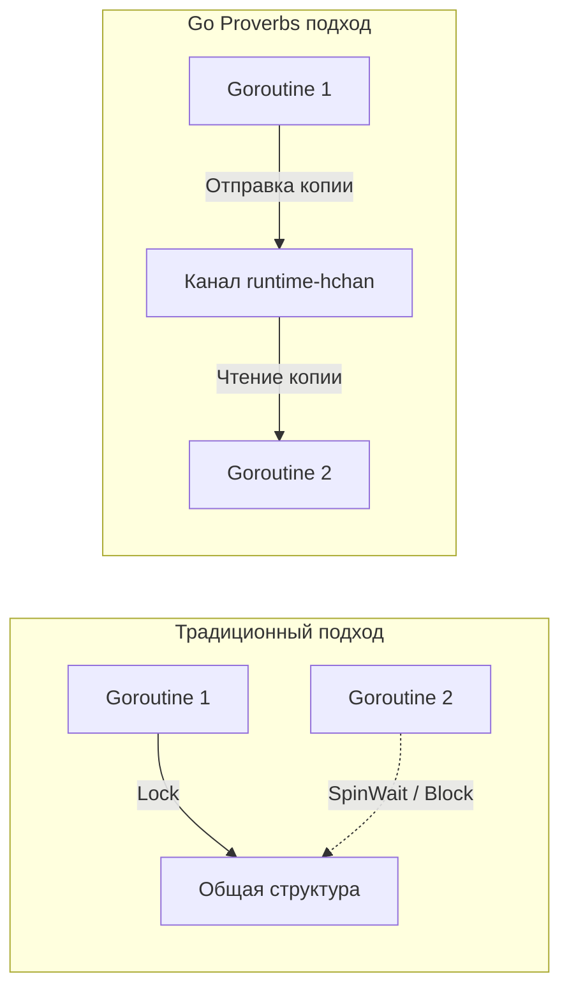

В 2015 году на конференции Gopherfest создатель языка Роб Пайк (Rob Pike) представил список из 19 кратких изречений, которые сообщество окрестило **«Go Proverbs» (Пословицы Go)**. Подобно «Дзену Python», эти фразы стали культурным кодом. 

Но для Senior-инженера это не просто красивые цитаты для футболок. Каждая пословица — это концентрат архитектурного опыта, тесно связанный с тем, как работает компилятор, рантайм и операционная система. 

В этой статье мы разберем самые важные "пословицы" через призму внутреннего устройства языка и Mechanical Sympathy.

## 1. Don't communicate by sharing memory, share memory by communicating
*(Не общайтесь, разделяя память; разделяйте память, общаясь)*

Это самая знаменитая пословица, определяющая подход Go к конкурентности. В классических языках (C++, Java, C#) потоки общаются через общие переменные. Чтобы избежать гонок данных (Data Races), программисты защищают эту память мьютексами (`Mutex`), семафорами или `Monitor`.

**Проблема общей памяти на уровне железа (Mechanical Sympathy):**
Когда несколько ядер процессора (CPU Cores) пытаются захватить один и тот же мьютекс, происходит жесткая борьба за кэш-линию L1/L2 (Cache Line Bouncing). Процессор вынужден постоянно инвалидировать кэш соседей по шине (протокол MESI), что приводит к огромным задержкам на уровне железа (False Sharing).

**Решение Go: Общение через каналы (Channels).**
Вместо того чтобы горутины толпились вокруг одного куска памяти, одна горутина **передает владение** данными другой через канал (встроенную типизированную очередь).



> [!info] Под капотом: Очереди каналов
> Канал в Go — это структура `hchan` внутри рантайма. Она содержит кольцевой буфер (ring buffer) и две очереди ожидания (wait queues) для читателей и писателей. Когда горутина пытается прочитать из пустого канала, рантайм вызывает `gopark`. Горутина снимается с выполнения (переходит в статус `waiting`), а освободившийся поток ОС (тред `M`) немедленно берет другую горутину из локальной очереди планировщика. Передача владения данными становится абсолютно прозрачной и безопасной операцией в User Space.

Мы детально разберем этот паттерн в статье [[25. Share Memory By Communicating. Почему каналы важнее Mutex]].

## 2. Concurrency is not parallelism
*(Конкурентность — это не параллелизм)*

Разработчики часто путают эти два термина. 
*   **Параллелизм** — это свойство *железа* (Hardware). Это когда несколько задач физически выполняются в один и тот же момент времени на разных ядрах CPU.
*   **Конкурентность** — это свойство *архитектуры кода* (Software Design). Это способ разбить программу на независимые процессы, которые **могут** выполняться параллельно, но не обязаны.

Go — это язык для написания *конкурентных* программ. Ваш код, разбитый на горутины, может отлично работать на одноядерном процессоре (например, в дешевом AWS EC2 t3.nano). Планировщик Go будет просто очень быстро переключать контекст между ними. А если вы перенесете этот же бинарник на сервер с 64 ядрами, программа автоматически станет *параллельной* без единого изменения в коде. 
Подробнее эта философская концепция раскрыта в [[24. Concurrency Is Not Parallelism. Философия конкурентности в Go]].

## 3. A little copying is better than a little dependency
*(Небольшое копирование лучше небольшой зависимости)*

В мире экосистемы Node.js (npm) однажды произошла катастрофа: автор удалил из реестра крошечную библиотеку `left-pad` (заполняющую строку пробелами). Это сломало сборку миллионов проектов по всему миру, включая React и Babel.

Go-инженеры ненавидят раздутые деревья зависимостей. Компилятор Go собирает приложение статически. Каждая внешняя зависимость (`import`) увеличивает:
1. Время сборки (хоть и не сильно).
2. Размер бинарного файла.
3. Риск проблем безопасности (Supply Chain Attacks).
4. Вероятность конфликта версий в `go.mod`.

> [!tip] Собеседование
> **Вопрос:** В микросервисе А есть структура `UserDTO`. Микросервису Б нужно читать события из Kafka, которые генерит сервис А. Стоит ли выносить `UserDTO` в общий пакет `shared-models` и импортировать его в оба сервиса?
> **Ответ:** Согласно Go Proverbs — нет. Создание `shared-models` создает жесткую связность (Tight Coupling) между микросервисами и приводит к версионному аду. Идиоматичнее **скопировать** описание нужной части `UserDTO` в микросервис Б. Пусть каждый сервис владеет своей проекцией данных. "A little copying is better than a little dependency".

## 4. Make the zero value useful
*(Делайте нулевое значение полезным)*

Когда вы объявляете переменную в Go, она автоматически инициализируется «нулевым значением» для своего типа (`0` для int, `false` для bool, `nil` для указателей, `""` для строк).

Хорошо спроектированный API использует это свойство, позволяя работать со структурой без явной инициализации (без конструкторов `New...()`).

Пример из стандартной библиотеки — `sync.WaitGroup`:
```go
func processItems(items[]string) {
    var wg sync.WaitGroup // Выделяется на стеке, поля обнулены

    for _, item := range items {
        wg.Add(1) // Сразу работает!
        go func(val string) {
            defer wg.Done()
            doWork(val)
        }(item)
    }

    wg.Wait()
}
```

> [!info] Под капотом: Быстрая инициализация памяти
> Когда Go выделяет память (на стеке или в куче), он обязан её обнулить ради безопасности, чтобы в переменной не оказались случайные "мусорные" данные от предыдущего процесса. В рантайме Go за это отвечает оптимизированная процедура `memclrNoHeapPointers` (написанная на ассемблере с использованием векторизованных инструкций AVX). Раз память всё равно бесплатно и быстро обнуляется аппаратно, дизайн структур должен извлекать из этого выгоду (см. [[20. Zero Value как часть дизайна языка]]).

## 5. Clear is better than clever
*(Понятное лучше заумного)*

Среди программистов часто считается доблестью написать логику в одну строку кода (One-liner). Но в Go "clever" (заумный/хитрый) код считается антипаттерном.

Если вы можете использовать пакет `reflect`, чтобы магическим образом смапить данные из базы в структуру без явного перечисления полей, разработчики на Python или Java похлопают вас по плечу. Разработчики на Go отклонят ваш Pull Request.

**Почему Clever код вреден в Go:**
1. **Он убивает Escape Analysis:** Компилятор не всегда может понять, куда утекают переменные при использовании рефлексии `reflect` или `unsafe`, и отправляет их в Heap. Растет нагрузка на Garbage Collector.
2. **Он ломает Inlining:** "Хитрые" вызовы методов через интерфейсы и рефлексию не могут быть заинлайнены (встроены прямо в место вызова).
3. **Он стоит дорого в поддержке:** Код читают чаще, чем пишут.

Пишите "скучный" (boring) и явный (explicit) код. Явный `for` с явным `if` всегда лучше, чем магия скрытых итераторов или рефлексии.

## 6. Errors are values
*(Ошибки — это значения)*

В языках с исключениями (`try/catch/throw`) ошибка — это особый сигнал, который разрушает нормальный порядок выполнения программы (Control Flow), заставляя процессор раскручивать стек (Stack Unwinding) в поисках `catch`-блока. Это дорогая операция на уровне железа.

В Go ошибка (тип `error`) — это просто значение. Оно ничем не отличается от `int` или `string`. Вы можете положить ошибку в мапу, передать по каналу, записать в переменную и обработать позже.

```go
type Processor struct {
    err error // Ошибка сохраняется как состояние
}

func (p *Processor) DoStep1() {
    if p.err != nil {
        return // Если ошибка уже есть, ничего не делаем
    }
    _, p.err = performAction1()
}

func (p *Processor) DoStep2() {
    if p.err != nil {
        return
    }
    _, p.err = performAction2()
}

// Использование:
p := &Processor{}
p.DoStep1()
p.DoStep2()
if p.err != nil {
    log.Println("Конвейер остановился из-за ошибки:", p.err)
}
```
Такой подход называется **Safe Error Handling** (Безопасная обработка ошибок). Поток выполнения остается прозрачным, линейным и предсказуемым для предсказателя ветвлений процессора (Branch Predictor).

## Итог

Go Proverbs — это мост между абстрактной философией и конкретными архитектурными решениями:
*   Нужна безопасность данных? Используйте каналы, а не мьютексы.
*   Нужна гибкость развертывания? Копируйте мелкий код вместо создания зависимостей.
*   Нужна производительность? Делайте структуры полезными "из коробки" (Zero Value) и избегайте рефлексии ("Clear is better than clever").

Мы вплотную подошли к самой обсуждаемой и "ненавистной" для новичков теме в Go. Пословица "Errors are values" радикально меняет подход к проектированию. Почему авторы языка отказались от исключений и как правильно жить с бесконечными `if err != nil`? Переходим к следующей статье: [[9. Errors Are Values. Почему в Go нет исключений]].