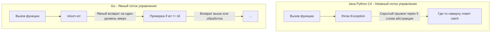

Для разработчика, приходящего в Go из мира Java, C#, PHP или Python, ничто не вызывает такого сильного отторжения в первые недели, как работа с ошибками. Отсутствие конструкций `try/catch/finally` и бесконечные блоки `if err != nil` кажутся возвратом в 70-е годы, к языку C.

Многие начинают искать способы "обойти" систему: пишут глобальные обработчики паник (чтобы эмулировать `catch`), создают сложные обертки `Must()`, или используют пакеты, имитирующие монады. 

Однако со временем приходит осознание: **отказ от исключений — это одно из лучших архитектурных решений в Go.** Чтобы понять почему, нам нужно спуститься на уровень процессора и операционной системы, а затем посмотреть на дизайн крупных бэкенд-систем.

## Цена исключений: Mechanical Sympathy

В классических ООП-языках исключение (Exception) — это фундаментальный механизм изменения потока управления (Control Flow). Когда вы пишете `throw new UserNotFoundException()`, вы не просто возвращаете результат работы функции. Вы запускаете сложнейший системный механизм.

> [!info] Под капотом: Что делает процессор при Exception?
> Когда генерируется исключение (например, в C++ или Java), рантайм должен остановить нормальное выполнение кода и начать процесс **Раскрутки стека (Stack Unwinding)**.
> 1. Рантайм читает специальные метаданные (например, секцию `.eh_frame` в бинарниках ELF), чтобы понять, какие функции сейчас находятся в стеке вызовов.
> 2. Процессор начинает прыгать "назад" по кадрам стека, проверяя, есть ли в текущей функции подходящий обработчик `catch` для типа исключения (это требует дорогой проверки типов в рантайме — RTTI).
> 3. Попутно нужно вызвать деструкторы для локальных объектов (в C++) или выполнить блоки `finally` (в Java/C#).
> 
> **Для процессора это катастрофа.** Конвейер (Pipeline) сбрасывается. Предсказатель ветвлений (Branch Predictor) полностью ослеплен, так как переход происходит по динамическим адресам. Кэш инструкций (I-Cache) инвалидируется, потому что код обработки исключений обычно лежит "холодным" в других областях памяти. В высоконагруженных системах использование исключений для бизнес-логики (например, "неверный пароль") способно просадить пропускную способность сервиса в разы.

В Go ошибка — это **обычное значение** (value). Возврат ошибки `return nil, err` ничем не отличается от возврата `return 0, 1`. На уровне регистров CPU (в современном Go используется register-based ABI) это просто копирование 16 байт в регистры `RAX`/`RBX`. 

Проверка `if err != nil` компилируется в простейшую ассемблерную инструкцию условного перехода (типа `JNZ` — Jump if Not Zero). Предсказатели ветвлений современных процессоров щелкают такие паттерны как орехи (ведь чаще всего ошибки нет, и конвейер безошибочно продолжает линейное выполнение кода).

## Неявный поток управления vs Явный

Исключения создают **скрытый канал связи** между функциями. 

Представьте, что вы читаете чужой код в Java:
```java
public void processTransaction(Transaction tx) {
    db.save(tx);
    billing.charge(tx);
    email.sendReceipt(tx);
}
```
Глядя на этот код, вы не можете сказать, что произойдет, если `billing.charge()` упадет с `NetworkException`. Прервется ли выполнение? Откатится ли транзакция в базе? Перехватит ли исключение кто-то выше по стеку? Чтобы это узнать, вам придется прочитать документацию или исходники каждой из этих функций, а также просмотреть весь стек вызовов вверх. Исключения — это "невидимый GOTO".

В Go поток управления **абсолютно прозрачен**:
```go
func (s *Service) ProcessTransaction(tx *Transaction) error {
    if err := s.db.Save(tx); err != nil {
        return fmt.Errorf("failed to save tx: %w", err)
    }
    
    if err := s.billing.Charge(tx); err != nil {
        // Явный откат состояния
        s.db.Rollback(tx)
        return fmt.Errorf("billing failed: %w", err)
    }
    
    // email.SendReceipt может вернуть ошибку, но мы осознанно её игнорируем/логируем, 
    // не прерывая бизнес-процесс (потому что чек можно отправить позже)
    if err := s.email.SendReceipt(tx); err != nil {
        log.Printf("non-critical error sending receipt: %v", err)
    }
    
    return nil
}
```

Читая Go-код сверху вниз, вы точно знаете, где функция может прерваться и какие побочные эффекты произойдут. Компилятор заставляет вас принять решение (обработать, вернуть выше или залогировать) прямо в месте возникновения ошибки.



## "Ошибки" против "Багов"

Один из главных архитектурных инсайтов Go: **в бизнес-приложениях большинство ошибок — это не катастрофы, а ожидаемое состояние.**

*   Пользователь ввел неправильный логин — это нормально (ожидаемо).
*   База данных ответила таймаутом из-за сетевого скачка — это нормально (сеть по определению ненадежна).
*   Файл для чтения не существует — это нормально.

Все эти ситуации должны обрабатываться как часть бизнес-логики. Именно для них используется интерфейс `error`.

Но что, если:
*   Вы обращаетесь к 10-му элементу массива из 5?
*   Вы разыменовываете указатель, который равен `nil`?
*   Вы делите на ноль?

Это не ошибки бизнес-логики. Это **баги программиста**. В этих случаях программа находится в невалидном состоянии, и продолжать её выполнение опасно (можно повредить данные в БД). Для таких случаев в Go используется механизм `panic`. Паника крашит текущую горутину и, если ее не поймать, всё приложение. Подробнее о том, когда паники уместны, мы поговорим в [[11. Panic и Recover. Когда они нужны, а когда вредны]].

> [!tip] Собеседование
> **Вопрос:** В Go вообще нет аналога try/catch? Зачем тогда нужны panic и recover?
> **Ответ:** Аналог (panic/recover) есть, но он используется только для **восстановления после критических сбоев времени выполнения** (например, паника внутри middleware HTTP-сервера, чтобы не упал весь сервер из-за одного битого запроса), а не для передачи сигналов бизнес-логики. Если вы используете `panic` в качестве `throw` и `recover` в качестве `catch` для управления флоу — вы нарушаете идиомы Go. Ошибки должны быть значениями.

## "Errors are values" означает, что их можно программировать

Когда Роб Пайк (создатель языка) написал знаменитое эссе «Errors are values» (Ошибки — это значения), многие поняли его неверно. Люди подумали, что это означает "ошибка — это просто тип, смиритесь с `if err != nil`". 

На самом деле Пайк имел в виду другое: раз ошибка — это просто значение (интерфейс), вы можете использовать всю мощь языка для работы с ней. Вы можете писать алгоритмы, инкапсулирующие проверку ошибок, чтобы код был чистым.

Вместо того чтобы делать так:
```go
_, err = w.Write(p0)
if err != nil {
    return err
}
_, err = w.Write(p1)
if err != nil {
    return err
}
// ... и так 10 раз
```

Идиоматичный подход (из стандартного пакета `bufio`) — инкапсулировать состояние ошибки в структуру:

```go
type errWriter struct {
    w   io.Writer
    err error // Сохраняем ошибку как внутреннее состояние
}

// Write не возвращает ошибку, он сохраняет её
func (ew *errWriter) Write(buf[]byte) {
    if ew.err != nil {
        return // Если ошибка уже была, ничего не делаем (no-op)
    }
    _, ew.err = ew.w.Write(buf)
}

// Теперь бизнес-логика выглядит элегантно:
func WriteResponse(w io.Writer) error {
    ew := &errWriter{w: w}
    
    ew.Write([]byte("Header\n"))
    ew.Write([]byte("Body\n"))
    ew.Write([]byte("Footer\n"))
    
    // Проверяем ошибку ровно один раз в самом конце
    return ew.err
}
```

> [!warning] Ловушка / Gotcha: `err` — это интерфейс, а не строка
> Приходя из скриптовых языков, разработчики часто проверяют ошибки по их текстовому сообщению: `if strings.Contains(err.Error(), "not found")`.
> Это **ужасный антипаттерн**. Сообщение об ошибке может измениться в новой версии библиотеки, и ваш код молча сломается. В Go `error` — это интерфейс. Вы должны проверять сам тип или значение ошибки с помощью функций `errors.Is` и `errors.As`.

## Итог

Дизайн Go сознательно заставляет вас испытывать дискомфорт при написании кода, возвращающего ошибки, чтобы сделать чтение и поддержку этого кода максимально комфортными.

1. **Производительность:** Ошибки-значения не ломают предсказание ветвлений CPU и не требуют дорогой раскрутки стека.
2. **Прозрачность:** Вы всегда видите, где код может прерваться (явный Control Flow).
3. **Разделение сущностей:** Ошибки (значения) — для бизнес-логики и нормальной работы. Паники — для багов и фатальных сбоев.

Теперь, когда мы поняли философию отказа от исключений, возникает практический вопрос: как правильно работать с этими ошибками? Как прокидывать контекст ошибки наверх по стеку, логировать её и сравнивать? Об этом пойдет речь в следующей статье: [[10. Обработка ошибок в Go. if err != nil как часть дизайна]].