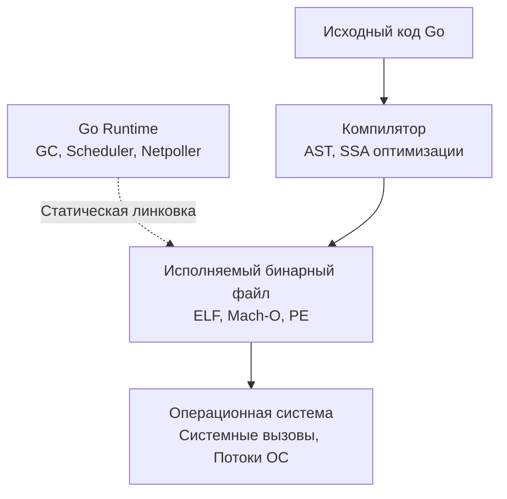

Добро пожаловать в раздел, посвященный основам и синтаксису языка Go. Если вы пришли из мира Java, C#, PHP или C++, первое впечатление от Go может быть обманчивым. Синтаксис кажется примитивным, язык выглядит так, будто его создали в 80-х, а отсутствие привычных фич (вроде наследования или исключений `try/catch`) вызывает недоумение. 

Однако за этой внешней простотой скрывается жесточайший прагматизм. Go создавался не для академических исследований в области computer science, а для решения конкретных инженерных проблем Google: долгих сборок, нечитаемого спагетти-кода, сложного деплоя и тяжелой поддержки высоконагруженных сетевых сервисов.

В этом разделе мы заложим фундамент. Но, поскольку вы уже умеете программировать, мы не будем останавливаться на том, "что такое переменная". Мы будем разбирать, **как именно Go реализует эти концепции под капотом**, как они влияют на железо и почему язык спроектирован именно так.

## Архитектура Go-программы: Что мы вообще пишем?

Главное отличие Go от языков с виртуальными машинами (Java, C#) или интерпретаторов (Python, PHP) — это компиляция в **статически слинкованный машинный код** с внедренным рантаймом.

> [!info] Под капотом: Что такое Go Runtime?
> В отличие от JVM или CLR, рантайм Go — это не виртуальная машина, устанавливаемая на сервер. Это просто набор библиотечного кода (написанного на том же Go и ассемблере), который компилятор автоматически "вшивает" в каждый бинарный файл. 
> Рантайм управляет тремя фундаментальными вещами:
> 1. **Memory Allocation & Garbage Collection:** Выделение памяти и сборка мусора.
> 2. **Goroutine Scheduling:** Планировщик горутин (G-M-P модель), распределяющий легковесные потоки по реальным тредам ОС.
> 3. **Netpoll:** Асинхронный сетевой IO-мультиплексор (epoll/kqueue), абстрагированный от разработчика.

## 4 столпа парадигмы Go

Чтобы писать на Go идиоматично (а не писать код на Java синтаксисом Go), нужно принять четыре базовые архитектурные концепции языка. Мы будем подробно разбирать их в последующих статьях, но вот краткий обзор.

### 1. Ортогональность и Минимализм
В Go всего 25 ключевых слов. Язык намеренно лишен "магии". Концепция ортогональности означает, что фичи языка независимы друг от друга, но могут гибко комбинироваться.
Например, в Go нет классов, но есть структуры `struct` (данные) и методы (поведение). Они существуют отдельно, но вместе дают механизмы инкапсуляции.

### 2. Value Semantics и Механическая Симпатия (Mechanical Sympathy)
В языках вроде Java или PHP (для объектов) всё является ссылкой. В Go вы контролируете, где лежат данные. Вы можете передавать значения по копии (на стеке) или по указателю (в куче). 

Это критически важно для производительности. Современные CPU работают невероятно быстро, пока данные лежат в кэше процессора (L1/L2). Данные в Go могут располагаться в памяти непрерывно (например, массивы структур), что обеспечивает идеальную работу механизма **CPU Prefetcher**. Go поощряет написание кода, дружелюбного к кэш-линиям. Компилятор Go также использует **Escape Analysis**, чтобы определить, может ли переменная остаться на дешевом стеке или ее нужно аллоцировать в дорогой куче (Heap).

### 3. Композиция вместо Наследования
В Go **нет наследования** (отсутствует ключевое слово `extends`). Вместо построения глубоких и хрупких иерархий (Vehicle -> Car -> Toyota), Go использует встраивание структур. 
Полиморфизм достигается через интерфейсы, которые реализуются **неявно** (Duck Typing). Вам не нужно писать `implements Interface`. Если тип имеет нужные методы — он автоматически удовлетворяет интерфейсу.

> [!warning] Ловушка / Gotcha
> Самая частая ошибка мигрантов с ООП-языков — попытка воссоздать паттерны абстрактных фабрик, базовых классов и строить огромные интерфейсы заранее. Идиоматичный Go-код строится снизу вверх: сначала реализуется конкретная логика, и только когда возникает реальная необходимость в полиморфизме, выделяется небольшой интерфейс (часто из 1-2 методов). Об этом мы поговорим в статьях [[23. Интерфейсы. Полиморфизм по-goшному]] и [[25. Встраивание. Embedding вместо наследования]].

### 4. Ошибки — это значения (Errors are values)
Отсутствие исключений (`throw/catch`) сначала раздражает всех. В Go ошибка — это обычное значение, реализующее интерфейс `error`. Вы возвращаете её как последнее значение функции и явно проверяете: `if err != nil`.
Это заставляет программиста обрабатывать ошибки (или сознательно их игнорировать) прямо в месте их возникновения, создавая предсказуемый и надежный код (Control Flow). Подробнее в [[12. Обработка ошибок через error]].

> [!tip] Собеседование
> **Вопрос:** Почему в Go нет исключений (Exceptions)?
> **Ответ:** Исключения скрывают поток выполнения (Control Flow). Читая код с `try/catch`, вы не знаете, какая именно строчка может бросить исключение и где оно будет перехвачено. В высоконагруженных системах "невидимые" пути выполнения приводят к сложным багам и утечкам ресурсов. Явный возврат ошибок делает код линейным и предсказуемым.

## Структура данного раздела

В рамках этого "учебника" мы пройдем путь от установки среды до понимания базовых примитивов конкурентности. Раздел разбит на следующие блоки:

1. **Базис:** Сборка, инструментарий, типы данных, память и указатели.
2. **Структуры данных:** Глубокое погружение в слайсы и мапы, включая их исходный код и устройство в памяти.
3. **ООП по-Goшному:** Структуры, методы и интерфейсы (их внутреннее устройство — `iface` и `eface`).
4. **Конкурентность (Основы):** Что такое горутины и почему они дешевле потоков ОС. Знакомство с каналами, select и базовой синхронизацией. Детально эти темы будут разобраны в статьях [[34. Горутины. Легковесная конкурентность в Go]] и [[36. Каналы. Передача данных между горутинами]].

Go — это инструмент с низким порогом входа, но очень высоким потолком мастерства. Изучение синтаксиса займет пару вечеров, но понимание того, как писать масштабируемый, параллельный и не съедающий всю RAM код — требует изменения мышления.

Начнем с подготовки рабочего окружения и первого компилируемого бинарника в статье: [[2. Установка Go, GOPATH, GOROOT и первая программа]].