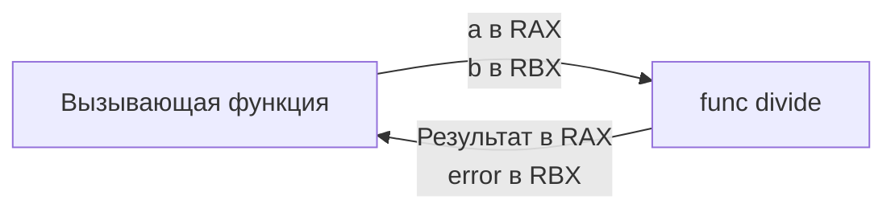

Функции в Go — это объекты первого класса (First-Class Citizens). Вы можете передавать их как аргументы, возвращать из других функций и присваивать переменным. 

Если вы пришли из C++, Java или C#, вас может удивить то, чего в Go **нет**:
1. **Нет перегрузки функций (Overloading)**: Вы не можете написать две функции `Print(int)` и `Print(string)`.
2. **Нет аргументов по умолчанию (Default parameters)**: Нельзя написать `func process(timeout int = 10)`.

Это не недоработка создателей, а осознанное архитектурное решение. В больших кодовых базах Google перегрузка и неявные значения по умолчанию приводили к тому, что при чтении кода было невозможно без IDE понять, какая именно версия функции вызывается. Go заставляет разработчика быть явным: нужны разные поведения — дайте функциям разные, четкие имена (`PrintInt`, `PrintString`) или используйте интерфейсы.

## Анатомия функции и Multiple Return Values

В C или Java функция возвращает строго одно значение. Если вам нужно вернуть результат и статус ошибки, вам приходится либо бросать исключение (Exception), либо возвращать `null`, либо использовать "out-параметры" по указателю.

В Go возврат нескольких значений (Multiple Return Values) поддерживается на уровне языка и является фундаментом архитектуры обработки ошибок.

```go
// Функция принимает два int и возвращает int и error
func divide(a, b int) (int, error) {
    if b == 0 {
        // Ошибка - обычное значение, реализующее интерфейс error
        return 0, fmt.Errorf("деление на ноль")
    }
    return a / b, nil
}

func main() {
    result, err := divide(10, 2)
    if err != nil {
        // Обработка ошибки
    }
}
```

> [!info] Под капотом: Register ABI (Application Binary Interface)
> Как физически процессор возвращает два значения, если в C/C++ (до C++17) стандартом был возврат одного значения через регистр `RAX`?
> До версии 1.17 компилятор Go передавал аргументы и возвращал результаты **через стек горутины**. Это было просто в реализации, но медленно (требовало обращения к памяти). 
> 
> Начиная с Go 1.17, язык использует **Register-based ABI**. Компилятор мапит аргументы и возвращаемые значения напрямую на аппаратные регистры процессора. На архитектуре amd64 Go резервирует до 9 целочисленных регистров (RAX, RBX, RCX и т.д.) и 15 XMM-регистров для чисел с плавающей точкой.
> Если вы возвращаете `(int, error)`, процессор положит `int` в регистр `RAX`, а указатель на `error` — в `RBX`. Никаких обращений к медленной оперативной памяти (стеку), мгновенный возврат!



## Передача аргументов: Всегда по значению

Это один из самых частых вопросов на собеседованиях и причина множества багов.
**В Go все аргументы передаются исключительно по значению (Pass by value).** В языке нет концепции "передача по ссылке" (Pass by reference) в том смысле, как это работает в C++ (через `&`).

Когда вы передаете переменную в функцию, Go делает **полную побитовую копию** этой переменной и помещает её в регистр или на стек новой функции.

```go
func modify(x int) {
    x = 100 // Изменяем КОПИЮ, оригинал не пострадает
}
```

### Передача указателей
Если вы хотите, чтобы функция изменила оригинальную переменную, вы передаете указатель. 
Но помните механику: **сам указатель тоже передается по значению**. Функция получает копию адреса в памяти (8 байт на 64-битной ОС), которая указывает на оригинальные данные.

```go
func modifyPtr(x *int) {
    *x = 100 // Разыменовываем копию указателя, меняем оригинал
}
```
*(Подробно работу с указателями и Escape Analysis мы разберем в [[14. Указатели в Go]])*.

> [!warning] Ловушка / Gotcha: Передача слайсов и мап
> В Go часто говорят: "слайсы и мапы передаются по ссылке". **Это ложь.**
> Как мы выяснили ранее, слайс под капотом — это структура (`SliceHeader`), состоящая из указателя на массив, длины и вместимости (24 байта).
> Когда вы передаете слайс в функцию, эта структура **копируется по значению**. Копия слайса будет иметь *тот же самый указатель* на базовый массив. 
> Изменяя элементы массива, вы измените оригинал. Но если вы сделаете `append` внутри функции, и слайс изменит свою длину (или переаллоцирует массив), оригинальный слайс снаружи функции об этом не узнает (его копия `SliceHeader` останется старой)!

## Вариативные аргументы (Variadic parameters)

Иногда функции нужно принять неограниченное количество аргументов (например, `fmt.Println`). Для этого используется синтаксис `...type`. Такой параметр должен быть строго последним в списке аргументов.

```go
func sum(prefix string, nums ...int) int {
    total := 0
    // Внутри функции nums - это обычный срез (slice) типа[]int
    for _, n := range nums {
        total += n
    }
    return total
}
```

### Распаковка слайса (Unpacking)
Если у вас уже есть слайс, и вы хотите передать его в вариативную функцию, вы должны использовать оператор распаковки `...` при вызове:

```go
mySlice :=[]int{1, 2, 3, 4}
// sum("test", mySlice) // Ошибка компиляции! Ожидается int, а не[]int
result := sum("test", mySlice...) // Правильно
```

> [!tip] Собеседование
> **Вопрос:** Вы вызываете `sum("test", 1, 2, 3)`. Выделяет ли компилятор память в куче (Heap) для создания слайса `nums`?
> **Ответ:** Зависит от Escape Analysis. Компилятор Go достаточно умен. Если слайс `nums` используется только внутри функции `sum` и не "убегает" в глобальные переменные или другие горутины, компилятор создаст невидимый базовый массив для `[1, 2, 3]` прямо на дешевом **стеке (Stack)**, и никакого давления на Garbage Collector (GC) не будет. 
> Однако, если мы передаем уже существующий `mySlice...`, никаких дополнительных аллокаций вообще не происходит — функция просто получает копию `SliceHeader` существующего слайса.

## Функции как параметры (Колбэки)

Поскольку функции — это объекты первого класса, они часто используются для внедрения зависимостей или паттерна "Стратегия".

В Go принято определять тип функции (сигнатуру) через `type`, чтобы код был читаемым:

```go
// Определяем тип функции, которая принимает int и возвращает bool
type FilterFunc func(int) bool

// Функция принимает слайс и функцию-фильтр
func filter(data []int, f FilterFunc) []int {
    var result[]int
    for _, val := range data {
        if f(val) {
            result = append(result, val)
        }
    }
    return result
}

func main() {
    nums :=[]int{1, 2, 3, 4, 5}
    
    // Передаем анонимную функцию (лямбду) в качестве аргумента
    evens := filter(nums, func(n int) bool {
        return n%2 == 0
    })
}
```

В этом примере лямбда-функция также может являться **замыканием (closure)** — она имеет доступ ко всем переменным из области видимости функции `main`, даже если физически будет вызвана внутри функции `filter`. Рантайм Go автоматически упакует такие захваченные переменные в кучу (Heap), чтобы они не уничтожились после выхода из текущего стекового фрейма.

## Итог

1. **Нет магии**: Отсутствие перегрузки и дефолтных аргументов делает код линейным и понятным с первого взгляда.
2. **Multiple Return Values**: Нативная поддержка возврата нескольких значений заменяет `try-catch` и out-параметры. 
3. **Register ABI**: С версии 1.17 передача аргументов и возврат результатов выполняются через регистры CPU, обеспечивая высочайшую производительность.
4. **Pass by value**: Go всегда копирует аргументы. Если нужно мутировать оригинал или избежать копирования гигантской структуры — передавайте указатель (но помните, что сам адрес тоже скопируется).
5. **Вариативные аргументы** превращаются в слайсы под капотом и оптимизируются компилятором для работы на стеке (Escape Analysis).

В этой статье мы рассмотрели базовую работу с функциями. Но у Go есть еще две уникальные механики, тесно связанные с жизненным циклом функций и обработкой ресурсов — это возможность именовать результаты и мощный механизм отложенных вызовов `defer`. Этому посвящена следующая статья: [[11. Именованные возвращаемые значения и defer]].