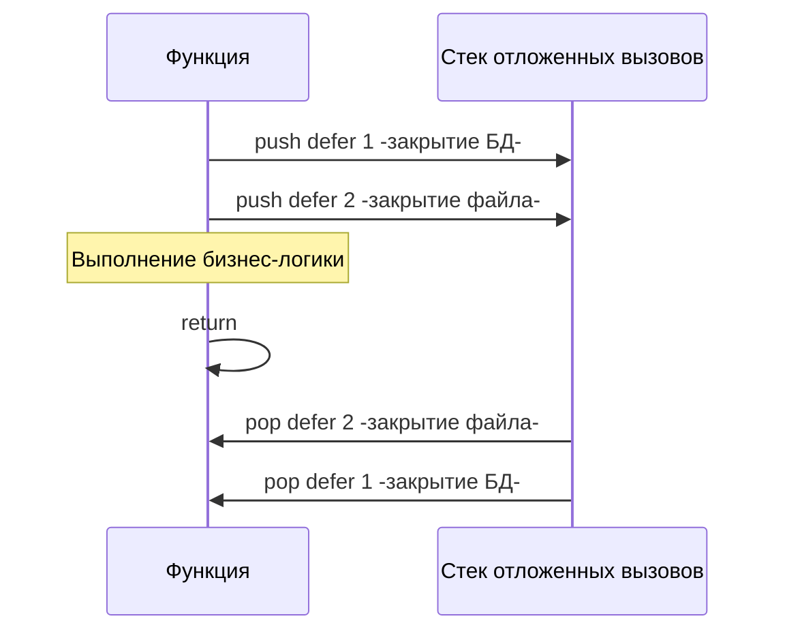

В языках с ручным управлением памятью (C/C++) разработчику приходится маниакально следить за освобождением ресурсов: закрывать файлы, отпускать мьютексы, очищать сокеты. Паттерн RAII (Resource Acquisition Is Initialization) из C++ решает это через деструкторы, а Java/C# используют блоки `try-finally`.

В Go нет ни деструкторов (так как сборщик мусора очищает только память, а не системные ресурсы), ни конструкции `finally`. Вместо этого в язык встроены два мощнейших механизма, которые работают в тандеме: **именованные возвращаемые значения (Named Return Values)** и **отложенные вызовы (`defer`)**. 

Понимание того, как они взаимодействуют на уровне стека — обязательное условие для прохождения любого хардового собеседования на Go-разработчика.

## 1. Именованные возвращаемые значения

Go позволяет не просто указать типы возвращаемых значений, но и дать им имена прямо в сигнатуре функции.

```go
// Классический возврат
func divide(a, b int) (int, error) {
    return a / b, nil
}

// Именованный возврат
func divideNamed(a, b int) (result int, err error) {
    if b == 0 {
        err = fmt.Errorf("деление на ноль")
        return // Так называемый "Naked return"
    }
    result = a / b
    return // Вернет текущие значения result и err
}
```

### Как это работает под капотом?
Когда компилятор видит функцию с именованными возвращаемыми значениями, он рассматривает их как **обычные локальные переменные**, которые аллоцируются во фрейме стека (Stack Frame) этой функции прямо в момент её вызова и инициализируются их Zero Values (нулями, пустыми строками, `nil`).

### Naked Return: Удобство или зло?
Ключевое слово `return` без аргументов называется **Naked Return**. Оно автоматически берет текущие значения именованных переменных и возвращает их. 

> [!warning] Ловушка / Gotcha: Читаемость кода
> Naked return считается **антипаттерном** в функциях длиной более 5-10 строк. Читая длинную функцию, вы встречаете просто `return` и не понимаете, какие именно данные сейчас улетят наружу, если переменная `result` была изменена на 50 строк выше. 
> Идиоматичный Go допускает использование именованных значений для документации (чтобы в IDE было видно, что именно возвращает функция), но требует явного возврата: `return result, err`.

Зачем же тогда нужны именованные возвраты? Их истинная суперсила раскрывается в связке с `defer`.

## 2. Анатомия defer

Ключевое слово `defer` откладывает выполнение функции до момента **возврата из текущей функции** (или до паники). Это идеальный инструмент для закрытия ресурсов.

```go
func processFile(filename string) error {
    f, err := os.Open(filename)
    if err != nil {
        return err
    }
    // Выполнится прямо перед выходом из processFile
    defer f.Close() 
    
    // ... чтение файла ...
    return nil
}
```

### Порядок вызова: LIFO
Если в функции несколько `defer`, они помещаются в стек и выполняются в порядке **LIFO** (Last In, First Out — Последним пришел, первым ушел).



Такой порядок логичен: ресурс, который был открыт последним, может зависеть от ресурса, открытого первым, поэтому его нужно закрывать раньше.

### Оценка аргументов в момент объявления

Это классическая ловушка. Значения аргументов функции, переданной в `defer`, вычисляются **в момент объявления**, а не в момент выполнения.

```go
func main() {
    start := time.Now()
    // ОШИБКА: time.Since-start- вычислится прямо сейчас!
    // defer всегда напечатает 0 миллисекунд.
    defer fmt.Println("Время выполнения:", time.Since(start)) 

    time.Sleep(2 * time.Second)
}
```

Как починить? Обернуть в анонимную функцию (замыкание). Тогда функция `time.Since` будет вызвана только в момент исполнения `defer`.

```go
defer func() {
    fmt.Println("Время выполнения:", time.Since(start))
}()
```

## 3. Взаимодействие defer и именованных возвратов

А теперь главный вопрос с собеседований на грейд Middle. Что вернет эта функция?

```go
func magic() (result int) {
    defer func() {
        result *= 10
    }()
    return 5
}
```

Правильный ответ: **50**.

Чтобы понять почему, нужно разобрать, как физически работает инструкция `return` в Go. Это не атомарная операция. Она состоит из трех шагов:
1. Присвоение возвращаемых значений (если используется явный возврат). В нашем случае: `result = 5`.
2. Выполнение всех отложенных функций `defer` в порядке LIFO. Замыкание видит переменную `result` и делает `result = result * 10` (5 * 10 = 50).
3. Фактический возврат (выход из фрейма стека) с текущим значением `result`.

Этот механизм невероятно полезен для **глобального перехвата ошибок**.
```go
func doWork() (err error) {
    defer func() {
        if r := recover(); r != nil {
            // Перехватываем панику и превращаем её в ошибку!
            err = fmt.Errorf("паника поймана: %v", r)
        }
    }()
    // ... потенциально опасный код ...
}
```
*(Мы детальнее разберем этот паттерн в [[13. Panic, Recover и stack trace]])*.

## 4. Mechanical Sympathy: Defer под капотом

Исторически `defer` был "тяжелым". До Go 1.13 каждый вызов `defer` приводил к аллокации структуры `_defer` в куче (или на стеке) и формированию связного списка внутри структуры горутины (поле `_defer` в структуре `g`). Это требовало дорогостоящих переключений контекста функций рантайма `runtime.deferproc` и `runtime.deferreturn`. Разработчики высоконагруженных систем старались избегать `defer` в горячих (hot path) циклах.

В **Go 1.14** компилятор получил потрясающую оптимизацию: **Open-coded defers (Инлайнинг отложенных вызовов)**.

Если ваша функция содержит не более 8 `defer`, и они не находятся внутри циклов, компилятор больше не вызывает рантайм. На этапе компиляции (в SSA) он буквально "вклеивает" код из `defer` перед каждой возможной точкой возврата (инструкцией `RET` в ассемблере). 
Затраты на вызов `defer` снизились с ~50 наносекунд до **~1 наносекунды**. Теперь `defer` в простых случаях практически бесплатен для процессора.

>[!warning] Ловушка / Gotcha: Defer в цикле
> Оптимизация open-coded defers отключается, если `defer` используется в цикле. Более того, `defer` в цикле — это путь к катастрофе, так как функции не выполнятся, пока не завершится **вся функция** (а не итерация цикла).
> 
> ```go
> func processFiles(files[]string) {
>     for _, filename := range files {
>         f, _ := os.Open(filename)
>         defer f.Close() // КРИТИЧЕСКАЯ ОШИБКА
>     }
> }
> ```
> Если файлов 10 000, вы исчерпаете лимит операционной системы на открытые файловые дескрипторы (ulimit), потому что ни один `f.Close()` не будет вызван до конца работы функции `processFiles`.
> 
> **Решение:** Оборачивайте тело цикла в анонимную функцию, чтобы `defer` срабатывал при выходе из неё:
> ```go
> for _, filename := range files {
>     func() {
>         f, _ := os.Open(filename)
>         defer f.Close() // Выполнится на каждой итерации
>         // ...
>     }()
> }
> ```

## Итог

1. **Именованные возвращаемые значения** инициализируются на стеке сразу при вызове функции. Naked return возвращает их текущее состояние, но снижает читаемость.
2. **`defer`** откладывает выполнение функции до конца работы объемлющей функции. Вызовы исполняются в порядке **LIFO**.
3. **Аргументы** для отложенного вызова вычисляются мгновенно, а само тело функции — только при выходе.
4. `defer` имеет доступ к именованным возвращаемым переменным и может **мутировать** их перед возвратом вызывающему коду.
5. Никогда не используйте `defer` в длинных циклах напрямую.
6. Благодаря оптимизации **open-coded defers**, использование этого оператора в линейном коде больше не бьет по производительности.

Мы посмотрели, как `defer` помогает управлять ресурсами и возвращать значения, в том числе ошибки. В Go ошибки — это не исключения, ломающие Control Flow, а обычные значения. В следующей статье [[12. Обработка ошибок через error]] мы разберем философию "Errors are values", паттерны оборачивания ошибок (`%w`) и то, как рантайм работает с интерфейсом `error`.