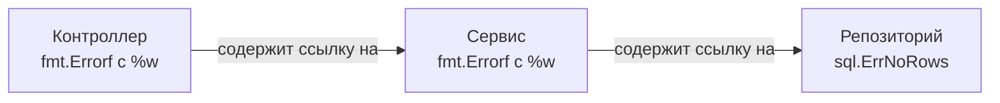

Когда разработчики из мира Java, C# или Python впервые видят код на Go, их главная претензия звучит так: «Почему я должен писать `if err != nil` каждые три строчки? Верните мне `try-catch`!».

Создатели Go намеренно отказались от системы исключений (Exceptions). Исключения ломают линейность выполнения программы (Control Flow). Когда вы вызываете функцию в Java, вы не знаете, вернет ли она значение, или невидимый механизм раскрутки стека (Stack Unwinding) выбросит вас на пять уровней вверх в ближайший `catch`. В высоконагруженных сетевых сервисах такая скрытая логика приводит к утечкам ресурсов, незакрытым коннектам и непредсказуемому поведению.

В Go **ошибка — это просто значение (Error is a value)**. Оно не обладает магией, не прерывает работу приложения, передается через регистры процессора как обычные данные, и разработчик обязан реагировать на него здесь и сейчас.

В этой статье мы разберем внутреннее устройство ошибок, паттерны их оборачивания и самую знаменитую ловушку с `nil`, на которой "валят" кандидатов на собеседованиях.

## 1. Интерфейс error под капотом

В Go нет встроенного сложного класса для ошибок. `error` — это просто встроенный интерфейс с одним единственным методом.

```go
type error interface {
    Error() string
}
```

Любой пользовательский тип, у которого есть метод `Error() string`, автоматически реализует этот интерфейс и может возвращаться как ошибка.

> [!info] Под капотом: Размер интерфейса
> Так как `error` — это интерфейс, под капотом (в рантайме) он представляется структурой `iface`, которая занимает **16 байт** (на 64-битной архитектуре):
> 1. 8 байт — указатель на `itab` (таблицу методов и информацию о конкретном типе).
> 2. 8 байт — указатель на сами данные ошибки (в куче или на стеке).
> 
> Когда функция возвращает `error`, она фактически возвращает эти 16 байт (через регистры, как мы выяснили в статье про функции).

## 2. Создание ошибок и фокус с указателем

Самый простой способ создать ошибку — использовать пакет `errors` или `fmt`.

```go
err1 := errors.New("file not found")
err2 := fmt.Errorf("user %d not found", userID)
```

Давайте заглянем в исходный код стандартной библиотеки `errors`:
```go
package errors

// New возвращает ошибку, форматированную как заданный текст.
func New(text string) error {
    return &errorString{text} // Обратите внимание на амперсанд!
}

type errorString struct {
    s string
}

func (e *errorString) Error() string {
    return e.s
}
```

> [!tip] Собеседование
> **Вопрос:** Почему `errors.New` возвращает **указатель** `&errorString`, а не само значение `errorString`?
> **Ответ:** Ради правильного сравнения (Sentinel Errors). 
> В Go интерфейсы равны, если равны их типы и значения под ними. Если бы функция возвращала значение, то `errors.New("EOF") == errors.New("EOF")` было бы `true` (так как строки равны). 
> Возвращая указатель, мы заставляем Go сравнивать адреса памяти. Каждый вызов `errors.New` выделяет новую память, поэтому две ошибки с одинаковым текстом, созданные в разных местах, никогда не будут равны. Это защищает от ложных срабатываний при сравнении ошибок.

## 3. Классификация ошибок в Go

В идиоматичном Go-коде ошибки делятся на три категории.

### Категория 1: Сигнальные ошибки (Sentinel Errors)
Это глобальные переменные пакета. Они используются для индикации ожидаемых состояний, например, конец файла (`io.EOF`) или отсутствие записи в БД (`sql.ErrNoRows`).

```go
var ErrUserNotFound = errors.New("user not found")

func getUser() error {
    return ErrUserNotFound
}

// Проверка:
if err == ErrUserNotFound {
    // ...
}
```

### Категория 2: Пользовательские типы ошибок (Custom Error Types)
Когда тексту ошибки недостаточно, и нужно передать контекст (например, HTTP статус-код или ID транзакции), создают свои структуры.

```go
type HTTPError struct {
    StatusCode int
    URL        string
    Msg        string
}

func (e *HTTPError) Error() string {
    return fmt.Sprintf("HTTP %d: %s at %s", e.StatusCode, e.Msg, e.URL)
}
```

### Категория 3: Обернутые ошибки (Wrapped Errors)
В микросервисной архитектуре ошибка может пройти через пять слоев абстракции: Репозиторий -> Сервис -> HTTP Контроллер. Если база данных вернет `connection refused`, а каждый слой будет просто возвращать `err`, на верхнем уровне вы получите лог `connection refused` и не поймете, к какой БД и при каком запросе не удалось подключиться.

Исторически разработчики писали: `fmt.Errorf("db fetch: %v", err)`. Но это уничтожало изначальный тип ошибки. Начиная с **Go 1.13**, в язык встроили механизм оборачивания (Wrapping).

```go
// Используем %w (wrap) вместо %v (value)
return fmt.Errorf("не удалось загрузить пользователя %d: %w", userID, err)
```
Оператор `%w` создает скрытый связный список ошибок, сохраняя "Базовую ошибку" и добавляя к ней контекст.



#### Распаковка: errors.Is и errors.As

Поскольку ошибка теперь завернута как капуста, классическое сравнение `if err == sql.ErrNoRows` перестанет работать. Вместо него используются функции:

**1. `errors.Is`** — заменяет оператор `==`. Она рекурсивно "разворачивает" ошибку, вызывая скрытый метод `Unwrap`, и проверяет, есть ли в цепочке нужная сигнальная ошибка.
```go
if errors.Is(err, sql.ErrNoRows) {
    // Выполнится, даже если sql.ErrNoRows была обернута 10 раз
}
```

**2. `errors.As`** — заменяет приведение типов (Type Assertion). Позволяет достать конкретную пользовательскую структуру (Custom Error Type) из цепочки.
```go
var httpErr *HTTPError // Создаем пустой указатель
if errors.As(err, &httpErr) {
    // Если в цепочке был *HTTPError, функция заполнит наш httpErr
    fmt.Println(httpErr.StatusCode)
}
```

## 4. Главная ловушка: Typed Nil (Неявный Nil интерфейс)

Это самый опасный баг, связанный с ошибками. Если вы поймете механику его работы, вы покажете уровень крепкого Middle-инженера. 

Рассмотрим код:

```go
type MyError struct {
    Msg string
}

func (e *MyError) Error() string { return e.Msg }

func doWork() error {
    // Внимание! Мы объявляем переменную конкретного типа указателя
    var err *MyError = nil 
    
    // ...какая-то успешная логика...
    
    return err // Возвращаем nil?
}

func main() {
    err := doWork()
    if err != nil {
        fmt.Println("ПРОИЗОШЛА ОШИБКА!", err)
    } else {
        fmt.Println("УСПЕХ!")
    }
}
```
**Вывод программы:** `ПРОИЗОШЛА ОШИБКА! <nil>`

Как так? Мы вернули `nil`, но проверка `err != nil` выдала `true`!

### Mechanical Sympathy: Разбор полета
Вспомним начало статьи: `error` — это интерфейс (`iface`). Он состоит из двух указателей: `(Type, Data)`.
Интерфейс равен `nil` **только тогда**, когда оба его поля равны `nil` — `(nil, nil)`.

Что происходит при вызове `return err` внутри `doWork`?
Компилятор берет наш `nil` указатель типа `*MyError` и упаковывает его в интерфейс `error`. 
- В поле `Data` он кладет `nil`.
- Но в поле `Type` он кладет ссылку на описание типа `*MyError`!

В итоге `main` получает интерфейс вида `(*MyError, nil)`. 
Проверка `if err != nil` сравнивает `(*MyError, nil)` с `(nil, nil)`. Они не равны! И мы заходим в блок обработки ошибки, где программа вероятнее всего упадет с `panic: nil pointer dereference`, попытавшись прочитать ошибку.

> [!tip] Собеседование
> **Как защититься от ловушки Typed Nil?**
> 1. **Никогда** не объявляйте переменные ошибок как конкретный тип, если вы планируете возвращать их как `error`. 
> 2. Пишите `var err error = nil`.
> 3. Если функция возвращает интерфейс, возвращайте явный литерал `nil`, а не локальную переменную-указатель, в которой случайно оказался `nil`.

Детальнее работу внутреннего устройства интерфейсов и `iface`/`eface` мы будем разбирать в разделе ООП в статье [[24. Интерфейсы под капотом. iface и eface]].

## Итог

1. **Ошибки — это значения**. Они не прерывают выполнение программы и передаются в регистрах CPU как обычные данные.
2. Под капотом `error` — это стандартный 16-байтный интерфейс с одним методом `Error()`.
3. `errors.New` возвращает указатель, чтобы гарантировать корректную работу оператора `==` при сравнении сигнальных ошибок.
4. Оборачивайте ошибки через `%w` для сохранения контекста и используйте `errors.Is` и `errors.As` для их анализа на верхних слоях приложения.
5. Опасайтесь **Typed Nil**: интерфейс, содержащий типизированный `nil` указатель, не равен `nil`.

Ошибки — это штатные ситуации, которые можно (и нужно) обрабатывать: база отвалилась, файл не найден, валидация не пройдена. Но что делать, если происходит фатальный сбой, после которого программа физически не может продолжать работу, например выход за границы массива или разыменование нулевого указателя? 

Здесь на сцену выходит механизм жесткой остановки горутины. В следующей статье [[13. Panic, Recover и stack trace]] мы разберем, как работают паники, как рантайм печатает трейсбэк и как можно безопасно перехватить панику на лету.