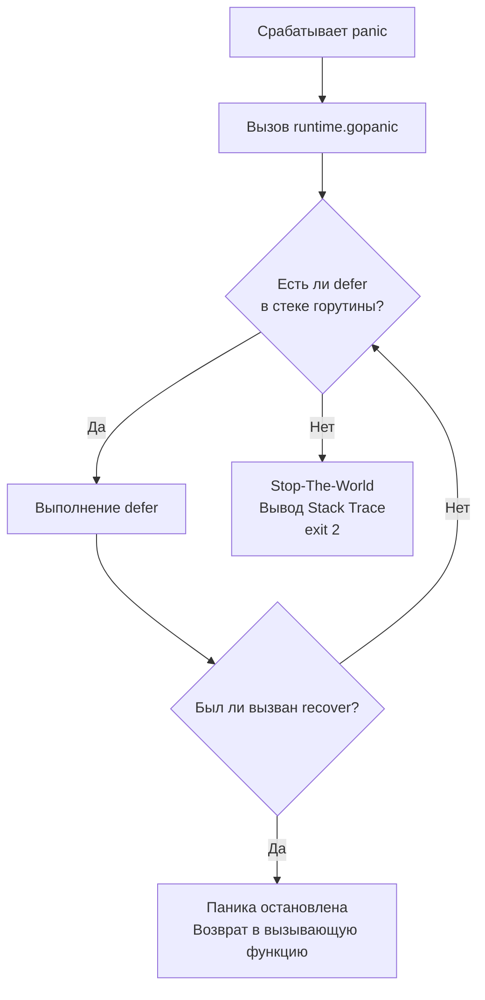

В предыдущей статье мы выяснили, что в Go ожидаемые проблемы (отсутствие файла, таймаут сети) решаются через возврат значений `error`. Но как быть с критическими, невосстановимыми ситуациями? Что делать, если программа пытается обратиться к отрицательному индексу массива или разыменовать нулевой указатель?

В языках вроде Java или Python это вызовет обычное исключение (Exception), которое можно поймать глобальным `try-catch`. В Go для таких ситуаций существует отдельный, гораздо более жесткий механизм — **паника (`panic`)**.

Философия Go близка к паттерну "Let it crash" из Erlang: если в программе произошла логическая ошибка программиста (например, выход за границы слайса), это значит, что состояние памяти может быть скомпрометировано. Лучше немедленно убить процесс, чем позволить ему работать с поврежденными данными и записывать мусор в базу данных.

В этой статье мы разберем механику работы `panic` и `recover` под капотом рантайма, выясним, почему паника в чужой горутине убьет всё ваше приложение, и как рантайм формирует тот самый Stack Trace.

## 1. Анатомия паники (runtime.gopanic)

Паника может быть вызвана двумя способами:
1. **Явно:** вызовом встроенной функции `panic("описание")`.
2. **Неявно (через рантайм ОС или железо):** например, процессор генерирует аппаратное прерывание `SIGSEGV` при обращении к недоступной памяти (nil pointer). Рантайм Go перехватывает этот сигнал ОС на низком уровне и превращает его в вызов паники.

> [!info] Под капотом: Что делает panic
> Когда вызывается паника, управление передается в функцию `runtime.gopanic`. 
> Текущая горутина (структура `g`) имеет внутренний связный список всех объявленных отложенных вызовов (поле `_defer`). 
> `gopanic` начинает "раскручивать стек" (Stack Unwinding):
> 1. Он берет последний добавленный в список `defer` и выполняет его.
> 2. Если внутри этого `defer` нет вызова `recover()`, рантайм переходит к следующему `defer` (по принципу LIFO, как мы разбирали в [[11. Именованные возвращаемые значения и defer]]).
> 3. Если отложенные функции закончились, а паника не была перехвачена, `gopanic` вызывает остановку всего мира (Stop-The-World), выводит Stack Trace в `stderr` и завершает процесс с кодом `exit(2)`.



## 2. Recover: Ловец падений

Встроенная функция `recover()` позволяет остановить процесс раскрутки стека при панике и вернуть значение, которое было передано в `panic`. 

**Фундаментальное правило:** `recover()` имеет смысл вызывать **только напрямую внутри отложенной функции (defer)**. Вызов `recover()` в обычном потоке управления всегда вернет `nil` и не даст никакого эффекта.

### Идиоматичный перехват и конвертация в error

Часто внутри библиотек (например, при парсинге сложных AST-деревьев) удобнее использовать паники для быстрого прерывания глубокой рекурсии. Но наружу, пользователю библиотеки, должна вернуться обычная ошибка. 

```go
func ParseData() (err error) {
    defer func() {
        if r := recover(); r != nil {
            // Перехватили панику и превратили её в обычную ошибку!
            err = fmt.Errorf("ошибка парсинга: %v", r)
        }
    }()
    
    // ... глубокая логика парсинга, которая может вызвать panic ...
    return nil
}
```

> [!warning] Ловушка / Gotcha: Тонкости вызова recover
> `recover()` должен вызываться **непосредственно** в первой функции, указанной в `defer`. 
> 
> ```go
> // ТАК РАБОТАТЬ НЕ БУДЕТ:
> defer func() {
>     catchPanic() // recover спрятан внутри другой функции
> }()
> 
> func catchPanic() {
>     recover() // Вернет nil, паника не остановится!
> }
> ```
> Под капотом `runtime.gorecover` проверяет, совпадает ли адрес текущей функции с адресом функции, которая была непосредственно вызвана механизмом `defer`. Если мы ушли "вглубь" стека вызовов, `recover` блокируется, чтобы предотвратить случайный или злонамеренный перехват паник из глубоких сторонних библиотек.

## 3. Границы горутин: Смертельная ловушка

Это самый важный вопрос про паники на любом собеседовании. 
**`recover()` может перехватить панику только в рамках той горутины, в которой она произошла.**

Если вы создаете новую горутину, и в ней случается `panic`, никакой `try-catch` или `defer recover` в вызывающей горутине (включая `main`) её не спасет. Паника немедленно уничтожит весь процесс приложения со всеми сотнями тысяч других работающих горутин.

```go
func main() {
    // Этот defer НИКАК не поможет от паники в другой горутине!
    defer func() {
        if r := recover(); r != nil {
            fmt.Println("Поймали:", r)
        }
    }()

    go func() {
        // Эта паника убьет всё приложение
        panic("boom!") 
    }()

    time.Sleep(1 * time.Second)
}
```

### Как с этим бороться в бэкенде?
В продакшене любая горутина, которая исполняет фоновую задачу (например, обработку сообщений из Kafka), **обязана** иметь свой собственный `defer recover()`.

```go
go func() {
    defer func() {
        if r := recover(); r != nil {
            log.Printf("Паника в фоновом воркере поймана: %v", r)
            // Возвращаем горутину в пул или аккуратно завершаем
        }
    }()
    
    // Выполнение бизнес-логики...
}()
```
*(Подробнее об управлении жизненным циклом фоновых задач мы будем говорить в [[34. Горутины. Легковесная конкурентность в Go]])*.

> [!info] Под капотом: net/http и паники
> Если вы пишете стандартный HTTP-сервер на Go (пакет `net/http`), вы могли заметить, что паника в одном обработчике не роняет весь сервер. Пользователь получает ответ `HTTP 500`, а сервер продолжает работать. 
> Почему? Потому что стандартная библиотека заботливо оборачивает вызов **каждого** HTTP-хендлера в невидимый `defer recover()`. Однако, если внутри своего хендлера вы запустите новую `go func()`, эта защита уже не сработает.

## 4. Как формируется Stack Trace

Когда паника не перехвачена, рантайм печатает "След стека" (Stack Trace) и убивает программу. Для бэкендера умение читать этот выхлоп — базовый навык выживания.

Как рантайм узнает, на какой строке какого файла упал код?
Скомпилированный бинарник Go содержит специальную секцию таблиц (аналог DWARF), которая мапит машинные инструкции (Program Counters - PC) на строки исходного кода.

Процесс `runtime.traceback` проходит по стеку текущей горутины (читая регистры `RSP`/`RBP`) от текущего фрейма до самого начала (функции `main` или `goexit`).

```text
panic: runtime error: index out of range [5] with length 3

goroutine 1 [running]:
main.process(0xc0000100a0, 0x3, 0x3)
        /app/main.go:15 +0x45
main.main()
        /app/main.go:10 +0x34
```

**Как читать эту сводку:**
1. **Причина:** `index out of range...`
2. **Горутина:** ID горутины (тут `1`) и её состояние (`running`).
3. **Функция:** `main.process` — где именно упали.
4. **Аргументы (в HEX):** `(0xc0000100a0, 0x3, 0x3)`. Это физические значения в регистрах/на стеке в момент паники. В данном случае это параметры слайса (указатель на массив, длина 3, вместимость 3).
5. **Файл и строка:** `/app/main.go:15`.
6. **Смещение:** `+0x45` — это смещение в байтах от начала скомпилированной функции `main.process` до конкретной ассемблерной инструкции, на которой мы упали.

### Переменная окружения GOTRACEBACK
По умолчанию при панике Go выводит трейсбэк только для той горутины, которая упала. В распределенных системах бывает полезно посмотреть, чем занимались остальные треды в этот момент. Вы можете управлять этим через переменную окружения `GOTRACEBACK`:
- `GOTRACEBACK=single` (по умолчанию): только упавшая горутина.
- `GOTRACEBACK=all`: выводит стек всех пользовательских горутин.
- `GOTRACEBACK=system`: выводит стек всех горутин, включая скрытые системные воркеры рантайма (сборщик мусора, netpoller).
- `GOTRACEBACK=crash`: выводит всё и создает системный дамп ядра (core dump) ОС для глубокого дебага в `dlv` или `gdb`.

## 5. Идиоматика: Когда паниковать можно?

Новички часто спрашивают: "Если паника это плохо, зачем вообще нужен `panic`?" 
В идиоматичном Go есть ровно два случая, когда использование `panic` (или встроенных оберток вроде `Must`-функций) оправдано:

1. **Инициализация приложения (Startup / func init).**
   Если при запуске сервиса вы не можете прочитать конфигурационный файл, скомпилировать критически важное регулярное выражение (`regexp.MustCompile`) или подключиться к основной БД, нет смысла пытаться "восстановиться" и работать дальше. Лучше упасть сразу с громкой паникой (`Fast Fail`).
2. **Недостижимый код и нарушения инварианта.**
   Если по логике вашего кода (state-машины) вы оказались в ветке `switch`, которая физически не должна быть достижима, это означает фатальный баг в архитектуре. В таком `default` блоке смело ставьте `panic("unreachable state")`.

## Итог

1. **`panic`** — это механизм остановки программы при критических ошибках, разрушающих состояние памяти. Это не аналог `throw Exception`.
2. **`recover()`** работает исключительно внутри прямого вызова в `defer`. Он возвращает управление и данные паники.
3. **Изоляция:** Паника убивает весь процесс ОС. `recover` не может поймать панику, запущенную в дочерней горутине.
4. Рантайм строит **Stack Trace**, связывая адреса инструкций в памяти с таблицами отладки, хранящими номера строк.
5. Соблюдайте идиоматику: бизнес-ошибки (нет денег на счету, неверный пароль) — это возврат `error` (см. [[12. Обработка ошибок через error]]). Ошибки разработчика (выход за границы массива) или провалы на старте сервера — это `panic`.

Мы разобрали механизмы Control Flow и обработки нестандартных ситуаций. Теперь мы переходим к самому фундаментальному понятию, необходимому для написания высокопроизводительного кода. В следующей статье [[14. Указатели в Go]] мы поговорим о том, как работать с памятью напрямую, как избежать утечек и что такое Escape Analysis, который определяет, будет ли ваша переменная жить на быстром стеке или переедет в тяжелую кучу.