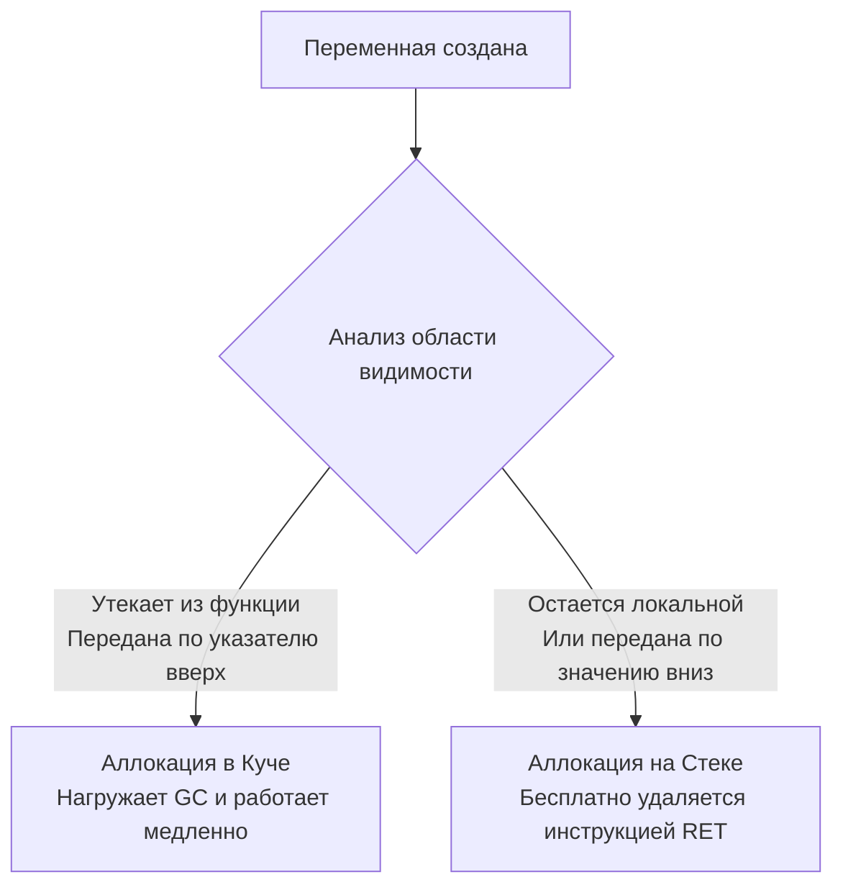

Если вы пришли из C или C++, слово «указатель» может вызывать у вас ассоциации с адресной арифметикой, утечками памяти (memory leaks), висячими указателями (dangling pointers) и знаменитой ошибкой `Segmentation fault`. Если же ваш бэкграунд — Java, C# или PHP, то вы привыкли работать со «ссылками», когда рантайм полностью скрывает от вас физическое расположение объектов в памяти.

Go выбирает золотую середину. Указатели в Go — это мощный инструмент для контроля над памятью (как в C++), но они сделаны **безопасными**. В Go запрещена адресная арифметика: вы не можете прибавить `1` к указателю, чтобы "перепрыгнуть" на соседние байты в памяти (если не используете специальный пакет `unsafe`). 

В этой статье мы разберем, как физически устроены указатели, почему возврат локальной переменной по указателю не "взрывает" программу (привет, Escape Analysis) и почему слепая передача всего по указателю "ради оптимизации" — это главная ошибка Middle-разработчиков, убивающая производительность бэкенда.

## Физика указателя

Переменная любого типа — это участок физической памяти. Указатель — это просто переменная, которая хранит **адрес** этого участка. 

На 64-битной архитектуре (amd64, arm64) любой указатель всегда занимает ровно **8 байт** (64 бита), независимо от того, указывает ли он на крошечный `int8` или на гигантскую структуру размером в мегабайт.

В Go используются два оператора:
- `&` (Амперсанд) — операция взятия адреса. "Где лежит эта переменная?"
- `*` (Звездочка) — операция разыменования. "Прочитай или запиши данные по этому адресу."

```go
func main() {
    var x int = 42
    var p *int = &x // p теперь хранит адрес x (например, 0xc0000100a8)
    
    *p = 100 // Разыменовываем p и меняем значение по этому адресу
    fmt.Println(x) // Выведет 100
}
```

> [!info] Под капотом: Mechanical Sympathy
> Когда процессор видит инструкцию изменения по указателю `*p = 100`, он берет 8 байт (адрес) из регистра CPU (например, RAX), отправляет этот адрес в контроллер памяти (через шину адреса), находит нужную кэш-линию L1/L2 и меняет в ней биты. Если этой кэш-линии нет в кэше процессора, происходит **Cache Miss**, и CPU простаивает сотни тактов, ожидая данные из медленной оперативной памяти (RAM).

## Escape Analysis: Сердце управления памятью Go

Это самая важная концепция в этой статье. Понимание алгоритма Escape Analysis отличает Junior-разработчика от Senior.

Рассмотрим классический код, за который в C/C++ вас уволят:

```go
func NewUser(name string) *User {
    u := User{Name: name}
    // Возвращаем указатель на ЛОКАЛЬНУЮ переменную
    return &u 
}
```

В C/C++ локальная переменная `u` живет во фрейме стека (Stack Frame) функции `NewUser`. Как только функция завершается, её стек помечается как свободный. Возвращенный указатель становится висячим (Dangling Pointer). При попытке обратиться к нему программа получит мусорные данные или упадет.

Но в Go этот код **абсолютно безопасен и идиоматичен**. Почему?
Во время компиляции Go запускает алгоритм **Escape Analysis (Анализ побега)**. Компилятор строит граф потока данных и видит: *"Ага, указатель на переменную `u` возвращается из функции и уходит во внешний мир. Она не может жить на стеке!"*. 

Компилятор автоматически переносит (promotes) аллокацию переменной `u` со стека в **Кучу (Heap)**.



> [!tip] Собеседование
> **Вопрос:** Как проверить, куда аллоцируется переменная — на стек или в кучу?
> **Ответ:** Запустить сборку с флагом вывода решений компилятора: `go build -gcflags="-m" main.go`. Вы увидите сообщения вида `moved to heap: u` или `escapes to heap`.

## Миф: "Передавать по указателю всегда быстрее"

Главная ошибка разработчиков, приходящих из PHP/Java — создавать указатели на всё подряд, думая, что это спасет память от лишних копирований (ведь скопировать 8 байт адреса быстрее, чем 100 байт структуры, верно?).

В языках с ручным управлением или VM это может быть правдой. В Go — **это убивает производительность**.

Давайте разберем механику (Mechanical Sympathy):
1. **Давление на Garbage Collector (GC Pressure):** Стек очищается мгновенно и бесплатно при выходе из функции. Куча (Heap) требует работы Сборщика Мусора. Передавая указатель, вы часто заставляете переменную "утечь" в кучу. Больше объектов в куче -> чаще включается GC -> больше пауз (Stop-The-World) -> выше CPU utilization.
2. **Кэш-промахи (Cache Misses):** Обращение к данным по значению (на стеке или в массиве) — это линейное чтение памяти. Процессор это обожает (работает Prefetcher). Обращение по указателю в кучу — это случайный прыжок в памяти. Это гарантированный промах мимо L1/L2 кэша.

**Эвристика для бэкендера:**
- Передавайте по указателю только если вам нужно **мутировать** (изменить) оригинальное состояние объекта.
- Передавайте по значению (копией), если структура небольшая (до ~64-128 байт — это 1-2 кэш-линии процессора). Скопировать 64 байта в регистрах CPU занимает доли наносекунды, это в сотни раз дешевле, чем нагружать Сборщик Мусора и прыгать по куче.
- Используйте указатели для огромных структур (например, буфер в несколько килобайт), чтобы избежать реально тяжелого копирования памяти.

## Вызов методов на nil-указателе

Еще одна специфика Go, на которой часто "ловят" кандидатов.
В Go нулевое значение (Zero Value) для указателя — это `nil`. Если вы попытаетесь разыменовать `nil` (написать `*p`), рантайм выбросит панику (`nil pointer dereference`).

Но что будет, если вызвать метод на nil-указателе?

```go
type User struct {
    Name string
}

func (u *User) Greet() {
    if u == nil {
        fmt.Println("Я безымянный призрак")
        return
    }
    fmt.Println("Привет, " + u.Name)
}

func main() {
    var u *User = nil
    u.Greet() // Упадет ли здесь паника?
}
```

Паники **не будет**! Программа выведет `"Я безымянный призрак"`.

> [!info] Под капотом
> Как мы обсуждали в статье про функции, методы в Go — это просто функции, где `receiver` (получатель) является первым скрытым аргументом. 
> Вызов `u.Greet()` компилятор превращает в `User.Greet(u)`. 
> Передача `nil` в качестве аргумента функции абсолютно легальна. Паника возникает только тогда, когда внутри метода вы попытаетесь обратиться к полю (например, прочитать `u.Name`), потому что это требует физического разыменования памяти (обращения по адресу 0x0).

## Пакет unsafe: Обход системы типов

Хотя Go запрещает адресную арифметику, язык предоставляет инструмент для системного программирования (написания драйверов, сериализаторов или взаимодействия с Си-кодом) — пакет `unsafe`.

Специальный тип `unsafe.Pointer` позволяет привести указатель любого типа к указателю любого другого типа, а тип `uintptr` (целочисленное представление адреса) позволяет выполнять математические операции над адресами.

```go
import "unsafe"

func main() {
    arr :=[2]int{10, 20}
    
    // Получаем адрес первого элемента массива
    ptr := unsafe.Pointer(&arr[0])
    
    // Прибавляем к адресу 8 байт (размер int на 64-bit), чтобы перейти ко второму элементу.
    // Для математики приводим к uintptr, затем обратно в unsafe.Pointer и в *int
    nextPtr := (*int)(unsafe.Pointer(uintptr(ptr) + unsafe.Sizeof(arr[0])))
    
    fmt.Println(*nextPtr) // Выведет 20
}
```

**Золотое правило бэкендера:** Никогда не используйте `unsafe`, если вы не пишете библиотеку сериализации (типа `encoding/json`), аллокатор или пакет для работы с сырыми syscall'ами. `uintptr` невидим для Garbage Collector'а. Если сборщик мусора решит переместить стек горутины в памяти (а он это делает при росте стека), ваш `uintptr` продолжит указывать на старый (инвалидный) адрес памяти, что приведет к катастрофическому падению продакшена, которое невозможно отладить.

## Итог

1. **Размер:** Указатель всегда занимает 8 байт на 64-битной архитектуре и хранит виртуальный адрес памяти.
2. **Escape Analysis:** Компилятор Go сам решает, где будет жить переменная. Возврат локальной переменной по указателю безопасен — переменная автоматически "убежит" (escape) в кучу.
3. **Производительность:** Передача малых/средних структур по значению (по копии) почти всегда быстрее передачи по указателю, так как спасает кэш-линии процессора и не нагружает Garbage Collector.
4. **Безопасность:** Методы можно вызывать на `nil`-указателях, но попытка прочитать из них данные вызовет панику.
5. **Магия:** Адресная арифметика запрещена, но доступна через "темную магию" пакета `unsafe`.

Мы научились работать с указателями и адресами памяти. Теперь пора посмотреть, как эта память организуется в непрерывные блоки для хранения множества элементов. В следующей статье [[15. Массивы и их особенности]] мы разберем жесткие массивы Go, поймем, почему они передаются по значению и почему в реальном коде вы почти никогда не будете их использовать напрямую.