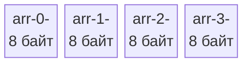

В динамических языках (Python, PHP, JavaScript) слово «массив» обычно означает эластичную структуру, в которую можно бесконечно добавлять элементы разных типов. Если вы пришли из C или C++, массив для вас — это указатель на первый элемент непрерывного блока памяти.

В Go массив — это абсолютно жесткая, монолитная и неизменяемая по размеру структура данных. В реальном продакшен-коде на Go вы редко будете объявлять массивы напрямую, предпочитая им их гибкую обертку — слайсы (slices). Однако без глубокого понимания физики массивов невозможно понять, как работают слайсы, почему возникают утечки памяти и как оптимизировать код для максимальной производительности.

Массив — это фундамент. Давайте разберем, как он работает на уровне железа.

## Длина — это часть типа

Фундаментальное правило массивов в Go: **размер массива зашит в его тип на этапе компиляции**.

Типы `[3]int` и `[5]int` для компилятора Go — это **два совершенно разных типа**, точно так же, как `int` и `string`. Вы не можете присвоить один массив другому или передать `[3]int` в функцию, которая ожидает `[5]int`.

```go
var a[3]int
var b [5]int

// a = b // Ошибка компиляции! Cannot use 'b' (type [5]int) as type [3]int
```

Благодаря этой жесткости компилятор точно знает, сколько байт памяти нужно выделить на стеке (или в куче) для каждой переменной еще до запуска программы.

### Синтаксис инициализации
```go
// Массив инициализирован нулями (Zero Values)
var zeros [5]int 

// Инициализация с конкретными значениями
primes := [4]int{2, 3, 5, 7}

// Компилятор сам посчитает длину благодаря оператору [...]
magic := [...]string{"Go", "Rust", "C++"} // Тип будет выведен как [3]string

// Инициализация по индексам (остальные элементы будут 0)
sparse := [10]int{0: 42, 9: 100} 
```

## Mechanical Sympathy: Идеальная структура для CPU

С точки зрения железа, массив в Go — это идеальная структура данных. В памяти он представляет собой непрерывный блок байт, где элементы лежат строго друг за другом без каких-либо дополнительных метаданных, указателей или заголовков.

Если вы объявляете `var arr [4]int64`, компилятор выделит ровно 32 байта (4 * 8 байт). 



> [!info] Под капотом: CPU Prefetcher
> Почему непрерывность так важна? В современных процессорах есть блок предвыборки (Hardware Prefetcher). Когда ваш цикл обращается к `arr[0]`, контроллер памяти загружает в кэш L1 целую кэш-линию (обычно 64 байта). Prefetcher видит паттерн линейного чтения и заранее, в фоне, подгружает следующие кэш-линии из RAM, пока процессор обрабатывает текущие данные. 
> Итерация по массиву (или слайсу) — это самая быстрая операция, которую может выполнить ваш сервер. Обращение к элементам связного списка или глубокого графа объектов (где каждый элемент разбросан по куче) будет в десятки раз медленнее из-за постоянных Cache Misses.

## Массивы передаются по значению

В языке C имя массива автоматически распадается (decays) до указателя на его первый элемент. При передаче массива в функцию C вы передаете легкий указатель (8 байт).

**В Go массивы — это значения (Value Semantics).**
Когда вы присваиваете массив другой переменной или передаете его в функцию, Go делает **полную побитовую копию всего массива**.

```go
func modify(arr [3]int) {
    arr[0] = 999 // Меняем КОПИЮ
}

func main() {
    original := [3]int{1, 2, 3}
    modify(original)
    fmt.Println(original[0]) // Выведет 1, оригинал не изменился!
}
```

> [!warning] Ловушка / Gotcha: Скрытое копирование
> Если у вас есть массив `var data[1000000]int` (занимающий ~8 Мегабайт памяти), и вы передадите его в функцию по значению, рантайм Go скопирует все 8 МБ на стек вызываемой функции. Это не только съест такты процессора на копирование через регистры SIMD, но и может привести к переполнению начального стека горутины, спровоцировав тяжелую операцию его расширения (Stack Growth).

Как избежать копирования, если вам нужно передать массив? Передавать указатель на массив: `*[3]int`. Но, как мы увидим в следующей статье, в 99% случаев для этого используются слайсы.

```go
// Передача указателя на массив
func modifyPtr(arr *[3]int) {
    arr[0] = 999 
    // В Go не нужно писать (*arr)[0], синтаксис позволяет обращаться к индексу напрямую
}
```

## Где массивы реально используются?

Если слайсы так удобны, зачем нужны массивы в повседневном коде бэкенд-разработчика?

1. **Криптография и Хеширование:**
   Большинство криптографических алгоритмов возвращают фиксированный размер данных. Например, функция `sha256.Sum256` из стандартной библиотеки возвращает именно массив `[32]byte`, а не слайс. Пакет `uuid` (например, `github.com/google/uuid`) хранит UUID внутри структуры как `[16]byte`. Это дает абсолютную гарантию, что размер хеша не изменится в рантайме.

2. **Избавление от аллокаций (Zero Allocation):**
   Поскольку длина массива известна на этапе компиляции, компилятор легко размещает локальные массивы на дешевом стеке. Создание слайса часто (хоть и не всегда) требует выделения памяти в куче. Если вам нужен временный буфер фиксированного размера (например, для чтения чанков из файла или сокета), массив `[4096]byte` на стеке не создаст никакой нагрузки на Garbage Collector.

3. **Базовый слой для слайсов:**
   Вы не можете создать слайс в вакууме. Под капотом любого слайса **всегда** лежит скрытый массив.

> [!tip] Собеседование
> **Вопрос:** Вы написали `a := [3]int{1, 2, 3}` и `b := [3]int{1, 2, 3}`. Можно ли сравнить их через `a == b`? А если это слайсы?
> **Ответ:** Массивы можно сравнивать через `==`, если элементы массива поддерживают сравнение (например, числа). Компилятор сравнит их побитово. Слайсы сравнивать через `==` **запрещено** (кроме сравнения с `nil`), потому что они являются ссылочными типами данных со скрытой структурой, и рантайм не знает, хотите вы сравнить их указатели или сами данные.

## Итог

1. **Длина — часть типа.** Массив фиксирован. `[3]int` нельзя передать туда, где ожидается `[4]int`.
2. **Память:** Это непрерывный блок байт, обеспечивающий идеальную механическую симпатию и использование кэшей процессора.
3. **Value Semantics:** Присвоение и передача в функцию создают полную побитовую копию всего массива. Не передавайте мегабайтные массивы по значению!
4. **Прагматизм:** В чистом виде используются для криптографии, низкоуровневых буферов и оптимизаций на стеке.

Массив — это сырой блок бетона. Работать с ним напрямую безопасно, но неудобно. Чтобы строить гибкие приложения, создатели Go придумали гениальную структуру — легковесное "окно", которое смотрит на этот бетонный блок. 

В следующей статье мы переходим к королю структур данных в Go: [[16. Slice. Главная структура данных в Go]]. Вы узнаете, как слайс обходит ограничения массивов, из чего он состоит физически и как работают встроенные функции работы с ним.