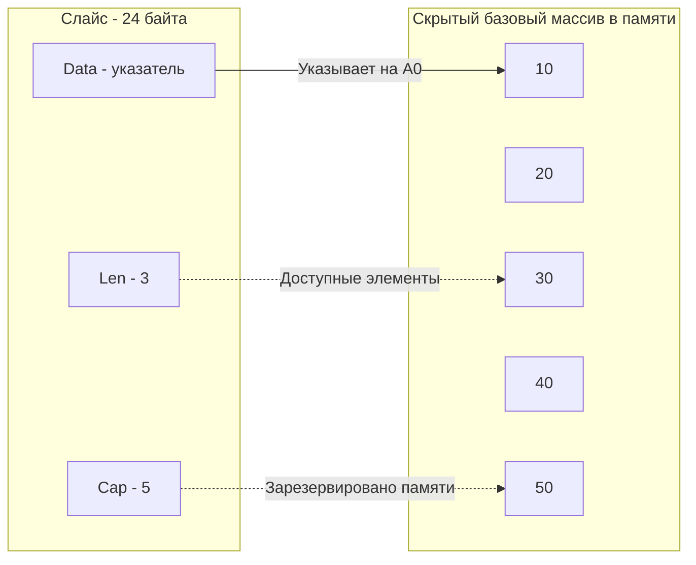

Как мы выяснили в статье [[15. Массивы и их особенности]], массивы в Go — это монолитные блоки памяти фиксированного размера. Их длина зашита в тип. На практике писать код, где каждая функция жестко привязана к размеру массива `[10]int`, было бы пыткой.

Для решения этой проблемы в Go существует **слайс (slice, срез)**. Это самая часто используемая структура данных в языке. Если вы приходите из C++, то можете ошибочно подумать, что слайс — это `std::vector`. Если из Java — что это `ArrayList`.

Но слайс в Go работает иначе. Слайс — это не динамический массив сам по себе. Это легковесное "окно" (или дескриптор), которое смотрит на базовый массив (backing array). Понимание этой концепции убережет вас от диких утечек памяти и багов с неявной перезаписью данных.

## Структура SliceHeader под капотом

С точки зрения рантайма Go, слайс — это маленькая структура из трех полей. Если заглянуть в стандартный пакет `reflect`, мы увидим её объявление:

```go
type SliceHeader struct {
    Data uintptr
    Len  int
    Cap  int
}
```

На 64-битной архитектуре каждое поле занимает 8 байт. Итого **любой слайс всегда весит ровно 24 байта**, независимо от того, лежит в нем один элемент или миллион.

1. `Data` — указатель на первый элемент базового жесткого массива, до которого дотягивается этот слайс.
2. `Len` (Length) — логическая длина слайса. Сколько элементов доступно нам прямо сейчас. Возвращается встроенной функцией `len(s)`.
3. `Cap` (Capacity) — физическая вместимость. Сколько элементов реально выделено в памяти базового массива, начиная от указателя `Data` и до конца массива. Возвращается функцией `cap(s)`.



## Операция среза (Slicing)

Слайс называется "срезом", потому что он может отрезать кусок от существующего массива (или другого слайса). Синтаксис: `array[start:end]`.

> [!warning] Ловушка / Gotcha: Математика индексов
> В выражении `[start:end]` левая граница включается, а правая — **не включается**. Длина нового слайса вычисляется по формуле `end - start`. Смещение всегда считается в элементах, а не в байтах.

```go
arr := [5]int{10, 20, 30, 40, 50} // Это жесткий массив

// Создаем слайс, который смотрит на элементы с индексами 1 и 2
s := arr[1:3]
```

Что произойдет в памяти?
- `Data` слайса `s` будет указывать на элемент `arr[1]` (значение 20).
- `Len` будет равен 2 (`3 - 1`).
- `Cap` будет равен 4. Почему? Потому что от `arr[1]` до конца базового массива `arr` осталось ровно 4 элемента (20, 30, 40, 50).

> [!info] Под капотом: Mechanical Sympathy
> Создание слайса из массива — это молниеносная операция. Она выполняется за $O(1)$ и не копирует никакие данные из массива. Компилятор просто записывает 24 байта (новый дескриптор `SliceHeader`) на стек горутины, высчитывая указатель со смещением. Это одна из причин, почему Go такой быстрый при парсинге текстов или байтовых потоков.

## Инициализация: Nil vs Empty Slice

Вы можете создать слайс "с нуля", без явного массива. Но здесь скрыт один из самых любимых вопросов на собеседованиях.

В чем разница между этими двумя объявлениями?
```go
var s1 []int         // Подход 1
s2 :=[]int{}        // Подход 2
s3 := make([]int, 0) // Подход 3 -аналогичен 2-
```

С точки зрения работы кода (если вы сделаете `append` или проверите `len`) — разницы почти нет. Но с точки зрения работы с памятью разница колоссальна.

### 1. Nil-слайс (var s1[]int)
Это идиоматичный способ объявления пустого слайса в Go.
- `Data = nil`
- `Len = 0`
- `Cap = 0`

**Никакой памяти не выделено.** Слайс абсолютно бесплатен. Он равен `nil` при проверке `s1 == nil`. Встроенная функция `append` прекрасно умеет работать с `nil`-слайсом, она сама выделит память при первом добавлении.

### 2. Пустой слайс (s2 :=[]int{})
Это слайс с нулевой длиной, но он **не равен nil**.
- `Data = 0x...` (Указывает на специальный адрес в памяти — `zerobase`)
- `Len = 0`
- `Cap = 0`

Рантайм Go содержит специальную крошечную глобальную переменную `zerobase`. Все пустые аллокации в Go (слайсы без вместимости, структуры без полей `struct{}`) указывают на этот единственный адрес в памяти, чтобы не аллоцировать новые байты в куче. 
Тем не менее, использование `[]int{}` менее идиоматично. Например, сериализатор `encoding/json` для `nil`-слайса выведет `null`, а для пустого слайса выведет `[]`.

> [!tip] Собеседование
> **Вопрос:** Вы пишете `var users[]User`. Безопасно ли сразу делать `users = append(users, newUser)`?
> **Ответ:** Да, абсолютно безопасно. Идиоматичный Go призывает использовать `var s[]T` (nil-slice) по умолчанию. Функция `append` под капотом проверяет указатель на `nil` и сама аллоцирует массив через рантайм, если это необходимо.

## Функция make и преаллокация

Если вы заранее знаете, сколько элементов будет в слайсе (например, мапите данные из БД или делаете трансформацию списка), **всегда** используйте функцию `make`.

```go
// Создаст слайс- Len = 5, Cap = 5, заполненный нулями.
s1 := make([]int, 5) 

// Создаст слайс- Len = 0, Cap = 100.
s2 := make([]int, 0, 100)
```

Второй подход (`Len=0, Cap=100`) — это золотой стандарт бэкендера. Вы заранее просите рантайм выделить в куче непрерывный кусок памяти под 100 элементов. При вызовах `append` слайс будет просто инкрементировать `Len` (операция сложения в регистре CPU) и записывать данные в уже выделенную память. Это спасает процессор от дорогих системных вызовов аллокации (reallocation) и работы Garbage Collector'а.

## Передача слайса в функцию

Помните правило из статьи про функции? **В Go всё передается по значению**.
Слайс не исключение. Когда вы передаете слайс в функцию, копируется его структура `SliceHeader` (те самые 24 байта).

```go
func modify(s[]int) {
    s[0] = 999 // Изменит оригинал! -указатель Data смотрит на общую память-
    s = append(s, 42) // А вот это изменение длины оригинал не увидит!
}

func main() {
    nums :=[]int{1, 2, 3}
    modify(nums)
    fmt.Println(nums) // Выведет -999, 2, 3-. Элемента 42 здесь нет!
}
```

**Почему так происходит?**
Функция `modify` получила **копию** дескриптора (24 байта). Когда мы пишем `s[0] = 999`, процессор идет по скопированному указателю `Data` в общую память массива и меняет там байты. 
Но когда мы делаем `append(s, 42)`, встроенная функция `append` возвращает **новый** дескриптор слайса с `Len = 4`. Этот новый дескриптор перезаписывает локальную копию `s` внутри `modify`. Оригинальный слайс `nums` в `main` ничего об этом не знает, его `Len` так и остался равен 3.

## Итог

1. **Слайс — это окно**. Он не хранит данные сам, а лишь ссылается на скрытый жесткий массив через дескриптор `SliceHeader` (24 байта).
2. **Передача по значению**. Передавая слайс в функцию, вы передаете копию дескриптора. Вы можете менять существующие элементы, но `append` внутри функции не изменит длину слайса снаружи (без явного возврата значения через `return`).
3. **Nil-слайсы**. Используйте `var s[]T` для инициализации пустых коллекций. Это не требует аллокаций памяти и абсолютно безопасно для работы.
4. **Преаллокация**. Всегда используйте `make([]T, 0, cap)`, если знаете конечный объем данных, чтобы избежать переаллокаций в рантайме.

Мы затронули базовую механику слайсов, но намеренно не углубились в самую сложную часть: что происходит, когда место (`Cap`) в базовом массиве заканчивается? Как функция `append` решает, сколько новой памяти выделить? Что такое "Memory Leak" при слайсинге и почему слайс может годами удерживать гигабайты мусора? Все эти хардкорные низкоуровневые механизмы мы препарируем в следующей статье: [[17. Slice под капотом. len, cap, append и realloc]].