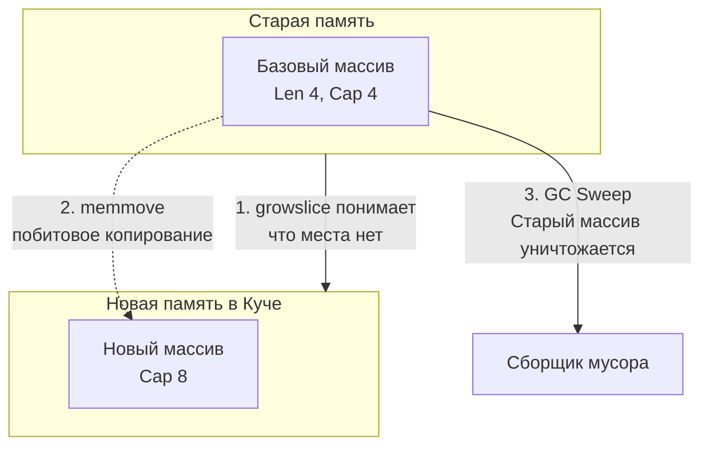

В прошлой статье мы остановились на том, что слайс — это всего лишь 24-байтная структура (`SliceHeader`), которая указывает на скрытый базовый массив. Но эта элегантная абстракция скрывает под собой один из самых сложных механизмов рантайма Go — алгоритм динамического роста. 

Именно на непонимании того, как работает встроенная функция `append` и как Сборщик Мусора (GC) смотрит на слайсы, бэкенд-разработчики теряют гигабайты оперативной памяти в продакшене. 

В этой статье мы спустимся в исходники рантайма (`runtime/slice.go`), разберем физику переаллокации (realloc) и изучим два главных паттерна утечек памяти при работе со слайсами.

## Анатомия функции append

Встроенная функция `append(slice, elements...)` работает в двух режимах: "быстром" (fast path) и "медленном" (slow path).

### Fast Path: Места хватает (Len < Cap)
Если в скрытом массиве есть зарезервированное место (свободная вместимость), `append` работает со скоростью света.

1. Рантайм проверяет: `Cap - Len >= количество добавляемых элементов`.
2. Если да, процессор просто записывает новые данные в следующую ячейку памяти базового массива.
3. Логическая длина (`Len`) в 24-байтном дескрипторе увеличивается.
4. Возвращается обновленный `SliceHeader`.

Это $O(1)$ операция, которая идеально ложится в кэш-линии процессора. Никаких системных вызовов, никакой работы с аллокатором кучи.

### Slow Path: Массив заполнен (Len == Cap)
Когда физическое место в базовом массиве заканчивается, `append` больше не может записывать данные — это привело бы к повреждению памяти других переменных (buffer overflow). 
В этот момент рантайм переходит в "медленный путь" и вызывает внутреннюю функцию `runtime.growslice`.

## runtime.growslice: Физика переаллокации

Функция `growslice` делает самую тяжелую работу. Процесс переаллокации (reallocation) состоит из четырех шагов:

1. **Вычисление новой вместимости (Cap)** по хитрому алгоритму.
2. **Аллокация:** Запрос у менеджера памяти нового, более крупного непрерывного блока памяти.
3. **Копирование (memmove):** Побитовое копирование всех старых данных в новый массив.
4. **Очистка:** Старый массив остается в памяти сиротой. В будущем Garbage Collector найдет его и удалит.



>[!info] Под капотом: Функция memmove
> Копирование данных в Go происходит не обычным циклом `for`. Рантайм использует функцию `runtime.memmove`, которая написана на чистом ассемблере под каждую архитектуру (amd64, arm64). Она использует широкие векторные регистры процессора (SIMD, AVX) для перемещения данных кусками по 32 или 64 байта за один такт. Это очень быстро, но если вы копируете слайс размером в 100 МБ, это всё равно надолго заблокирует текущую горутину и создаст всплеск потребления RAM (в момент копирования в памяти будут лежать и старые 100 МБ, и новые 200 МБ).

### Алгоритм роста (Как меняется Cap?)
Часто на собеседованиях говорят: *"Слайс увеличивается в 2 раза"*. **Это устаревший ответ.** 

Начиная с **Go 1.18**, алгоритм плавного роста изменился для предотвращения резких скачков аллокаций.
Порог (threshold) теперь равен **256 элементам** (в старых версиях было 1024).

1. Если старый `Cap < 256` — новая вместимость удваивается (`x2`).
2. Если старый `Cap >= 256` — применяется формула плавного роста. Вместо жесткого умножения на 1.25, каждый следующий шаг увеличивает `cap` по формуле `newcap += (newcap + 3*256) / 4`. Это обеспечивает гладкую кривую от 2.0x до ~1.25x для гигантских массивов.

> [!tip] Собеседование
> **Вопрос:** Мы делаем `append` в слайс типа `[]int8`, текущий `Cap` равен 10. Каким будет новый `Cap`?
> **Ответ:** Вы ожидаете 20. Но на практике функция `growslice` делает **выравнивание памяти (memory alignment)**. Она просит у аллокатора размер класса памяти (size class), наиболее подходящий для `mspan` в куче. Аллокатор может выдать кусок памяти на 24 или 32 байта. Поэтому реальный `Cap` после `append` может оказаться непредсказуемым (например, 24), но **никогда не меньше**, чем запросил алгоритм роста.

## Утечка памяти №1: Теневой массив (Capacity Leak)

Это классический баг при работе с файлами или сетью.

Представьте, вы читаете из сети пакет размером 1 Мегабайт в слайс `[]byte`. Затем вы находите в этом пакете полезную нагрузку (всего 10 байт) и возвращаете её в виде среза.

```go
func getPayload(packet []byte)[]byte {
    // Допустим, мы нашли полезные данные в самом конце
    return packet[len(packet)-10:] 
}

func main() {
    packet := make([]byte, 1024*1024) // Аллоцируем 1 МБ
    // ... читаем данные из сети ...
    
    payload := getPayload(packet) // Берем 10 байт
    
    // В этот момент packet выходит из области видимости.
    // GC должен бы удалить 1 МБ. Но он этого НЕ СДЕЛАЕТ!
}
```

### Mechanical Sympathy: Почему GC бессилен?
Слайс `payload` — это окно. Указатель `Data` внутри этого окна **всё ещё смотрит на оригинальный мегабайтный массив** (просто со смещением к концу). 
Garbage Collector в Go работает по принципу трассировки графа (Mark and Sweep). Он видит, что есть живой указатель в кучу. GC не знает, что вы собираетесь использовать только 10 байт из миллиона. Он не имеет права освободить этот мегабайт памяти. 10 байт данных будут держать в заложниках 1 МБ RAM.

### Как лечить?
Нужно разорвать связь со старым базовым массивом. Вы должны аллоцировать *новый* крошечный массив на 10 байт и скопировать туда данные.

**Способ 1: Идиоматичный (через `bytes` / `slices`)**
Начиная с Go 1.21 можно использовать стандартный пакет `slices`:
```go
import "slices"

func getPayload(packet []byte)[]byte {
    return slices.Clone(packet[len(packet)-10:])
}
```

**Способ 2: Через append и nil**
```go
func getPayload(packet []byte)[]byte {
    // append в nil принудительно создаст новый массив и скопирует элементы
    return append([]byte(nil), packet[len(packet)-10:]...)
}
```

## Утечка памяти №2: Заражение через append

Еще одна коварная ошибка возникает, когда несколько слайсов смотрят на один базовый массив, и вы начинаете использовать `append`.

```go
func main() {
    // Представим это как кэш или общий буфер
    origin :=[]int{1, 2, 3, 4, 5} // Len=5, Cap=5
    
    // Делаем срез
    view := origin[1:3] // [2, 3]. Len=2, Cap=4
    
    // А теперь добавляем данные в "вид"
    view = append(view, 999)
    
    fmt.Println("view:", view)     // [2, 3, 999]
    fmt.Println("origin:", origin) // [1, 2, 3, 999, 5] - ОРИГИНАЛ ИСПОРЧЕН!
}
```

В слайсе `view` была свободная вместимость (`Cap = 4`, а `Len = 2`). Функция `append` пошла по "Fast Path" и просто перезаписала 4-й элемент в базовом массиве. Так как массив общий, она уничтожила число `4` в оригинальном слайсе.

### Как лечить? (Трех-индексный срез)
В Go есть редко используемый, но невероятно мощный синтаксис полного выражения среза: `slice[low:high:max]`.
Третий индекс (`max`) позволяет искусственно ограничить вместимость (`Cap`) нового слайса!

```go
func main() {
    origin :=[]int{1, 2, 3, 4, 5}
    
    // Создаем срез, но жестко ограничиваем Cap до длины среза (3)
    view := origin[1:3:3] 
    
    // Теперь у view Len=2, Cap=2. 
    // При вызове append свободного места НЕТ. 
    // Сработает slow path (runtime.growslice), будет выделен НОВЫЙ массив.
    view = append(view, 999)
    
    fmt.Println("origin:", origin) // [1, 2, 3, 4, 5] - ОРИГИНАЛ ЦЕЛ!
}
```

Ограничение емкости (`:3`) "отрезает" слайс от влияния на последующие элементы базового массива, защищая ваши данные в конкурентной среде или при передаче буферов между подсистемами.

## Итог

1. **Fast / Slow Path:** `append` работает за $O(1)$, пока есть место (`Cap`). Если места нет, вызывается `growslice`, что влечет аллокацию и $O(N)$ копирование.
2. **Формула роста:** В современном Go `Cap` удваивается только до 256 элементов. Далее он растет плавно, чтобы не съесть всю оперативную память.
3. **Memory Leaks:** Отрезая крошечный кусок от огромного слайса, вы удерживаете в памяти весь гигантский исходный массив. Используйте `slices.Clone()` для копирования данных.
4. **Data Corruption:** Несколько срезов одного массива разделяют память. Изменение через `append` в одном может повредить другой. Используйте синтаксис `a[low:high:max]` для ограничения `Cap` и форсирования переаллокации.

Мы досконально изучили линейные массивы и слайсы. Но для бэкендера критически важно уметь искать данные за $O(1)$ по ключу. И здесь на сцену выходит самая сложная структура данных в языке, скрывающая в себе магию хэширования, эвакуации данных и защиту от коллизий. 

В следующей статье мы начнем разбирать хэш-таблицы: [[18. Map. Хеш-таблица в Go]]. Вы узнаете, почему ключи в мапах не упорядочены, почему `map` нельзя передавать по указателю и как безопасно работать с ней в многопоточной среде.