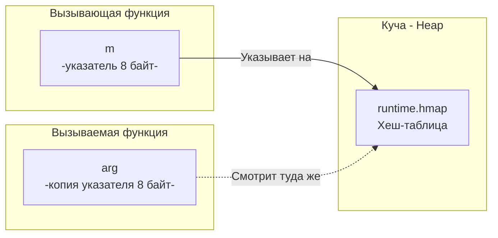

В C++ стандартный `std::map` — это красно-черное дерево (сложность поиска $O(\log N)$). Если вам нужна хеш-таблица, вы используете `std::unordered_map`. 
В Go создатели пошли по пути прагматизма: встроенный тип `map` всегда является классической **хеш-таблицей** (Hash Table). Она обеспечивает среднюю сложность поиска, вставки и удаления за $O(1)$.

В этой статье мы разберем синтаксис, базовые ловушки (gotchas) при работе с мапами, почему итерация по мапе заставляет PHP-разработчиков седеть, и как мапа передается в функции под капотом.

## Инициализация: Главная ловушка с nil

Как и слайсы, мапы можно инициализировать несколькими способами. И здесь скрыта одна из самых частых причин падения Go-приложений в продакшене.

```go
// 1. Nil-мапа
var m1 map[string]int 

// 2. Пустая мапа (аллоцирована)
m2 := map[string]int{} 

// 3. Мапа с преаллокацией (Лучшая практика!)
m3 := make(map[string]int, 100) 
```

> [!warning] Ловушка / Gotcha: Чтение vs Запись в nil-мапу
> В отличие от слайсов (где `append` в `nil`-слайс работает отлично), **запись в `nil`-мапу вызывает немедленную панику (`panic: assignment to entry in nil map`)**. 
> ```go
> var cache map[string]string
> cache["user_1"] = "data" // ПАНИКА! Программа падает.
> ```
> При этом **чтение** из `nil`-мапы абсолютно безопасно! Оно всегда возвращает нулевое значение (Zero Value) для типа значения. `val := cache["user_1"]` просто вернет `""`.
> 
> *Эвристика:* Если ваша структура содержит мапу, всегда инициализируйте её в конструкторе (`New...()`) через `make`.

### Преаллокация и Mechanical Sympathy
Создание мапы через `make(map[K]V, capacity)` — это признак хорошего тона. Если вы знаете, что загрузите в мапу 10 000 пользователей, укажите этот размер сразу. 
Рантайм заранее выделит необходимое количество бакетов (buckets) в куче. Если этого не сделать, при вставке 10 000 элементов мапа будет вынуждена несколько раз произвести операцию **эвакуации (rehashing)** — невероятно тяжелый процесс выделения новой памяти и пересчета хешей для всех существующих ключей.

## Базовые операции и идиома Comma Ok

Чтение из мапы всегда возвращает значение. Если ключа нет, возвращается `Zero Value`.

```go
m := make(map[string]int)
m["alice"] = 25

age := m["bob"] 
fmt.Println(age) // Выведет 0. Но 0 может быть и реальным возрастом!
```

Как отличить отсутствие ключа от реального нулевого значения? Для этого в Go используется идиома **"Comma Ok"**.

```go
if age, exists := m["bob"]; exists {
    fmt.Printf("Боб найден, ему %d лет\n", age)
} else {
    fmt.Println("Боба нет в базе")
}
```

Удаление элемента происходит через встроенную функцию `delete`.
```go
delete(m, "alice")
delete(m, "charlie") // Безопасно! Удаление несуществующего ключа ничего не делает.
```

## Требования к ключам: Что такое Comparable?

В Go вы не можете использовать любой тип в качестве ключа мапы. Ключ должен быть **сравнимым (comparable)**. Это означает, что для типа должны быть определены операторы `==` и `!=`.

**Можно использовать:** `int`, `float64`, `string`, `bool`, указатели, интерфейсы, и **структуры**, если все их поля сравнимы.
**Нельзя использовать:** Слайсы (slices), Мапы (maps) и Функции (functions).

> [!tip] Собеседование
> **Вопрос 1:** Можно ли использовать структуру в качестве ключа мапы?
> **Ответ:** Да, если она не содержит внутри себя слайсов, мап или функций. Сравнение структур происходит побитово (каждое поле).
> 
> **Вопрос 2:** Что будет, если использовать `float64` в качестве ключа?
> **Ответ:** Технически это разрешено. Но из-за стандарта IEEE-754 (и проблем с округлением) вы можете потерять доступ к ключу. Кроме того, специальное значение `NaN` (Not a Number) не равно самому себе (`NaN != NaN`). Рантайм Go обрабатывает `NaN` как ключ особым образом, но использовать `float` как ключ — это выстрел в ногу.

## Итерация по мапе: Намеренный хаос

В C# `Dictionary` может сохранять порядок вставки (в зависимости от реализации). В PHP массивы (которые под капотом хеш-таблицы) жестко гарантируют порядок ключей.

В Go итерация по мапе с помощью `for range` **не гарантирует никакого порядка**. Более того, порядок будет **разным** при каждом новом запуске программы!

```go
m := map[int]string{1: "A", 2: "B", 3: "C"}
for k, v := range m {
    fmt.Printf("%d:%s ", k, v)
}
// Запуск 1: 2:B 1:A 3:C
// Запуск 2: 3:C 2:B 1:A
```

> [!info] Под капотом: Почему рантайм перемешивает ключи?
> Исторически (до Go 1.0) порядок итерации зависел от того, как элементы легли в бакеты. Программисты быстро замечали паттерны и писали код, который неявно опирался на этот порядок. Но когда мапа росла и происходил *rehash*, порядок менялся, и программы ломались.
> 
> Чтобы отучить программистов опираться на порядок, авторы Go добавили в рантайм **намеренную рандомизацию**. При каждом начале цикла `range` рантайм генерирует случайное смещение (offset) и начинает итерацию со случайного бакета.

Если вам нужен отсортированный вывод ключей мапы, вы обязаны создать отдельный слайс ключей, отсортировать его и итерироваться по нему.

## Мапа передается по ссылке? (Снова иллюзия)

Мы помним фундаментальное правило из статьи [[10. Функции. Аргументы, return, multiple return values]]: в Go **всё** передается по значению. Почему же изменение мапы внутри функции меняет её снаружи?

Дело в том, что тип `map[K]V` — это просто синтаксический сахар над обычным указателем. Под капотом мапа — это указатель на структуру `runtime.hmap` (о которой мы детально поговорим в следующей статье). 
Указатель на 64-битной системе занимает 8 байт.



Когда вы передаете мапу в функцию, копируются только эти 8 байт указателя. И оригинал, и копия смотрят на одну и ту же структуру `hmap` в куче.

>[!warning] Ловушка / Gotcha
> Никогда не пишите функции, принимающие указатель на мапу `func process(m *map[string]int)`. Это бессмысленная двойная косвенность (двойной указатель), которая только запутывает код и добавляет лишнее разыменование, снижая производительность. Мапа уже является легковесным дескриптором.

## Потокобезопасность (Thread Safety)

Мапы в Go **категорически не потокобезопасны**.

Если одна горутина читает из мапы, а другая в этот же момент пишет в неё (или обе пишут), рантайм мгновенно убьет всё ваше приложение с фатальной ошибкой `fatal error: concurrent map read and map write`. 

Эту ошибку нельзя поймать через `recover()`. Она обходит механизм паники и вызывает жесткий `abort` процесса на уровне ОС. Рантайм детектирует гонки аппаратно (в структуре `hmap` есть специальный флаг состояния `hashWriting`, который проверяется при каждой операции).

Если вам нужно работать с мапой из разных горутин, у вас есть два идиоматичных пути:
1. Обернуть стандартную мапу структурой с мьютексом `sync.RWMutex`.
2. Использовать специализированную потокобезопасную коллекцию `sync.Map` (подходит только для специфических сценариев с преобладанием чтения над записью).
*(Мы подробно разберем оба подхода в разделе конкурентности, в статье [[40. sync.WaitGroup, Mutex, RWMutex]])*.

## Итог

1. **`map`** — это классическая хеш-таблица. Операции в среднем стоят $O(1)$.
2. **Нулевой указатель:** Читать из `nil`-мапы можно (вернет нули), писать — нельзя (сразу паника). Инициализируйте через `make`.
3. **Преаллокация:** Задавайте `capacity` в `make(map, size)`, чтобы избежать катастрофических просадок производительности при эвакуации данных.
4. **Comma Ok:** Используйте паттерн `val, ok := m[key]` для надежной проверки наличия элемента.
5. **Хаос:** Итерация по мапе преднамеренно рандомизирована. Никогда не опирайтесь на порядок ключей.
6. **Конкурентность:** Мапа не защищена от гонок данных. Одновременный доступ на чтение и запись убьет приложение насмерть.

В этой статье мы посмотрели на мапы с точки зрения синтаксиса и использования. Но настоящая инженерная магия начинается, когда мы заглянем в исходный код рантайма. 

Как Go разрешает коллизии хешей? Что такое «бакеты» (buckets) и почему в каждом из них ровно 8 слотов? Как происходит эвакуация данных без блокировки всей программы на секунды? Об этом мы поговорим в самой хардкорной статье раздела: [[19. Map под капотом. hmap, buckets и рост]].