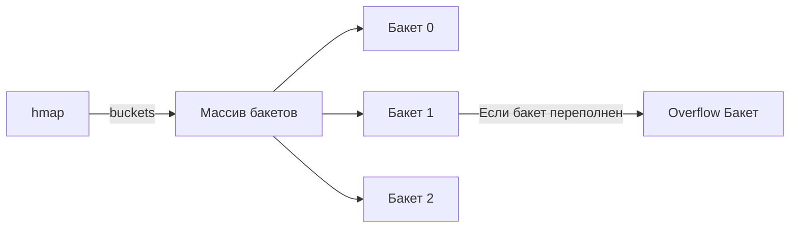
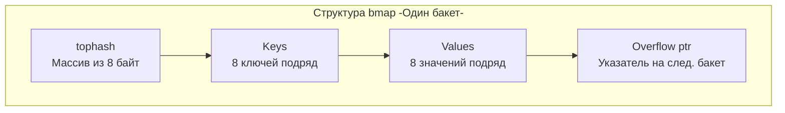

В предыдущей статье [[18. Map. Хеш-таблица в Go]] мы обсуждали синтаксис и базовое поведение мап. Мы узнали, что мапа передается в функции как легкий 8-байтный указатель. Но на что именно он указывает?

Реализация хеш-таблицы в Go — это шедевр инженерной мысли, в котором сплелись воедино защита от хакерских атак, забота о кэше процессора (L1/L2) и алгоритмы плавной дефрагментации памяти. Знание того, как мапа устроена под капотом, — это один из главных маркеров Senior-разработчика на технических интервью.

В этой статье мы препарируем структуру `hmap`, разберем, как разрешаются коллизии и почему мапа никогда не отдает память обратно операционной системе.

## 1. Структура hmap: Заголовок хеш-таблицы

Когда вы пишете `make(map[string]int)`, рантайм создает в куче структуру `hmap` (Header Map). Она описана в исходниках Go в файле `runtime/map.go` и содержит метаданные о нашей хеш-таблице.

```go
// Упрощенная структура hmap из исходников рантайма
type hmap struct {
    count     int    // Логическое количество элементов -len-
    flags     uint8  // Флаги состояния -например, hashWriting для защиты от гонок-
    B         uint8  // Логарифм от количества бакетов -2^B = кол-во бакетов-
    noverflow uint16 // Примерное количество overflow-бакетов
    hash0     uint32 // Рандомный seed (соль) для хеш-функции

    buckets    unsafe.Pointer // Указатель на массив текущих бакетов
    oldbuckets unsafe.Pointer // Указатель на старый массив бакетов -при эвакуации-
    // ... отладочные поля и счетчики
}
```

Ключевые поля для нас:
- **`count`**: именно это поле читается за $O(1)$, когда вы вызываете `len(m)`.
- **`B`**: определяет размер массива бакетов. Если `B = 4`, то у нас $2^4 = 16$ бакетов.
- **`buckets`**: физический массив, где хранятся данные.

> [!info] Под капотом: Защита от HashDOS (hash0)
> Поле `hash0` генерируется случайным образом при создании каждой новой мапы. 
> В ранних версиях языков программирования хеш-функции были предсказуемыми. Злоумышленник мог специально подобрать миллион разных ключей, которые давали бы одинаковый хеш, и отправить их в JSON-запросе на ваш сервер. Все ключи попадали бы в один бакет, превращая поиск $O(1)$ в связный список со сложностью $O(N)$. Сервер тратил 100% CPU на поиск и "падал" (HashDOS-атака). 
> В Go хеш-функция (обычно AES или xxHash) солится значением `hash0`. Для каждой мапы коллизии будут возникать на совершенно разных ключах, делая атаку невозможной.

## 2. Структура bmap (Бакет) и Mechanical Sympathy

Хеш-таблица в Go — это массив **бакетов (buckets)**. Каждый бакет в Go представлен структурой `bmap` и может хранить **ровно 8 пар "ключ-значение"**.



Если вы откроете исходники, структура `bmap` покажется вам пустой (в ней описано только поле `tophash`). Это связано с тем, что рантайм Go генерирует настоящую структуру бакета динамически на этапе компиляции, в зависимости от типов ключей и значений.

Логически бакет выглядит так:



### Mechanical Sympathy: Гениальная оптимизация памяти
Обратите внимание на порядок полей. Почему Go хранит ключи и значения в формате `K1, K2, K3... V1, V2, V3...`, а не парами `K1, V1, K2, V2...`?

Ответ кроется в **выравнивании памяти (Memory Padding)** (о котором мы будем говорить в [[21. Struct. Пользовательские типы данных]]).
Представьте, что ваша мапа имеет тип `map[int64]int8`. 
- Ключ занимает 8 байт.
- Значение занимает 1 байт.

Если бы они хранились парами (Key, Value), то после каждого `int8` компилятору приходилось бы вставлять 7 пустых байт (padding), чтобы следующий `int64` начинался с адреса, кратного 8. Один бакет тратил бы 56 байт памяти впустую!

Сгруппировав все ключи вместе, а все значения после них, рантайм Go полностью избавляется от внутренних "дыр" в памяти. Бакет получается максимально плотным, занимая минимум кэш-линий процессора (L1 Cache).

## 3. Анатомия поиска: Как Go находит элемент?

Когда вы запрашиваете значение `val := m["alice"]`, рантайм выполняет следующий алгоритм:

1. **Хеширование:** Ключ `"alice"` и `hash0` прогоняются через хеш-функцию. Получается 64-битное число (на amd64).
2. **Выбор бакета:** Рантайм берет **младшие `B` бит** этого хеша (Low bits). Например, если `B = 4`, он берет 4 последних бита. Допустим, это `0011` (в десятичной 3). Мы идем в Бакет №3.
3. **TopHash (Быстрый фильтр):** Рантайм берет **старшие 8 бит** хеша (High bits) — это `tophash`. 
4. **Поиск внутри бакета:** Рантайм не сравнивает тяжелые строки! Он берет массив из 8 байт `tophash` внутри бакета и ищет совпадение с помощью быстрых векторных инструкций процессора. 
5. **Финальное сравнение:** Только если `tophash` совпал, Go идет в массив ключей, берет ключ из нужного слота и делает полноценное сравнение `key == "alice"`. Это спасает CPU от дорогих вызовов сравнения строк.

## 4. Разрешение коллизий: Chaining (Цепочки)

Что произойдет, если мы попытаемся добавить 9-й элемент в тот же самый бакет (возникнет коллизия, и 8 слотов уже заняты)?

Go использует метод разрешения коллизий с помощью **связных списков (Separate Chaining)**, но оптимизированный.
Рантайм выделит новый бакет (Overflow Bucket) и запишет указатель на него в поле `overflow` текущего переполненного бакета. Получается цепочка бакетов.

> [!warning] Ловушка / Gotcha
> Если у вас очень плохая хеш-функция или слишком много коллизий, цепочки `overflow` бакетов становятся очень длинными. Поиск превращается из $O(1)$ в $O(N)$ по связному списку (самая недружелюбная к кэшу CPU структура). Чтобы этого не допустить, мапа должна уметь расти.

## 5. Эвакуация (Рост мапы)

Мапа принимает решение о расширении в двух случаях:
1. **Load Factor > 6.5**. Load Factor — это среднее количество элементов в одном бакете (`count / 2^B`). Если мапа заполнена в среднем больше чем на 80% (6.5 из 8 слотов), значит коллизий становится слишком много.
2. **Слишком много overflow-бакетов**. Если `Load Factor` низкий, но overflow-бакетов много (это бывает, если вы добавляли и удаляли ключи), мапа сильно фрагментирована.

### Инкрементальная эвакуация (Incremental Rehash)
Когда срабатывает триггер роста (например, `Load Factor > 6.5`), рантайм:
1. Увеличивает `B` на 1 (размер массива бакетов **удваивается**).
2. Создает новый массив бакетов.
3. Записывает указатель на старый массив в поле `oldbuckets`, а новый — в `buckets`.

Но Go **не копирует все данные сразу**. 
Если в мапе 10 миллионов элементов, полная блокировка (Stop-The-World) для их перехеширования заняла бы секунды! Это убило бы все latency в бэкенд-сервисе.

Вместо этого Go использует **постепенную (инкрементальную) эвакуацию**. 
При каждой следующей операции записи (`m[k] = v`) или удаления (`delete`) рантайм берет **ровно один-два бакета** из `oldbuckets`, пересчитывает для их элементов хеши и переносит их в новый массив. 

> [!tip] Собеседование
> **Вопрос:** Вы обращаетесь на чтение к ключу во время эвакуации мапы. Откуда Go возьмет значение?
> **Ответ:** Во время эвакуации рантайм Go сначала всегда проверяет старый массив `oldbuckets`. Если бакет, в котором должен лежать ключ, еще не эвакуирован, значение будет прочитано оттуда. Если бакет уже перенесен (на нем стоит специальный флаг `evacuated`), поиск перенаправляется в новый массив `buckets`.

### Эвакуация того же размера (Same-size Evacuation)
Если сработал триггер "слишком много overflow-бакетов", мапа не удваивается. Она выделяет новый массив **такого же размера** и переносит элементы туда. Зачем? 
Это процесс **дефрагментации**. Он собирает размазанные по куче одинокие элементы из overflow-цепочек в плотные бакеты, уничтожая пустые места, оставшиеся после операций `delete`.

## 6. Великая утечка памяти в Map

Мапы в Go подвержены специцифической утечке памяти, о которой часто забывают.

**Хеш-таблица в Go никогда не сжимается (does not shrink).**
Если вы добавили в мапу 1 000 000 элементов, рантайм выделит память под ~150 000 бакетов. 
Если вы затем вызовете `delete` для всех 1 000 000 элементов, `count` станет равен 0. Но массив бакетов (сотни мегабайт) **останется в памяти навсегда**. Поле `B` никогда не уменьшается. Сборщик мусора не может освободить этот массив, так как структура `hmap` продолжает на него ссылаться.

**Как лечить?**
Если вы используете мапу как долгоживущий кэш, который периодически сильно раздувается и затем очищается, вы должны **периодически пересоздавать мапу**:
```go
// Плохой подход для In-Memory кэша
for k := range cache {
    delete(cache, k)
}

// Правильный подход
cache = make(map[string]Data) // Старая мапа потеряет ссылки и уйдет в GC
```

## Итог

1. **`hmap`**: Заголовок хеш-таблицы. Содержит счетчик элементов, степень двойки для массива бакетов (`B`) и защитный seed (`hash0`).
2. **`bmap` (Бакет)**: Хранит ровно 8 пар "ключ-значение". Структура отсортирована по типам (все ключи, затем все значения), чтобы устранить пустые байты выравнивания (padding).
3. **TopHash**: Быстрый кэш из старших 8 бит хеша для $O(1)$ SIMD-поиска внутри бакета без полного сравнения тяжелых ключей.
4. **Эвакуация**: При `Load Factor > 6.5` мапа удваивается. Процесс идет "в фоне" небольшими порциями при каждой записи, не блокируя горутину надолго.
5. **Memory Leak**: Удаление элементов через `delete` не возвращает память операционной системе. Мапа умеет только расти, но не сжиматься.

Изучив устройство массивов, слайсов и мап, мы покрыли основные контейнеры. Однако самым частым ключом для хеш-таблиц является текст. Строки в Go имеют уникальную двойственную природу (слайс байт с одной стороны и неделимый монолит с другой). В следующей статье [[20. Строки в Go. Immutable string и работа с Unicode]] мы заглянем под капот строк, узнаем про `StringHeader`, интернирование (interning) и то, как рантайм оптимизирует конкатенацию с помощью `strings.Builder`.