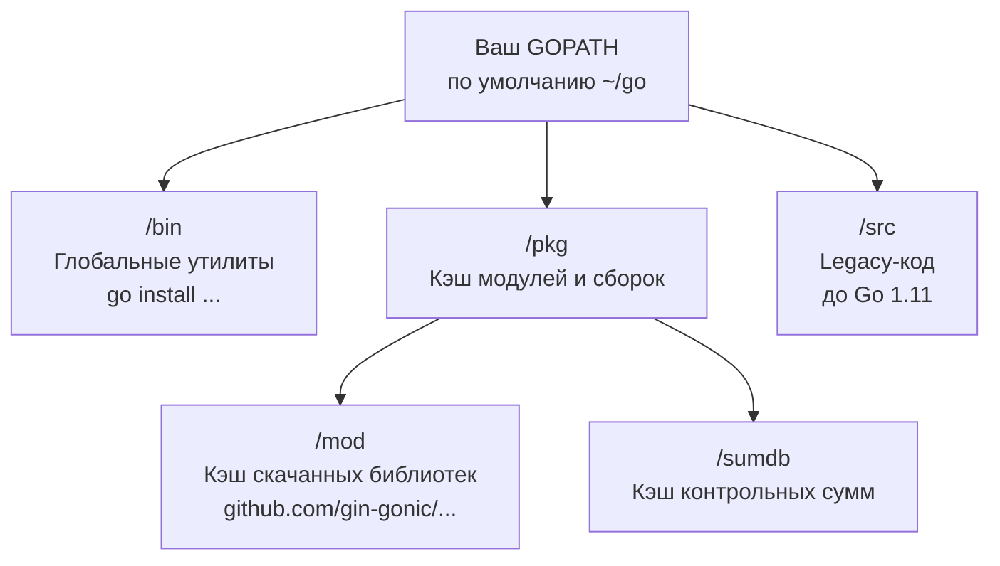

Установка Go на любую операционную систему сводится к скачиванию архива с официального сайта или использованию пакетного менеджера (например, `brew install go` или `apt install golang`). Как опытный разработчик, вы без труда справитесь с добавлением бинарника в `PATH`. 

Гораздо важнее понимать, как Go организует рабочее пространство и управляет зависимостями на уровне файловой системы. Вокруг этого исторически сломано много копий, и понимание этих механизмов обязательно для прохождения собеседований и настройки CI/CD.

## Две главные переменные: GOROOT и GOPATH

Когда вы устанавливаете Go, компилятору и инструментарию (toolchain) нужно знать две вещи:
1. Где лежат файлы самого языка (стандартная библиотека, компилятор).
2. Где лежат ваши исходники и скачанные сторонние библиотеки.

За это отвечают переменные окружения `GOROOT` и `GOPATH`.

### GOROOT: Дом для самого Go
`GOROOT` указывает на директорию, куда установлен сам язык (обычно `/usr/local/go` на Linux/macOS или `C:\Program Files\Go` на Windows). 
Внутри этой директории находятся:
- `bin/` — сам компилятор (`go`) и утилита форматирования (`gofmt`).
- `src/` — исходный код **стандартной библиотеки** (пакеты `fmt`, `net/http`, `os` и т.д.).
- `pkg/` — скомпилированные объекты стандартной библиотеки для ускорения сборки.

> [!info] Под капотом
> В современных версиях Go (начиная с 1.10) вам **почти никогда не нужно задавать GOROOT вручную**. Бинарник `go` умеет определять свое местоположение относительно того пути, откуда он был запущен. Ручное переопределение `GOROOT` обычно нужно только при сборке самого тулчейна Go из исходников или при использовании хитрых менеджеров версий (например, `gvm`).

### GOPATH: Историческое наследие и современность
`GOPATH` — это переменная, которая исторически определяла **единое рабочее пространство** (Workspace) для всех ваших Go-проектов.

Go создавался в Google, где исторически используется гигантский монорепозиторий. Ранние версии Go переняли эту философию: язык ожидал, что весь ваш код и код всех ваших зависимостей будет лежать в одной строго структурированной директории (обычно `~/go`).

Внутри `GOPATH` требовалось иметь три папки:
1. `src/` — исходники **ваших** проектов и сторонних библиотек (например, `~/go/src/github.com/user/project`).
2. `pkg/` — скомпилированные промежуточные файлы (`.a`).
3. `bin/` — скомпилированные исполняемые бинарники из ваших проектов.

**Проблема:** Этот подход делал невозможным использование разных версий одной и той же библиотеки в разных проектах на одной машине. Все лежало в едином дереве `src/`.

#### Эпоха Go Modules (Наше время)
Начиная с версии Go 1.11 (и окончательно в 1.13), язык перешел на систему модулей. Теперь вам **не нужно** хранить свой код внутри `GOPATH/src`. Вы можете инициализировать проект в любой папке на диске с помощью `go mod init`. (Подробнее мы разберем это в статье [[28. Модули и go.mod]]).

> [!tip] Собеседование
> **Вопрос:** Используется ли GOPATH сейчас, в эпоху Go Modules?
> **Ответ:** Да, используется, но его роль изменилась. Теперь он не диктует, где должен лежать *ваш* код, но продолжает использоваться как глобальный кэш. 
> 1. `GOPATH/pkg/mod` — сюда складываются скачанные сторонние зависимости. Это readonly-кэш (одна версия библиотеки скачивается ровно один раз для всех проектов на машине).
> 2. `GOPATH/bin` — сюда устанавливаются утилиты при вызове `go install` (например, линтеры или генераторы кода). Этот путь обязательно нужно добавить в системный `$PATH`.



## Первая программа

Создадим директорию в любом удобном месте (вне legacy `GOPATH/src`), например `~/projects/hello-go`.
Создадим файл `main.go`:

```go
package main

import (
	"fmt"
	"runtime"
)

func main() {
	fmt.Println("Hello, System!")
	fmt.Printf("OS: %s<br>Arch: %s\n", runtime.GOOS, runtime.GOARCH)
}
```

### Разбор структуры
1. `package main` — определяет, что этот файл является точкой входа в исполняемую программу, а не разделяемой библиотекой. Компилятор соберет бинарник только если найдет пакет `main` с функцией `main()`.
2. `import` — импорт зависимостей. Компилятор Go невероятно строг: **если вы импортировали пакет, но не используете его, код не скомпилируется**. Это защищает от раздувания бинарников мертвым кодом.
3. `func main()` — точка входа (Entry point). Она не принимает аргументов (аргументы CLI читаются через `os.Args`) и не возвращает значений (код возврата ОС задается через `os.Exit()`).

> [!warning] Ловушка / Gotcha
> Вызов функции `main()` происходит **не самым первым**. До выполнения `main()` рантайм Go инициализирует горутины, сборщик мусора, а также выполняет специальные функции `init()` во всех импортированных пакетах и в вашем `main` пакете. Это механизм часто используется в драйверах БД для саморегистрации, но может привести к "магии" и неочевидному поведению.

## Компиляция и Mechanical Sympathy

Go предоставляет две основные команды для запуска: `go run` (компилирует во временную папку и запускает) и `go build` (создает бинарник в текущей директории). Выполним:

```bash
go build -o app main.go
./app
```

**Что мы получили на выходе?**
В отличие от Java/C#, мы получили нативный исполняемый файл (ELF в Linux, Mach-O в macOS, PE в Windows). 

Давайте заглянем под капот (на примере Linux):
```bash
file ./app
# Вывод: app: ELF 64-bit LSB executable, x86-64, version 1 (SYSV), statically linked, Go BuildID=..., not stripped
```

Обратите внимание на слова **statically linked** (или *dynamically linked*, в зависимости от настроек CGO). 

### Влияние CGO_ENABLED

Go умеет вызывать C-код через механизм `cgo`. По умолчанию он включен (`CGO_ENABLED=1`). Если ваша программа (или её зависимости, например пакет `net` или `os/user`) используют `cgo`, ваш Go-бинарник будет **динамически слинкован** с системной `libc` (библиотекой языка C вашей ОС).

Почему это важно для бэкендера?
Если вы скомпилируете такой бинарник на Ubuntu (которая использует `glibc`) и попытаетесь запустить его в минималистичном Docker-контейнере на базе Alpine Linux (которая использует `musl libc`), **программа упадет с ошибкой "file not found"**, потому что ОС не сможет найти нужную динамическую библиотеку `libc`.

Чтобы получить по-настоящему независимый, 100% статически слинкованный бинарник (который можно запустить в абсолютно пустом `scratch` контейнере, где нет вообще ничего, кроме ядра ОС), собирайте код так:

```bash
CGO_ENABLED=0 go build -o app main.go
```

При `CGO_ENABLED=0` Go компилятор подменяет вызовы к `libc` (например, для резолва DNS) на свои собственные, написанные на чистом Go (pure Go) реализации. Бинарник становится чуть больше, но зато он абсолютно автономен — он общается с ядром ОС напрямую через системные вызовы (syscalls), минуя прослойки C-библиотек.

## Итог

1. **GOROOT** — место жительства компилятора и стандарта. Обычно трогать не нужно.
2. **GOPATH** — раньше там жил весь код. Сейчас это кэш для модулей (`pkg/mod`) и место для глобально установленных Go-утилит (`bin/`).
3. Первая программа всегда начинается с `package main` и `func main()`.
4. Go создает автономные бинарные файлы. Флаг `CGO_ENABLED=0` гарантирует 100% статическую линковку, идеальную для минималистичных Docker-образов.

В следующей статье [[3. go run, go build, go test и базовый toolchain]] мы подробнее разберем встроенный инструментарий: как Go компилирует код, ищет гонки данных (race conditions) и прогоняет тесты без использования сторонних утилит типа Make или CMake.