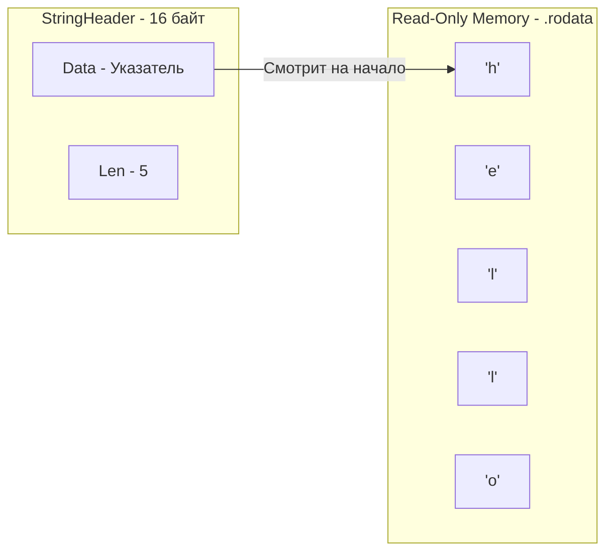

В предыдущих статьях мы часто использовали строки в качестве ключей для мап или значений для переменных. В статье [[7. Rune, Byte и Unicode в Go]] мы уже выяснили, что строка — это не массив символов, а последовательность байт в кодировке UTF-8. 

Но для написания высокопроизводительного бэкенда этого знания недостаточно. Строки (strings) в Go скрывают под капотом строгие гарантии неизменяемости (Immutability), которые спасают нас от гонок данных, но могут стать причиной огромных утечек памяти и просадок производительности при неправильной конкатенации или конвертации.

В этой статье мы заглянем в память, где живут строки, разберем анатомию `StringHeader`, узнаем, почему конвертация строки в слайс байт — это зло, и как `strings.Builder` использует "темную магию" для обхода правил рантайма.

## Анатомия StringHeader

С точки зрения рантайма, строка — это примитивная 16-байтная структура (на 64-битной архитектуре), описанная в пакете `reflect` как `StringHeader`.

```go
type StringHeader struct {
    Data uintptr
    Len  int
}
```

Обратите внимание на отличие от `SliceHeader` из статьи [[16. Slice. Главная структура данных в Go]]: **у строки нет поля `Cap` (Capacity)**. 

1. `Data` — указатель на неизменяемый (read-only) массив байт в памяти.
2. `Len` — количество байт (не рун!).



Поскольку структура весит всего 16 байт, передача строки в функцию по значению (без указателя) — это невероятно дешевая операция. Процессор просто копирует два 8-байтных регистра. Никакие текстовые данные при этом не дублируются.

## Неизменяемость (Immutability) и её цена

Главное правило строк в Go: **строка неизменяема**. 
После того как строка создана, вы не можете изменить ни один её байт.

```go
s := "hello"
// s[0] = 'H' // Ошибка компиляции! Cannot assign to s[0]
```

### Mechanical Sympathy: Зачем нужна неизменяемость?
1. **Безопасность в многопоточности.** Вы можете передавать одну и ту же строку в 1000 горутин. Рантайму не нужны мьютексы (Mutex), потому что ни одна горутина не сможет изменить эти данные.
2. **Разделение памяти (Memory Sharing).** Когда вы делаете срез строки (`s[1:3]`), Go не копирует данные! Он создает новый 16-байтный `StringHeader`, `Data` которого указывает на середину оригинальной строки.
3. **Хранение констант.** Если строка задана жестко в коде (`"hello"`), компилятор помещает её текстовые данные в специальный защищенный сегмент памяти скомпилированного бинарника — `.rodata` (Read-Only Data). Попытка процессора записать туда данные вызовет аппаратное прерывание `SIGSEGV` (Segmentation fault).

## Конкатенация: O(N^2) и убийство Garbage Collector'а

Из-за неизменяемости операция сложения строк (конкатенация) может стать "бутылочным горлышком" вашего приложения.

>[!warning] Ловушка / Gotcha: Сложение в цикле
> ```go
> var result string
> for i := 0; i < 100000; i++ {
>     result += "A" // КАТАСТРОФА!
> }
> ```
> При каждом вызове `+=` рантайм Go вынужден выделять в куче **новый** массив байт, размер которого равен `Len(старая строка) + Len(добавка)`, и копировать туда обе части. 
> На следующей итерации старая строка становится мусором. Для 100 тысяч итераций этот код выделит около 5 Гигабайт (!) оперативной памяти и заставит Garbage Collector работать в панике.

### Идиоматичный подход: strings.Builder

Для сборки строк из множества частей был создан тип `strings.Builder`. Под капотом он содержит обычный слайс байт `[]byte`, в который вы добавляете данные через `WriteString()`.

```go
var b strings.Builder
b.Grow(100000) // Оптимизация! Заранее просим аллокатор выделить память

for i := 0; i < 100000; i++ {
    b.WriteString("A") 
}
result := b.String()
```

> [!info] Под капотом: Магия Zero-Copy
> В отличие от `bytes.Buffer`, который при вызове `.String()` создает новую строку и полностью копирует в нее свой буфер, `strings.Builder` делает **Zero-Copy** конвертацию.
> Посмотрим в исходники функции `String()` у `strings.Builder`:
> ```go
> func (b *Builder) String() string {
>     return unsafe.String(unsafe.SliceData(b.buf), len(b.buf))
> }
> ```
> Он использует пакет `unsafe`, чтобы "притвориться", что лежащий внутри него слайс байт — это и есть неизменяемая строка. Копирования данных не происходит! Возвращается просто новый `StringHeader`, указывающий на тот же кусок памяти. Это безопасно, потому что `strings.Builder` спроектирован так, чтобы после вызова `.String()` вы больше не могли мутировать его внутренний буфер без паники.

## Конвертация string <->[]byte

Написание сетевых сервисов постоянно требует конвертации текста в байты (для отправки в сокет/файл) и обратно.
Классический код выглядит так:

```go
s := "hello"
b := []byte(s) // Конвертация в байты

b[0] = 'H' // Меняем байт
s2 := string(b) // Конвертация обратно в строку
```

> [!tip] Собеседование
> **Вопрос:** Выделяет ли память конструкция `b :=[]byte(s)`?
> **Ответ:** Да, и это дорогая операция! Поскольку строка `s` неизменяема (и может лежать в `.rodata`), а слайс `b` обязан быть изменяемым, рантайм **выделяет новый блок памяти в куче** и побитово копирует туда данные строки $O(N)$. То же самое происходит при обратной конвертации `string(b)`.

### Оптимизации компилятора (Compiler Magic)
Разработчики Go знали, что конвертация — это боль. Поэтому в компилятор зашили несколько исключений, при которых аллокации не происходит:

1. **Поиск в мапе:** `m[string(bytesSlice)]`. Компилятор не создает реальную строку, он просто вычисляет хеш от байтов.
2. **Конкатенация:** `s + string(bytesSlice)`.
3. **Сравнение:** `string(bytesSlice) == "hello"`.

**Эвристика бэкендера:**
Если вы работаете со стандартной библиотекой (например, пишите ответ в `http.ResponseWriter` или файл `os.File`), методы `Write` всегда принимают `[]byte`. Если у вас есть переменная-строка, **не конвертируйте её** через `[]byte(s)`. Используйте `io.WriteString(w, s)`. Внутри пакеты сами разберутся, как оптимальнее передать память в ядро ОС без лишнего копирования.

## String Interning: Экономия на дубликатах

Что произойдет, если в разных частях вашего (очень большого) приложения написано:
```go
s1 := "internal_server_error"
s2 := "internal_server_error"
```
Будет ли эта строка занимать память дважды? Нет.

Компилятор Go использует технику **String Interning** (Интернирование строк) для строковых литералов, известных на этапе компиляции. Он найдет все идентичные хардкод-строки, создаст для них ровно один массив байт в секции `.rodata`, а всем переменным `s1` и `s2` раздаст 16-байтные заголовки, `Data` которых будет указывать на один и тот же адрес в памяти.

Но помните: это работает **только для строк, зашитых в код**. Если вы получаете тысячи одинаковых строк из базы данных или по сети (например, повторяющиеся статусы `success`), рантайм честно выделит память под каждую из них. 

## Итог

1. **`StringHeader`**: 16-байтная структура без вместимости (`Cap`). Передавать строки по значению абсолютно "бесплатно" для CPU.
2. **Неизменяемость**: Строки нельзя менять. Взятие подстроки `s[1:5]` не копирует данные, а просто создает новый заголовок, смотрящий на старую память.
3. **Конкатенация**: Избегайте сложения строк в циклах (`+=`). Всегда используйте `strings.Builder` с заранее вызванным `Grow()` — он делает Zero-Copy сборку через `unsafe`.
4. **Конвертация**: Явное преобразование `[]byte(s)` или `string(b)` выделяет память в куче и копирует данные. В высоконагруженных участках ищите способы работать с `[]byte` напрямую.

Мы закончили с базовыми типами данных и встроенными коллекциями. Пришло время посмотреть, как мы можем создавать свои собственные доменные модели. Как упаковать разрозненные данные о "Пользователе" в единую сущность? В следующей статье [[21. Struct. Пользовательские типы данных]] мы разберем структуры, поймем, что такое Memory Padding (выравнивание памяти) и почему порядок полей в вашей структуре может сэкономить мегабайты оперативной памяти.