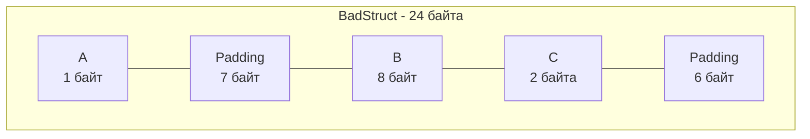

В классических объектно-ориентированных языках (Java, C#, PHP) базовым строительным блоком предметной области является «Класс» (Class). Класс смешивает внутри себя и состояние (поля), и поведение (методы), и невидимую магию (таблицы виртуальных методов для наследования).

В Go классов нет. Философия языка предписывает жестко разделять данные и поведение. Для описания данных используется **структура (`struct`)** — прозрачный, легковесный и предсказуемый контейнер, который представляет собой просто непрерывный кусок памяти.

В этой статье мы разберем анатомию структур, выясним, почему порядок полей влияет на объем потребляемой памяти (Memory Padding), и изучим "нулевую структуру" `struct{}`, которая является излюбленным инструментом в высоконагруженных системах.

## Синтаксис и Zero Value

Структура объединяет несколько переменных (полей) различных типов под одним именем.

```go
type User struct {
    ID        int64
    Email     string
    IsActive  bool
    CreatedAt time.Time
}
```

Как и любая переменная в Go, структура всегда безопасно инициализируется. Если вы просто объявите `var u User`, рантайм выделит память и заполнит каждое поле его "нулевым значением" (Zero Value):
- `ID` будет `0`
- `Email` будет `""`
- `IsActive` будет `false`
- `CreatedAt` получит нулевое время (0001-01-01).

Никаких `NullReferenceException` при обращении к `u.ID` не произойдет.

### Анонимные структуры
Если структура нужна только один раз (например, для парсинга JSON или в табличных тестах), вам не обязательно объявлять для нее отдельный `type`. Можно использовать анонимную структуру:

```go
config := struct {
    Host string
    Port int
}{
    Host: "localhost",
    Port: 8080,
}
```

## Mechanical Sympathy: Выравнивание памяти (Padding)

Это самая важная техническая часть статьи. Незнание этого механизма приводит к тому, что структуры в памяти занимают в 1.5 - 2 раза больше места, чем реально весят их данные.

Процессор не читает оперативную память побайтово. Он читает её "машинными словами" (Words). На 64-битной архитектуре слово равно **8 байтам**. 
Чтобы CPU работал максимально быстро, компилятор Go обязан размещать переменные по адресам, кратным их размеру. Это называется **выравниванием памяти (Memory Alignment)**.

Например, тип `int64` (8 байт) должен начинаться с адреса, который делится на 8. Если он будет лежать "криво", процессору придется сделать два чтения из RAM и склеивать биты регистрами, что убьет производительность.

Чтобы обеспечить выравнивание, компилятор вставляет между полями вашей структуры невидимые пустые байты — **Padding**.

Давайте посмотрим на классическую ошибку новичка:

```go
type BadStruct struct {
    A int8   // 1 байт
    B int64  // 8 байт
    C int16  // 2 байта
}
```

Сколько весит `BadStruct`? В теории: 1 + 8 + 2 = 11 байт.
На практике, если мы вызовем `unsafe.Sizeof(BadStruct{})`, мы получим **24 байта**! Куда делись еще 13 байт?

1. Поле `A` занимает 1 байт.
2. Поле `B` требует выравнивания по 8 байтам. Компилятор добавляет **7 пустых байт** (Padding) после `A`.
3. Поле `B` занимает 8 байт.
4. Поле `C` занимает 2 байта.
5. Общий размер структуры должен быть кратен размеру её самого большого поля (8 байт), чтобы при создании массива таких структур следующая структура легла ровно. 1 + 7 + 8 + 2 = 18. Ближайшее кратное 8 — это 24. Компилятор добавляет еще **6 пустых байт** в конец.



### Как это починить?
Золотое правило оптимизации структур в Go: **сортируйте поля по убыванию их размера (от самых больших к самым маленьким)**.

```go
type GoodStruct struct {
    B int64  // 8 байт
    C int16  // 2 байта
    A int8   // 1 байт
}
```

Считаем снова:
1. `B` занимает 8 байт.
2. `C` (2 байта) ложится сразу после `B`, выравнивание по 2 не нарушено (адрес 8 кратен 2).
3. `A` (1 байт) ложится сразу после `C`.
4. Текущий размер 11 байт. Выравниваем до кратного 8. Ближайшее — **16 байт**. Добавляется 5 байт отступа в конце.

Мы сэкономили 8 байт (33% памяти) просто поменяв строчки местами! Если в вашем кэше лежит миллион таких структур, вы только что сэкономили 8 Мегабайт оперативной памяти и улучшили попадание в кэш процессора.

>[!tip] Собеседование
> **Как автоматизировать поиск "дырявых" структур?**
> Никто не считает байты вручную. В экосистеме Go есть встроенный линтер. Если запустить `golangci-lint` с включенным правилом `fieldalignment` (ранее `maligned`), он автоматически укажет вам на структуры, поля которых можно переставить для экономии памяти, и покажет, сколько байт будет сэкономлено.

## Пустая структура struct{} и zerobase

Один из самых идиоматичных паттернов в Go — использование пустой структуры `struct{}`. 

```go
var empty struct{}
fmt.Println(unsafe.Sizeof(empty)) // Выведет 0!
```

Структура без полей весит **строго 0 байт**. 
В статье [[16. Slice. Главная структура данных в Go]] мы упоминали глобальную переменную рантайма `zerobase`. Все указатели на аллоцированные 0-байтовые структуры (или слайсы с capacity = 0) всегда указывают на один и тот же системный адрес памяти `zerobase`. Вы можете создать миллион пустых структур, и они не займут ни одного байта оперативной памяти.

Где это используется на практике?

**1. Реализация Set (Множества) через Map**
В Go нет встроенного типа `Set` (коллекции уникальных элементов). Его эмулируют через мапу, где значениями выступает пустая структура:
```go
// Идеальный In-Memory Set. Значения не занимают память!
visitedURLs := make(map[string]struct{})

visitedURLs["https://google.com"] = struct{}{}

if _, exists := visitedURLs["https://google.com"]; exists {
    // URL уже посещен
}
```
Если бы вы использовали `map[string]bool`, каждое значение `true` отнимало бы по 1 байту памяти.

**2. Каналы-сигналы (Signal Channels)**
Когда вам нужно послать сигнал другой горутине, но сами данные не важны, используют канал пустых структур.
```go
done := make(chan struct{})
// Отправка 0 байт данных. Идеальный сигнал!
done <- struct{}{} 
```

## Теги структур (Struct Tags)

Поскольку поля структуры — это просто данные в памяти, стандартные сериализаторы (JSON, XML) или драйверы баз данных не знают, как мапить их на внешние системы. 

Для этого в Go придуманы **Теги структур** — строковые метаданные, которые описываются после типа поля в обратных кавычках.

```go
type User struct {
    ID       int64  `json:"id" db:"user_id"`
    Password string `json:"-"` // Тире означает: игнорировать поле при JSON-сериализации
}
```

> [!info] Под капотом: Теги и Рефлексия
> Теги **не влияют на компиляцию** и не несут никакой логики сами по себе. Компилятор просто вшивает эти строчки в метаданные типа в бинарном файле (в структуру `_type`). 
> Чтобы прочитать тег, сторонние библиотеки (например, `encoding/json`) используют тяжелый механизм рефлексии (пакет `reflect`). Они запрашивают метаданные структуры в рантайме, парсят строку тега через `strings.Split` и решают, под каким ключом выводить поле. Из-за активного использования рефлексии стандартный JSON-парсер считается достаточно медленным, что породило решения с кодогенерацией (например, `easyjson`), которые генерируют методы сериализации без рефлексии.

## Передача структуры по значению

Как мы помним из статьи [[14. Указатели в Go]], в языке применяется строгая семантика передачи по значению. 
Если структура весит 128 байт, её передача в функцию приведет к побитовому копированию всех 128 байт в новую область стека (или регистры).

```go
func process(u User) {
    u.IsActive = true // Мутирует КОПИЮ! Оригинал не изменится.
}
```

**Когда использовать указатель `*User`?**
1. Когда функция должна **мутировать** (изменить) оригинальные данные структуры.
2. Когда структура весит очень много (сотни байт) и её копирование бьет по производительности (начинает занимать лишние такты CPU). Но помните про *Escape Analysis* — возврат указателя может привести к переносу структуры в Кучу (Heap), нагружая GC. Для структур малого и среднего размера (до 64-128 байт) передача по копии часто эффективнее, так как сохраняет локальность кэша (Cache Locality).

## Итог

1. **`struct`** — это композитный тип данных, представляющий собой непрерывный блок памяти. Никакого наследования и скрытых таблиц методов.
2. **Padding (Выравнивание)** — компилятор вставляет пустые байты между полями структуры для оптимизации работы CPU. Сортируйте поля от большего к меньшему, чтобы экономить память.
3. **`struct{}`** — пустая структура, занимает строго 0 байт. Используется для создания множеств (`map[T]struct{}`) и сигнальных каналов.
4. **Теги** предоставляют метаданные для рефлексии в рантайме (JSON, DB), но работают медленно из-за динамического парсинга.

Структуры определяют форму ваших данных. Но как определить их поведение? Как привязать функцию к конкретной структуре, создавая подобие ООП-класса? В следующей статье [[22. Методы. Value Receiver и Pointer Receiver]] мы разберем механизм Receiver'ов, поймем, как компилятор трансформирует методы в обычные функции и почему выбор между мутирующим и немутирующим вызовом является фундаментом архитектуры в Go.