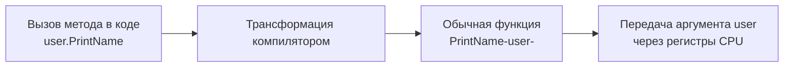

В классических ООП-языках (Java, C#, C++) методы неразрывно связаны с классами. Когда вы вызываете метод `user.setName("Bob")`, компилятор неявно прокидывает внутрь метода магический указатель `this` или `self`, который указывает на текущий экземпляр объекта.

Go отвергает магию. В Go нет классов, а методы — это просто **обычные функции**, у которых есть специальный первый аргумент, называемый **Receiver (Получатель)**. 

В этой статье мы разберем анатомию методов, выясним, как компилятор обманывает нас синтаксическим сахаром, и изучим фундаментальные правила выбора между `Value Receiver` (передача по значению) и `Pointer Receiver` (передача по указателю).

## Анатомия метода: Под капотом

Синтаксически метод в Go отличается от функции только тем, что перед его именем в скобках указывается тип получателя (Receiver).

```go
type User struct {
    Name string
}

// Метод с Value Receiver
func (u User) PrintName() {
    fmt.Println(u.Name)
}
```

Но что видит компилятор? На этапе построения синтаксического дерева (AST) компилятор Go трансформирует этот метод в обычную плоскую функцию, где `Receiver` становится **первым аргументом**.



Внутри рантайма нет никакой связи между структурой `User` и функцией `PrintName`, кроме того, что они находятся в одном пакете. Нет никаких скрытых таблиц виртуальных методов (vtable), пока вы не начнете использовать интерфейсы.

> [!info] Под капотом: Название переменной
> В отличие от `this` или `self`, имя переменной-ресивера в Go выбирает сам разработчик. Идиоматичный Go требует, чтобы это имя было кратким — обычно это одна или две первые буквы названия типа. Если тип `User`, ресивер должен называться `u`. Никогда не используйте имена `this`, `self` или `me` в Go — это выдает разработчика, который пишет на Java синтаксисом Go.

## Value Receiver vs Pointer Receiver

Поскольку ресивер — это просто аргумент функции, на него распространяется фундаментальное правило языка из статьи [[10. Функции. Аргументы, return, multiple return values]]: **в Go всё передается по значению**.

У вас есть два стула:

### 1. Value Receiver (Ресивер по значению)
```go
func (u User) Rename(newName string) {
    u.Name = newName // Меняет КОПИЮ!
}
```
При вызове метода создается **полная побитовая копия** структуры `User`. Любые изменения внутри метода не затронут оригинальный объект. 
**Mechanical Sympathy:** Если структура весит 1 КБ, каждый вызов такого метода будет копировать 1 КБ памяти через регистры, сжигая такты CPU. Однако для маленьких структур (до 64 байт) это невероятно быстро и гарантирует, что объект не "убежит" в кучу (Heap), избавляя Garbage Collector от работы.

### 2. Pointer Receiver (Ресивер по указателю)
```go
func (u *User) Rename(newName string) {
    u.Name = newName // Меняет ОРИГИНАЛ
}
```
При вызове метода передается только **копия указателя** (8 байт). Вы работаете с оригинальной памятью объекта. Это необходимо, если метод должен изменить состояние структуры или если структура слишком огромна для копирования.

## Синтаксический сахар: Автоматическое разыменование

Чтобы программистам не приходилось постоянно писать `(&u).Rename()` или `(*u).PrintName()`, компилятор Go предоставляет мощный синтаксический сахар.

Вы можете вызывать методы с `Pointer Receiver` на значениях, и методы с `Value Receiver` на указателях. Компилятор сам подставит `&` или `*` под капотом:

```go
func main() {
    // 1. Переменная-значение
    userValue := User{Name: "Alice"}
    userValue.Rename("Bob") // Компилятор сделает: -&-userValue-.Rename-"Bob"-
    
    // 2. Переменная-указатель
    userPtr := &User{Name: "Charlie"}
    userPtr.PrintName() // Компилятор сделает: -*-userPtr-.PrintName--
}
```

Но у этой магии есть одно жесткое ограничение, которое является классическим вопросом на Middle-собеседованиях.

## Ловушка: Неадресуемые значения (Unaddressable Values)

Компилятор может автоматически подставить `&` (взять адрес) **только если переменная является адресуемой (Addressable)**. 

Попробуем вызвать метод, изменяющий структуру, которая лежит внутри мапы:

```go
type Counter struct {
    count int
}
func (c *Counter) Inc() { c.count++ }

func main() {
    m := map[string]Counter{
        "visits": {count: 0},
    }
    
    // ОШИБКА КОМПИЛЯЦИИ! 
    // Cannot call pointer method on m["visits"]
    m["visits"].Inc() 
}
```

Почему возникает ошибка? Вспоминаем статью [[19. Map под капотом. hmap, buckets и рост]]. Мапа в Go — это хеш-таблица, которая периодически эвакуирует данные в новые массивы памяти (при росте).
Если бы компилятор разрешил взять указатель `&m["visits"]`, то после эвакуации мапы этот указатель стал бы невалидным — он смотрел бы в старый кусок памяти, который уже удален GC. 

Значения в мапе **неадресуемы**. Компилятор физически не может применить синтаксический сахар `(&m["visits"]).Inc()`.

> [!tip] Собеседование
> **Как решить проблему с мапой?**
> Есть два пути:
> 1. Хранить в мапе указатели: `map[string]*Counter`. Тогда `m["visits"]` вернет указатель, и метод `Inc()` отработает идеально.
> 2. Создать копию, изменить её и положить обратно:
> ```go
> tmp := m["visits"]
> tmp.Inc()
> m["visits"] = tmp
> ```

## Ловушка 2: Вызов метода у nil-указателя

В Java вызов метода у объекта, равного `null`, вызывает мгновенный `NullPointerException`. В Go, как мы обсуждали в статье [[14. Указатели в Go]], методы можно спокойно вызывать у `nil`-указателей.

Поскольку метод — это просто функция, в которую передается аргумент, передача `nil` вместо указателя абсолютно легальна:

```go
func (u *User) IsAdmin() bool {
    // В Go это нормальная практика - защищаться от nil внутри метода
    if u == nil {
        return false
    }
    return u.Role == "admin"
}

func main() {
    var u *User = nil
    fmt.Println(u.IsAdmin()) // Паники нет! Выведет false.
}
```
Паника возникнет только в том случае, если метод попытается разыменовать указатель (например, неявно обратиться к `u.Role` без проверки `u == nil`). Рантайм не сможет прочитать память по нулевому адресу.

## Идиоматика: Правила выбора Receiver'а

Когда вы проектируете структуру, вы должны выбрать: какие ресиверы использовать? Вот строгие правила идиоматичного Go:

1. **Правило мутации:** Если метод изменяет структуру — используйте `Pointer Receiver`.
2. **Правило размера:** Если структура содержит внутри себя гигантские массивы или десятки полей, используйте `Pointer Receiver`, чтобы избежать $O(N)$ копирования.
3. **Правило синхронизации:** Если структура содержит `sync.Mutex` или другие примитивы синхронизации, вы **обязаны** использовать `Pointer Receiver`. Копирование мьютекса по значению ломает его логику (замок копируется, и разные горутины будут блокировать разные мьютексы).
4. **Правило Консистентности (Главное):** **НИКОГДА не смешивайте Value и Pointer методы для одной структуры.** Если хотя бы один метод вашей структуры (например, `SetName`) требует `Pointer Receiver`, то **ВСЕ** остальные методы этой структуры (даже простые геттеры вроде `GetName`) тоже должны использовать `Pointer Receiver`.

> [!warning] Ловушка / Gotcha: Почему нельзя смешивать?
> Если вы смешаете методы, вы создадите себе огромные проблемы при использовании интерфейсов. Интерфейсы в Go очень чувствительны к типу ресивера. Если тип реализует интерфейс частично указателями, а частично значениями, вы не сможете легко передавать эту структуру в функции, принимающие интерфейс. (Мы подробно разберем эту механику в следующей статье).

## Итог

1. **Метод — это функция.** Ресивер — это просто скрытый первый аргумент. Никаких виртуальных таблиц на уровне структур нет.
2. **Value Receiver** работает с копией данных. Идеален для маленьких, неизменяемых (immutable) структур, так как снижает нагрузку на сборщик мусора (GC).
3. **Pointer Receiver** работает с оригиналом. Используется для мутации и защиты от копирования тяжелых объектов.
4. **Сахар компилятора:** Go сам разыменовывает или берет адреса у переменных при вызове методов, но только если переменная *адресуема* (элементы мапы не адресуемы!).
5. **Консистентность:** Либо все методы структуры используют указатель, либо все используют значение. Не смешивайте.

Мы научились привязывать поведение к структурам данных. Это закладывает базу для инкапсуляции. Но главная сила Go — не в самих структурах, а в том, как разные типы могут взаимозаменяемо использоваться в коде. 

В следующей статье мы перейдем к одной из самых важных и элегантных концепций языка — абстракциям. В статье [[23. Интерфейсы. Полиморфизм по-goшному]] мы разберем утиную типизацию (Duck Typing), узнаем, почему в Go нет слова `implements` и как маленькие интерфейсы спасают архитектуру больших проектов.