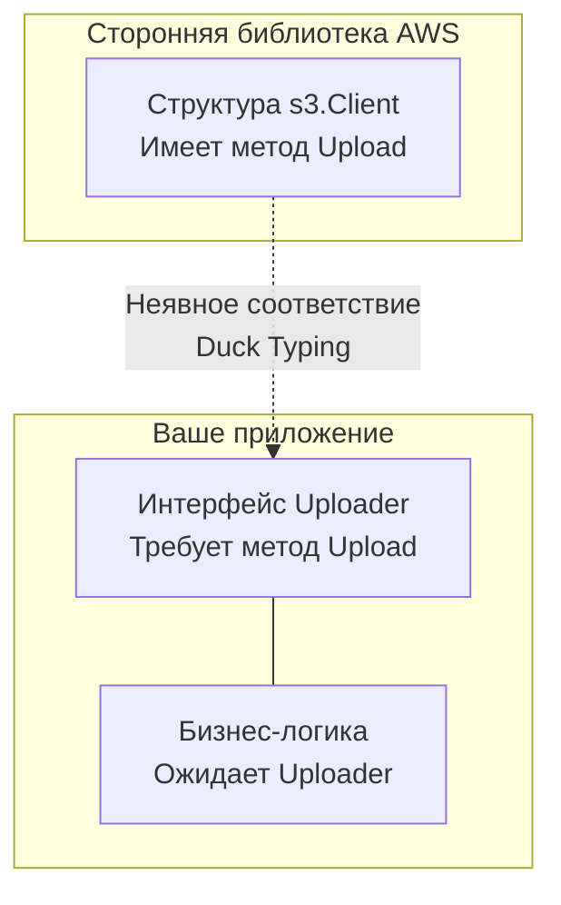

Если вы пришли в Go из Java, C# или PHP, то слово «интерфейс» ассоциируется у вас с жестким контрактом. В классическом ООП (номинативная типизация) класс обязан явно заявить, что он реализует интерфейс, используя ключевое слово `implements`. Это создает жесткую иерархическую связь: класс знает об интерфейсе на этапе своего создания.

Go переворачивает эту концепцию с ног на голову. Создатели языка посчитали, что явные декларации `implements` делают код хрупким и связывают пакеты (packages) ненужными зависимостями. 

В Go интерфейсы реализуются **неявно**. Это называется **Duck Typing (Утиная типизация)**. Если тип имеет все методы, описанные в интерфейсе, он автоматически его реализует. Никаких дополнительных ключевых слов не нужно.

В этой статье мы разберем, как утиная типизация меняет архитектуру приложений, изучим знаменитое правило «Method Sets» (на котором валится 80% кандидатов) и научимся безопасно извлекать оригинальные данные из интерфейсов.

## Утиная типизация: Разворот зависимостей

Представьте, что вы используете стороннюю библиотеку для работы с AWS S3. Библиотека предоставляет структуру `s3.Client` с десятком методов, включая `Upload(data[]byte)`.

В Java, если бы вы хотели подменить этот клиент на заглушку (Mock) для тестов, вам пришлось бы молиться, чтобы авторы библиотеки предусмотрели интерфейс `IClient`. Если они этого не сделали, вам придется писать класс-адаптер (Adapter/Wrapper).

В Go вы вообще не зависите от авторов библиотеки. Вы просто описываете интерфейс в **своем** коде:

```go
package myapp

// Мы определяем интерфейс ТАМ, ГДЕ ОН ИСПОЛЬЗУЕТСЯ
type Uploader interface {
    Upload(data[]byte) error
}

// Наша бизнес-логика зависит от интерфейса, а не от конкретного s3.Client
func ProcessAndSave(u Uploader, data[]byte) error {
    // ... логика ...
    return u.Upload(data)
}
```

Теперь вы можете передать в функцию `ProcessAndSave` как реальный `s3.Client` (потому что у него физически есть метод `Upload`), так и свой локальный `MockUploader`. Сторонняя библиотека AWS знать не знает о вашем интерфейсе `Uploader`, но её структура идеально под него подходит.



> [!tip] Собеседование
> **Вопрос:** В чем архитектурное преимущество неявных интерфейсов в Go?
> **Ответ:** Они обеспечивают абсолютную **инверсию зависимостей (Dependency Inversion)** без модификации чужого кода. Интерфейсы в Go принадлежат пакету, который их *использует*, а не пакету, который их *реализует*. Это избавляет проекты на Go от гигантских графов зависимостей и абстрактных интерфейсов, созданных "про запас".

## Маленькие интерфейсы: Идиома Go

Благодаря утиной типизации, в Go процветает **Interface Segregation Principle (Принцип разделения интерфейсов)** из SOLID.

Самые мощные и часто используемые интерфейсы в стандартной библиотеке Go состоят всего из одного метода:
- `io.Reader` (метод `Read`)
- `io.Writer` (метод `Write`)
- `fmt.Stringer` (метод `String`)
- `error` (метод `Error`)

Go поощряет **композицию интерфейсов**. Вместо создания одного гигантского `FileInterface`, вы собираете его из маленьких кусочков:

```go
// Композиция интерфейсов (Встраивание)
type ReadWriter interface {
    io.Reader
    io.Writer
}
```

### Главная архитектурная поговорка Go
> *"Accept interfaces, return structs" (Принимайте интерфейсы, возвращайте структуры)*.

Если ваша функция что-то возвращает — возвращайте конкретную структуру (например, `*os.File` или `*db.Connection`). Если вы вернете интерфейс, вы жестко ограничите пользователя тем контрактом, который придумали вы. Вернув структуру, вы позволите пользователю самому определить нужный ему микро-интерфейс (например, только `Reader`), под который эта структура неявно подойдет.

## Ловушка Method Sets: Значения против Указателей

Это **самый частый вопрос с подвохом** на собеседованиях по Go. Он напрямую вытекает из правил, которые мы изучили в статье [[22. Методы. Value Receiver и Pointer Receiver]].

Посмотрим на код:
```go
type Worker interface {
    DoWork()
}

type Job struct {
    Name string
}

// ВНИМАНИЕ: Pointer Receiver!
func (j *Job) DoWork() {
    fmt.Println("Working on", j.Name)
}

func start(w Worker) {
    w.DoWork()
}

func main() {
    j := Job{Name: "Task 1"}
    
    // ОШИБКА КОМПИЛЯЦИИ!
    // Cannot use 'j' (type Job) as type Worker in argument to start:
    // Job does not implement Worker (DoWork method has pointer receiver)
    start(j) 
}
```

Почему это не компилируется? Ведь у `Job` есть метод `DoWork`? 
Нет! Рантайм Go имеет строгие правила множества методов (Method Sets):

1. Множество методов для типа-значения (`T`) содержит **только** методы с Value Receiver (`func (t T) ...`).
2. Множество методов для типа-указателя (`*T`) содержит методы **и с Value, и с Pointer** Receiver.

>[!info] Под капотом: Почему рантайм так строг?
> В прошлой статье мы видели синтаксический сахар: компилятор может сам взять адрес `(&j).DoWork()`. Почему он не делает это при передаче в интерфейс?
> Потому что значение `j`, переданное в интерфейс `Worker`, копируется. Оно упаковывается внутрь интерфейса. И это скопированное значение может быть **неадресуемым** в памяти (unaddressable). Компилятор не может гарантировать, что он сможет безопасно взять указатель на внутреннюю копию, чтобы передать его в Pointer-метод. 
> Поэтому компилятор жестко рубит на корню: если метод требует указатель, вы **обязаны** передать указатель в интерфейс.

**Как исправить код?** Передать указатель:
```go
start(&j) // Все работает! Тип *Job удовлетворяет интерфейсу Worker.
```

## Пустой интерфейс и any

До появления дженериков (Generics) в версии Go 1.18, пустой интерфейс `interface{}` был единственным способом написать функцию, принимающую значение **любого типа**. 

Интерфейс без методов (`interface{}`) означает: "Я ожидаю тип, у которого есть хотя бы ноль методов". Очевидно, что под это правило подходят абсолютно все типы в Go: `int`, `string`, мапы, каналы, структуры.

Начиная с Go 1.18, разработчики добавили удобный псевдоним `any` (полный аналог `interface{}`), чтобы код читался проще.

```go
func PrintAnything(value any) {
    fmt.Println(value)
}
```

### Распаковка интерфейса: Type Assertion

Интерфейс в Go — это "черный ящик". Если вы положили в `any` структуру `User`, вы больше не можете обратиться к полю `value.Name` напрямую. Компилятор видит только интерфейс.
Чтобы достать оригинальные данные, используется механизм **утверждения типа (Type Assertion)**.

```go
var i any = "Hello, System!"

// Безопасное извлечение с проверкой
if str, ok := i.(string); ok {
    fmt.Printf("Это строка длиной %d\n", len(str))
} else {
    fmt.Println("Это не строка")
}
```

>[!warning] Ловушка / Gotcha: Паника при Assertion
> Если вы сделаете небезопасное утверждение `str := i.(string)` (без запятой и переменной `ok`), и внутри окажется не строка, а `int`, рантайм немедленно выбросит фатальную **панику** (`panic: interface conversion`). Всегда используйте безопасную форму с `ok` в production коде!

### Type Switch (Рефлексия на минималках)

Если интерфейс может содержать несколько разных типов (что часто бывает при парсинге неизвестного JSON или обработке событий), элегантнее всего использовать Type Switch.

```go
func handleEvent(event any) {
    switch v := event.(type) {
    case string:
        fmt.Println("Строковое событие:", v)
    case int, int64:
        fmt.Println("Числовое событие:", v)
    default:
        // В блоке default 'v' сохраняет тип any
        fmt.Printf("Неизвестный тип: %T\n", v)
    }
}
```

Это гораздо эффективнее и читабельнее, чем городить цепочку `if-else` с постоянными проверками `reflect.TypeOf()`. 

## Итог

1. **Duck Typing:** Интерфейсы реализуются неявно. Это развязывает зависимости и позволяет описывать абстракции рядом с местом их использования.
2. **Accept interfaces, return structs:** Идиоматичный паттерн, обеспечивающий максимальную гибкость для пользователей вашего кода.
3. **Method Sets:** Метод с Pointer Receiver удовлетворяет интерфейсу *только* если вы передали указатель (`&j`). Передача значения (`j`) приведет к ошибке компиляции.
4. **`any` (`interface{}`)**: Контейнер для любого типа данных. Извлекать данные обратно нужно строго с проверкой `value, ok := i.(Type)`.

Мы посмотрели на интерфейсы сверху, как на синтаксический конструкт. Но мы упустили главное: как именно компилятор понимает в рантайме, что лежит внутри интерфейса? Как работает Type Assertion на уровне процессорных инструкций? Как `interface{}` вообще хранит внутри себя любой тип, если он должен занимать строго фиксированное количество байт в памяти?

В следующей статье мы закатаем рукава, спустимся на уровень исходников рантайма (`runtime/iface.go`) и препарируем самые загадочные и важные структуры языка. Статья [[24. Интерфейсы под капотом. iface и eface]] ответит на вопрос, почему пустой интерфейс весит 16 байт и как работает динамическая диспетчеризация методов в Go.