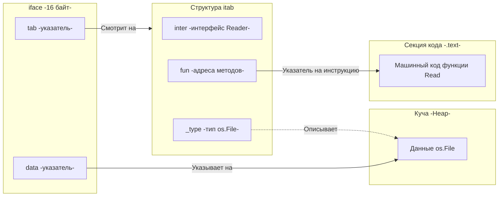

В прошлой статье мы рассмотрели утиную типизацию и архитектурные преимущества неявных интерфейсов. Мы выяснили, что переменная типа `any` (или `io.Reader`) может хранить в себе абсолютно любой тип данных, удовлетворяющий контракту.

Но для бэкенд-инженера, который заботится о тактах процессора и аллокациях памяти, здесь кроется парадокс. В Go строгая типизация. Любая переменная имеет жестко заданный размер в памяти. Тип `int64` занимает 8 байт, а структура `User` может занимать 128 байт. 
Как одна и та же переменная интерфейса может хранить в себе значения совершенно разного размера, и при этом компилятор точно знает, сколько байт под нее выделить?

Ответ кроется в исходниках рантайма Go (файл `runtime/runtime2.go`). Под капотом интерфейс — это не абстрактная концепция, а конкретная структура размером **ровно 16 байт** (на 64-битной архитектуре). 

В Go существует два вида таких структур: **`eface`** (пустой интерфейс) и **`iface`** (интерфейс с методами).

## 1. eface: Пустой интерфейс (any)

Когда вы используете `any` (или `interface{}`), вы говорите компилятору, что переменная не обязана иметь никаких методов. 
Под капотом рантайм представляет такую переменную в виде структуры `eface` (Empty Interface).

```go
// Исходный код runtime.eface
type eface struct {
    _type *_type          // Указатель на описание типа -8 байт-
    data  unsafe.Pointer  // Указатель на сами данные -8 байт-
}
```

1. **`_type`**: Это указатель на глобальную структуру в секции `.rodata` бинарного файла. Она содержит метаданные о типе: его размер в байтах, хеш, алгоритмы сравнения (компараторы) и информацию для Сборщика Мусора (GC), где внутри этого типа лежат другие указатели.
2. **`data`**: Это сырой указатель на участок оперативной памяти, где физически лежат значения вашей переменной (строки, числа или структуры).

Поскольку `eface` состоит из двух указателей, её размер всегда 16 байт. 
Если вы кладете в `any` структуру размером 1 Мегабайт, интерфейс все равно будет весить 16 байт, а сам мегабайт данных будет лежать где-то в Куче (Heap), куда будет указывать поле `data`.

## 2. iface: Интерфейс с методами

Если ваш интерфейс содержит хотя бы один метод (например, `error` имеет метод `Error() string`, а `io.Reader` имеет `Read()`), рантайм использует структуру `iface`.

```go
// Исходный код runtime.iface
type iface struct {
    tab  *itab           // Указатель на таблицу интерфейса -8 байт-
    data unsafe.Pointer  // Указатель на сами данные -8 байт-
}
```

Здесь `data` играет ту же роль — указывает на полезную нагрузку. Но вместо простого `_type`, здесь появляется сложная структура **`itab`** (Interface Table).

### Анатомия itab и Виртуальная таблица методов

`itab` — это сердце динамической диспетчеризации (Dynamic Dispatch) в Go. Эта структура вычисляется в рантайме (кэшируется) или на этапе компиляции, и она связывает конкретный тип с конкретным интерфейсом.

```go
type itab struct {
    inter *interfacetype // Описание самого интерфейса -какие методы он требует-
    _type *_type         // Описание конкретного типа данных -который мы положили-
    hash  uint32         // Копия _type.hash для быстрого Type Assertion
    _     [4]byte        // Выравнивание памяти -Padding-
    fun   [1]uintptr     // Массив указателей на функции -Методы-
}
```



Поле **`fun`** — это аналог **vtable (виртуальной таблицы методов)** из C++. Хотя в структуре описан массив из 1 элемента, на самом деле компилятор выделяет столько памяти, сколько методов в интерфейсе. В этом массиве лежат прямые физические адреса машинных инструкций конкретных методов типа.

## Mechanical Sympathy: Как происходит вызов метода?

Что физически происходит в процессоре, когда вы вызываете метод интерфейса `reader.Read()`?

В отличие от прямого вызова функции `File.Read()`, где адрес инструкции известен на этапе компиляции, вызов через интерфейс требует **динамической диспетчеризации**:

1. Процессор идет по адресу переменной `reader` и читает указатель `tab`.
2. Из структуры `itab` он читает указатель массива `fun` по нужному смещению (например, индекс 0 для первого метода).
3. Процессор извлекает адрес функции из `fun`.
4. Процессор читает указатель `data`, чтобы передать его в функцию в качестве `Receiver`.
5. Процессор совершает косвенный переход (Indirect Jump) на адрес функции.

> [!info] Под капотом: Налог на интерфейсы
> Косвенные переходы (Indirect Jumps) плохо перевариваются предсказателем ветвлений (Branch Predictor) в современных CPU. Конвейер процессора может сброситься (Pipeline Flush). Вызов метода через интерфейс в среднем **на 1-2 наносекунды медленнее**, чем прямой вызов. 
> Для 99% бизнес-логики это не имеет значения. Но в горячих циклах (например, в высокопроизводительных парсерах JSON или сетевых роутерах) разработчики стараются избегать интерфейсов, используя техники "Девиртуализации" (переход к конкретным типам).

## Механика Type Assertion (Утверждения типа)

В прошлой статье мы использовали конструкцию `str, ok := val.(string)`. Как это работает аппаратно?

Это невероятно дешевая операция (сложность $O(1)$).
Когда вы делаете Type Assertion, рантайм просто берет скрытый указатель `_type` из вашего `eface` (или `itab._type` из `iface`) и сравнивает его с адресом описания типа `string`, который компилятор вшил в бинарник.
Это **одно сравнение двух 64-битных чисел (адресов)**. Если они равны — `ok = true`, и рантайм возвращает вам данные по указателю `data`. Никаких дорогих проверок строк или обхода деревьев наследования, как в Java (оператор `instanceof`), здесь нет.

## Утечка памяти и Boxing (Упаковка)

Интерфейсы имеют свою темную сторону в вопросах управления памятью.

Вспоминаем устройство `eface` и `iface`: поле `data` — это **указатель**.
Если вы хотите положить в интерфейс обычное число (`int`), которое является значением (Value Type) и должно лежать в регистрах или на быстром стеке, вы не можете вставить его напрямую в поле `data`. 

Рантайм вынужден применить механизм **Boxing (Упаковки)**:
1. Выделить 8 байт в **Куче (Heap)** для хранения вашего числа.
2. Скопировать число туда.
3. Записать адрес в куче в поле `data` интерфейса.

```go
func DoWork(val any) {
    // ...
}

func main() {
    x := 42 
    DoWork(x) // АЛЛОКАЦИЯ! x "убегает" в кучу
}
```

> [!warning] Ловушка / Gotcha: Интерфейсы нагружают GC
> Любая передача Value-типов (`int`, `bool`, небольших структур по значению) в функцию, принимающую интерфейс (например, `fmt.Println(x)`), исторически приводила к аллокации памяти в куче (Escape to Heap), что создавало лишнюю работу для Garbage Collector'a.
> *Оговорка:* В современных версиях Go (начиная с 1.15) рантайм научился оптимизировать упаковку целочисленных констант от 0 до 255. Они указывают на заранее заготовленный статический массив в памяти и не аллоцируют кучу. Но для структур и больших чисел правило сохраняется.

## Еще раз о Typed Nil

Понимание `iface` дает нам кристальную ясность в вопросе "Typed Nil", который мы обсуждали в статье о `error` [[12. Обработка ошибок через error]].

Интерфейс равен `nil` (буквальному `nil` в коде) **только тогда, когда ОБА его указателя (`tab` и `data`) равны `0x0`**.

```go
var ptr *MyStruct = nil
var i any = ptr 

// Что внутри i?
// i._type = -указатель на описание типа *MyStruct-
// i.data  = 0x0

if i == nil {
    // МЫ СЮДА НЕ ПОПАДЕМ!
}
```

Сравнение `i == nil` проверяет интерфейс на `(0x0, 0x0)`. Но наш интерфейс содержит `_type != 0x0`. Он не равен `nil`! Он "хранит внутри себя типизированный nil".

## Итог

1. **`eface` и `iface`:** Любой интерфейс под капотом — это структура из двух указателей размером 16 байт.
2. **Dynamic Dispatch:** `iface` хранит `itab`, в котором лежат прямые адреса методов. Вызов интерфейса — это косвенный переход по указателю, который слегка тормозит процессор.
3. **Type Assertion:** Распаковка интерфейса работает за $O(1)$, так как это просто сравнение адресов описания типов в памяти.
4. **Boxing:** Помещение типов-значений (value types) в интерфейс заставляет рантайм аллоцировать память в Куче, так как интерфейс обязан хранить указатель на данные.

Мы полностью разобрались с полиморфизмом и абстракциями в Go. Но для разработчиков из ООП-языков остался нерешенным один концептуальный вопрос. Мы отбросили наследование (Inheritance) с его ключевым словом `extends`. Как тогда переиспользовать код? Как реализовать паттерн "Декоратор" или добавить новые поля к уже существующей сущности без дублирования кода?

Ответ лежит в уникальной механике Go. В следующей статье [[25. Встраивание. Embedding вместо наследования]] мы разберем, как композиция заменяет иерархии классов, и как анонимные поля создают иллюзию наследования, не ломая архитектуру.