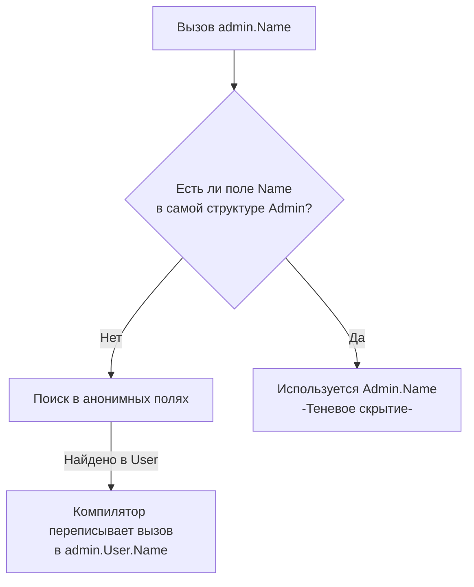

В классических ООП-языках (Java, C#, C++) основным механизмом переиспользования кода является наследование (Inheritance). Мы строим иерархии: `Vehicle` -> `Car` -> `Toyota`. Наследование реализует отношение **"является" (is-a)**. 

Однако с ростом кодовой базы глубокие иерархии становятся хрупкими (проблема базового класса). Изменение метода в родительском классе может непредсказуемо сломать десятки наследников. Знаменитая банда четырех (GoF) в книге по паттернам проектирования сформулировала правило: *"Предпочитайте композицию наследованию"*.

Создатели Go восприняли это буквально и **полностью вырезали наследование классов из языка**. В Go нет ключевого слова `extends`. Вместо этого язык предлагает механизм **Встраивания (Embedding)**, который реализует отношение **"имеет" (has-a)**, но с элегантным синтаксическим сахаром, создающим иллюзию наследования.

В этой статье мы разберем механику продвижения полей (Promotion), выясним, кто на самом деле является получателем (Receiver) встроенных методов, и разберем классическую ловушку с публичными мьютексами.

## 1. Синтаксис: Анонимные поля

Встраивание реализуется через так называемые "анонимные поля" внутри структуры. Вы просто указываете тип, не давая ему имени.


```go
type User struct {
    Name  string
    Email string
}

func (u *User) PrintProfile() {
    fmt.Printf(\"User: %s %s\n", u.Name, u.Email)
}
```

```go
// Admin ВСТРАИВАЕТ User
type Admin struct {
    User  // Анонимное поле (встраивание по значению)
    Level int
}
```

### Продвижение полей и методов (Promotion)
Главная фича встраивания — это **продвижение (Promotion)**. Все поля и методы встроенного типа `User` автоматически становятся доступны на уровне структуры `Admin`.

```go
func main() {
    admin := Admin{
        User:  User{Name: "Alice", Email: "alice@system.local"},
        Level: 1,
    }

    // Обращаемся напрямую, как будто Name принадлежит Admin!
    fmt.Println(admin.Name) 
    
    // Вызываем метод встроенного типа напрямую
    admin.PrintProfile() 
}
```

> [!info] Под капотом: Магия компилятора
> В рантайме нет никакой магии и никаких виртуальных таблиц. Компилятор Go преобразует вызов `admin.Name` в `admin.User.Name` на этапе построения абстрактного синтаксического дерева (AST). Встроенное поле неявно получает имя своего типа (в данном случае поле называется `User`). 
> С точки зрения физической памяти (о которой мы говорили в [[21. Struct. Пользовательские типы данных]]), структура `Admin` — это просто плоский кусок памяти, где сначала лежат байты структуры `User`, а за ними — байты поля `Level`.



## 2. Иллюзия наследования и фундаментальное отличие

Поскольку мы можем вызывать `admin.PrintProfile()`, кажется, что `Admin` унаследовал метод от `User`. Но здесь кроется главный вопрос с хардовых собеседований.

> [!tip] Собеседование
> **Вопрос:** Если мы вызовем `admin.PrintProfile()`, кто будет являться получателем (Receiver) внутри этого метода: указатель на `Admin` или указатель на `User`?
> **Ответ:** Получателем всегда будет оригинальный встроенный тип — **указатель на `User`**. Метод `PrintProfile` ничего не знает о существовании структуры `Admin`. Он не может обратиться к полю `admin.Level`. 
> Это радикально отличает Go от Java/C++, где метод базового класса имеет доступ к переопределенным полям и методам наследника через полиморфный `this`.

### Отсутствие полиморфизма типов
Поскольку `Admin` не является наследником `User`, вы **не можете** передать `Admin` в функцию, которая ожидает `User`:

```go
func sendEmail(u *User) {
    // ...
}

// sendEmail(&admin) // ОШИБКА КОМПИЛЯЦИИ! Admin и User — это разные типы.
sendEmail(&admin.User) // Правильно: мы передаем явное поле User.
```

Если вам нужен полиморфизм, используйте интерфейсы (как мы разбирали в [[23. Интерфейсы. Полиморфизм по-goшному]]). Структура `Admin` автоматически удовлетворяет всем интерфейсам, которым удовлетворяет встроенный `User`, так как методы продвигаются.

## 3. Переопределение методов (Shadowing)

Что делать, если `Admin` должен выводить профиль иначе? Мы можем определить метод с таким же именем для `Admin`. Это называется **Теневым скрытием (Shadowing)**.

```go
// Переопределяем метод для Admin
func (a *Admin) PrintProfile() {
    fmt.Printf("ADMIN [%d]: %s\n", a.Level, a.Name)
}

func main() {
    admin := Admin{User: User{Name: "Bob"}, Level: 5}
    
    admin.PrintProfile()      // Вызовет метод Admin.PrintProfile
    admin.User.PrintProfile() // Оригинальный метод никуда не исчез!
}
```
При коллизии имен компилятор всегда выбирает метод или поле, находящееся на самом "поверхностном" уровне структуры. Если у двух встроенных структур на одном уровне глубины есть одинаковые методы, вызов `admin.Method()` вызовет ошибку компиляции (Ambiguous selector) — придется указывать явный путь: `admin.A.Method()`.

## 4. Встраивание по указателю vs по значению

Вы можете встраивать структуры не только по значению, но и по указателю:

```go
type Admin struct {
    *User // Встраивание указателя
    Level int
}
```

Разница критически важна для управления памятью:
1. **Встраивание по значению (`User`)**: Память выделяется единым монолитным куском. Это дружелюбно к кэшу процессора. `admin.Name` работает сразу.
2. **Встраивание по указателю (`*User`)**: `Admin` хранит только 8 байт адреса. Вы **обязаны** явно инициализировать это поле (создать объект в куче), иначе при обращении `admin.Name` программа упадет с `panic: nil pointer dereference`. Это полезно, когда встроенный объект тяжелый и логически должен разделяться между разными структурами.

## 5. Встраивание интерфейсов (Декоратор "из коробки")

Это одна из самых мощных, но редко понимаемых новичками фич языка. Вы можете встроить **интерфейс в структуру**!

Это идеальный способ реализации паттерна "Декоратор" или частичного мокирования в тестах.

```go
// Допустим, это интерфейс из стандартной библиотеки
type Reader interface {
    Read(p[]byte) (n int, err error)
}

// Наш декоратор
type LoggedReader struct {
    Reader // Встраиваем интерфейс!
}

// Перехватываем метод Read
func (l LoggedReader) Read(p[]byte) (n int, err error) {
    fmt.Println("Началось чтение данных...")
    
    // Вызываем оригинальный метод встроенного интерфейса
    return l.Reader.Read(p) 
}
```

Вам не нужно писать обертки для всех остальных 50 методов (если бы это был большой интерфейс). Все непереопределенные методы автоматически "пробрасываются" во внутренний интерфейс `Reader`.
*(Главное — не забудьте положить в поле `Reader` реальный объект при инициализации `LoggedReader`, иначе получите панику при вызове).*

## 6. Антипаттерн: Публичное встраивание sync.Mutex

Классическая архитектурная ошибка Middle-разработчиков — слепое использование встраивания для сокращения кода при работе с мьютексами.

```go
// ПЛОХО: Встраивание мьютекса
type Cache struct {
    sync.Mutex // Анонимное поле
    data       map[string]string
}

func (c *Cache) Set(k, v string) {
    c.Lock() // Вау, как удобно, не нужно писать c.mu.Lock()
    defer c.Unlock()
    c.data[k] = v
}
```

Почему это ужасно? Потому что продвижение методов делает `Lock()` и `Unlock()` **публичным API** вашей структуры `Cache`. 
Любой другой разработчик, использующий ваш пакет, сможет написать:
```go
cache := NewCache()
cache.Lock() // Злоумышленник (или неопытный джун) заблокировал ваш кэш снаружи!
```

> [!warning] Ловушка / Gotcha: Инкапсуляция
> Встраивание делает методы встроенного типа частью публичного интерфейса вашей структуры (если методы начинаются с заглавной буквы). 
> **Золотое правило:** Встраивайте тип анонимно только тогда, когда вы ХОТИТЕ, чтобы его методы стали доступны внешнему миру. Если вы встраиваете тип только ради реализации внутренней логики (как мьютекс), используйте **именованное поле**: `mu sync.Mutex`. Это скроет его от глаз пользователей пакета.

## Итог

1. **Композиция вместо наследования:** Go не поддерживает иерархии классов. Структуры собираются из других структур, как лего.
2. **Promotion (Продвижение):** Методы и поля анонимных встроенных структур доступны напрямую (через точку), как если бы они принадлежали самой структуре.
3. **Receiver не меняется:** При вызове встроенного метода получателем остается внутренняя структура. Полиморфный `this` из ООП здесь не работает.
4. **Интерфейсы:** Встраивание интерфейса в структуру позволяет элегантно перехватывать и декорировать методы без необходимости реализовывать весь контракт.
5. **Инкапсуляция:** Остерегайтесь случайного раскрытия внутренних механизмов (как `sync.Mutex`) через продвижение методов.

Мы разобрались, как из кирпичиков (базовых типов и слайсов) собирать структуры, как описывать их поведение методами, связывать через интерфейсы и переиспользовать через встраивание. 

Но как управлять этим зоопарком кода в рамках реального проекта? Как скрыть приватные структуры от соседней команды и организовать архитектуру? В следующей статье [[26. Пакеты и организация кода]] мы вернемся к макро-уровню, разберем философию пакетов, циклы импортов и то, как Go заставляет нас проектировать микросервисы правильно с самого первого файла.