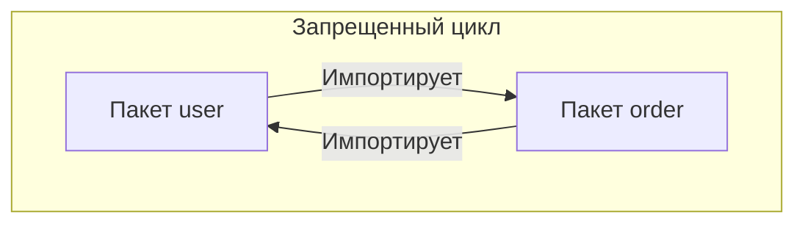
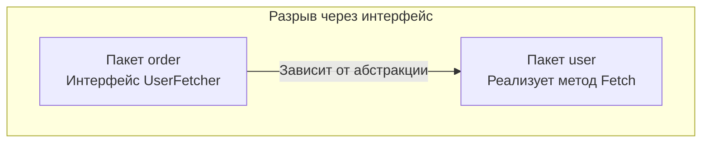

Если вы приходите в Go из экосистемы Java (Spring) или C# (.NET), то привыкли к пространствам имен (namespaces) и глубоким иерархиям папок вроде `src/main/java/com/company/project/models`. Если ваш бэкграунд — Python (Django) или Ruby on Rails, вы привыкли к фреймворкам, которые жестко диктуют, где должны лежать контроллеры, а где — представления.

В Go нет неймспейсов, нет классов и нет официального, встроенного в язык фреймворка, который бы диктовал структуру папок. Главной единицей инкапсуляции и организации кода является **пакет (package)**. 

Ошибки в проектировании пакетов на старте проекта приводят к самому страшному сну Go-разработчика: ошибке компиляции `import cycle not allowed`. В этой статье мы разберем философию пакетов, научимся строить архитектуру без циклических зависимостей и узнаем про магическую директорию `internal`.

## Иллюзия вложенности пакетов

Вспомним базовое правило из статьи [[4. Структура Go-программы. package, import, func main]]: **одна директория = один пакет**.

Самое важное, что нужно осознать (и что ломает мозг разработчикам из C#): **в Go нет концепции подпакетов (sub-packages)**. 

С точки зрения компилятора, пакет `net` и пакет `net/http` — это **абсолютно разные, независимые друг от друга пакеты**. То, что папка `http` физически лежит внутри папки `net`, не дает пакету `net/http` никаких особых привилегий. Он не имеет доступа к неэкспортируемым переменным пакета `net`, и пакет `net` не видит ничего внутри `net/http`.
Иерархия папок в Go существует только для удобства навигации разработчика (формирования логического дерева), но компилятор видит их как плоский список.

## Магия директории internal

Если все пакеты независимы, как скрыть внутреннюю реализацию вашего микросервиса или библиотеки от других команд? 

Допустим, вы пишете библиотеку для работы с базой данных, и у вас есть пакет `parser`, который парсит сырые SQL-запросы. Вы не хотите, чтобы пользователи вашей библиотеки напрямую импортировали этот `parser` (так как его API может меняться каждый день).

В Go есть встроенная в компилятор **жесткая защита** — директория `internal`.

Если вы поместите любой пакет внутрь папки с именем `internal`, компилятор разрешит импортировать его **только тем пакетам, которые лежат в том же корневом дереве, что и сама папка `internal`**.

```text
myproject/
├── main.go
├── auth/
│   ├── auth.go
│   └── internal/
│       └── crypto/    <- Этот пакет!
│           └── hash.go
└── billing/
    └── billing.go
```

> [!info] Под капотом: Компилятор и internal
> В дереве выше пакет `crypto` физически расположен по пути `myproject/auth/internal/crypto`. 
> Компилятор Go проанализирует этот путь и установит границу видимости на уровень выше папки `internal`, то есть на `myproject/auth`.
> - Пакет `myproject/auth` **сможет** импортировать `crypto`.
> - Пакет `myproject/main` **не сможет** импортировать `crypto` (ошибка компиляции).
> - Пакет `myproject/billing` **не сможет** импортировать `crypto`.
> - Любой сторонний проект на GitHub, скачавший вашу библиотеку, **не сможет** импортировать `crypto`.

Использование `internal` — это золотой стандарт разработки микросервисов на Go (Standard Go Project Layout). Вся ваша бизнес-логика должна лежать в `internal/`, чтобы никто (включая соседние скрипты или микросервисы в монорепозитории) не мог случайно привязаться к вашей внутренней реализации.

## Антипаттерны: Пакеты-помойки

Самая частая ошибка при миграции с MVC-фреймворков (вроде Laravel или Spring) — попытка сгруппировать код по техническому назначению.

**Плохо (Technical Grouping):**
- `package models` (Свалка всех структур данных)
- `package controllers` (Свалка всех HTTP-хендлеров)
- `package utils` или `helpers` (Абсолютное зло — пакеты без смысловой нагрузки)

Почему пакет `models` в Go — это антипаттерн? 
1. Это приводит к циклическим зависимостям (о чем мы поговорим ниже).
2. Имя пакета всегда используется при вызове: `models.User`, `models.Order`. Это не несет бизнес-смысла.

**Хорошо (Domain Driven Grouping):**
В Go принято группировать код по домену (предметной области). Пакет должен предоставлять законченный кусок функциональности, решая одну конкретную задачу.
- `package user` (Содержит и структуру `User`, и функции работы с ней `user.FindByID`)
- `package order` (Содержит структуру `Order` и логику ее расчета)
- `package payment` (Интеграция со шлюзами оплаты)

> [!tip] Собеседование
> **Вопрос:** Почему пакеты `util`, `common`, `base` считаются плохой практикой?
> **Ответ:** Название пакета должно описывать, **что** он предоставляет, а не **что он содержит**. Пакет `util` становится мусорным ведром для случайных функций, и со временем начинает зависеть от половины проекта, провоцируя циклы импортов. Вместо `util` следует создавать узкоспециализированные пакеты: `strutil`, `math`, `envparser`.

## Главный враг: Import Cycles (Циклические зависимости)

В языке C/C++ вы можете столкнуться с проблемой кольцевого включения заголовочных файлов, которая решается через `#pragma once` или `#ifndef`.

В Go **циклические зависимости (когда пакет A импортирует B, а B импортирует A) запрещены на уровне компилятора**. Программа просто не соберется.



### Mechanical Sympathy: Зачем Go запрещает циклы?
Это не вредность Роба Пайка. Запрет на циклические зависимости — это технический компромисс ради экстремальной скорости компиляции.
Граф зависимостей Go-программы обязан быть **направленным ациклическим графом (DAG)**. Благодаря этому планировщик компилятора может распараллелить сборку независимых пакетов по разным ядрам CPU, не дожидаясь их поочередного анализа. Если A зависит от B, компилятор собирает B, извлекает его интерфейс (экспортируемые символы) и затем собирает A. В цикле непонятно, кого собирать первым.

### Как разорвать цикл?

Если вы попали в цикл `user` <-> `order`, у вас есть проблема архитектурного дизайна. В 90% случаев это решается тремя путями:

**1. Вынос общих сущностей в третий пакет (Нижний уровень)**
Если и `user`, и `order` ссылаются на структуру `Transaction`, вынесите её в отдельный пакет `billing`. Оба пакета будут импортировать `billing`, образуя корректный V-образный граф.

**2. Объединение пакетов**
Возможно, `user` и `order` слишком тесно связаны (High Coupling). В Go нет ничего плохого в том, чтобы держать связанную логику в одном физическом пакете, разбив её на несколько файлов (`user.go`, `order.go`). Внутри одной директории импорты не нужны.

**3. Разрыв через интерфейсы (Dependency Inversion)**
Это самый мощный и красивый способ. Вы можете использовать утиную типизацию из статьи [[23. Интерфейсы. Полиморфизм по-goшному]].

Допустим, `order` хочет получить данные пользователя, но не должен импортировать пакет `user`.
Мы создаем локальный интерфейс внутри `order`:



Пакет `order` описывает то, что ему нужно:
```go
package order

// Пакет order больше ничего не знает о пакете user!
type UserFetcher interface {
    Fetch(id int) (name string, err error)
}

func Process(u UserFetcher) {
    name, _ := u.Fetch(1)
    // ...
}
```

А в функции `main` мы просто "склеиваем" их:
```go
package main

import (
    "myproject/order"
    "myproject/user"
)

func main() {
    u := user.NewService() // У него физически есть метод Fetch
    order.Process(u)       // Duck typing делает свою магию
}
```

## Эффект побочного действия (Blank Import)

Иногда нам нужно инициализировать пакет (выполнить его глобальные переменные и функции `init`), но мы не собираемся явно вызывать ни одну его функцию в коде.
Как мы знаем, компилятор Go ругается на неиспользуемые импорты. Чтобы обойти это, используется слепой импорт с подчеркиванием:

```go
import (
    "database/sql"
    _ "github.com/lib/pq" // Импорт драйвера PostgreSQL
)
```

> [!warning] Ловушка / Gotcha
> Злоупотребление функцией `init()` и слепыми импортами — это антипаттерн, который делает поведение программы непредсказуемым. Когда вы пишете `_ "pkg"`, рантайм выполняет функцию `init` этого пакета еще до старта вашего `main()`. В случае с драйвером БД этот `init` регистрирует драйвер в глобальной мапе пакета `database/sql`. В своих проектах старайтесь избегать функции `init`, заменяя её явными функциями `Setup()` или конструкторами `New()`.

## Итог

1. **Директория — это пакет.** Никаких подпакетов и иерархических привилегий.
2. **Директория `internal/`** — мощный инструмент компилятора для инкапсуляции кода от других команд и внешнего мира. Держите бизнес-логику там.
3. **Группируйте по домену**, а не по техническим абстракциям. Пакет `models` — это путь к циклическим зависимостям.
4. **DAG импортов:** Компилятор запрещает циклы ради скорости сборки. Разрывайте их через выделение независимых пакетов или использование паттерна инверсии зависимостей (через интерфейсы).
5. **Слепой импорт (`_`)** используется исключительно для сайд-эффектов (выполнения `init`), например при регистрации драйверов баз данных.

Архитектура проекта заложена. Но как внутри одного пакета скрыть внутренние структуры от внешнего мира? Мы уже упоминали, что экспорт имен в Go работает через регистр первой буквы. В следующей статье [[27. Видимость имен. export и unexport]] мы разберем эту механику досконально: узнаем, почему компилятор игнорирует маленькие буквы, как скрыть поля у экспортированной структуры и почему иногда даже "публичное" поле невозможно изменить снаружи.