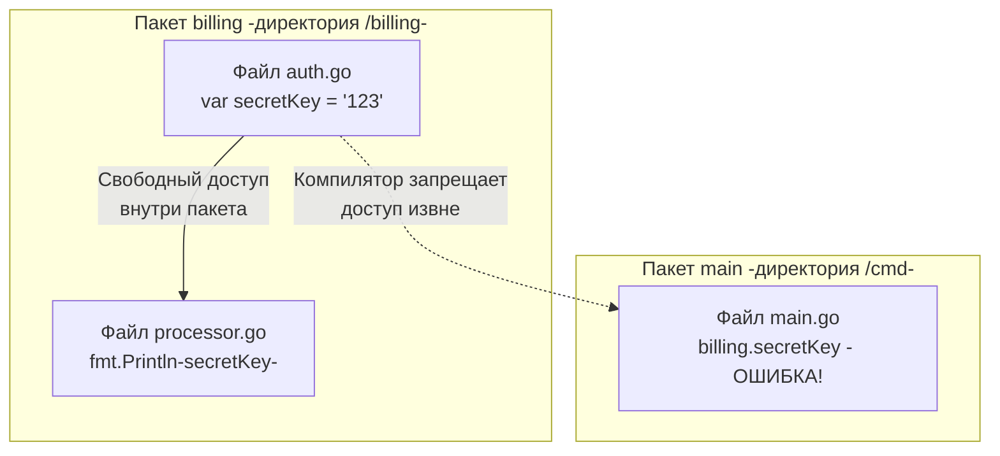

Если вы пишете на Java, C# или PHP, то инкапсуляция для вас неразрывно связана с модификаторами доступа: `public`, `private` и `protected`. Эти ключевые слова добавляют визуальный шум, заставляют писать громоздкие геттеры и сеттеры и усложняют чтение кода.

Создатели Go (Роб Пайк, Кен Томпсон) известны своей ненавистью к лишним сущностям. Они убрали модификаторы доступа из языка. В Go видимость идентификатора (переменной, функции, типа или поля структуры) определяется исключительно **регистром его первой буквы**. 

В этой статье мы разберем механику экспорта, поймем, почему в Go нет "приватности на уровне класса", и изучим продвинутый паттерн "Sealed Interfaces", который используется в стандартной библиотеке для защиты абстракций.

## Экспортируемое и Неэкспортируемое (Exported vs Unexported)

В терминологии Go не используются слова "публичный" (public) и "приватный" (private). Правильные термины: **Экспортируемый** и **Неэкспортируемый**.

Правило, зашитое прямо в лексический анализатор (Lexer) компилятора:
- Если имя начинается с **Заглавной буквы** (Upper case) — оно экспортируется (доступно из других пакетов). Пример: `User`, `Format`, `URL`.
- Если имя начинается со **строчной буквы** (Lower case) — оно не экспортируется (доступно только внутри своего пакета). Пример: `password`, `parseToken`, `cache`.

> [!info] Под капотом: Как компилятор это понимает?
> В фазе парсинга исходного кода функция `scanner.Scan()` проверяет первый символ токена через встроенную функцию `unicode.IsUpper(ch)`. 
> На этапе генерации объектных файлов (`.a`) компилятор применяет механизм **Name Mangling** (искажение имен). Экспортируемые символы записываются в таблицу символов бинарника в чистом виде (например, `User`), а неэкспортируемые "привязываются" к пути пакета, делая их вызов извне невозможным на этапе линковки.

## Границы видимости: Пакет, а не файл

Классическая ошибка разработчиков из ООП-языков — попытка инкапсулировать данные внутри структуры ("класса") или внутри одного файла.

В Go **границей видимости является пакет**. 
Если переменная или поле названы с маленькой буквы, они доступны из **любого файла** внутри этой же директории (пакета).



Вам не нужно делать переменные публичными, чтобы разбить логику одного домена на несколько файлов. Все файлы пакета видят "приватные" потроха друг друга.

## Инкапсуляция полей структуры

Само имя структуры и имена её полей экспортируются **независимо**. Это позволяет создавать мощные инкапсулированные типы.

```go
package user

// Структура User экспортируется (доступна извне)
type User struct {
    ID       string // Экспортируемое поле
    Email    string // Экспортируемое поле
    password string // Неэкспортируемое поле (инкапсулировано!)
}

// Метод доступен извне и может работать с неэкспортируемым полем
func (u *User) CheckPassword(input string) bool {
    return u.password == hash(input)
}
```

Любой другой пакет может создать экземпляр `user.User` и прочитать `ID` или `Email`, но **никто за пределами пакета `user` не сможет прочитать или изменить поле `password`**.

### Паттерн "Конструктор" (Factory Function)

Поскольку сторонний пакет не имеет доступа к полю `password`, он не сможет проинициализировать структуру напрямую через литерал. 

```go
package main

import "myproject/user"

func main() {
    // ОШИБКА КОМПИЛЯЦИИ: unknown field 'password' in struct literal
    u := user.User{
        ID: "1",
        password: "qwerty", 
    }
}
```

Чтобы решить эту проблему, в Go повсеместно используется паттерн конструкторов. Вы создаете экспортируемую функцию, которая традиционно начинается со слова `New...` и возвращает готовую структуру.

```go
// Внутри пакета user
func New(id, email, plainPassword string) *User {
    return &User{
        ID:       id,
        Email:    email,
        password: hash(plainPassword), // Мы контролируем инициализацию!
    }
}
```

>[!warning] Ловушка / Gotcha: Сериализация и JSON
> Неэкспортируемые поля (с маленькой буквы) **полностью игнорируются стандартными пакетами сериализации**, такими как `encoding/json` или `encoding/xml`.
> В статье [[21. Struct. Пользовательские типы данных]] мы обсуждали, что JSON-парсер использует рефлексию (пакет `reflect`). Рантайм Go жестко пресекает попытки рефлексии читать или изменять неэкспортируемые поля (метод `CanSet()` вернет `false`). 
> Если вы хотите, чтобы пароль никогда не попал в JSON-ответ сервера, самый надежный способ (надежнее тега `` `json:"-"` ``) — просто сделать поле неэкспортируемым (`password`).

## Неэкспортируемые типы в публичном API

Go позволяет функциям возвращать типы, которые не экспортированы. Это часто вызывает ступор у новичков.

```go
package db

// Неэкспортируемый тип
type connection struct {
    dsn string
}

// Экспортируемая функция возвращает НЕЭКСПОРТИРУЕМЫЙ тип!
func Connect() *connection {
    return &connection{dsn: "postgres://..."}
}
```

Может ли другой пакет вызвать эту функцию? Да!
Но как он сохранит результат, если тип `connection` ему недоступен? С помощью вывода типов `:=` (из статьи [[5. Переменные, константы и вывод типа]]).

```go
package main

import "myproject/db"

func main() {
    // var c *db.connection = db.Connect() // ОШИБКА: тип db.connection не найден
    
    c := db.Connect() // РАБОТАЕТ! Компилятор сам выводит тип.
    fmt.Println(c)
}
```

Однако этот паттерн считается плохим тоном (anti-pattern). Вы лишаете вызывающую сторону возможности явно типизировать параметры в своих функциях. Правильный идиоматичный подход — возвращать интерфейс (согласно правилу *"Accept interfaces, return structs"* из статьи [[23. Интерфейсы. Полиморфизм по-goшному]]).

## Sealed Interfaces (Запечатанные интерфейсы)

Это архитектурный трюк уровня Senior, который часто используется в ядре языка.
Предположим, вы создали библиотеку и описали публичный интерфейс `Event`. Вы хотите, чтобы пользователи вашей библиотеки могли передавать вам свои события, но вы **категорически запрещаете** им писать собственные реализации этого интерфейса. 

Как запретить имплементацию интерфейса сторонними пакетами? 
Добавьте в публичный интерфейс **неэкспортируемый метод**!

```go
package events

// Публичный интерфейс
type Event interface {
    Name() string
    Payload()[]byte
    
    // Неэкспортируемый метод -маркер-
    internal() 
}

// Экспортируемая структура, которая реализует этот интерфейс внутри нашей библиотеки
type SystemEvent struct {}
func (s SystemEvent) Name() string { return "sys" }
func (s SystemEvent) Payload()[]byte { return nil }
func (s SystemEvent) internal() {} // Реализовали скрытый метод
```

Если программист в пакете `main` попытается создать свой `CustomEvent`, он физически не сможет реализовать метод `internal()`, потому что метод с маленькой буквы принадлежит пространству имен пакета `events`. Его `CustomEvent` никогда не удовлетворит контракту `Event`. Интерфейс "запечатан".
Такой прием можно встретить в стандартном пакете `testing` (например, интерфейс `testing.TB`).

## Обход защиты: Пакет unsafe

Можно ли прочитать приватное поле из другого пакета, если очень хочется? 
Да, Go оставляет лазейку для системных программистов с помощью адресной арифметики.

Если вы знаете точный лейаут структуры в памяти (Memory Padding из статьи про структуры), вы можете взять адрес самой структуры, сдвинуть указатель на нужное количество байт и прочитать "приватные" данные.

```go
// Где-то в пакете secret
type Vault struct {
    PublicCode  int64
    privateCode int64
}

// В пакете main
v := secret.NewVault()
// Получаем указатель на структуру, конвертируем в число, сдвигаем на 8 байт 
// (размер PublicCode) и кастуем обратно в указатель на int64.
ptr := (*int64)(unsafe.Pointer(uintptr(unsafe.Pointer(v)) + 8))

fmt.Println("Взломанный код:", *ptr) 
```

Разумеется, в бизнес-логике использование `unsafe` для доступа к приватным полям — это абсолютное табу, которое сломается при первом же изменении порядка полей в оригинальной структуре.

## Итог

1. **Регистр решает всё:** В Go нет `public/private`. С большой буквы — экспортируется наружу, с маленькой — инкапсулируется внутри пакета.
2. **Граница — это пакет:** Файлы в одной директории видят все приватные функции и поля друг друга.
3. **Инкапсуляция полей:** Структура может быть публичной, а её поля — приватными. Инициализируйте такие структуры через функции-конструкторы `New()`.
4. **JSON-невидимки:** Неэкспортируемые поля игнорируются рефлексией и стандартными сериализаторами (JSON, XML).
5. **Sealed Interfaces:** Добавление неэкспортируемого метода в публичный интерфейс запрещает сторонним пакетам его реализовывать.

Мы разобрались, как скрывать внутреннюю логику внутри одного пакета и как организовывать связи между пакетами (вспоминая [[26. Пакеты и организация кода]]). Но все это касалось кода внутри нашего собственного проекта. 

В современном бэкенде никто не пишет всё с нуля. Как подключить к проекту драйвер PostgreSQL с GitHub? Где Go хранит версии библиотек, чтобы билд не сломался через год? И почему `GOPATH` больше не нужен? В следующей статье [[28. Модули и go.mod]] мы разберем современную систему управления зависимостями в Go, алгоритм MVS (Minimal Version Selection) и устройство файла `go.sum`.