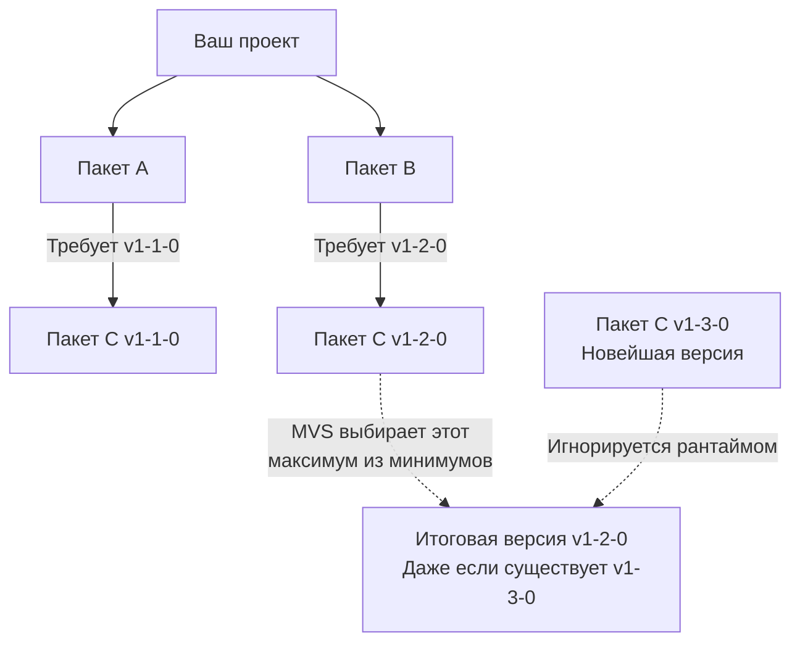

В статье [[2. Установка Go, GOPATH, GOROOT и первая программа]] мы вскользь упоминали, что современный Go не привязывает ваш код к жесткой структуре папки `GOPATH/src`. Сегодня стандартом де-факто является система модулей (Go Modules), появившаяся в версии 1.11.

Если вы пришли из мира JavaScript (npm/yarn), PHP (Composer) или Python (pip), концепция модулей в Go покажется вам знакомой, но под капотом она работает по совершенно иным, математически строгим правилам. Здесь нет центрального реестра (вроде `npmjs.com`), нет классического lock-файла, а алгоритм разрешения конфликтов версий спроектирован так, чтобы гарантировать 100% воспроизводимость сборок (Reproducible Builds) спустя годы.

В этой статье мы разберем анатомию `go.mod`, уникальный алгоритм MVS, устройство криптографического файла `go.sum` и настройку приватных репозиториев.

## 1. Анатомия модуля и go.mod

Любой проект на Go начинается с инициализации модуля:
```bash
go mod init github.com/mycompany/myproject
```

Эта команда создает файл `go.mod` в корне проекта. Директория, содержащая `go.mod`, называется **корнем модуля (Module root)**. Все пакеты во всех вложенных папках автоматически становятся частью этого модуля.

Заглянем внутрь `go.mod`:

```go
// Имя вашего модуля. Это префикс для импорта всех ваших внутренних пакетов.
module github.com/mycompany/myproject

// Минимально требуемая версия языка (и тулчейна)
go 1.21

// Прямые зависимости проекта
require (
    github.com/gin-gonic/gin v1.9.1
    github.com/google/uuid v1.4.0
)

// Транзитивные зависимости (добавленные косвенно)
require (
    golang.org/x/crypto v0.14.0 // indirect
    golang.org/x/sys v0.13.0 // indirect
)
```

### Директива module: Децентрализация
В отличие от `npm` или `maven`, где имя пакета — это просто абстрактная строка (`lodash`), в Go имя модуля — это **URL репозитория** (без протокола `https://`).
Это гениальное архитектурное решение делает экосистему децентрализованной. Когда вы делаете `go get github.com/google/uuid`, компилятор буквально знает, что нужно пойти на домен `github.com`, найти пользователя `google` и скачать репозиторий `uuid`.

### Директива replace: Локальная разработка
Если вы форкнули чужую библиотеку, чтобы исправить баг, или ведете разработку двух связанных микросервисов локально, вы можете переопределить путь поиска зависимости:
```go
replace github.com/google/uuid => ../my-local-uuid-fork
```
Компилятор проигнорирует версию из сети и возьмет исходники из локальной папки. Директива `replace` работает **только в главном go.mod** вашего проекта (она игнорируется в `go.mod` файлах ваших зависимостей).

## 2. Алгоритм MVS (Minimal Version Selection)

Это самый важный вопрос на хардовых собеседованиях при обсуждении инфраструктуры.

Представьте классическую проблему «Алмазной зависимости» (Diamond Dependency Problem). 
Ваш проект использует библиотеку `A` и библиотеку `B`.
- Библиотека `A` требует библиотеку `C` версии `v1.1.0`.
- Библиотека `B` требует библиотеку `C` версии `v1.2.0`.
- В интернете уже существует библиотека `C` версии `v1.3.0`.

**Как поведут себя классические пакетные менеджеры (npm, Cargo, Composer)?**
Они попытаются найти самую свежую (latest) версию, удовлетворяющую условиям. Скорее всего, они скачают `v1.3.0`. Если в `v1.3.0` закрался баг, ваша сборка сломается, хотя ни вы, ни авторы библиотек A и B не просили версию 1.3.0!

**Как ведет себя Go (алгоритм MVS)?**
Go выбирает **минимально возможную версию, которая удовлетворяет всем требованиям**. 
Максимум из минимумов: `v1.1.0` и `v1.2.0`. Побеждает `v1.2.0`. Версия `v1.3.0` будет полностью проигнорирована.



>[!info] Под капотом: Философия MVS
> MVS гарантирует, что добавление новой зависимости в проект не приведет к неявному обновлению старых зависимостей. Ваша сборка будет оставаться идентичной и воспроизводимой хоть 10 лет, пока вы сами явно не попросите обновить зависимости через `go get -u`.

## 3. Файл go.sum: Защита от Supply Chain Attacks

Когда вы добавляете зависимость, рядом с `go.mod` появляется файл `go.sum`. 
Многие ошибочно думают, что это аналог `package-lock.json` или `yarn.lock`. **Это не так.**
`go.mod` уже содержит точные версии благодаря алгоритму MVS (lock-файл не нужен).

`go.sum` — это база данных **криптографических контрольных сумм**.

```text
github.com/google/uuid v1.4.0 h1:1p6...
github.com/google/uuid v1.4.0/go.mod h1:TIy...
```

### Зачем он нужен?
Допустим, злоумышленник взломал GitHub-аккаунт автора библиотеки `uuid` и подменил исходный код в релизе `v1.4.0` (добавив туда бэкдор), не меняя номер версии. 
Если вы соберете проект на новом сервере CI/CD, компилятор скачает зараженный код. Но перед тем как его собрать, он посчитает его хеш (SHA-256) и сравнит с тем, что записан в вашем `go.sum`. Хеши не совпадут, и компиляция прервется с фатальной ошибкой безопасности (`SECURITY ERROR`).

Кроме того, Go сверяет хеши с публичной базой данных `sum.golang.org` (Checksum Database), чтобы убедиться, что скачанный вами код идентичен тому коду, который скачали тысячи других разработчиков по всему миру.

> [!warning] Ловушка / Gotcha: Конфликты go.sum
> При слиянии веток (git merge) в `go.sum` часто возникают конфликты. Никогда не пытайтесь разрешать конфликты в `go.sum` вручную! 
> Правильный алгоритм:
> 1. Разрешите конфликты в `go.mod`.
> 2. Выполните команду `go mod tidy`.
> Тулчейн Go сам пересчитает весь граф зависимостей, скачает недостающее, удалит мусор и сгенерирует кристально чистый `go.sum`.

## 4. Как работает go get и go mod tidy

В повседневной разработке вы будете использовать две основные команды:

- **`go get github.com/pkg/errors`** — скачивает конкретную библиотеку, добавляет её в `go.mod` и обновляет `go.sum`. 
  - `go get package@v1.2.3` — скачать конкретную версию.
  - `go get -u package` — обновить пакет до последней minor/patch версии.

- **`go mod tidy`** — генеральная уборка. Она сканирует все `.go` файлы в вашем проекте, находит все директивы `import`, проверяет их наличие в `go.mod`. Если вы добавили импорт, но не скачали библиотеку — `tidy` скачает её. Если вы удалили импорт из кода — `tidy` удалит библиотеку из `go.mod` и `go.sum`. Эта команда **обязательна** перед каждым коммитом.

### Где физически лежат скачанные зависимости?
Как мы помним из статьи о тулчейне, они кэшируются в директории `GOPATH/pkg/mod`. 
Рантайм Go скачивает версию библиотеки ровно один раз для всех проектов на вашем компьютере. 
Чтобы вы или ваша IDE случайно не отредактировали чужой код прямо в кэше (что сломало бы сборку всех остальных проектов из-за изменения контрольной суммы), рантайм скачивает файлы и делает их **Read-Only** на уровне файловой системы ОС (`chmod 444`).

## 5. Корпоративная среда и переменная GOPRIVATE

Это классическая боль при выходе на работу в Enterprise-компанию.
У вас есть внутренний репозиторий: `gitlab.company.local/core/auth`. Вы пишете `go get gitlab.company.local/core/auth` и получаете ошибку `404 Not Found` или `403 Forbidden` от сервера `proxy.golang.org`.

**Mechanical Sympathy проблемы:**
По умолчанию тулчейн Go не ходит в Git напрямую. Он оптимизирует загрузку, обращаясь к публичным прокси серверам Google (`proxy.golang.org`) и проверяя хеши в `sum.golang.org`. Естественно, серверы Google ничего не знают о вашем закрытом корпоративном GitLab, скрытом за VPN.

**Решение:**
Вы должны указать компилятору, какие домены являются приватными, с помощью переменной окружения `GOPRIVATE`.

```bash
# Указываем, что всё, что лежит на нашем гитлабе - это приватно
export GOPRIVATE="gitlab.company.local/*"
```

Когда Go видит префикс из `GOPRIVATE`, он:
1. Игнорирует публичный прокси-сервер.
2. Обращается к репозиторию напрямую через `git clone` (используя ваши локальные SSH-ключи или `.netrc` пароли).
3. **Отключает проверку хешей** через `sum.golang.org` для этого пакета (потому что Google не может посчитать хеш для закрытого кода).

> [!tip] Собеседование
> **Вопрос:** Что делает команда `go mod vendor` и зачем она нужна в 202X году?
> **Ответ:** Команда `go mod vendor` копирует исходный код всех зависимостей из глобального кэша `GOPATH/pkg/mod` прямо в папку `vendor/` внутри вашего проекта. В эпоху CI/CD это применяется в жестко изолированных (air-gapped) контурах безопасности банков или госучреждений, где сборочные сервера (Runners) физически отключены от интернета и не могут сделать `go get` в принципе. Компилятор Go автоматически подхватит код из папки `vendor/`, если она существует.

## Итог

1. **`go.mod`** — декларация вашего модуля и его прямых зависимостей. 
2. **Алгоритм MVS** гарантирует 100% повторяемость сборок (Reproducible Builds), выбирая минимально возможные (а не самые свежие) версии зависимостей из графа.
3. **`go.sum`** — это не lock-файл, а база криптографических хешей для защиты от атак на цепочку поставок (Supply Chain Attacks).
4. Команда **`go mod tidy`** — главный инструмент бэкендера для поддержания чистоты зависимостей и разрешения git-конфликтов.
5. Для работы с закрытыми корпоративными репозиториями обязательно настраивайте **`GOPRIVATE`**, чтобы тулчейн перестал стучаться за вашим приватным кодом на публичные серверы Google.

Мы разобрались, как управлять зависимостями и организовать архитектуру. Теперь пора переходить к взаимодействию нашего приложения с внешним миром. В бэкенде 90% задач сводятся к чтению из файлов, сокетов или записи в них. В следующей статье [[29. Работа с файлами и IO]] мы погрузимся в стандартные интерфейсы `io.Reader` и `io.Writer`, разберем, как Go оборачивает системные вызовы ОС, и почему `bufio` спасает ваш сервис от деградации производительности при работе с диском.