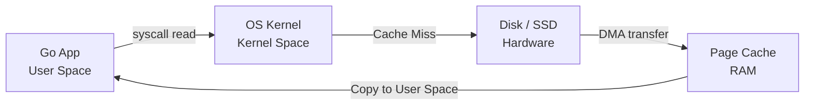

## Философия IO в Go: Всё есть поток

Если вы переходите в Go из PHP, Python или Ruby, ваш привычный опыт работы с файлами чаще всего сводится к вызовам вроде `file_get_contents()` или `File.ReadAllText()`, которые загружают всё содержимое файла в память целиком. В бэкенде это работает для скриптов, обрабатывающих один запрос за раз, но катастрофически плохо для высоконагруженных конкурентных серверов.

В Go парадигма IO кардинально иная. Она вдохновлена философией Unix: **всё есть поток байтов**. 
Вместо того чтобы работать с файлами как с монолитными кусками данных, Go рассматривает любые источники и приёмники данных (файлы на диске, сетевые соединения, буферы в памяти, сжатые потоки) как потоки, которые можно читать и писать по частям.

Фундаментом этой парадигмы являются всего два интерфейса из стандартного пакета `io`:

```go
type Reader interface {
    Read(p []byte) (n int, err error)
}

type Writer interface {
    Write(p []byte) (n int, err error)
}
```

> [!info] Под капотом
> Обратите внимание на сигнатуру `Read(p []byte)`. Go не аллоцирует память под результат, а передает слайс (буфер) внутрь метода. Рантайм Go просто записывает данные в уже выделенную память `p`. Это критически важно для GC: мы переиспользуем один и тот же буфер в куче, вместо того чтобы порождать мусор на каждую операцию чтения. Обязательно прочтите [[16. Slice. Главная структура данных в Go]], чтобы понимать, как ёмкость слайса влияет на переаллокацию буфера.

---

## Работа с файлами. Пакет `os`

Для непосредственной работы с файловой системой (FD — File Descriptors) используется пакет `os`. 

### Открытие и закрытие

Каждый открытый файл — это дескриптор файла (FD) на уровне ОС. Ресурсы ОС конечны (ulimit -n), поэтому файлы нужно обязательно закрывать.

```go
file, err := os.Open("data.txt")
if err != nil {
    log.Fatalf("не удалось открыть файл: %v", err)
}
defer file.Close() // Идиоматичный способ гарантированно закрыть файл
```

> [!warning] Ловушка / Gotcha
> Всегда проверяйте ошибку при `defer file.Close()`. В режиме записи ОС может использовать буферизацию на уровне ядра. Вызов `Close()` неявно вызывает `fsync`, сбрасывая буферы на диск. Если на этом этапе закончится место на диске, `Close()` вернёт ошибку, которую вы проигнорируете, если напишете просто `defer file.Close()`.
> В критически важных системах делают так:
> ```go
> defer func() {
>     if cerr := file.Close(); cerr != nil && err == nil {
>         err = cerr // Перезаписываем ошибку функции, только если её ещё нет
>     }
> }()
> ```

### Чтение и запись целых файлов

Начиная с Go 1.16, пакет `io/ioutil` был признан устаревшим (deprecated). Его функции переехали в `os` и `io`.

```go
// Чтение файла целиком в память (Осторожно с большими файлами!)
data, err := os.ReadFile("config.json")
if err != nil {
    log.Fatal(err)
}

// Запись слайса байтов в файл (создает файл или обрезает существующий)
err = os.WriteFile("out.bin", data, 0644) // 0644 - права доступа (rw-r--r--)
if err != nil {
    log.Fatal(err)
}
```

> [!warning] Ловушка / Gotcha
> Функция `os.ReadFile` загружает весь файл в `[]byte`. Если вы читаете лог-файл размером 5 ГБ, ваше приложение упрётся в OOM (Out of Memory) и будет убито OOM Killer'ом ОС. Для больших файлов используйте потоковое чтение.

---

## Mechanical Sympathy: Цена системного вызова

Когда вы вызываете `file.Read(buf)`, вы не просто читаете память. Вы инициируете цепочку глубоких аппаратных и программных переходов:

1. Вызов `Read()` в Go рантайме.
2. Переход из User Space в Kernel Space через системный вызов `read` (инструкция `SYSCALL` на x86_64). Процессор переключает привилегии (Ring 3 -> Ring 0) и стек.
3. Ядро ОС проверяет, есть ли запрошенные данные в **Page Cache** (кэш страниц в RAM).
4. Если данных нет в кэше, ядро инициирует чтение с диска через DMA (Direct Memory Access), блокируя текущий поток ОС.
5. Данные копируются из пространства ядра в ваш буфер `buf` в User Space.
6. Возврат из системного вызова (Ring 0 -> Ring 3).

**Системные вызовы — это дорого.** Они стоят тысячи тактов CPU и сбивают конвейер процессора.



### Буферизация: Пакет `bufio`

Как минимизировать количество syscall'ов? **Буферизацией.**
Пакет `bufio` оборачивает `io.Reader` или `io.Writer` в буферизированные обёртки.

**Запись:** Вместо того чтобы делать syscall `write` на каждую запись 10 байт, `bufio.Writer` копит данные в своем внутреннем слайсе (по умолчанию 4 КБ). Когда буфер заполняется, делается один syscall, отправляющий сразу 4 КБ на ядро.

```go
file, err := os.Create("big_log.txt")
if err != nil {
    log.Fatal(err)
}
defer file.Close()

// Оборачиваем файл в буферизированный Writer
bufWriter := bufio.NewWriter(file)

for i := 0; i < 1000000; i++ {
    // Запись идет в RAM. Syscall не происходит!
    _, err := bufWriter.WriteString("log entry line that is not too long\n")
    if err != nil {
        log.Fatal(err)
    }
}
// Обязательно сбрасываем остатки буфера на диск!
if err := bufWriter.Flush(); err != nil {
    log.Fatal(err)
}
```

**Чтение:** `bufio.Scanner` — ваш лучший друг для построчного чтения. Он сам заботится о буферизации и разрезании потока байтов на строки.

```go
file, err := os.Open("huge_log.txt")
if err != nil {
    log.Fatal(err)
}
defer file.Close()

scanner := bufio.NewScanner(file)
// По умолчанию Scanner читает строки. Можно поменять на слова или байты:
// scanner.Split(bufio.ScanWords)

for scanner.Scan() {
    line := scanner.Text() // Текущая строка без символа \n
    // Обрабатываем строку...
}

if err := scanner.Err(); err != nil {
    log.Fatal(err)
}
```

> [!tip] Собеседование
> **Вопрос:** Что будет, если строка в файле превысит размер внутреннего буфера `bufio.Scanner` (по умолчанию 64 КБ)?
> **Ответ:** `Scanner` прекратит работу и вернёт ошибку `bufio.ErrTooLong`. Чтобы читать строки произвольной длины, нужно увеличить буфер через `scanner.Buffer(buf, maxCapacity)` или использовать низкоуровневый `bufio.Reader.ReadString('\n')`, который читает до разделителя, аллоцируя новую память.

---

## Идиоматичная композиция: `io.Copy`

Частая задача — скопировать данные из Reader в Writer (например, скачать файл из сети и сохранить на диск, или заархивировать файл на лету). 

Наивный подход — выделить буфер в памяти `buf := make([]byte, 32*1024)`, читать в него из Reader и писать из него в Writer в цикле. 
Идиоматичный подход — использовать `io.Copy`.

```go
// Копирует из src в dst, используя внутренний буфер 32 КБ
written, err := io.Copy(dstWriter, srcReader)
```

> [!info] Под капотом
> `io.Copy` не просто делает цикл с `Read`/`Write`. Он проверяет, реализует ли `srcReader` интерфейс `io.WriterTo`, а `dstWriter` — `io.ReaderFrom`. Если да, он делегирует копирование им, избегая лишних аллокаций и промежуточных буферов. Например, при копировании из сетевого соединения в файл, `os.File` реализует `io.ReaderFrom` и использует системный вызов `sendfile` (Zero-copy), передавая данные от сетевой карты прямо на диск, минуя User Space вообще!

---

## Блокирующее IO и Планировщик Go

В Go сетевые операции неблокирующие (благодаря интеграции с `epoll`/`kqueue` через netpoller). Но **файловый IO в Linux является блокирующим**. 

Когда горутина вызывает `file.Read()`, рантайм Go вынужден сделать системный вызов, который заблокирует поток ОС (M). Если 1000 горутин одновременно начнут читать с диска, планировщику Go (см. [[35. Scheduler Go. G, M, P и work stealing]]) придется создать 1000 потоков ОС!

Это приводит к двум проблемам:
1. Истощение пула потоков (ошибка `fork/exec: resource temporarily unavailable`).
2. Деградации производительности из-за огромного количества блокировок на уровне планировщика ОС.

**Как решают в Production:**
1. Ограничивают конкурентность файлового IO с помощью семафоров (каналов или `sync.Mutex`).
2. Выносят тяжелый дисковый IO в пул воркеров с ограниченным числом потоков.
3. Используют асинхронные обертки поверх `io_uring` (Linux 5.1+) или библиотеки вроде `afero` для мемоизации.

---

## Пакет `io`: Утилиты для потоков

Пакет `io` содержит множество мелких, но незаменимых утилит, которые делают код чище:

1. `io.ReadAll(reader)` — читает всё из ридера до `io.EOF`. Используйте только если уверены, что источник конечный и небольшой (например, HTTP-тело JSON-запроса).
2. `io.LimitReader(reader, n)` — оборачивает ридер так, чтобы он вернул максимум `n` байт. Защита от OOM при чтении из ненадежных источников.
3. `io.TeeReader(reader, writer)` — "тройник". Всё, что читается из ридера, параллельно пишется в.writer. Идеально для логирования запросов на лету.
4. `io.MultiWriter(w1, w2)` — объединяет несколько Writer'ов в один. Пишет во все одновременно. Удобно для одновременной записи в файл и в буфер лога.

---

## Итог

1. **Интерфейсы `io.Reader` и `io.Writer`** — основа потоковой обработки данных в Go, позволяющая компоновать любые источники и приёмники.
2. **Системные вызовы дороги**. Используйте пакет `bufio` для буферизации чтения и записи, чтобы агрегировать данные в User Space и минимизировать переключения в Kernel Space.
3. **Файловый IO блокирует потоки ОС**. В отличие от сети, файлы не используют netpoller. Контролируйте количество горутин, одновременно работающих с диском.
4. **Избегайте `os.ReadFile`** для потенциально больших файлов и предпочитайте потоковую обработку (`bufio.Scanner`, `io.Copy`).
5. **Не забывайте про `Flush()`** при использовании `bufio.Writer`, иначе данные останутся в RAM и не попадут на диск.

В следующей статье мы переходим к самому популярному формату обмена данными в бэкенде. Мы разберем, как Go работает с JSON, почему `encoding/json` работает медленнее генераторов в других языках, и как этого избежать: [[30. Работа с JSON]].
