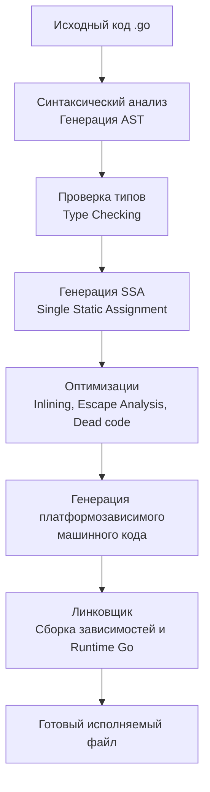

Когда вы приходите в Go из экосистемы C++ или Java, первое, что вызывает культурный шок — отсутствие внешних систем сборки. Вам не нужны CMake, Makefiles, Maven или Gradle для базовой работы (хотя Makefile часто используют как обертку для скриптов в крупных проектах). 

Создатели Go заложили весь необходимый инструментарий прямо в ядро языка — в единый бинарник `go`. Он является и компилятором, и пакетным менеджером, и тестовым фреймворком, и линтером. 

Давайте заглянем под капот основных команд тулчейна и разберемся, как они работают с исходным кодом и железом.

## 1. go build: Рабочая лошадка и кросс-компиляция

Команда `go build` собирает исходный код вместе со всеми зависимостями и рантаймом Go, выдавая на выходе готовый исполняемый файл. Она игнорирует файлы, оканчивающиеся на `_test.go`.

Одной из киллер-фич языка является **кросс-компиляция из коробки**. Вам не нужно устанавливать сложные цепочки кросс-компиляторов (cross-toolchains). Компилятор Go внутренне понимает архитектуры большинства современных процессоров (x86, ARM, MIPS) и операционных систем (Linux, Windows, macOS, FreeBSD).

Чтобы скомпилировать бинарник для Linux ARM64, сидя на MacBook с процессором x86-64, достаточно просто передать переменные окружения `GOOS` и `GOARCH`:

```bash
GOOS=linux GOARCH=arm64 go build -o app main.go
```
*(Условие: это работает идеально, пока отключен CGO. С включенным `CGO_ENABLED=1` вам всё равно понадобится системный кросс-компилятор для C-кода).*

### Под капотом компилятора

Go славится своей невероятной скоростью компиляции. В отличие от C++, где препроцессор вставляет мегабайты заголовочных файлов (headers) на каждый `#include`, Go использует строгую иерархию пакетов и кэширование объектов сборки.

Процесс сборки можно разбить на несколько этапов:



>[!info] Под капотом: SSA и Оптимизации
> В фазе **SSA** (Single Static Assignment) код переводится в промежуточное представление. Здесь компилятор применяет машинно-независимые оптимизации.
> Именно на этом этапе работает **Escape Analysis** — алгоритм, который решает, выделить переменную на дешевом стеке или отправить в кучу (Heap), нагрузив Garbage Collector. Также здесь происходит **Inlining** — подстановка тела небольших функций прямо в место их вызова, что избавляет CPU от накладных расходов на переключение контекста фрейма стека (Call frame overhead).

### Уменьшение размера бинарника
По умолчанию `go build` включает в бинарник отладочную информацию (символы таблиц DWARF), необходимую для работы дебаггеров (например, `delve`). Чтобы уменьшить размер продакшен-бинарника (иногда на 25-30%), используют флаги линковщика:
```bash
go build -ldflags="-s -w" -o app main.go
```
- `-s` удаляет таблицу символов.
- `-w` удаляет отладочную информацию DWARF.

## 2. go run: Иллюзия скриптового языка

Команда `go run` берет ваш код и немедленно исполняет его, словно это Python или PHP. 

```bash
go run main.go
```

> [!warning] Ловушка / Gotcha
> Многие начинающие думают, что в Go встроен интерпретатор. **Это не так.** 
> Go — строго компилируемый язык. При вызове `go run` тулчейн на лету компилирует код в полноценный бинарный файл, сохраняет его во временную директорию ОС (например, `/tmp/go-build...`), запускает этот бинарник, дожидается его завершения и затем удаляет.
> 
> Никогда не используйте `go run` в production-среде (через systemd или Docker CMD). Вы будете тратить процессорное время и память на компиляцию при каждом запуске контейнера, а временные файлы могут замусорить диск. Всегда собирайте артефакт через `go build`.

## 3. go test: Встроенный фреймворк тестирования

Вам не нужно искать аналоги JUnit/PHPUnit. Для написания тестов достаточно создать файл с суффиксом `_test.go` в том же пакете и написать функции, начинающиеся со слова `Test`, которые принимают указатель на `testing.T`.

```go
// Файл math_test.go
package math

import "testing"

func TestAdd(t *testing.T) {
    if Add(2, 2) != 4 {
        t.Fatal("Математика сломалась")
    }
}
```

Как это работает аппаратно? Команда `go test` собирает **отдельный синтетический бинарник**. Она генерирует временную функцию `main()`, которая по очереди вызывает все ваши `TestXxx` функции, замеряет время выполнения, выводит результаты в консоль, а затем самоуничтожается.

Полезные флаги:
- `go test -v ./...` — запустить все тесты в текущей директории и всех поддиректориях с подробным выводом.
- `go test -cover` — показать процент покрытия кода тестами.

## 4. Race Detector: Поиск гонок данных (Data Races)

Для бэкендера, пишущего высоконагруженный конкурентный код, гонки данных — это кошмар. Они возникают, когда две горутины обращаются к одной ячейке памяти одновременно, и хотя бы одна из них осуществляет запись.

Go содержит встроенный инструмент из арсенала LLVM — **ThreadSanitizer (TSAN)**. Его можно включить флагом `-race` при сборке, запуске или тестировании:

```bash
go test -race ./...
go build -race -o app main.go
```

> [!info] Под капотом: Как работает ключик -race?
> При компиляции с флагом `-race` компилятор модифицирует генерируемый машинный код. Перед **каждой** инструкцией чтения или записи в память он вставляет вызов специальной функции рантайма, которая логирует, какая горутина и когда обращалась к этому адресу. 
> Если рантайм замечает, что два разных потока трогали одну память без примитивов синхронизации (например, без `Mutex` или канала) — он моментально выводит подробный Stack Trace и (по умолчанию) роняет программу.

**Важное правило:** Никогда не катите бинарник, собранный с `-race`, в Production. Дополнительные инструкции увеличивают потребление памяти в 5-10 раз и замедляют выполнение программы в 2-20 раз. Однако прогон тестов с флагом `-race` в CI/CD пайплайнах строго обязателен.

## 5. Вспомогательные утилиты

Go содержит мощные инструменты статического анализа "из коробки":

### go fmt
Автоматически форматирует код по единому, жестко заданному стандарту. 

> [!tip] Собеседование
> В Go нет споров о том, где ставить скобку — на той же строке или на новой. `gofmt` (под капотом `go fmt`) использует пакет `go/ast` (Abstract Syntax Tree) для разбора вашего кода в дерево и его обратной генерации в текст по единым правилам. Это экономит тысячи человеко-часов на code review, полностью убивая "холивары" о стиле форматирования.

### go vet
Встроенный статический анализатор. Он ищет подозрительные конструкции, которые компилятор пропускает (т.к. они синтаксически верны), но которые скорее всего являются логической ошибкой:
- Несовпадение аргументов в `fmt.Printf`.
- Копирование мьютекса `sync.Mutex` по значению (копирование замка ломает его механику).
- Недостижимый код или бесконечные циклы хитрого вида.

### Build Tags (Теги сборки)
Иногда нужно скомпилировать разный код для разных ОС (например, использовать `epoll` на Linux и `kqueue` на macOS). Go позволяет управлять сборкой файлов с помощью комментариев-директив в самом начале файла:

```go
//go:build linux

package netpoll
// Этот файл попадет в бинарник только если GOOS=linux
```
При кросс-компиляции `go build` просто проигнорирует этот файл для Windows или macOS.

## Итог

1. `go build` компилирует независимые исполняемые файлы. Механика кросс-компиляции (`GOOS/GOARCH`) встроена в ядро языка.
2. Сборка идет быстро благодаря строгой системе пакетов и кэшированию, а компилятор применяет мощные оптимизации вроде Escape Analysis.
3. `go run` — это просто скрытая компиляция во временный файл.
4. Встроенный Race Detector (`-race`) — ваш главный союзник в поиске багов конкурентности, но он слишком "тяжелый" для продакшена.
5. Инструментарий Go сам покрывает нужды форматирования (`fmt`), линтинга (`vet`) и тестирования (`test`), не требуя сторонних инструментов.

Разобравшись с тулчейном, пора погрузиться в сам код. В следующей статье [[4. Структура Go-программы. package, import, func main]] мы в деталях разберем, как организуется структура файлов, что такое пакеты и как компилятор собирает приложение из множества разных файлов.