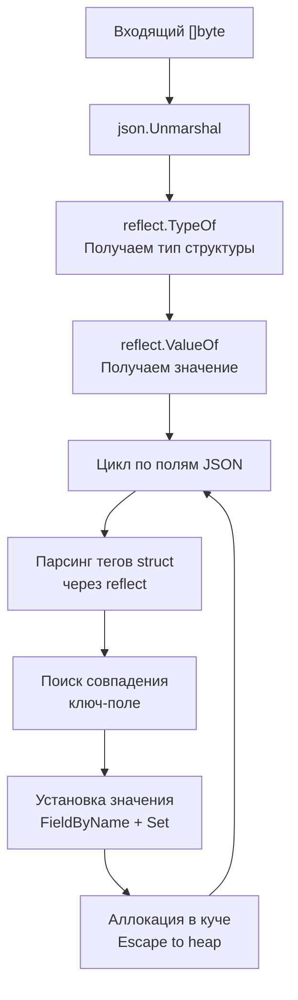

## JSON в Go: Между удобством и производительностью

JSON (JavaScript Object Notation) — кровеносная система современного бэкенда. 99% API общаются через него. В Go работа с JSON построена вокруг стандартного пакета `encoding/json`, который следует главной философии языка: **явное лучше неявного**, а рефлексия — это неизбежное зло, которое нужно контролировать.

Если вы пришли из PHP (`json_decode`) или Python (`json.loads`), где JSON разворачивается в динамические словари, в Go вас ждет суровый статический мир. Мы не парсим JSON "как есть". Мы десериализуем его в строго типизированные структуры (structs).

---

## Базовые операции: Marshal и Unmarshal

В Go принято разделять термины: сериализация (в байты) называется **Marshal**, а десериализация (из байт) — **Unmarshal**.

### Unmarshal: JSON -> Struct

```go
package main

import (
	"encoding/json"
	"fmt"
	"log"
)

// Структура должна быть экспортируемой (с заглавной буквы)
type User struct {
	ID    int    `json:"id"`
	Name  string `json:"name"`
	Email string `json:"email"`
}

func main() {
	jsonData := []byte(`{"id": 1, "name": "Alice", "email": "alice@example.com"}`)

	var user User
	// Передаем указатель, чтобы Unmarshal мог заполнить структуру
	err := json.Unmarshal(jsonData, &user)
	if err != nil {
		log.Fatalf("Unmarshal error: %v", err)
	}

	fmt.Printf("%+v\n", user) // {ID:1 Name:Alice Email:alice@example.com}
}
```

### Marshal: Struct -> JSON

```go
user := User{ID: 2, Name: "Bob", Email: "bob@example.com"}

// Marshal возвращает слайс байт и ошибку
jsonData, err := json.Marshal(user)
if err != nil {
	log.Fatal(err)
}
fmt.Println(string(jsonData)) // {"id":2,"name":"Bob","email":"bob@example.com"}
```

---

## Структурные теги (Struct Tags)

Пакет `encoding/json` полностью игнорирует поля структур, которые начинаются со строчной буквы (неэкспортируемые). Но в JSON приняты другие конвенции именования (обычно `snake_case` или `camelCase`). Для маппинга имен используются **структурные теги** — метаданные, которые читаются через рефлексию на этапе рантайма.

```go
type ServerConfig struct {
	Host      string `json:"host"`             // Маппинг на ключ "host"
	Port      int    `json:"port"`             // Маппинг на ключ "port"
	SecretKey string `json:"-"`                // Ключ "-" означает: ПОЛНОСТЬЮ ИГНОРИРОВАТЬ поле
	Timeout   int    `json:"timeout,omitempty"` // Опускать поле, если оно равно zero-value (0, "", nil, false)
}
```

> [!warning] Ловушка / Gotcha
> Будьте крайне осторожны с `omitempty` для типов `time.Time` или других struct'ов. В Go zero-value для `time.Time` — это не `nil`, это валидная дата (0001-01-01). Если вы пометите `time.Time` как `omitempty`, то валидная дата, если она совпадет с zero-value, будет удалена из JSON. Используйте указатель `*time.Time`, чтобы `nil` корректно удалялся, а валидная дата (даже нулевая) оставалась.

---

## Произвольные данные: `any` и `json.RawMessage`

Что делать, если структура JSON заранее неизвестна или часть payload может иметь разную структуру?

### `map[string]any` (бывший `map[string]interface{}`)
Подходит для динамического парсинга, но вы теряете типизацию и получаете массу аллокаций.

```go
var data map[string]any
json.Unmarshal([]byte(`{"key": "value", "num": 123}`), &data)
// Придется делать type assertion, что неидиоматично и чревато паниками
num, ok := data["num"].(float64) // Внимание: JSON числа ВСЕГДА парсятся во float64!
```

### `json.RawMessage`
Идеальный инструмент для частичного парсинга или отложенной десериализации. `RawMessage` — это просто `[]byte`, который реализует интерфейсы `Marshaler` и `Unmarshaler`.

```go
type Envelope struct {
	Type string          `json:"type"`
	Data json.RawMessage `json:"data"` // Данные не парсятся, остаются как байты
}

payload := []byte(`{"type": "user_created", "data": {"id": 1, "name": "Alice"}}`)

var env Envelope
json.Unmarshal(payload, &env)

// Парсим Data только когда поняли тип
if env.Type == "user_created" {
	var user User
	json.Unmarshal(env.Data, &user)
}
```

> [!info] Под капотом
> Использование `json.RawMessage` — классический паттерн для обработки вебхуков или реализации паттерна [[25. Встраивание. Embedding вместо наследования|встраивания]] в DTO. Вы экономите CPU, не парся глубокие структуры, которые вам сейчас не нужны.

---

## Потоковая работа: `Encoder` и `Decoder`

Функции `Marshal`/`Unmarshal` работают с полным слайсом байт `[]byte`. Но что если вы читаете JSON прямо из TCP-соединения или HTTP-тела размером в гигабайты? Загружать всё в память — прямой путь к OOM.

Для потоковой работы (Streaming IO) в пакете есть `json.Encoder` и `json.Decoder`. Они реализуют запись/чтение через интерфейсы `io.Writer` и `io.Reader`, неразрывно связанные с [[29. Работа с файлами и IO]].

```go
// Запись (сервер отправляет JSON в http.ResponseWriter)
func handler(w http.ResponseWriter, r *http.Request) {
	user := User{ID: 1, Name: "Alice"}
	
	// Encoder пишет напрямую в w, без промежуточного []byte
	err := json.NewEncoder(w).Encode(user)
	if err != nil {
		http.Error(w, err.Error(), http.StatusInternalServerError)
	}
}

// Чтение (сервер читает JSON из тела запроса)
func handlerPost(w http.ResponseWriter, r *http.Request) {
	var user User
	
	// Decoder читает напрямую из r.Body, без загрузки всего тела в RAM
	err := json.NewDecoder(r.Body).Decode(&user)
	if err != nil {
		http.Error(w, "bad request", http.StatusBadRequest)
		return
	}
}
```

> [!warning] Ловушка / Gotcha
> Автоматическая защита от OOM: `json.Decoder` по умолчанию отклоняет JSON-документы, содержащие глубину вложенности более 10 000 уровней (защита от stack overflow через злонамеренные payload'и). Если вам нужно менять этот лимит, используйте `decoder.DisallowUnknownFields()` или другие методы конфигурации Decoder'а.

---

## Под капотом: Рефлексия и аллокации

Почему `encoding/json` в Go считается медленным в сравнении с решениями в C++ или Rust?

Процесс `Unmarshal` выглядит примерно так:



1. **Рефлексия (`reflect`)**: На каждом запросе рантайм Go с помощью рефлексии "вскрывает" структуру, анализирует её поля, сверяет имена с ключами JSON. Рефлексия работает медленно и не поддается инлайнингу компилятором.
2. **Утечки в кучу (Escape Analysis)**: Интерфейс `any` и `reflect.Value` заставляют данные уходить в кучу. Для каждого числа или строки, которую парсер не может записать напрямую в стек, происходит аллокация. А где аллокации — там работа [[7. Глубокий Go. Внутреннее устройство|Garbage Collector]].
3. **UTF-8 валидация**: Строки в Go — это байты, не обязательно валидный UTF-8. А JSON требует UTF-8. `encoding/json` валидирует строки на лету, что занимает CPU.

---

## Производительность: Кодогенерация

Как Go-сообщество решает проблему медленного стандартного JSON-парсера? **Кодогенерацией.**

Вместо того чтобы анализировать структуру через рефлексию на рантайме, мы генерируем Go-код, который жестко прописывает логику парсинга конкретной структуры на этапе компиляции.

Популярные решения:
- **`easyjson`**: Генерирует частичный код. Работает в 2-3 раза быстрее стандартного пакета и почти не аллоцирует в кучу.
- **`go-json`**: Дроп-ин замена `encoding/json` с гибридным подходом (использует оптимизации ассемблера и кэширование структур).
- **`sonic` (от ByteDance)**: Самый быстрый парсер на данный момент. Использует JIT-компиляцию и SIMD-инструкции процессора для парсинга JSON на лету, а также написан частично на ассемблере.

> [!tip] Собеседование
> **Вопрос:** Почему `json.Unmarshal` в числах с плавающей точкой может терять точность при парсинге больших int64? Как этого избежать?
> **Ответ:** Спецификация JSON не разделяет целые и дробные числа. Стандартный парсер `encoding/json` при десериализации в `any` использует `float64`. `float64` имеет 53 бита под мантиссу, поэтому целые числа больше $2^{53}$ теряют точность.
> Чтобы избежать этого, нужно использовать тип `json.Number` (строковое представление числа под капотом) или десериализовать строго в `int64`.

---

## HTML-экранирование: Сюрприз для API

В `encoding/json` есть встроенная "защита" для HTML. По умолчанию `json.Marshal` экранирует символы `<`, `>`, `&` в строки (превращая их в `\u003c`, `\u003e`, `\u0026`). Это было сделано для безопасной встраивания JSON прямо в HTML-теги (защита от XSS).

Но если вы отдаете JSON по API, ваши клиенты (фронтендеры) увидят "испорченные" строки.

Отключить это в `Marshal` нельзя. Нужно использовать `Encoder`:

```go
var buf bytes.Buffer
enc := json.NewEncoder(&buf)
enc.SetEscapeHTML(false) // Отключаем экранирование
enc.Encode(data)
```

> [!warning] Ловушка / Gotcha
> Многие не знают про `SetEscapeHTML(false)` и создают "костыли" в виде `strings.Replace`, чтобы починить API-ответы. Это не только медленно, но и ломает легитимные данные, если они действительно содержат escape-последовательности. Всегда используйте `Encoder` с `SetEscapeHTML(false)` для REST API.

---

## Итог

1. **Статическая типизация**: В Go JSON маппится на структуры через теги. Никаких динамических объектов.
2. **Потоковая обработка**: Для работы с HTTP и сетью всегда используйте `json.Encoder`/`json.Decoder`, чтобы не аллоцировать гигантские слайсы байт.
3. **Цена рефлексии**: Стандартный `encoding/json` медленный из-за использования пакета `reflect` и аллокаций в кучу.
4. **Кодогенерация**: В высоконагруженных системах (`10k+ RPS`) стандартный парсер становится узким местом. Переход на `easyjson` или `sonic` — стандартная практика.
5. **Безопасность**: Не забывайте про `SetEscapeHTML(false)` в API и `json.Number` для больших чисел.

В следующей статье мы разберемся с тем, что является фундаментом для любого таймаута, логирования и шедулинга в бэкенде — временем. Мы посмотрим, как Go работает с `time.Time`, почему монотонные часы спасают от проблем с NTP, и как работают таймеры под капотом: [[31. Время и даты. time.Time, Duration, Timer, Ticker]].
