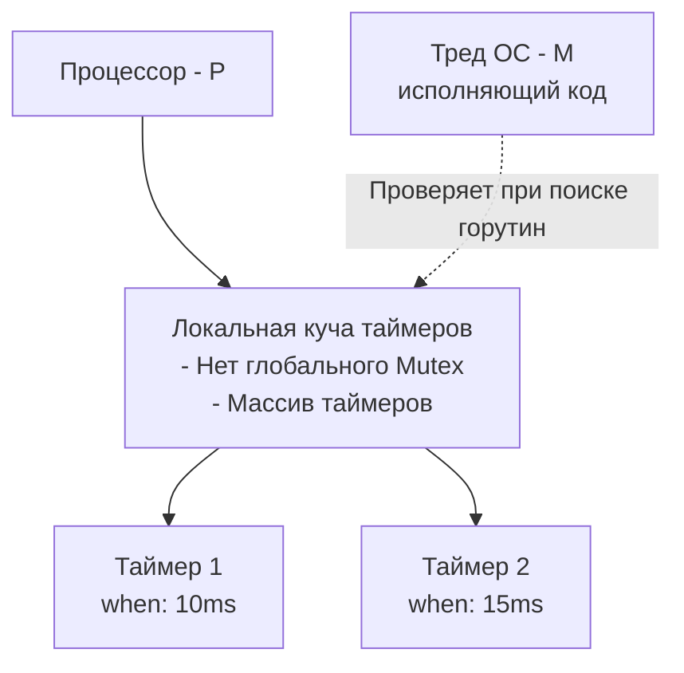

Работа со временем в программировании — это всегда минное поле. Високосные секунды, переходы на летнее время, рассинхронизация часов на серверах в кластере и обновление часовых поясов политиками разных государств. 

Большинство языков (например, PHP или ранние версии Java и C++) исторически опирались на простой Unix Timestamp (количество секунд с 1 января 1970 года). Но в распределенных высоконагруженных системах такой подход приводит к катастрофам.

Пакет `time` в Go спроектирован с учетом опыта системного программирования. Он скрывает за собой сложную механику взаимодействия с часами операционной системы, предоставляя потокобезопасный и идиоматичный API.

---

## 1. Wall Clock против Monotonic Clock

Это самая важная концепция, которую нужно усвоить бэкенд-разработчику для профилирования и измерения времени.

В любом современном компьютере есть двое «часов»:
1. **Wall Clock (Настенные часы):** Показывают текущее время для людей. Они подвержены изменениям: администратор может перевести время, или демон **NTP (Network Time Protocol)** может синхронизировать часы сервера и «отмотать» их назад, если они спешили.
2. **Monotonic Clock (Монотонные часы):** Внутренний счетчик операционной системы (в Linux это `CLOCK_MONOTONIC`). Он стартует при загрузке ОС и **всегда идет только вперед**. На него не влияет NTP или ручной перевод времени.

> [!warning] Ловушка / Gotcha
> Если вы измеряете продолжительность операции (например, запроса к БД) с помощью Wall Clock, вы можете получить отрицательное время!
> Пример из других языков: `t1 := unix_timestamp(); do_work(); t2 := unix_timestamp(); print(t2 - t1);`. Если между `t1` и `t2` произошла синхронизация NTP и часы сдвинулись назад, результат будет отрицательным.

В Go структура `time.Time` спроектирована гениально: она может хранить **оба** значения одновременно.

Когда вы вызываете `time.Now()`, Go запрашивает у ОС и Wall Clock, и Monotonic Clock, и упаковывает их в один объект.

```go
package main

import (
	"fmt"
	"time"
)

func main() {
	start := time.Now() // Сохраняет и Wall, и Monotonic время
	
	// Эмуляция долгой работы
	time.Sleep(100 * time.Millisecond)
	
	// time.Since использует ТОЛЬКО Monotonic часть из start (если она там есть),
	// гарантируя точное измерение, даже если системное время изменилось!
	elapsed := time.Since(start) 
	
	fmt.Printf("Прошло: %v\n", elapsed)
}
```

> [!info] Под капотом: Устройство time.Time и Memory Layout
> Структура `time.Time` занимает **24 байта** памяти (на 64-битных системах) и выглядит так:
> ```go
> type Time struct {
>     wall uint64    // Битовая маска: флаг наличия monotonic, 33 бита секунд, 30 бит наносекунд
>     ext  int64     // Если есть monotonic - тут лежат секунды от старта ОС. Иначе - секунды от 1 года н.э.
>     loc  *Location // Указатель на таймзону (8 байт)
> }
> ```
> Обратите внимание на `loc *Location`. Если вы передаете `time.Time` по значению (а это идиоматичный подход в Go: мы передаем `time.Time`, а не `*time.Time`), вы копируете 24 байта, что очень дешево для CPU. Указатель на Location шарится между копиями.

### vDSO и Mechanical Sympathy
Получение текущего времени — это системный вызов (`clock_gettime` в Linux). Как мы знаем из прошлых статей, syscall — это дорого из-за смены контекста Ring 3 -> Ring 0. 
Если ваша система профилирования замеряет каждый чих, вызывая `time.Now()` миллионы раз в секунду, приложение должно было бы встать колом. 

Но этого не происходит. Почему?
Go использует механизм **vDSO (Virtual Dynamically Shared Object)**. Ядро Linux мапит страницу памяти с текущим временем прямо в User Space вашего процесса. Вызов `time.Now()` в Go превращается в обычное чтение из памяти без переключения контекста процессора! Это работает в сотни раз быстрее классического syscall'а.

---

## 2. time.Duration: Типобезопасные интервалы

Во многих языках таймауты передаются как числа (int). `setTimeout(func, 1000)` — это 1000 секунд или миллисекунд? Нужно читать документацию.

В Go время — это тип. `time.Duration` под капотом — это просто `int64`, хранящий количество **наносекунд**.

```go
// src/time/time.go
type Duration int64

const (
	Nanosecond  Duration = 1
	Microsecond          = 1000 * Nanosecond
	Millisecond          = 1000 * Microsecond
	Second               = 1000 * Millisecond
	Minute               = 60 * Second
	Hour                 = 60 * Minute
)
```

Это защищает вас от ошибок размерностей на этапе компиляции. Вы не можете передать `10` в функцию, ожидающую `time.Duration`. Вы обязаны написать `10 * time.Second`.

---

## 3. Магия форматирования: "2006-01-02 15:04:05"

Это, пожалуй, самая странная фича Go для новичков. Вместо привычных паттернов вроде `YYYY-MM-DD HH:mm:ss`, Go использует референсную дату:

**02 января 2006 года, 15:04:05 по таймзоне MST (GMT-07:00).**

Почему именно она? Если посмотреть на это в американском формате (Месяц/День/Время/Год/Таймзона), то получится: `01/02 03:04:05PM '06 -0700`.
То есть это цифры от 1 до 7 по порядку!

```go
package main

import (
	"fmt"
	"time"
)

func main() {
	now := time.Now()
	
	// Форматирование в ISO 8601 / RFC 3339
	fmt.Println(now.Format(time.RFC3339))
	
	// Кастомный формат
	custom := now.Format("02.01.2006 (15:04)")
	fmt.Println(custom)
	
	// Парсинг
	parsed, err := time.Parse("2006-01-02", "2024-10-15")
	if err != nil {
		panic(err)
	}
	fmt.Println(parsed.Year())
}
```

> [!tip] Собеседование
> **Вопрос:** Что будет, если при форматировании написать `"2006-02-01"` вместо `"2006-01-02"`?
> **Ответ:** Go не выбросит ошибку! Он просто воспримет `02` (которое на месте месяца) как день, а `01` (которое на месте дня) как месяц. Ваш лог или база данных наполнится абсолютной чушью, где месяцы и дни поменяны местами. Всегда проверяйте паттерн формата.

---

## 4. Таймзоны и проблема tzdata в Docker

Таймзоны — это политическая, а не географическая концепция. Правила перехода на летнее время регулярно меняются правительствами. Эти правила хранятся в базе данных `tzdata` операционной системы.

В Go за это отвечает `time.Location`.

```go
loc, err := time.LoadLocation("Europe/Moscow")
if err != nil {
    // Внимание! Эта ошибка возникнет в production, если в контейнере нет tzdata!
    panic(err)
}
timeInMSK := time.Now().In(loc)
```

> [!warning] Ловушка / Gotcha
> Бэкенд-разработчики любят собирать минималистичные Docker-образы (например, `alpine` или `scratch`). В образе `scratch` (пустом) нет базы `tzdata`!
> Вызов `time.LoadLocation("Europe/Moscow")` вернет ошибку.
> **Решение:** Добавляйте зависимость `tzdata` в ваш `Dockerfile` или импортируйте пакет `_ "time/tzdata"`, который вошьет базу прямо в бинарник (увеличит его размер на ~400 КБ).

---

## 5. Таймеры и Тикеры: Каналы событий

Часто в бэкенде нужно сделать паузу (без блокировки системного треда), ограничить время выполнения или выполнять задачу периодически. Для этого используются `time.Timer` и `time.Ticker`. Оба работают через [[36. Каналы. Передача данных между горутинами]].

### time.Timer (Одноразовое событие)
Создает канал `C`, в который будет отправлено текущее время после истечения интервала.

```go
timer := time.NewTimer(2 * time.Second)
defer timer.Stop() // Всегда останавливайте таймер, если он больше не нужен!

<-timer.C // Горутина заблокируется здесь на 2 секунды
fmt.Println("Таймер сработал")
```

### Утечка памяти с time.After
`time.After` — это удобная обертка над `time.NewTimer`, которая сразу возвращает канал. Но это самая частая причина утечек памяти в Go.

> [!warning] Ловушка / Gotcha (Классика собеседований)
> Посмотрите на этот код обработчика очереди сообщений:
> ```go
> func processMessages(ch <-chan []byte) {
>     for {
>         select {
>         case msg := <-ch:
>             handle(msg)
>         case <-time.After(1 * time.Hour): // УТЕЧКА!
>             fmt.Println("Нет сообщений целый час, завершаю работу")
>             return
>         }
>     }
> }
> ```
> **В чем проблема?** Функция `time.After` создает *новый* таймер под капотом **каждую итерацию цикла**. Если сообщения в `ch` поступают 1000 раз в секунду, вы будете создавать 1000 таймеров в секунду, каждый из которых будет висеть в памяти ядра Go **целый час**, прежде чем сборщик мусора сможет его удалить (так как рантайм держит на него ссылку).
> 
> **Как правильно:**
> ```go
> timer := time.NewTimer(1 * time.Hour)
> defer timer.Stop()
> 
> for {
>     select {
>     case msg := <-ch:
>         handle(msg)
>         // Сбрасываем таймер безопасно
>         if !timer.Stop() {
>             <-timer.C // Очищаем канал, если таймер уже сработал
>         }
>         timer.Reset(1 * time.Hour)
>     case <-timer.C:
>         return
>     }
> }
> ```

### time.Ticker (Многоразовое событие)
`Ticker` отправляет тики с заданным интервалом постоянно.

```go
ticker := time.NewTicker(1 * time.Second)
defer ticker.Stop() // Если не вызвать Stop, Ticker останется в памяти навсегда!

done := make(chan bool)
go func() {
	time.Sleep(5 * time.Second)
	done <- true
}()

for {
	select {
	case t := <-ticker.C:
		fmt.Println("Тик в:", t)
	case <-done:
		fmt.Println("Завершение")
		return
	}
}
```

---

## 6. Под капотом: Как рантайм Go управляет таймерами

В старых версиях Go (до 1.14) все таймеры хранились в одной глобальной куче (Min-Heap). Был отдельный системный тред (горутина-timerproc), который просыпался и проверял эту кучу. Это создавало чудовищный **Contention (конкуренцию за блокировку)** — на системах с 64 ядрами, где тысячи горутин создавали таймеры, глобальный мьютекс убивал всю производительность.

Начиная с Go 1.14, архитектуру таймеров переписали. Теперь они интегрированы прямо в [[35. Scheduler Go. G, M, P и work stealing]] и сетевой поллер (`netpoll`).

1. У каждого логического процессора **P** (Processor) есть **своя локальная куча таймеров** (поля `timers` и `timer0When` в структуре `p`).
2. Больше нет глобального мьютекса. Создание таймера (`time.NewTimer` или `time.Sleep`) просто добавляет его в локальную кучу текущего `P` с помощью атомарных операций или спинлока.
3. Проверка таймеров происходит не отдельным тредом, а **самим планировщиком**. Когда тред ОС (`M`), привязанный к `P`, ищет работу (горутины для выполнения), он заодно проверяет свою локальную кучу таймеров. Если таймер протух, `M` закидывает в канал таймера время и будит горутину, которая этого ждала.



> [!info] Под капотом: Netpoll
> Что если все горутины спят, и процессор не делает полезной работы? Кто разбудит тред, чтобы он проверил кучу таймеров?
> Планировщик передает время самого ближайшего таймера в `netpoll` (который использует `epoll` на Linux / `kqueue` на MacOS). Тред засыпает внутри системного вызова ядра (например `epoll_wait`), но ОС разбудит его ровно тогда, когда придет время для срабатывания таймера Go! 

---

## Итог

1. **`time.Time`** содержит и Wall clock (подвержено сдвигам), и Monotonic clock (для измерения интервалов). Используйте `time.Since()` для замеров времени выполнения, это защитит от NTP сдвигов.
2. **`time.Duration`** — безопасный тип-обертка над наносекундами.
3. **Таймзоны** зависят от ОС (`tzdata`). В minimal-контейнерах их нужно внедрять вручную (`_ "time/tzdata"`).
4. **`time.After`** в `for-select` циклах — источник утечек памяти. Используйте и переиспользуйте `time.NewTimer`.
5. **Рантайм-таймеры** в современных версиях Go работают невероятно быстро благодаря интеграции в локальные процессоры (P) планировщика и отказу от глобальных блокировок.

Понимание того, как работают структуры данных и интерфейсы времени, плавно подводит нас к тому, как создавать гибкий код. До версии 1.18 в Go не было возможности писать алгоритмы, не зависящие от типа данных (например, функцию `Min`, работающую и с `int`, и с `float`, и с `time.Duration`), что часто заставляло использовать пустые интерфейсы или кодогенерацию. В следующей статье мы разберем поворотную веху в развитии языка: [[32. Дженерики. Type Parameters и Constraints]].