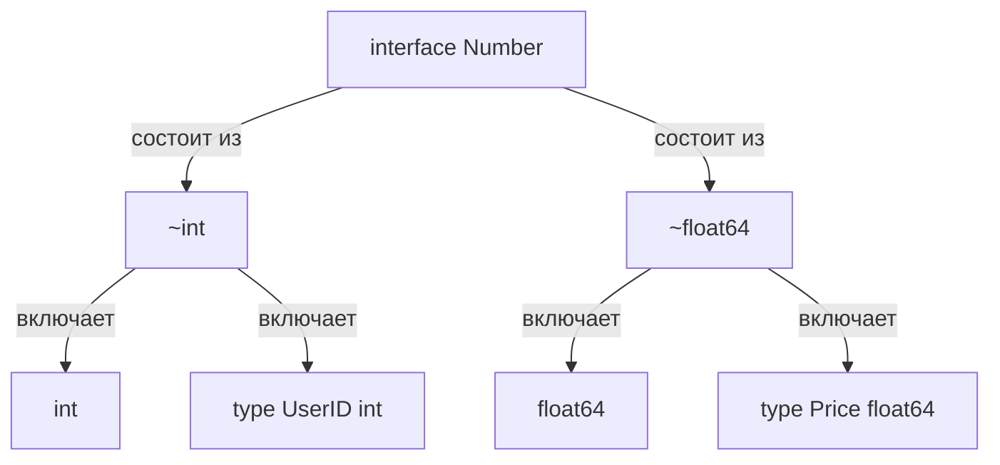

До релиза Go 1.18 бэкенд-разработчики жили в состоянии компромисса. Если вам нужно было написать функцию `Min`, возвращающую минимальное из двух чисел, или реализовать структуру данных `Stack`, вы стояли перед выбором из трех зол:

1. **Дублирование кода:** Написать `MinInt`, `MinFloat64`, `MinInt32` и так далее. Это типобезопасно и быстро работает, но превращает поддержку кодовой базы в ад.
2. **Кодогенерация (go generate):** Использовать утилиты, которые генерируют типизированный код перед сборкой. Усложняет CI/CD пайплайны и увеличивает время компиляции.
3. **Использование `interface{}`:** Написать универсальную функцию, принимающую пустой интерфейс.

Третий вариант выглядит самым простым, но для инженера он самый болезненный. Использование `interface{}` лишает вас проверок типов на этапе компиляции (можно случайно передать строку и `int` и получить `panic` в рантайме) и, что еще хуже, **убивает производительность**.

Дело в том, что передача значимого типа (value type) в пустой интерфейс почти всегда приводит к **упаковке (boxing)** и провалу Escape Analysis. Значение аллоцируется в куче (heap), нагружая Garbage Collector.

Go 1.18 принес элегантное решение — **Дженерики (Обобщения)**. Они позволяют писать код, который работает с разными типами данных, сохраняя строгую типизацию и производительность.

---

## Type Parameters: Синтаксис обобщений

Вместо того чтобы привязывать функцию к конкретному типу, мы объявляем **Параметры типов (Type Parameters)** в квадратных скобках `[]` перед аргументами функции.

```go
package main

import "fmt"

// T - это параметр типа.
// any - это ограничение (constraint), означающее "любой тип".
func PrintAnything[T any](value T) {
	fmt.Println(value)
}

func main() {
	// Явное указание типа
	PrintAnything[int](42)
	PrintAnything[string]("Go")

	// Вывод типов (Type Inference)
	// Компилятор сам понимает, что 3.14 - это float64
	PrintAnything(3.14) 
}
```

В примере выше `T` становится подменным типом внутри тела функции. Компилятор гарантирует, что `value` будет иметь именно тот тип, который передан при вызове.

---

## Constraints (Ограничения): От поведения к множествам

Если параметр типа — это `any`, мы мало что можем сделать с переменной внутри функции. Мы не можем сложить два `T`, потому что если `T` окажется структурой, операция сложения вызовет ошибку.

Чтобы разрешить операции над типами, мы должны их **ограничить (constrain)**. И здесь создатели Go приняли гениальное архитектурное решение: вместо добавления новых ключевых слов, они расширили концепцию интерфейсов.

До Go 1.18 интерфейс описывал **поведение** (множество методов).

Начиная с Go 1.18, интерфейс может описывать **множество типов (Type Sets)**.

### 1. Оператор `|` (Union)

Вы можете создать интерфейс, который разрешает только определенные типы, используя оператор объединения `|`.

```go
// Number - это constraint, разрешающий только int или float64
type Number interface {
	int | float64
}

// Теперь компилятор знает, что T - это точно число, и разрешает оператор '+'
func Add[T Number](a, b T) T {
	return a + b
}
```

### 2. Оператор `~` (Approximation / Underlying Type)

Что если в вашем коде есть пользовательский тип `type UserID int`? Он не пройдет проверку в `Number`, потому что `UserID` — это не `int` в строгом смысле системы типов Go.

Для этого был введен оператор `~` (тильда). Он означает: _"Любой тип, базовым (underlying) типом которого является указанный"_.

```go
type Number interface {
	~int | ~float64
}

type UserID int

func main() {
	id1, id2 := UserID(10), UserID(20)
	// Теперь это скомпилируется и будет работать
	sum := Add(id1, id2) 
}
```




### 3. Встроенные ограничения `any` и `comparable`

Вам не нужно писать базовые ограничения с нуля:

- **`any`**: Псевдоним для пустого интерфейса `interface{}`. Позволяет передать что угодно.
- **`comparable`**: Встроенный constraint, который включает все типы, поддерживающие операторы `==` и `!=` (числа, строки, булевы значения, указатели, каналы, а также структуры и массивы, состоящие из comparable-типов). Слайсы, мапы и функции **не** являются `comparable`.

---

## Обобщенные структуры данных

Самая сильная сторона дженериков — создание универсальных структур данных без потерь производительности и типобезопасности.

Реализуем классический Stack:

```go
package main

import "fmt"

// Stack может хранить элементы любого типа T
type Stack[T any] struct {
	items []T
}

func (s *Stack[T]) Push(item T) {
	s.items = append(s.items, item)
}

func (s *Stack[T]) Pop() (T, bool) {
	if len(s.items) == 0 {
		var zero T // Идиоматичный способ получить zero-value для обобщенного типа
		return zero, false
	}
	
	lastIndex := len(s.items) - 1
	item := s.items[lastIndex]
	s.items = s.items[:lastIndex] // Избегаем утечки памяти
	
	return item, true
}

func main() {
	// Создаем стек интов
	intStack := &Stack[int]{}
	intStack.Push(10)
	
	// Создаем стек строк
	stringStack := &Stack[string]{}
	stringStack.Push("Hello")
	
	// Вытаскиваем значения без всяких type assertions!
	val, _ := stringStack.Pop()
	fmt.Println(val) // Выведет: Hello
}
```

> [!warning] Ловушка / Gotcha
> 
> Вы **не можете** добавлять type parameters к отдельным _методам_ структуры, если эти параметры не определены в самой структуре.
> 
> Go
> 
> ```
> type MyStruct struct{}
> // ОШИБКА КОМПИЛЯЦИИ: метод не может иметь собственных type parameters
> func (m *MyStruct) DoSomething[T any](val T) {} 
> ```
> 
> Если вам нужна обобщенная операция, не привязанная к состоянию структуры, делайте ее обычной функцией, а не методом.

---

## Mechanical Sympathy: Как это влияет на железо?

Когда вы используете классические ООП-интерфейсы `interface{}`, компилятор не знает точный размер данных и их структуру на этапе компиляции. Это вынуждает рантайм использовать динамическую диспетчеризацию (поиск нужного метода по таблицам виртуальных функций во время исполнения) и часто выделять память в куче. Куча означает нагрузку на Garbage Collector и потенциальные промахи в кэше процессора (Cache Misses) из-за разбросанных указателей.

С дженериками ситуация иная. Когда вы пишете `Stack[int]`, компилятор Go генерирует код, который знает точный размер `int` (8 байт на 64-битных системах). Слайс `s.items []int` будет лежать в памяти как непрерывный массив целых чисел. Процессор сможет максимально эффективно использовать L1/L2 кэши за счет предварительной выборки (Hardware Prefetching). **Никакой динамической диспетчеризации, никакого боксинга (упаковки), никакого лишнего мусора для GC.**

> [!info] Под капотом
> 
> Разные языки решают проблему дженериков по-разному.
> 
> - **C++ (Templates):** Создает уникальную копию функции для каждого используемого типа (Monomorphization). Это супер-быстро в рантайме, но раздувает размер бинарного файла и замедляет компиляцию (Code Bloat).
>     
> - **Java (Type Erasure):** В рантайме все дженерики превращаются в `Object`. Компилятор просто расставляет автоматические касты типов. Из-за этого примитивы (вроде `int`) приходится упаковывать в объекты (`Integer`), что сильно бьет по памяти и CPU.
>     
> - **Go (GCShape Stenciling):** Go использует гибридный подход. Он группирует типы с одинаковым "шаблоном сборщика мусора" (GC Shape). Например, все указатели (`*int`, `*string`, `*MyStruct`) имеют одинаковый размер (8 байт) и одинаково сканируются GC. Для них компилятор создаст _одну_ версию машинного кода (и передаст скрытый словарь с метаданными типов). А для `int` и `float64` — разные. Это дает скорость уровня C++ без сильного раздувания бинарника.
>     

---

## Правила хорошего тона в Idiomatic Go

Появление дженериков спровоцировало волну "дженерификации" всего подряд, особенно у разработчиков, пришедших из C# или Java. Это антипаттерн в Go.

> [!tip] Собеседование
> 
> **Вопрос:** Когда следует использовать интерфейсы, а когда дженерики?
> 
> **Ответ:** > * Используйте **интерфейсы**, когда вам важен только _вызов методов_ (поведение), и вам все равно, какой тип лежит под капотом (например, `io.Reader`).
> 
> - Используйте **дженерики**, когда вы пишете структуру данных (списки, деревья, кэши) или алгоритм (сортировка, map/filter), где необходимо строго _сохранить тип данных_ на выходе, чтобы избежать type assertion'ов и аллокаций.
>     

Не пишите так:

```go
// Плохо: Дженерик здесь не нужен, он только усложняет чтение
func ReadAll[T io.Reader](r T) ([]byte, error) { ... }
```

Пишите классически:

```go
// Хорошо: Интерфейс - это все, что нам нужно
func ReadAll(r io.Reader) ([]byte, error) { ... }
```

Введение дженериков в язык потребовало монументальных изменений в работе компилятора и рантайма. Понимание того, как именно Go компилирует параметризованный код (что такое GC Shape и Dictionaries), необходимо для того, чтобы писать высоконагруженный код и не столкнуться с неочевидными просадками производительности. Об этом, а также о том, почему в Go до сих пор нельзя сделать дженериковые методы, мы детально поговорим в следующей статье: [[33. Дженерики под капотом и ограничения текущей реализации]].