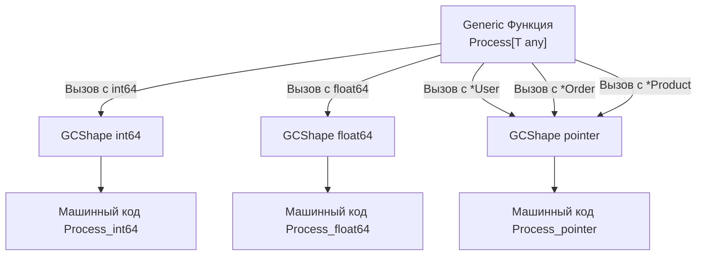

В предыдущей статье мы увидели, как синтаксис параметров типов позволяет писать переиспользуемый код без потери строгой типизации. Но магия не берется из ниоткуда. Для бэкенд-разработчика уровня Senior важно понимать, какую цену мы платим за абстракции.

Реализация дженериков в Go 1.18 потребовала самого масштабного изменения компилятора (`cmd/compile`) за всю историю языка. Инженеры Google искали баланс между скоростью компиляции, размером бинарного файла и производительностью в рантайме.

Чтобы понять архитектурное решение Go, давайте посмотрим, как эту проблему решали другие языки.

---

## Проблема реализации обобщений (Generics)

Когда компилятор видит функцию `func Min[T Number](a, b T)`, он должен перевести её в машинный код. Но процессор не понимает «обобщенных» типов. Ему нужно знать точный размер регистров (читать 4 байта или 8 байт?) и конкретные инструкции (целочисленное сложение `ADD` или сложение с плавающей точкой `ADDSD`?).

Исторически есть два экстремальных подхода:

1. **Monomorphization (C++, Rust):** Компилятор создает уникальную копию функции для _каждого_ используемого типа. Вызвали `Min` для `int` и `float64` — получили две разные функции в машинном коде.
    - **Плюс:** Максимальная производительность (нет накладных расходов в рантайме).
    - **Минус:** Катастрофическое раздувание размера бинарника (Code Bloat) и очень долгая компиляция. Если вы используете 100 разных типов, вы получите 100 копий одной и той же функции в кэше инструкций процессора.
2. **Type Erasure (Java):** Компилятор просто «стирает» дженерики и заменяет их на базовый объект (в Java это `Object`, в Go это был бы `interface{}`).
    - **Плюс:** Бинарный код функции существует в единственном экземпляре. Быстрая компиляция.
    - **Минус:** Медленный рантайм. Примитивы (вроде `int`) приходится аллоцировать в куче (Boxing). Каждое чтение сопровождается динамическим приведением типов.

Go выбрал гибридный, компромиссный путь, который называется **GCShape Stenciling with Dictionaries**.

---

## GCShape Stenciling: Золотая середина Go

Компилятор Go объединяет типы в группы, которые называются **GCShape** (Garbage Collection Shape — Форма для сборщика мусора).

**GCShape** определяется двумя вещами:

1. Размер типа в байтах.
2. Расположение указателей внутри этого типа (чтобы сборщик мусора знал, где искать ссылки на другие объекты).

Компилятор создает **только одну** копию функции для каждого уникального GCShape. Это называется _Stenciling_ (штамповка).

### Как группируются типы?

- Базовые типы разных размеров (`int32`, `int64`, `float64`) имеют **разные** GCShape. Для них компилятор сгенерирует отдельные машинные функции (как в C++).
- **Все указатели** (`*User`, `*Product`, `*string`, `*int`) на 64-битной архитектуре занимают ровно 8 байт и имеют одинаковое поведение для сборщика мусора (это просто адреса памяти). Следовательно, все указатели относятся к **одному** GCShape!

Если вы вызываете дженерик-функцию с 50 различными структурами по указателю, компилятор Go сгенерирует **всего одну** ассемблерную функцию, обслуживающую их все.




---

## Словари (Dictionaries): Как работают методы?

Здесь возникает очевидный вопрос. Допустим, мы вызываем функцию с `*User` и `*Order`. Они обе скомпилировались в одну ассемблерную функцию `Process_pointer`.

Но что если `Process` вызывает метод `item.Save()`? У `User` и `Order` реализации `Save()` лежат по разным адресам в памяти. Как одна и та же ассемблерная функция понимает, какой метод дергать?

Тут вступает в игру **Dictionary (Словарь)**.

Когда компилятор группирует вызовы в один GCShape, он неявно добавляет к функции **скрытый первый аргумент** — указатель на словарь с метаданными.

> [!info] Под капотом
> 
> То, что вы пишете так:
> 
> ```go
> func Process[T Saver](item T) {
>     item.Save()
> }
> ```
> 
> Компилятор Go превращает (псевдокод) во что-то подобное:
> 
> ```go
> // shape - это указатель или другой GCShape
> // dict - неявный словарь, содержащий itab (таблицу виртуальных методов)
> func Process_pointer(dict *Dictionary, item shape) {
>     // Достает адрес метода Save из словаря и вызывает его
>     methodPtr := dict.GetMethod("Save") 
>     methodPtr(item) 
> }
> ```

Этот подход избавляет от Code Bloat (раздувания бинарника), но привносит небольшую цену в рантайме: если дженерик-функция использует методы типа, процессору приходится делать лишнее разыменование указателя (читать адрес метода из словаря), что может привести к L1 Cache Miss.

---

## Ограничения реализации (Gotchas & Ловушки)

Из-за выбора архитектуры `GCShape + Dictionaries` в Go появились строгие ограничения, о которых часто спрашивают на интервью.

### 1. Запрет на дженерик-методы структур

Это самое раздражающее ограничение для выходцев из ООП-языков. В Go **структура может иметь параметры типов, но её методы — нет** (за исключением тех параметров, которые объявлены в самой структуре).

```go
type Processor struct{}

// ОШИБКА КОМПИЛЯЦИИ: метод не может иметь type parameters
func (p *Processor) Handle[T any](item T) {
	// ...
}
```

> [!tip] Собеседование
> 
> **Вопрос:** Почему в Go запрещены дженерик-методы?
> 
> **Ответ:** Из-за структуры интерфейсов под капотом (itab). Интерфейс в Go динамически матчится с типом во время выполнения (Duck Typing). Для этого компилятор должен построить таблицу `itab`, содержащую адреса всех методов типа, удовлетворяющих интерфейсу.
> 
> Если бы метод был дженериком, он мог бы быть инстанциирован _бесконечным_ количеством типов (`Handle[int]`, `Handle[string]` и т.д.). Компилятор не знает заранее, с какими типами этот метод будет вызван в других пакетах, а значит, он принципиально не может заранее вычислить размер и содержимое таблицы виртуальных функций `itab` на этапе сборки.

**Решение:** Выносите такие методы в обычные дженерик-функции, принимающие структуру как аргумент.

### 2. Type Switches и Type Assertions

Вы не можете использовать параметр типа `T` напрямую в операторе `switch type`, если не приведете его к пустому интерфейсу.

```go
func Inspect[T any](val T) {
	// ОШИБКА КОМПИЛЯЦИИ: нельзя использовать type switch на параметре типа T
	/* switch val.(type) {
	case int:
		fmt.Println("int")
	}
	*/

	// ВЕРНО: Нужно сначала скастовать (упаковать) к any (пустому интерфейсу)
	switch any(val).(type) {
	case int:
		fmt.Println("int")
	}
}
```

**Mechanical Sympathy:** Обратите внимание, что конвертация `any(val)` может привести к аллокации в куче (Escape Analysis может не всегда доказать, что переменная не утекает), так как мы создаем структуру `eface` (empty interface), состоящую из указателя на тип и указателя на данные.

### 3. Отсутствие специализации (Template Specialization)

В C++ вы можете написать общую реализацию дженерика, а затем "переопределить" её специально для `int` (чтобы написать более быстрый ассемблерный код). В Go специализации нет.

Если вам нужно разное поведение внутри одной дженерик функции, вам придется использовать рефлексию или тот самый `switch any(v).(type)`, что убивает часть профита от дженериков в высоконагруженных участках (Hot Paths).

---

## Итог и рекомендации по производительности

1. **Дженерики в Go — не бесплатны (не Zero-Cost Abstraction).** Вызов методов у типов, переданных в дженерик-функцию по указателю, требует косвенного вызова через скрытый Dictionary.
2. **Осторожно с интерфейсами в ограничениях.** Передача `interface{}` в качестве параметра типа (например, `Stack[error]`) работает, но приводит к двойной косвенности: сначала словарь дженерика, потом сам `iface` структуры Go.
3. **Не используйте дженерики вместо обычных интерфейсов.** Если функция просто вызывает `Read()` и возвращает ошибку, используйте классический `io.Reader`. Дженерики нужны там, где тип возвращаемого значения жестко зависит от типа входящего аргумента.

Дженерики значительно упростили работу с коллекциями и написание универсальных пакетов, избавив нас от кодогенерации и `interface{}`. Но главная "киллер-фича" Go, благодаря которой язык захватил бэкенд, — это не система типов, а парадигма конкурентности.

Мы завершили изучение синтаксиса и структур данных языка. Следующий шаг — погружение в мир конкурентного программирования. В следующей статье мы начнем разбирать главный механизм параллелизма: [[34. Горутины. Легковесная конкурентность в Go]].