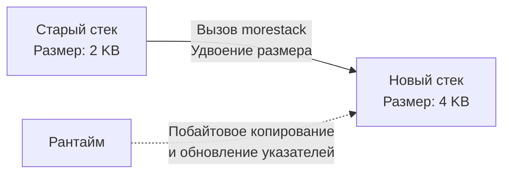

Исторически в бэкенд-разработке сложились две парадигмы конкурентности:
1. **Процессно-ориентированная (PHP-FPM, Python/uWSGI):** На каждый HTTP-запрос операционная система выделяет целый процесс. Это надежно (падение одного не убьет другие), но чудовищно неэффективно по памяти и переключениям контекста.
2. **Многопоточная (Java, C++, C#):** На каждый запрос выделяется поток ОС (OS Thread). Это легче процессов, но имеет свой предел — знаменитую «проблему C10K» (10 000 одновременных соединений).

Бэкенд на Go проектировался для эпохи облаков и микросервисов, где сервер должен держать сотни тысяч постоянных соединений (например, WebSockets). Создатели Go отвергли классические потоки ОС в пользу **Горутин (Goroutines)** — легковесных потоков, управляемых не операционной системой, а самим рантаймом Go (в User Space).

## 1. Mechanical Sympathy: Горутины против Потоков ОС

Почему обычные потоки ОС (Threads) не подходят для высокой конкурентности? Проблема кроется в архитектуре ядра Linux и железа.

### Проблема 1: Размер стека (Memory Footprint)
Когда вы создаете поток в Java или C++, операционная система сразу выделяет для него непрерывный кусок виртуальной памяти под стек — по умолчанию от 1 до 2 Мегабайт (зависит от ОС и настроек). 
Если вы захотите держать 100 000 активных WebSocket-соединений, где на каждое выделен поток, вам потребуется: `100 000 * 2 МБ = 200 Гигабайт` оперативной памяти только на поддержание пустых стеков!

**Решение Go:** Горутина стартует с крошечным стеком — всего **2 Килобайта**. 
100 000 горутин займут около 200 Мегабайт памяти. Разница в тысячу раз.

### Проблема 2: Цена переключения контекста (Context Switch)
Чтобы переключить выполнение с одного потока ОС на другой, процессор должен вызвать прерывание, перейти в режим ядра (Ring 0), сохранить в память все 16+ регистров общего назначения, векторные регистры (AVX/SSE), сохранить состояние FPU, сменить таблицы страниц (TLB) и выбрать новый поток через планировщик ОС (например, CFS в Linux). Это занимает от 1000 до 2000 тактов процессора (~1-2 микросекунды).

**Решение Go:** Переключение горутин происходит полностью в пространстве пользователя (User Space) силами рантайма Go. Рантайму нужно сохранить только три основных регистра: `PC` (Program Counter - где мы остановились), `SP` (Stack Pointer - где вершина стека) и `BP` (Base Pointer). Это занимает около **200 наносекунд** — на порядок быстрее системного `Context Switch`.

---

## 2. Под капотом: Структура `g`

Горутина — это не магия, а просто структура данных в памяти рантайма. В исходниках Go (в файле `src/runtime/runtime2.go`) она называется структурой `g`.

> [!info] Под капотом
> Упрощенно структура `g` выглядит так:
> ```go
> type g struct {
>     stack       stack   // Описывает границы стека [lo, hi]
>     sched       gobuf   // Контекст выполнения (SP, PC, BP) для переключения
>     atomicstatus uint32  // Текущее состояние: _Gidle, _Grunnable, _Grunning, _Gwaiting...
>     goid        uint64  // Уникальный ID горутины (недоступен разработчику напрямую)
>     m           *m      // Указатель на поток ОС (M), который сейчас выполняет эту G
>     // ... и еще несколько десятков служебных полей
> }
> 
> type gobuf struct {
>     sp   uintptr // Указатель стека
>     pc   uintptr // Счетчик команд
>     ctxt unsafe.Pointer // Контекст замыкания
> }
> ```
> Когда вы пишете `go func()`, рантайм просто аллоцирует новую структуру `g`, ставит ей статус `_Grunnable` и кладет в очередь выполнения. Никаких системных вызовов к ОС не происходит!

---

## 3. Магия растущего стека (Continuous Stacks)

Возникает резонный инженерный вопрос: если стек горутины всего 2 КБ, что произойдет, если мы сделаем глубокую рекурсию или создадим массив на 4 КБ прямо внутри функции? В C++ это привело бы к переполнению стека (Stack Overflow) и падению программы (`SIGSEGV`).

Go использует механизм **Continuous Stacks (Непрерывные стеки)**.

Компилятор Go вставляет небольшую проверку (пролог) в начало *каждой* функции. Эта проверка сравнивает текущий указатель стека (`SP`) с нижней границей стека текущей горутины (`g.stack.lo`).

Если места не хватает, происходит магия:
1. Вызывается специальная функция рантайма `runtime.morestack`.
2. Рантайм выделяет в куче новый, увеличенный в 2 раза стек (например, 4 КБ вместо 2 КБ).
3. Старый стек **побайтово копируется** в новый.
4. **Самое сложное:** Рантайм проходит по новому стеку и *обновляет все указатели*, которые ссылались на переменные внутри старого стека, чтобы они указывали на новые адреса.
5. Выполнение функции продолжается на новом стеке, а старый отдается сборщику мусора (GC).



> [!tip] Собеседование
> **Вопрос:** Почему в C или C++ невозможно реализовать такие же перемещаемые стеки, как в Go?
> **Ответ:** Потому что C/C++ не знают, что является указателем, а что просто числом `int`, значение которого случайно совпало с адресом памяти. Go имеет строгую систему типов и "Точный сборщик мусора" (Exact GC). Компилятор генерирует карты стека (Stack Maps), поэтому рантайм Go точно знает, где на стеке лежат указатели, и может безопасно их переписать при переносе стека.

---

## 4. Ловушки (Gotchas) и утечки памяти

Горутины дешевые, но они не бесплатные. Одна из главных проблем новичков — **Goroutine Leaks (Утечки горутин)**.

Сборщик мусора (GC) в Go не может собрать (удалить из памяти) горутину, пока она:
1. Выполняет код.
2. Заблокирована на чтении/записи в канал, сеть или мьютекс.

Если вы запустили горутину, которая ждет данных из канала, в который больше никто никогда не напишет, эта структура `g` и её стек останутся в памяти **навсегда**.

> [!warning] Ловушка / Gotcha (Классическая ошибка)
> Запуск горутины без контроля её жизненного цикла.
> ```go
> func ProcessData(data []byte) error {
>     errCh := make(chan error)
>     
>     go func() {
>         // Если doHeavyWork зависнет или мы выйдем из ProcessData раньше,
>         // эта горутина навсегда застрянет при попытке записи в небуферизованный errCh
>         errCh <- doHeavyWork(data) 
>     }()
>     
>     select {
>     case err := <-errCh:
>         return err
>     case <-time.After(1 * time.Second): // Таймаут
>         return errors.New("timeout")
>     }
> }
> ```
> **Как исправить:** > 1. Сделать канал буферизованным `make(chan error, 1)`, тогда горутина запишет результат и завершится.
> 2. Использовать `context.Context` для явной отмены (разберем в [[39. Context. Управление жизненным циклом операций]]).

### Замыкания в циклах (Loop Variables Closure Trap)

> [!info] Историческая справка для Senior'ов
> До версии **Go 1.22** создание горутин внутри цикла с использованием переменной цикла было самой частой ошибкой во всем языке.
> ```go
> // Для Go 1.21 и ниже!
> for i := 0; i < 3; i++ {
>     go func() {
>         fmt.Println(i) // Выведет 3, 3, 3
>     }()
> }
> ```
> Это происходило потому, что `i` была одной переменной в памяти, и все горутины захватывали ссылку на нее. К моменту запуска горутин цикл уже заканчивался, и `i` равнялось 3. Приходилось делать теневое копирование: `i := i`.
> 
> **Начиная с Go 1.22**, семантика циклов `for` изменена. Теперь на каждую итерацию создается *новая* переменная цикла. Код выше в современном Go выведет `0, 1, 2` (в случайном порядке). Однако знать эту особенность необходимо для поддержки legacy-кода и ответов на собеседованиях.

---

## Итог

1. **Горутины — это структуры рантайма (`g`)**, а не потоки операционной системы. Они живут в User Space.
2. **Экстремально дешевые:** Занимают от 2 КБ в памяти и переключаются за ~200 наносекунд.
3. **Растут динамически:** Рантайм копирует стеки в новые области памяти при их нехватке (Continuous Stacks).
4. **Не собираются GC при блокировке:** Брошенные горутины — главная причина утечек памяти в Go-бэкендах.

Теперь мы знаем, что горутина — это просто структура `g`. Но кто решает, какую горутину и на каком ядре процессора выполнять в данный момент времени? Обычный планировщик Linux ничего не знает про наши горутины. Эту задачу решает одно из самых гениальных изобретений в Go — его собственный внутренний планировщик. О нем мы детально поговорим в следующей статье: [[35. Scheduler Go. G, M, P и work stealing]].