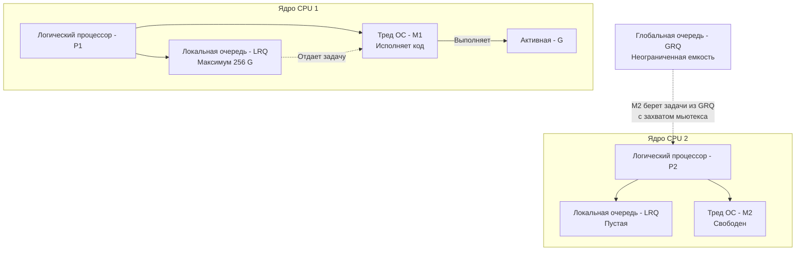

В прошлой статье мы выяснили, что горутины — это легковесные структуры в памяти (User Space), которые невероятно дешево создавать. Но операционная система (Linux, Windows) ничего не знает о горутинах. Планировщик ОС управляет исключительно своими тяжеловесными системными потоками (OS Threads).

Возникает фундаментальная проблема: как эффективно распределить сотни тысяч горутин по нескольким доступным ядрам процессора? Этим занимается **Планировщик Go (Go Scheduler)**.

Планировщик Go реализует модель **M:N**, где $M$ горутин мультиплексируются (выполняются) на $N$ потоках операционной системы.

---

## Архитектура G-M-P

В ранних версиях Go (до 1.1) планировщик состоял только из горутин и потоков ОС, а все горутины лежали в одной глобальной очереди, защищенной гигантским мьютексом (Global Lock). Это работало ужасно: на многоядерных машинах потоки ОС постоянно ждали снятия блокировки, чтобы взять новую горутину.

В 2012 году Дмитрий Вьюков полностью переписал планировщик, добавив концепцию логических процессоров. Так родилась знаменитая модель **G-M-P**:

1. **G (Goroutine):** Структура `g`, описывающая саму горутину (стек, текущий указатель инструкций `PC`, статус). Это просто данные. Сама по себе горутина ничего не исполняет.
2. **M (Machine / Тред ОС):** Структура `m`, представляющая поток операционной системы. Именно $M$ запрашивается у ОС и исполняет машинный код. 
3. **P (Processor / Логический контекст):** Структура `p`, абстрактный ресурс или «контекст выполнения». Чтобы $M$ мог выполнять $G$, он **обязан** получить в свое распоряжение $P$.

> [!info] Под капотом: Роль P и GOMAXPROCS
> $P$ — это ключ к масштабированию. Внутри структуры $P$ находится **Локальная очередь горутин (LRQ)** и локальный кэш аллокатора памяти (`mcache`). 
> Количество $P$ в системе жестко фиксировано и по умолчанию равно количеству логических ядер вашего CPU. Этим значением управляет переменная окружения или функция `runtime.GOMAXPROCS()`. 
> Именно привязка очередей и кэшей к $P$, а не к потокам $M$, позволила избавиться от глобальных блокировок.

---

## Очереди горутин: Где живут задачи?

В системе есть два типа очередей для готовых к выполнению горутин (в статусе `_Grunnable`):

1. **LRQ (Local Run Queue):** Локальная очередь внутри каждого $P$. Она реализована как кольцевой буфер и вмещает максимум **256 горутин**. Доступ к ней происходит без системных блокировок, потому что в каждый момент времени ей владеет только один $M$.
2. **GRQ (Global Run Queue):** Глобальная очередь рантайма. Сюда попадают горутины, если локальная очередь $P$ переполнилась (достигла лимита в 256), а также горутины, которые были разбужены сетевым поллером или сборщиком мусора. Доступ к ней защищен мьютексом, поэтому обращение к GRQ обходится дорого.

---

## Work Stealing (Кража работы)

Что происходит, если $M2$ (на Ядре 2) быстро выполнил все горутины из своей локальной очереди `LRQ2`? Он не засыпает, чтобы не тратить ресурсы ОС на пробуждение в будущем. 

Вместо этого планировщик запускает агрессивный алгоритм поиска работы — **Work Stealing**.

Порядок поиска работы для потока $M$ (функция `findrunnable` в рантайме):
1. **Проверить локальную очередь (LRQ).**
2. **Проверить глобальную очередь (GRQ).** (Берется сразу пачка горутин, чтобы оправдать захват мьютекса).
3. **Проверить сетевой поллер (Netpoll).** Нет ли горутин, чьи сетевые I/O операции завершились?
4. **Кража (Work Stealing).** $M$ случайным образом выбирает другой $P$ и **крадет ровно половину** горутин из его локальной очереди!

> [!tip] Собеседование
> **Вопрос:** В планировщике есть правило «1/61». Что это такое и зачем оно нужно?
> **Ответ:** Это механизм защиты от голодания (Starvation). Если $P$ будет постоянно крутиться в своей локальной очереди и воровать задачи у других $P$, горутины в Глобальной очереди (GRQ) могут никогда не получить процессорное время. 
> Поэтому рантайм Go жестко зашил правило: каждый $61$-й такт планировщика процессор $P$ **обязан** игнорировать свою локальную очередь и брать задачу из Глобальной очереди.

---

## Блокировки: Syscall и Handoff

Mechanical Sympathy требует от нас понимания: что будет, если горутина сделает тяжелый синхронный системный вызов (например, `fsync` или `CGO` вызов)?

Если горутина делает вызов, ядро Linux **блокирует системный поток $M$**.
Если бы $P$ оставался привязанным к заблокированному $M$, все остальные горутины в `LRQ` этого $P$ зависли бы, ожидая завершения вызова, хотя другие ядра могли бы простаивать!

Для решения этой проблемы используется механизм **Handoff (Передача контекста)**.

1. Рантайм обнаруживает, что $M1$ ушел в блокирующий Syscall.
2. $M1$ «отцепляется» от своего процессора $P1$, сохраняя при этом блокирующую горутину $G1$.
3. Процессор $P1$ становится сиротой. Планировщик берет из резерва (или создает новый) свободный поток $M2$ и привязывает его к $P1$.
4. $M2$ продолжает выполнять оставшиеся горутины из очереди $P1$.
5. Когда Syscall на $M1$ завершается, он пытается вернуть себе любой свободный $P$. Если свободных $P$ нет, $M1$ кладет горутину $G1$ в **Глобальную очередь**, а сам засыпает и уходит в пул неактивных потоков.

> [!warning] Ловушка / Gotcha: Блокировки и GOMAXPROCS
> Параметр `GOMAXPROCS` ограничивает **только количество $P$**, но **не ограничивает количество $M$ (потоков ОС)**.
> Если вы напишете код, который запускает 10 000 горутин, и каждая сделает вызов блокирующей C-функции через CGO, рантайм Go создаст 10 000 потоков ОС ($M$), пытаясь спасти $P$. Ваша программа упадет с ошибкой нехватки памяти (OOM) или превышения лимитов системы. Рантайм Go имеет встроенный лимит в 10 000 потоков `M`, при превышении которого приложение принудительно падает (panic).

---

## Вытесняющая многозадачность (Preemption)

До Go 1.14 планировщик был **кооперативным**. Это означало, что горутина отдавала управление планировщику добровольно: при вызове функций (в прологе функции происходила проверка стека), аллокациях, блокировках на каналах или системных вызовах.
Но если вы писали бесконечный математический цикл без вызова функций, эта горутина захватывала $M$ навсегда, вызывая дедлок всего приложения (если таких циклов было больше, чем ядер).

Начиная с **Go 1.14**, планировщик стал **Асинхронным вытесняющим (Asynchronous Preemptive)**.

В фоне работает специальный системный поток, который не привязан к $P$ — он называется `sysmon` (System Monitor).
`sysmon` периодически просыпается и проверяет статус всех $P$. Если он видит, что какая-то горутина выполняется дольше **10 миллисекунд** без остановки, он отправляет системному потоку $M$ сигнал ОС (`SIGURG` в Linux / Unix). 

Обработчик этого сигнала прерывает выполнение горутины, сохраняет её регистры, переводит её статус в `_Grunnable`, закидывает в глобальную очередь и передает процессорное время следующей задаче.

---

## Итог

1. **G-M-P модель:** Изолирует состояние очередей (в $P$) от потоков ОС ($M$), устраняя глобальные блокировки.
2. **Work Stealing:** Распределяет нагрузку. Простаивающий $P$ крадет половину горутин у загруженного соседа.
3. **Handoff:** Защищает от блокировок. Если $M$ заблокировался в Syscall, рантайм отвязывает $P$ и передает его новому $M$.
4. **sysmon и Вытеснение:** Фоновый монитор следит за зависшими горутинами и вытесняет их через сигналы ОС (`SIGURG`), если они работают дольше 10 мс.

Планировщик виртуозно управляет исполнением горутин. Но как этим независимым микро-потокам обмениваться данными, не наступая друг другу на пятки через классическую общую память и мьютексы? Для этого создатели Go возвели в абсолют концепцию из математической теории взаимодействующих последовательных процессов (CSP). Мы разберем её в следующей статье: [[36. Каналы. Передача данных между горутинами]].