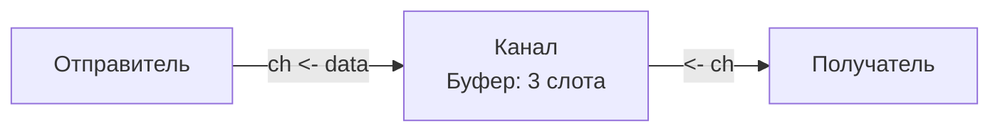

В предыдущих статьях мы разобрали, как планировщик Go виртуозно жонглирует горутинами, раскидывая их по ядрам процессора. Но изолированные функции, выполняющиеся в фоне, бесполезны. Им нужно обмениваться данными: передавать результаты вычислений, сигнализировать об ошибках или координировать порядок работы.

Классический подход C++, Java или C# — это **Shared Memory (Общая память)**. Вы создаете переменную, и разные потоки читают и пишут в нее, защищая доступ мьютексами (`Mutex`). В высоконагруженных системах это приводит к спагетти-коду, сложным взаимным блокировкам (Deadlocks) и деградации производительности из-за инвалидации кэш-линий процессора (False Sharing).

Go пошел другим путем, возведя в абсолют концепцию **CSP (Communicating Sequential Processes)**, предложенную Тони Хоаром в 1978 году. 

Роб Пайк, один из создателей Go, сформулировал это так:
> *«Не общайтесь, разделяя память; вместо этого разделяйте память, общаясь» (Do not communicate by sharing memory; instead, share memory by communicating).*

Инструментом реализации CSP в Go являются **Каналы (Channels)**.

---

## 1. Что такое канал?

С архитектурной точки зрения, канал — это потокобезопасная труба (pipe), через которую одна горутина может отправить данные строго определенного типа, а другая — безопасно их получить.

Когда вы передаете данные через канал, вы передаете **право владения** (ownership) этими данными. Вместо того чтобы две горутины дрались за один кусок памяти с мьютексами, одна горутина собирает данные, отправляет их в канал и «забывает» про них, а вторая принимает и начинает с ними работать.

### Базовый синтаксис

Каналы являются ссылочным типом (как map и slice), поэтому они инициализируются через `make`.

```go
// Создание небуферизованного канала для передачи int
ch := make(chan int)

// Отправка данных в канал (стрелка указывает В канал)
ch <- 42 

// Чтение данных из канала (стрелка указывает ИЗ канала)
val := <-ch 

// Закрытие канала
close(ch)
```

---

## 2. Синхронность: Небуферизованные каналы

По умолчанию `make(chan T)` создает **небуферизованный** канал. В нем нет внутреннего хранилища для данных. 

Это означает, что отправка и получение — это **синхронная операция (рандеву)**. 
* Если горутина А пытается отправить данные в канал, она **заблокируется** (планировщик снимет ее с процессора), пока горутина Б не будет готова эти данные прочитать.
* Аналогично, если горутина Б пытается прочитать из пустого канала, она заблокируется до тех пор, пока горутина А не отправит туда данные.

> [!info] Под капотом: Mechanical Sympathy
> Что значит «заблокируется» на уровне железа и ОС? Ничего! 
> Рантайм Go не делает системных вызовов (`futex` или `sleep`) при блокировке на канале. Планировщик просто меняет статус текущей структуры `g` (горутины) с `_Grunning` на `_Gwaiting`, сохраняет ее регистры и отдает поток ОС (`M`) другой готовой горутине. Это экстремально дешевая операция (сотни наносекунд).

Небуферизованные каналы идеальны для **гарантированной синхронизации**. Отправляя данные, вы точно знаете: как только строка `ch <- data` выполнилась, другая горутина *уже получила* эти данные.

---

## 3. Асинхронность: Буферизованные каналы

Если мы передадим второй аргумент в `make`, мы создадим **буферизованный** канал.

```go
// Канал с кольцевым буфером на 3 элемента
ch := make(chan string, 3)
```

Внутри такого канала появляется массив (Ring Buffer). 
* Отправитель **не блокируется**, пока в буфере есть свободное место.
* Получатель **не блокируется**, пока в буфере есть хотя бы один элемент.



> [!warning] Ловушка / Gotcha: Чрезмерная буферизация
> Новички часто делают каналы с буфером 1000 или 10000 "на всякий случай", чтобы отправитель не блокировался. Это антипаттерн. 
> Если ваш потребитель (consumer) работает медленнее производителя (producer), буфер в 10000 элементов заполнится за миллисекунды, и система все равно заблокируется, но теперь у вас в памяти висит 10000 объектов, нагружая Garbage Collector. Буферы следует использовать для сглаживания кратковременных всплесков (micro-bursts), а не как очередь сообщений (RabbitMQ/Kafka).

---

## 4. Паттерны чтения: for-range и comma-ok

В реальном коде мы редко читаем одно значение. Обычно горутина-воркер слушает канал постоянно.

**Плохой подход (бесконечный цикл без проверки):**
```go
for {
    val := <-ch // Если канал закроют, это начнет возвращать нулевые значения бесконечно!
    fmt.Println(val)
}
```

**Хороший подход 1 (Идиома comma-ok):**
Позволяет точно узнать, было ли прочитано реальное значение, или канал закрыли.
```go
for {
    val, ok := <-ch
    if !ok {
        // Канал закрыт, и буфер пуст. Пора выходить.
        break
    }
    process(val)
}
```

**Хороший подход 2 (for-range):**
Это самый идиоматичный способ чтения из канала. Цикл автоматически завершится, когда канал будет закрыт и из него будут вычитаны все оставшиеся данные.
```go
for val := range ch {
    process(val)
}
```

---

## 5. Матрица состояний: Главные вопросы с собеседований

Канал может находиться в трех состояниях: `nil` (не инициализирован), открыт и закрыт. Понимание того, как ведут себя операции в каждом состоянии — это абсолютный минимум для Middle разработчика.

| Операция | `nil` канал | Открытый канал | Закрытый канал |
| :--- | :--- | :--- | :--- |
| **Чтение (`<-ch`)** | Блокируется навсегда (Deadlock) | Читает данные / Блокируется | Возвращает zero-value и `ok=false` |
| **Запись (`ch <-`)** | Блокируется навсегда (Deadlock) | Пишет данные / Блокируется | **Panic** |
| **Закрытие (`close`)** | **Panic** | Закрывает канал | **Panic** |

> [!tip] Собеседование
> **Вопрос:** Зачем может понадобиться `nil` канал, если чтение и запись в него блокируются навсегда? Разве это не приведет к утечке горутины?
> **Ответ:** `nil` каналы активно используются внутри конструкции `select` для динамического отключения одной из веток (case). Если мы больше не хотим слушать определенный канал, мы просто присваиваем ему `nil`, и `select` навсегда исключает эту ветку из опроса, продолжая обрабатывать остальные.

---

## 6. Escape Analysis и передача указателей

Поскольку каналы работают в парадигме передачи владения, мы должны копировать данные.

```go
type BigStruct struct {
    data [1024]byte
}

ch := make(chan BigStruct)
// ...
ch <- BigStruct{} // Копирование 1 КБ данных
```

С точки зрения железа, копирование большого объема памяти — это долго. Поэтому разработчики часто передают в канал указатели:

```go
ch := make(chan *BigStruct)
ch <- &BigStruct{} // Копирование 8 байт (указателя)
```

Но здесь кроется серьезная архитектурная ловушка механизма **Escape Analysis** (Анализа утечек).

> [!warning] Ловушка / Gotcha: Удары по GC
> Когда вы передаете объект по значению (`BigStruct`), он часто может быть аллоцирован на быстром стеке (Stack) горутины-отправителя.
> Но когда вы отправляете **указатель** в канал, компилятор на этапе сборки не знает, в какой момент и какая именно горутина прочитает этот указатель. Жизненный цикл объекта становится непредсказуемым. 
> Компилятор обязан выполнить **Heap Allocation** — выкинуть этот объект в кучу (Heap). Если вы прогоняете миллионы таких указателей через канал в секунду, вы создадите огромную нагрузку на Garbage Collector (GC), что приведет к росту STW (Stop The World) пауз.
> Иногда скопировать 1 КБ данных по значению оказывается *быстрее* и дешевле для системы, чем передать указатель и заставить GC убирать мусор. Всегда используйте профилировщик (`pprof`) для проверки.

---

## 7. Ownership (Принцип владения каналом)

Одна из самых частых причин паники в Go-бэкендах — это `panic: send on closed channel`.
Чтобы этого избежать, в сообществе Go выработан строгий паттерн проектирования: **Channel Ownership**.

**Правила владельца:**
1. Тот, кто создает канал, тот его и закрывает.
2. Тот, кто пишет в канал, тот его и закрывает (чтобы сигнализировать получателям, что данных больше нет).
3. Получатель **никогда** не должен закрывать канал.
4. Если отправителей много (N producers, 1 consumer), никто не должен закрывать канал напрямую. Вместо этого используется отдельный канал-сигнал (или `context.Context`) для уведомления отправителей о том, что пора остановиться.

---

## Итог

1. **CSP:** В Go мы не шарим память между потоками, мы шарим данные, пересылая их через потокобезопасные трубы — каналы.
2. **Синхронизация:** Небуферизованные каналы требуют одновременного присутствия отправителя и получателя (рандеву).
3. **Состояния:** Писать в закрытый канал — это паника. Читать из закрытого — безопасно (вернется zero-value).
4. **Range:** Чтение через `for val := range ch` — самый безопасный и правильный способ обработки потока данных.

Мы разобрали, как использовать каналы на уровне синтаксиса и бизнес-логики. Но настоящая инженерия начинается там, где заканчивается абстракция. Является ли канал Lock-Free структурой? Что именно происходит с горутиной, когда она встает в очередь ожидания пустого канала? И как работает `select`, опрашивая несколько каналов одновременно? Пора залезть в исходники рантайма. Переходим к хардкору в следующей статье: [[37. Каналы под капотом. Буферизация, блокировки и select]].