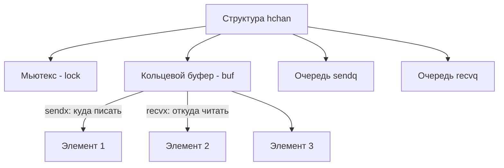

В предыдущей статье мы обсуждали каналы как высокоуровневую абстракцию, реализующую математическую модель CSP. С точки зрения разработчика, канал — это магия, которая позволяет безопасно передавать данные между горутинами.

Но для Senior-инженера магии не существует. Любая абстракция имеет свою цену. Если вы строите высоконагруженный бэкенд, вам необходимо знать, во что компилируется оператор `<-ch` и почему каналы могут стать узким горлышком (bottleneck) производительности.

Давайте заглянем в исходный код рантайма Go (`src/runtime/chan.go`) и разберем канал на запчасти.

---

## 1. Структура hchan: Анатомия канала

Когда вы вызываете `make(chan int, 3)`, рантайм аллоцирует в куче (heap) структуру `hchan` и возвращает вам указатель на нее. Именно поэтому каналы можно передавать в функции без `*` — вы уже передаете указатель.

> [!info] Под капотом: Исходники runtime/chan.go
> Упрощенно структура `hchan` выглядит так:
> ```go
> type hchan struct {
>     qcount   uint           // Количество элементов в буфере сейчас
>     dataqsiz uint           // Размер буфера (емкость)
>     buf      unsafe.Pointer // Указатель на массив-кольцевой буфер (Ring Buffer)
>     elemsize uint16         // Размер одного элемента в байтах (напр. 8 для int64)
>     closed   uint32         // Флаг: закрыт канал или нет
>     sendx    uint           // Индекс для следующей записи в буфер
>     recvx    uint           // Индекс для следующего чтения из буфера
>     recvq    waitq          // Очередь горутин, ожидающих чтения (Linked List)
>     sendq    waitq          // Очередь горутин, ожидающих записи (Linked List)
> 
>     lock mutex              // Обычный мьютекс для защиты всех полей выше!
> }
> ```

Сразу развеем главный миф, на котором часто сыпятся на собеседованиях.

> [!warning] Ловушка / Gotcha: Каналы НЕ Lock-Free!
> Многие разработчики считают, что раз каналы созданы как альтернатива мьютексам, то внутри они реализованы как Lock-Free структуры на атомиках (CAS-операциях). **Это не так.**
> Как видно из структуры, у каждого канала есть поле `lock mutex`. Любая операция чтения или записи в канал начинается с захвата этого системного мьютекса. Если у вас тысячи горутин агрессивно пишут в один канал, они выстроятся в очередь за мьютексом, и производительность деградирует (Lock Contention). В таких экстремальных случаях атомарные счетчики (`sync/atomic`) работают быстрее.

---

## 2. Как работает буферизация (Ring Buffer)

Поле `buf` — это указатель на непрерывный массив в памяти, который работает как кольцевой буфер. Поля `sendx` и `recvx` отслеживают, куда писать и откуда читать.

**Mechanical Sympathy:** Почему именно кольцевой массив, а не связный список?
Потому что непрерывный массив обеспечивает идеальное попадание в кэш процессора (L1/L2 Cache Lines). Когда процессор читает один элемент буфера, он аппаратно предзагружает соседние (Hardware Prefetching), делая чтение следующих элементов невероятно быстрым.



---

## 3. Очереди ожидания и структура sudog

Что происходит, когда буфер канала полон, а горутина пытается туда что-то записать? Она должна заблокироваться.

Здесь в игру вступают поля `sendq` и `recvq`. Это двусвязные списки из структур `sudog` (псевдо-g).
`sudog` — это обертка над горутиной (структурой `g` из статьи [[35. Scheduler Go. G, M, P и work stealing]]), которая содержит ссылку на элемент, который нужно передать, и ссылку на саму горутину.

### Сценарий блокировки при отправке:
1. Горутина-отправитель (G1) захватывает `lock` канала.
2. Проверяет буфер. Буфер полон.
3. Рантайм создает структуру `sudog`, кладет в нее указатель на отправляемые данные и указатель на G1.
4. Добавляет `sudog` в очередь `sendq` канала.
5. G1 отпускает `lock`.
6. Вызывается `gopark()` — горутина переводится в статус `_Gwaiting`, отвязывается от треда ОС (M), и планировщик (P) берет на исполнение другую горутину. Тред ОС не простаивает!

---

## 4. Супер-оптимизация рантайма: Direct Handoff (Прямая передача)

Разработчики Go внедрили гениальную оптимизацию.

Представьте ситуацию: буфер канала пуст. Горутина-получатель (G2) попыталась прочитать данные, заблокировалась и висит в очереди `recvq`. 
Приходит горутина-отправитель (G1) и делает запись в канал: `ch <- data`.

**Как это работало бы «в лоб»:**
G1 кладет `data` в буфер канала -> будит G2 -> G2 просыпается, читает из буфера -> удаляет данные.
*Итог: 2 копирования памяти и лишняя работа с буфером.*

**Как это работает в Go (Direct Handoff):**
Когда G1 захватывает мьютекс и видит, что в `recvq` ждет G2, G1 **вообще не трогает кольцевой буфер**. 
G1 берет указатель на память из ожидающего `sudog` (который указывает на стек заблокированной G2) и с помощью функции `memmove` **напрямую копирует данные из своего стека в стек горутины G2!**

После этого G1 будит G2 (переводит в статус `_Grunnable`). 

> [!tip] Собеседование
> **Вопрос:** Может ли горутина писать данные в стек другой горутины?
> **Ответ:** По правилам безопасности памяти Go — нет, стек изолирован. Но рантайм языка имеет привилегированный доступ. При отправке в канал с ожидающим получателем, рантайм выполняет прямую запись в стек другой горутины (Direct Handoff), минуя буфер канала, что экономит аллокации и такты CPU.

---

## 5. Select под капотом: selectgo

Мы часто используем оператор `select` для неблокирующего чтения или мультиплексирования.

```go
select {
case val := <-ch1:
    // ...
case ch2 <- data:
    // ...
default:
    // ...
}
```

Для компилятора `select` — это не обычный `switch`. На этапе компиляции блок `select` разворачивается в вызов сложной функции рантайма `selectgo()`.

### Алгоритм работы selectgo:

1. **Scrambling (Перемешивание):** Рантайм случайным образом перемешивает порядок `case`-выражений (генерация псевдослучайного порядка).
    * *Зачем?* Для предотвращения Starvation (голодания). Если бы `select` всегда проверял каналы сверху вниз, при высокой нагрузке на `ch1`, очередь до `ch2` могла бы никогда не дойти.
2. **Locking (Блокировка):** Рантайм **захватывает мьютексы ВСЕХ каналов**, участвующих в `select`. 
    * Чтобы не получить Deadlock (взаимную блокировку) при захвате нескольких мьютексов одновременно, рантайм предварительно сортирует каналы по их адресам в памяти и блокирует их строго от меньшего адреса к большему.
3. **Polling (Опрос):** Рантайм проходит по перемешанному списку и проверяет готовность каналов (есть ли данные в буфере или ждущие горутины).
4. **Execution (Выполнение):**
    * Если готов хотя бы один канал — выполняется операция, рантайм отпускает все мьютексы и выполняет блок кода.
    * Если готово несколько — выбирается первый по *перемешанному* списку.
    * Если ни один не готов и есть `default` — выполняем `default`, отпускаем мьютексы.
    * Если ни один не готов и `default` нет — текущая горутина упаковывается в `sudog` и добавляется в очереди ожидания **сразу всех** участвующих каналов. Затем горутина паркуется. При пробуждении любым из каналов, она удалит себя из очередей остальных.

> [!warning] Ловушка / Gotcha: Производительность select
> Оператор `select` — это тяжелая артиллерия. Захват мьютексов всех участвующих каналов, сортировки и генерация случайных чисел отнимают немало тактов процессора. 
> Использование `select` с одним `case` и `default` (для неблокирующего чтения) оптимизируется компилятором в более простые вызовы, но если у вас 5-10 кейсов в нагруженном цикле, это может стать причиной просадки производительности.

---

## Итог

1. **`hchan`** — это тяжелая структура в куче с мьютексом. Каналы — это не Lock-Free магия.
2. **Буфер** — это непрерывный массив (Ring Buffer), дружелюбный к кэшу процессора.
3. **Direct Handoff** — оптимизация, при которой отправитель пишет данные напрямую в стек ждущего получателя, минуя буфер.
4. **`selectgo`** — захватывает блокировки всех каналов одновременно (сортируя по адресам для защиты от Deadlock) и обрабатывает их в случайном порядке для честного распределения ресурсов.

Понимание того, как рантайм паркует горутины и захватывает блокировки в `select`, критически важно для проектирования систем реального времени. В следующей статье мы отойдем от устройства рантайма и перейдем к прикладной архитектуре. Мы разберем популярные паттерны использования этого мощного оператора в статье: [[38. Select. Ожидание нескольких каналов]].