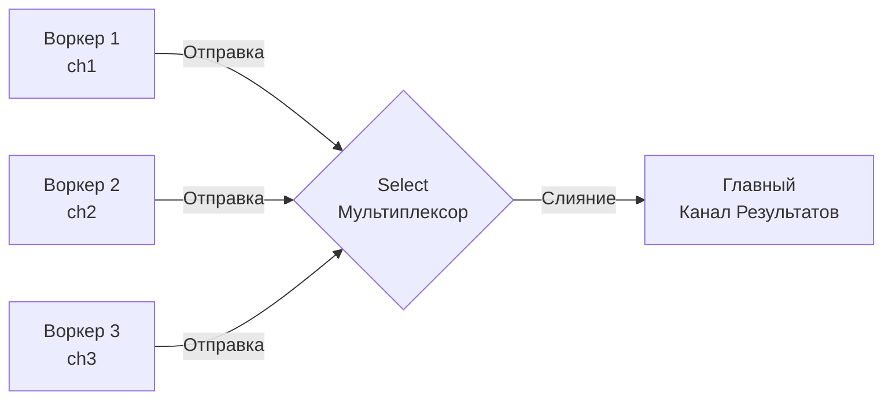

Если горутины — это легковесные потоки выполнения, а каналы — это трубы для передачи данных между ними, то оператор `select` — это диспетчерский пульт (мультиплексор). 

В классическом системном программировании на C/C++ для ожидания событий от множества файловых дескрипторов (сетевых сокетов) используются системные вызовы вроде `select()`, `poll()` или `epoll`. Создатели Go перенесли эту концепцию на уровень самого языка, но вместо файловых дескрипторов `select` в Go работает с каналами.

С помощью `select` одна горутина может блокироваться, ожидая данных сразу из нескольких каналов, не потребляя при этом такты процессора (CPU).

---

## Как работает select: Базовые правила

Синтаксически `select` похож на `switch`, но каждый `case` обязан быть операцией общения с каналом (чтением или записью).

```go
select {
case msg := <-ch1:
	fmt.Println("Получено из ch1:", msg)
case ch2 <- data:
	fmt.Println("Отправлено в ch2")
}
```

**Ключевые свойства диспетчера:**
1. **Блокировка:** Если ни один канал не готов (в `ch1` пусто, а буфер `ch2` переполнен), горутина засыпает и передает управление планировщику.
2. **Случайность:** Если одновременно готовы несколько каналов, `select` выберет **случайный**. Это защищает систему от «голодания» (Starvation). В отличие от классического `switch`, здесь нет приоритета сверху вниз.
3. **Атомарность:** Операция чтения/записи внутри выбранного `case` выполняется атомарно, как единое целое.

---

## Паттерны проектирования с select

Знание синтаксиса не делает вас инженером. Инженером вас делает понимание того, как собирать из этих кубиков надежные системы.

### 1. Неблокирующие операции (default)

По умолчанию `select` блокирует горутину. Но если добавить блок `default`, поведение радикально меняется. Если ни один канал не готов прямо сейчас, рантайм **мгновенно** выполнит ветку `default` и пойдет дальше.

```go
// Пытаемся забрать задачу из очереди, но если её нет - не ждем
select {
case task := <-taskQueue:
	process(task)
default:
	fmt.Println("Очередь задач пуста, займусь фоновой работой")
	doBackgroundWork()
}
```

> [!info] Под капотом: Оптимизации компилятора
> В статье [[37. Каналы под капотом. Буферизация, блокировки и select]] мы видели, что полноценный `select` вызывает тяжелую функцию `runtime.selectgo`, которая блокирует все мьютексы всех каналов-участников.
> Но разработчики компилятора Go добавили "быстрые пути" (Fast Paths). 
> Если ваш `select` имеет только один `case` и `default`, компилятор не вызывает `selectgo`. Он заменяет этот блок на прямой вызов `runtime.selectnbrecv` (Non-Blocking Receive). Это обычная проверка буфера канала без создания `sudog` очередей. Это экстремально быстрая операция (десятки наносекунд).

### 2. Timeouts (Таймауты)

В микросервисной архитектуре ни одна операция ввода-вывода (IO) не должна работать без таймаута. Если база данных или соседний сервис "повис", горутина не должна висеть вечно.

```go
func fetchWithTimeout(ch <-chan Data) (Data, error) {
	// Создаем таймер (помним про утечки time.After из прошлых статей!)
	timer := time.NewTimer(2 * time.Second)
	defer timer.Stop()

	select {
	case result := <-ch:
		return result, nil
	case <-timer.C:
		return Data{}, errors.New("timeout: сервис не ответил за 2 секунды")
	}
}
```

### 3. Отключение каналов через nil

Это один из самых частых вопросов на Senior-собеседованиях. 
Что делать, если мы читаем данные из двух каналов, и один из них закрывается? 

> [!warning] Ловушка / Gotcha: Чтение из закрытого канала в select
> Если канал закрыт, чтение из него **не блокируется**. Оно мгновенно возвращает zero-value. 
> Если вы не обработаете это в `select`, ваш код уйдет в бесконечный цикл (Infinite Spin), сжигая 100% ядра CPU.

**Решение:** Чтение из `nil` канала блокируется навсегда. Следовательно, чтобы динамически выключить `case` внутри `select`, достаточно присвоить этому каналу значение `nil`. Рантайм просто проигнорирует эту ветку при следующем проходе.

```go
func mergeTwo(ch1, ch2 <-chan int) {
	for ch1 != nil || ch2 != nil {
		select {
		case val, ok := <-ch1:
			if !ok {
				ch1 = nil // Отключаем ветку ch1 навсегда
				continue
			}
			fmt.Println("Из первого:", val)
			
		case val, ok := <-ch2:
			if !ok {
				ch2 = nil // Отключаем ветку ch2 навсегда
				continue
			}
			fmt.Println("Из второго:", val)
		}
	}
	fmt.Println("Оба канала закрыты, выходим")
}
```

### 4. Паттерн Fan-In (Мультиплексирование)

Классическая задача: у вас есть несколько воркеров, каждый шлет результаты в свой канал. Вам нужно объединить их потоки в один (слияние).



Для фиксированного количества каналов это делается простым `select`:

```go
func fanIn(ch1, ch2 <-chan string) <-chan string {
	merged := make(chan string)
	go func() {
		defer close(merged)
		for ch1 != nil || ch2 != nil {
			select {
			case val, ok := <-ch1:
				if ok {
					merged <- val
				} else {
					ch1 = nil
				}
			case val, ok := <-ch2:
				if ok {
					merged <- val
				} else {
					ch2 = nil
				}
			}
		}
	}()
	return merged
}
```

Но что если количество каналов неизвестно заранее (динамическое)? В этом случае статическая конструкция `select` не поможет. Приходится использовать пакет `reflect` и функцию `reflect.Select`. Это мощный механизм, но он работает в 10-100 раз медленнее обычного `select` из-за накладных расходов рефлексии (динамических аллокаций `[]reflect.SelectCase` в куче).

---

## Пустой select {}

Иногда в чужом коде можно встретить такую конструкцию:

```go
func main() {
	go runDaemon()
	go startHTTPServer()
	
	select {} // ???
}
```

> [!tip] Собеседование
> **Вопрос:** Что делает пустой `select {}` и зачем он нужен?
> **Ответ:** Он блокирует текущую горутину **навсегда**. 
> В отличие от `for {}` (который является busy-loop и сожжет ядро процессора), пустой `select {}` компилируется в функцию рантайма `runtime.block()`. Горутина отвязывается от потока ОС и навсегда переводится в статус ожидания. 
> Это используется в функции `main()`, чтобы предотвратить завершение программы, если вся полезная работа выполняется в фоновых горутинах.

---

## Итог

1. **`select`** позволяет одной горутине эффективно мониторить множество каналов без потребления CPU в моменты простоя.
2. **Случайный выбор** гарантирует честное распределение внимания (Fairness) между каналами.
3. **Блок `default`** превращает `select` в неблокирующий вызов (предотвращая парковку горутины в рантайме).
4. **`ch = nil`** — это идиоматичный способ выключить канал из опроса, если он закрылся.

Долгое время паттерны с `select` и каналом `done` были единственным способом отменить дерево горутин при таймауте HTTP-запроса. Однако с ростом кодовой базы передавать пустые каналы-сигналы через десятки слоев абстракций стало невыносимо. 

В Go 1.7 разработчики стандартной библиотеки стандартизировали этот процесс, введя мощнейший инструмент управления жизненным циклом и передачи метаданных. В следующей статье мы разберем абсолютный стандарт бэкенд-разработки на Go: [[39. Context. Управление жизненным циклом операций]].