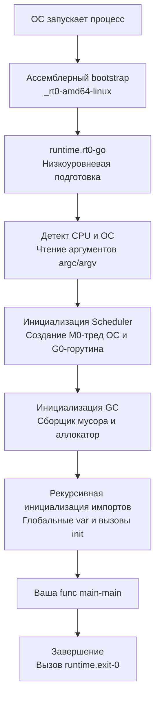

Если вы пишете на Java, то привыкли, что один файл — это один класс, а структура директорий строго повторяет иерархию пространств имен (namespaces). Если вы пришли из C/C++, то знаете разницу между заголовочными файлами (`.h`) для деклараций и файлами реализации (`.cpp`), которые препроцессор склеивает через `#include`.

В Go разработчики отказались от обоих подходов в пользу максимальной простоты и скорости компиляции. В этой статье мы разберем атомарные единицы Go-кода, посмотрим на граф зависимостей и узнаем, с какой функции *на самом деле* начинается выполнение вашей программы (спойлер: не с `main`).

## 1. Пакет (package): Атомарная единица компиляции

В Go нет классов и нет пространств имен в привычном понимании. Главной структурной единицей языка является **пакет (package)**.

Правило предельно простое: **одна директория на файловой системе = один пакет**.

Каждый `.go` файл обязан начинаться с объявления пакета, к которому он принадлежит:
```go
package http
```

При компиляции Go собирает все файлы из одной директории, которые имеют одинаковое имя пакета, и объединяет их в единое целое на уровне абстрактного синтаксического дерева (AST). 
Это значит, что:
1. Вы можете разбивать логику одного пакета на десятки мелких файлов (например, `server.go`, `router.go`, `client.go` в пакете `http`).
2. Внутри пакета все файлы "видят" функции, типы и переменные друг друга напрямую. Никаких импортов внутри одной директории делать не нужно.
3. Отсутствуют заголовочные файлы (headers). Компилятор сам сканирует все файлы пакета за один проход.

> [!tip] Собеседование
> В Go нет ключевых слов `public`, `private` или `protected`. Видимость (экспорт) определяется исключительно **регистром первой буквы**. Если имя функции или типа начинается с Большой буквы (например, `ServeHTTP`) — она доступна из других пакетов. Если с маленькой (`parseURL`) — она видна только внутри текущего пакета (во всех его файлах). Подробнее механику видимости мы разберем в [[27. Видимость имен. export и unexport]].

### Особый пакет: package main

Любой пакет в Go при компиляции превращается в промежуточный объектный файл (`.a`), который используется линковщиком. Но если вы хотите получить на выходе исполняемый бинарный файл, пакет должен называться строго `main`. 
Компилятор воспринимает `package main` как сигнал: "Здесь должна быть точка входа, собери мне бинарник".

## 2. Импорты (import) и направленный граф

Чтобы использовать код из других пакетов, используется директива `import`. 

```go
package main

import (
    "fmt"
    "net/http"
    "github.com/google/uuid"
)
```

Вы импортируете **путь** до пакета (относительно корневого модуля), но в коде обращаетесь к нему по **короткому имени пакета**, которое указано в исходниках самого пакета. Например, импортируя `github.com/google/uuid`, вы будете писать `uuid.New()`.

### Почему компилятор запрещает неиспользуемые импорты?
Если вы импортировали `"fmt"`, но ни разу не вызвали `fmt.Println`, программа **не скомпилируется**. Это не просто стиль или рекомендация линтера (как в Python или TypeScript) — это жесткое правило языка.
Создатели Go пошли на это ради скорости. В С++ препроцессор может рекурсивно включать мегабайты мертвых заголовочных файлов, увеличивая время сборки в разы. Строгость Go гарантирует, что дерево зависимостей бинарника минимально, а компилятор не тратит время на парсинг лишних файлов.

### Запрет на циклические зависимости
Если пакет `A` импортирует пакет `B`, то пакет `B` (или любая его зависимость) ни при каких условиях не может импортировать `A`.
Go формирует **Направленный Ациклический Граф (DAG)** импортов. 

> [!info] Под капотом
> Почему DAG так важен? Это позволяет компилятору `go build` собирать пакеты **параллельно**. Если пакеты независимы друг от друга на нижних уровнях графа, планировщик компилятора отдаст их сборку разным ядрам CPU одновременно. Это одна из причин феноменальной скорости компиляции Go.

### Специфичные импорты: blank import и alias
Иногда вам нужно изменить стандартное поведение импорта:
1. **Алиасы**: Если имена пакетов пересекаются (например, стандартный `context` и ваш внутренний `context`), вы можете задать псевдоним:
   ```go
   import stdCtx "context"
   ```
2. **Blank import (Слепой импорт)**: Используется символ `_`.
   ```go
   import _ "github.com/lib/pq"
   ```
   Слепой импорт означает: "Я не буду явно вызывать функции этого пакета, но мне нужно, чтобы компилятор включил его в сборку и выполнил его функцию `init`". Это стандартный паттерн для регистрации драйверов баз данных.

## 3. Точка входа: func main и func init

Ваш код начинает выполняться в функции `main` пакета `main`. 

```go
func main() {
    // Код приложения
}
```

Она не принимает аргументов и ничего не возвращает. Если вам нужно прочитать аргументы командной строки, вы используете срез `os.Args`. Если нужно завершить работу с кодом ошибки — вызываете `os.Exit(1)`. Возврат из функции `main` (достижение закрывающей скобки) приводит к завершению программы с кодом 0 (success).

### Функция init
Помимо `main`, в любом пакете (даже не в `main`) может быть объявлена функция `init`.
Она не принимает аргументов и вызывается **до** функции `main`, автоматически, в момент инициализации пакета рантаймом. Вы не можете вызвать её явно из своего кода.

```go
var db *Database

func init() {
    db = Connect() // Инициализируется до старта приложения
}
```

> [!warning] Ловушка / Gotcha
> Вы можете написать сколько угодно функций `init` в одном файле или в разных файлах одного пакета. Компилятор соберет их все. Однако **порядок их выполнения не гарантирован и зависит от лексикографического порядка файлов**. Использование `init` для сложной логики инициализации считается антипаттерном в идиоматичном Go. Сегодня `init` стараются избегать, заменяя явными вызовами `Setup()` или паттерном "Конструктор".

## Mechanical Sympathy: Настоящая точка входа (Bootstraping)

Теперь самое интересное. Что происходит с момента запуска бинарника ОС до первой строчки вашего `fmt.Println` в `func main()`? Функция `main` — это вершина айсберга, скрывающая колоссальную работу Go-рантайма.

Настоящая точка входа в бинарник задается линковщиком. В Linux x86-64 это ассемблерная функция `_rt0_amd64_linux`, которая пробрасывает управление в кросс-платформенную функцию `runtime.rt0_go` внутри ядра языка.

Поток загрузки выглядит так:



**Разберем ключевые моменты из схемы:**
1. **M0 и G0**: В самом начале рантайм берет главный поток операционной системы (System Thread) и называет его `M0`. Внутри этого потока он создает специальную корневую горутину — `G0`. Именно горутина `G0` отвечает за планирование всех остальных горутин вашей программы.
2. **Аллокатор и GC**: До того как ваш код начнет исполняться, Go инициализирует систему управления виртуальной памятью (выделяет пулы арен) и подготавливает бэкграунд-воркеры сборщика мусора.
3. **Инициализация пакетов**: Рантайм обходит граф импортов (тот самый DAG) **снизу вверх**. Сначала инициализируются глобальные переменные стандартной библиотеки, затем их `init` функции. И так по цепочке до тех пор, пока не будут вызваны все глобальные `var` и `init()` вашего `main` пакета.
4. **Старт main**: Только когда рантайм и всё дерево зависимостей полностью готовы, управление передается в `main.main()` как в новую горутину.

Понимание этой последовательности критически важно при отладке "плавающих" багов. Например, если в `init` функции пакета A происходит паника, функция `main` даже не успеет запуститься.

## Итог

1. Иерархия модульности в Go строится вокруг **пакетов** (директорий), а не классов. Забудьте о правиле "один класс = один файл". Разделяйте код по файлам так, как удобно для чтения.
2. Неиспользуемые и циклические импорты запрещены на уровне компилятора ради экстремально быстрой сборки бинарника.
3. Инициализация программы идет снизу вверх: глобальные переменные зависимостей -> их `init` функции -> ваши `init` функции -> ваша функция `main`.
4. Под капотом вашей `main` предшествует тяжелая инициализация рантайма (`runtime.rt0_go`), которая подготавливает главный поток `M0`, горутину планировщика `G0` и аллокатор памяти.

Мы разобрались со структурой и процессом запуска. Пришло время спуститься на уровень данных. В следующей статье [[5. Переменные, константы и вывод типа]] мы разберем базовый синтаксис, узнаем, что такое нетипизированные константы, как работает `:=` под капотом и почему переменные в Go всегда инициализированы нулем (Zero Value).